<div align="center">


## **Universidad Peruana de Ciencias Aplicadas**
### Carrera de Ingeniería de Software
<br>

**Curso: Desarrollo de Aplicaciones Open Source**

**NRC: 7760**

**Docente: FLORES MOROCCO; Juan Antonio**
<br>

### **Informe del Trabajo Final**

**Nombre de la Startup:** AgriDron Solutions

**Nombre del producto:** AgriDron
<br>

### **Integrantes**

</div>

<table align="center" style="border-collapse: collapse; border: none; margin-left: auto; margin-right: auto;">
    <tr>
        <th style="border: none; padding: 0 18px 6px 0; text-align: center;">U202421392</th>
        <th style="border: none; padding: 0 0 6px 0; text-align: center;">Damacen Galindo, Italo Gianfranco</th>
    </tr>
    <tr>
        <td style="border: none; padding: 0 18px 4px 0; text-align: center;">U20241G306</td>
        <td style="border: none; padding: 0 0 4px 0; text-align: center;">Nicho Huillcañahui, Edwin Noe</td>
    </tr>
    <tr>
        <td style="border: none; padding: 0 18px 4px 0; text-align: center;">U202416053</td>
        <td style="border: none; padding: 0 0 4px 0; text-align: center;">Ramirez Gutierrez, Gabriel</td>
    </tr>
    <tr>
        <td style="border: none; padding: 0 18px 4px 0; text-align: center;">U202422642</td>
        <td style="border: none; padding: 0 0 4px 0; text-align: center;">Sayago Vidal, Sebastian Leonardo</td>
    </tr>
    <tr>
        <td style="border: none; padding: 0 18px 4px 0; text-align: center;">U202222473</td>
        <td style="border: none; padding: 0 0 4px 0; text-align: center;">Vasquez Roncal, Alexander Felipe</td>
    </tr>
</table>
<br>
<div align="center">
<b><i>Septiembre, 2026</i></b>
</div>
<br>

---

## Registro de Versiones

| Versión | Fecha      | Autor              | Descripción                            |
|:--------|:-----------|:-------------------|:---------------------------------------|
| 0.1.0   | 05/09/2026 | Sebastián Sayago   | Creación inicial del documento.        |
| 0.2.0   | 06/09/2026 | Sebastián Sayago   | Implementación inicial del capitulo 1  |
| 0.3.0   | 09/09/2026 | Nicho Huillcañahui | Implementación inicial del capitulo 2  |
| 0.3.0   | 07/09/2026 | Nicho Huillcañahui | Implementación del capitulo 2          |
| 0.6.0   | 07/09/2026 | Nicho Huillcañahui | Implementación del capitulo 2          |
| 0.5.0   | 08/09/2026 | Sebastián Sayago   | Implementación del capitulo 4          |
| 0.7.0   | 08/09/2026 | Alexander Vasquez  | Implementación del capitulo 3          |
| 0.8.0   | 08/09/2026 | Sebastián Sayago   | Implementación del capitulo 4          |
| 0.4.0   | 12/09/2026 | Italo Damacen      | Implementación completa del capitulo 1 |
| 0.6.0   | 12/09/2026 | Gabriel Ramirez    | Implementacion del capitulo 5          |
| 0.4.0   | 13/09/2026 | Nicho Huillcañahui | Segunda implementación del capitulo 2  |
| 0.5.0   | 13/09/2026 | Nicho Huillcañahui | Segunda implementación del capitulo 2  |
| 0.6.5   | 14/09/2026 | Gabriel Ramirez    | Segunda implementacion del capitulo 2  |
| 0.7.0   | 15/09/2026 | Agridron    | Correccion de errores  |
| 0.8.0   | 16/09/2026 | Agridron    | Pre-release 1.0 del documento  |
| 1.0.0   | 17/09/2026 | Agridron           | Evidencia completa de entrega AV1      |


---

# Contenido

## Tabla de Contenido

- [Contenido](#contenido)
  - [Tabla de Contenido](#tabla-de-contenido)
  - [Student Outcome](#student-outcome)
- [Capítulo I: Introducción](#capítulo-i-introducción)
  - [1.1. Startup Profile](#11-startup-profile)
    - [1.1.1. Descripción de la Startup](#111-descripción-de-la-startup)
    - [1.1.2. Perfiles de integrantes del equipo](#112-perfiles-de-integrantes-del-equipo)
  - [1.2. Solution Profile](#12-solution-profile)
    - [1.2.1. Antecedentes y problemática](#121-antecedentes-y-problemática)
    - [1.2.2. Lean UX Process](#122-lean-ux-process)
      - [1.2.2.1. Lean UX Problem Statements](#1221-lean-ux-problem-statements)
      - [1.2.2.2. Lean UX Assumptions](#1222-lean-ux-assumptions)
      - [1.2.2.2. Lean UX Assumptions](#1222-lean-ux-assumptions-1)
      - [1.2.2.3. Lean UX Hypothesis Statements](#1223-lean-ux-hypothesis-statements)
      - [1.2.2.4. Lean UX Canvas](#1224-lean-ux-canvas)
  - [1.3. Segmentos objetivo](#13-segmentos-objetivo)
    - [1.3.1. Pequeños y Medianos Agricultores (PyMAs)](#131-pequeños-y-medianos-agricultores-pymas)
    - [1.3.2. Personal Técnico (Ingenieros Agrónomos y Técnicos de Campo)](#132-personal-técnico-ingenieros-agrónomos-y-técnicos-de-campo)
- [Capítulo II: Requirements Elicitation \& Analysis](#capítulo-ii-requirements-elicitation--analysis)
  - [2.1. Competidores](#21-competidores)
    - [2.1.1. Análisis competitivo](#211-análisis-competitivo)
    - [2.1.2. Estrategias y tácticas frente a competidores](#212-estrategias-y-tácticas-frente-a-competidores)
      - [1. Estrategia de Enfoque en Costos y Accesibilidad (Frente a DroneDeploy y Agrivi)](#1-estrategia-de-enfoque-en-costos-y-accesibilidad-frente-a-dronedeploy-y-agrivi)
      - [2. Estrategia de Diferenciación por Interoperabilidad Abierta](#2-estrategia-de-diferenciación-por-interoperabilidad-abierta)
      - [3. Estrategia de Adopción Digital y Curva de Aprendizaje Acelerada (Usabilidad)](#3-estrategia-de-adopción-digital-y-curva-de-aprendizaje-acelerada-usabilidad)
      - [4. Estrategia de Penetración de Canal y Trabajo con Comunidades Agrícolas](#4-estrategia-de-penetración-de-canal-y-trabajo-con-comunidades-agrícolas)
  - [2.2. Entrevistas](#22-entrevistas)
    - [2.2.1. Diseño de entrevistas](#221-diseño-de-entrevistas)
    - [2.2.2. Registro de entrevistas](#222-registro-de-entrevistas)
    - [2.2.3. Análisis de entrevistas](#223-análisis-de-entrevistas)
  - [2.3. Needfinding](#23-needfinding)
    - [2.3.1. User Personas](#231-user-personas)
    - [2.3.2. User Task Matrix](#232-user-task-matrix)
    - [2.3.3. User Journey Mapping](#233-user-journey-mapping)
    - [2.3.4. Empathy Mapping](#234-empathy-mapping)
  - [2.4. Big Picture EventStorming](#24-big-picture-eventstorming)
  - [2.5. Ubiquitous Language](#25-ubiquitous-language)
- [Capítulo III: Requirements Specification](#capítulo-iii-requirements-specification)
  - [3.1. User Stories](#31-user-stories)
  - [3.2. Impact Mapping](#32-impact-mapping)
  - [3.3. Product Backlog](#33-product-backlog)
- [Capítulo IV: Product Design](#capítulo-iv-product-design)
  - [4.1. Style Guidelines](#41-style-guidelines)
    - [4.1.1. General Style Guidelines](#411-general-style-guidelines)
  - [4.2. Information Architecture](#42-information-architecture)
    - [4.2.1. Organization Systems](#421-organization-systems)
    - [4.2.2. Labeling Systems](#422-labeling-systems)
    - [4.2.3. SEO Tags and Meta Tags](#423-seo-tags-and-meta-tags)
    - [4.2.4. Searching Systems](#424-searching-systems)
    - [4.2.5. Navigation Systems](#425-navigation-systems)
  - [4.3. Landing Page UI Design](#43-landing-page-ui-design)
    - [4.3.1. Landing Page Wireframe](#431-landing-page-wireframe)
    - [4.3.2. Landing Page Mock-up](#432-landing-page-mock-up)
  - [4.4. Web Applications UX/UI Design](#44-web-applications-uxui-design)
    - [4.4.1. Web Applications Wireframes](#441-web-applications-wireframes)
    - [4.4.2. Web Applications Wireflow Diagrams](#442-web-applications-wireflow-diagrams)
    - [4.4.3. Web Applications Mock-ups](#443-web-applications-mock-ups)
    - [4.4.4. Web Applications User Flow Diagrams](#444-web-applications-user-flow-diagrams)
  - [4.5. Web Applications Prototyping](#45-web-applications-prototyping)
  - [4.6. Domain-Driven Software Architecture](#46-domain-driven-software-architecture)
    - [4.6.1. Design-Level Event Storming](#461-design-level-event-storming)
      - [4.6.1.1. Bounded Contexts](#4611-bounded-contexts)
    - [4.6.2. Software Architecture Context Diagram](#462-software-architecture-context-diagram)
    - [4.6.3. Software Architecture Container Diagrams](#463-software-architecture-container-diagrams)
    - [Trazabilidad entre dominio y arquitectura](#trazabilidad-entre-dominio-y-arquitectura)
    - [4.6.4. Software Architecture Components Diagrams](#464-software-architecture-components-diagrams)
      - [4.6.4.1. RESTful API](#4641-restful-api)
      - [4.6.4.2. Web Application](#4642-web-application)
      - [4.6.4.3. Weather Integration Component](#4643-weather-integration-component)
  - [4.7. Software Object-Oriented Design](#47-software-object-oriented-design)
    - [4.7.1. Class Diagrams](#471-class-diagrams)
      - [4.7.1.1. Field Management](#4711-field-management)
      - [4.7.1.2. Flight Operations](#4712-flight-operations)
      - [4.7.1.3. Weather Integration](#4713-weather-integration)
      - [4.7.1.4. Analytics \& Reporting](#4714-analytics--reporting)
      - [4.7.1.5. Shared / Identity](#4715-shared--identity)
  - [4.8. Database Design](#48-database-design)
    - [4.8.1. Database Diagrams](#481-database-diagrams)
      - [4.8.1.1. Field Management](#4811-field-management)
      - [4.8.1.2. Flight Operations](#4812-flight-operations)
      - [4.8.1.3. Weather Integration](#4813-weather-integration)
      - [4.8.1.4. Analytics \& Reporting](#4814-analytics--reporting)
      - [4.8.1.5. Vista integrada de persistencia](#4815-vista-integrada-de-persistencia)
- [Capítulo V: Product Implementation, Validation \& Deployment](#capítulo-v-product-implementation-validation--deployment)
  - [5.1. Software Configuration Management](#51-software-configuration-management)
    - [5.1.1. Software Development Environment Configuration](#511-software-development-environment-configuration)
      - [5.1.1.1. Propósito](#5111-propósito)
      - [5.1.1.2. Herramientas del proyecto](#5112-herramientas-del-proyecto)
      - [5.1.1.3. Configuración base](#5113-configuración-base)
      - [5.1.1.4. Estructura de repositorios](#5114-estructura-de-repositorios)
    - [5.1.2. Source Code Management](#512-source-code-management)
      - [5.1.2.1. Plataforma y repositorios](#5121-plataforma-y-repositorios)
      - [5.1.2.2. GitFlow Workflow](#5122-gitflow-workflow)
      - [5.1.2.3. Convención para Feature Branches](#5123-convención-para-feature-branches)
      - [5.1.2.4. Convención para Release Branches](#5124-convención-para-release-branches)
      - [5.1.2.5. Convención para Hotfix Branches](#5125-convención-para-hotfix-branches)
      - [5.1.2.6. Pull Requests](#5126-pull-requests)
      - [5.1.2.7. Conventional Commits](#5127-conventional-commits)
      - [5.1.2.8. Semantic Versioning](#5128-semantic-versioning)
    - [5.1.3. Source Code Style Guide \& Conventions](#513-source-code-style-guide--conventions)
      - [5.1.3.1. Principios generales](#5131-principios-generales)
      - [5.1.3.2. HTML](#5132-html)
      - [5.1.3.3. CSS](#5133-css)
      - [5.1.3.4. JavaScript](#5134-javascript)
      - [5.1.3.5. TypeScript / Angular](#5135-typescript--angular)
      - [5.1.3.6. Java / Spring Boot](#5136-java--spring-boot)
      - [5.1.3.7. API REST](#5137-api-rest)
      - [5.1.3.8. Documentación y lenguaje](#5138-documentación-y-lenguaje)
    - [5.1.4. Software Deployment Configuration](#514-software-deployment-configuration)
      - [5.1.4.1. Objetivo](#5141-objetivo)
      - [5.1.4.2. Arquitectura de despliegue](#5142-arquitectura-de-despliegue)
      - [5.1.4.3. Ambientes](#5143-ambientes)
      - [5.1.4.4. Integración continua](#5144-integración-continua)
      - [5.1.4.5. Variables y secretos](#5145-variables-y-secretos)
      - [5.1.4.6. Configuración de base de datos](#5146-configuración-de-base-de-datos)
      - [5.1.4.7. Configuración de la API meteorológica](#5147-configuración-de-la-api-meteorológica)
      - [5.1.4.8. Estrategia de deployment](#5148-estrategia-de-deployment)
      - [5.1.4.9. Trazabilidad del deployment](#5149-trazabilidad-del-deployment)
  - [5.2. Landing Page, Services \& Applications Implementation](#52-landing-page-services--applications-implementation)
    - [5.2.1. Sprint 1](#521-sprint-1)
      - [5.2.1.1. Sprint Planning 1](#5211-sprint-planning-1)
        - [Sprint Goal \& User Stories](#sprint-goal--user-stories)
      - [5.2.1.2. Aspect Leaders and Collaborators](#5212-aspect-leaders-and-collaborators)
      - [5.2.1.3. Sprint Backlog 1](#5213-sprint-backlog-1)
      - [5.2.1.4. Development Evidence for Sprint Review](#5214-development-evidence-for-sprint-review)
      - [5.2.1.5. Execution Evidence for Sprint Review](#5215-execution-evidence-for-sprint-review)
      - [5.2.1.6. Services Documentation Evidence for Sprint Review](#5216-services-documentation-evidence-for-sprint-review)
      - [5.2.1.7. Software Deployment Evidence for Sprint Review](#5217-software-deployment-evidence-for-sprint-review)
      - [5.2.1.8. Team Collaboration Insights during Sprint](#5218-team-collaboration-insights-during-sprint)
  - [5.3. Validation Interviews](#53-validation-interviews)
    - [5.3.1. Interview Design](#531-interview-design)
    - [5.3.2. Interview Registry](#532-interview-registry)
    - [5.3.3. Heuristic Evaluations](#533-heuristic-evaluations)
  - [5.4. Video About-the-Product](#54-video-about-the-product)
  - [Conclusiones y recomendaciones](#conclusiones-y-recomendaciones)
- [Bibliografía](#bibliografía)
- [Anexos](#anexos)
  - [Anexo A: Evidencias adicionales](#anexo-a-evidencias-adicionales)
  - [Anexo B: Videos de Exposiciones](#anexo-b-videos-de-exposiciones)
  - [Anexo C: Otros](#anexo-c-otros)

---

## Student Outcome


> En el siguiente cuadro se describe las acciones realizadas y enunciados de conclusiones por parte del grupo, que permiten sustentar el haber alcanzado el logro del Student Outcome.

<table>
  <thead>
    <tr>
      <th>Criterio específico</th>
      <th>Acciones realizadas</th>
      <th>Conclusiones</th>
    </tr>
  </thead>
  <tbody>
    <tr>
      <td><strong>Comunica oralmente con efectividad a diferentes rangos de audiencia</strong></td>
      <td>
        <p><b>Ramirez Gutierrez, Gabriel</b><br><em><b>AV1</b></em><br>Presenté la propuesta de valor y el funcionamiento del landing page de AgriDron Solutions, explicando de manera clara la organización de sus secciones, el uso de los recursos visuales y la experiencia planteada para los usuarios.</p>
        <p><b>Nicho Huillcañahui Edwin Noe</b><br><em><b>AV1</b></em><br>Participé en el video de exposición explicando ante cámara los hallazgos del Capítulo II. Prioricé un lenguaje sencillo al presentar los perfiles de usuario (User Personas) y sus necesidades a una audiencia no técnica, apoyándome en las capturas de UXPressia para ilustrar el discurso en lugar de leer texto. Durante las entrevistas de Needfinding, apliqué escucha activa, dejando hablar al entrevistado antes de repreguntar, y en la sustentación grupal recibí y respondí preguntas del docente sobre el criterio usado para identificar patrones entre segmentos.</p>
        <p><b></b><br><em><b></b></em><br></p>
        <p><b>Sayago Vidal, Sebastián Leonardo</b><br><em><b>AV1</b></em><br>Participé en la presentación de las decisiones técnicas y de desarrollo relacionadas con AgriDron Solutions, explicando los aspectos de arquitectura de software, diseño y configuración del entorno de desarrollo mediante diagramas y recursos audiovisuales.</p>
        <p><b>Vasquez Roncal, Alexnader Felipe</b><br><em><b>AV1</b></em><br>Implementación del capítulo 3 y 4, además de creación de mockups de landing page y Web Application.</p>
        <p><b>Damacen Galindo, Italo Gianfranco</b><br><em><b>AV1</b></em><br>Participé en la elaboración y presentación del Capítulo I de AgriDron Solutions, comunicando de manera clara y ordenada el perfil de la startup, la descripción de la solución, los antecedentes y la problemática identificada. Durante la presentación, expliqué el proceso Lean UX y las decisiones tomadas para orientar la propuesta de solución, utilizando diapositivas y recursos visuales para facilitar la comprensión de los contenidos según el objetivo de cada sección.</p>
      </td>
      <td><p>Como equipo, durante el AV1 desarrollamos nuestra capacidad de comunicación oral mediante la presentación de los diferentes componentes de AgriDron Solutions. Cada integrante comunicó los resultados y decisiones correspondientes a su parte del proyecto, empleando recursos audiovisuales como diapositivas, diagramas, mockups y demostraciones para facilitar la comprensión de la información. Esto permitió presentar de manera organizada la propuesta, el diseño y la arquitectura de la solución, adaptando la explicación al objetivo de cada sección.</p></td>
    </tr>
    <tr>
      <td><strong>Comunica por escrito con efectividad a diferentes rangos de audiencia</strong></td>
      <td>
        <p><b>Ramirez Gutierrez, Gabriel</b><br><em><b>AV1</b></em><br>Diseñé y desarrollé integralmente el landing page de AgriDron Solutions, definiendo su estructura, contenido visual, distribución de secciones y propuesta de navegación para comunicar el valor de la solución de forma clara y atractiva.</p>
        <p><b>Nicho Huillcañahui Edwin Noe</b><br><em><b>AV1</b></em><br>Redacté en el Informe de Proyecto (Markdown) las secciones de Análisis Competitivo, Diseño y Registro de Entrevistas, y Needfinding, transcribiendo de forma descriptiva las respuestas de los entrevistados y sustentando con porcentajes las características comunes de cada segmento. Cuidé la ortografía y gramática, seguí la estructura de tablas exigida (Competitive Analysis Landscape, User Task Matrix) y usé el idioma inglés para el Ubiquitous Language según lo indicado en el enunciado.</p>
        <p><b></b><br><em><b></b></em><br></p>
        <p><b>Sayago Vidal, Sebastián Leonardo</b><br><em><b>AV1</b></em><br>Desarrollé y estructuré documentación técnica relacionada con la arquitectura, diseño y Software Configuration Management (SCM) de AgriDron Solutions, empleando un lenguaje técnico, preciso y organizado para comunicar las decisiones y características de la solución.</p>
        <p><b>Vasquez Roncal, Alexnader Felipe</b><br><em><b>AV1</b></em><br>Me encargué de crear la organización en GitHub para poder trabajar de manera colaborativa.</p>
        <p><b>Damacen Galindo, Italo Gianfranco</b><br><em><b>AV1</b></em><br>Elaboré y estructuré el Capítulo I del informe de AgriDron Solutions, desarrollando el Startup Profile (1.1), el Solution Profile (1.2), los antecedentes, la problemática identificada y los componentes del proceso Lean UX. Organicé la información de manera clara y sintetizada, empleando un lenguaje técnico acorde con el contexto del proyecto para comunicar de forma ordenada el propósito, contexto, problemática y propuesta de valor de la solución.</p>
      </td>
      <td><p>Como equipo, durante el AV1 elaboramos y consolidamos la documentación de AgriDron Solutions, distribuyendo la redacción de los diferentes capítulos y componentes del proyecto. Se empleó un lenguaje técnico y estructurado para documentar tanto la propuesta de solución como aspectos de diseño, arquitectura, implementación y gestión del desarrollo. La integración de los aportes de los integrantes permitió mantener una estructura coherente en el informe y comunicar de forma clara las decisiones y resultados obtenidos durante este avance.</p></td>
    </tr>
  </tbody>
</table>

# Capítulo I: Introducción

## 1.1. Startup Profile

<p align="justify">

<strong>AgriDron Solutions</strong> es una startup tecnológica orientada a mejorar la gestión de cultivos mediante el uso de drones para fumigación y monitoreo. La plataforma busca facilitar estas tareas y hacer que las operaciones sean más rápidas y fáciles de controlar.

</p>

<p align="justify">

AgriDron Solutions ofrece una plataforma que permite planificar misiones de fumigación, monitorear el trabajo en tiempo real y consultar reportes de las operaciones realizadas. El objetivo es que agricultores y personal técnico puedan controlar estas tareas desde una sola aplicación.

</p>

**Misión:** Mejorar la gestión de cultivos mediante drones y una plataforma accesible que permita reducir costos y tiempo en las operaciones de fumigación.

**Visión:** Convertirnos en una solución tecnológica de confianza para el sector agrícola, ayudando a modernizar la forma en que se gestionan y supervisan las operaciones de fumigación.

Valores:

<ul>
  <li><strong>Innovación:</strong> buscamos utilizar nuevas tecnologías para mejorar las operaciones agrícolas.</li>
  <li><strong>Eficiencia:</strong> buscamos reducir el tiempo, los costos y el uso de recursos.</li>
  <li><strong>Confiabilidad:</strong> buscamos que las operaciones y los datos mostrados en la plataforma sean claros y precisos.</li>
  <li><strong>Compromiso:</strong> buscamos ofrecer una solución útil y accesible para agricultores y personal técnico.</li>
</ul>

### 1.1.1. Descripción de la Startup

<p align="justify">

<strong>AgriDron Solutions</strong> es una startup que busca mejorar la protección de cultivos mediante drones y una plataforma de monitoreo. El sistema permitirá gestionar las operaciones de fumigación desde una sola plataforma.

</p>

<p align="justify">

La plataforma permitirá registrar fincas y parcelas, seleccionar áreas de fumigación mediante un mapa, crear misiones, consultar el clima, monitorear los drones y revisar el historial de las operaciones.

</p>

Pilares de valor:

<ul>
  <li><strong>Innovación tecnológica:</strong> uso de drones aplicados a la agricultura.</li>
  <li><strong>Eficiencia operativa:</strong> reducción de costos y tiempos frente a métodos tradicionales de fumigación.</li>
  <li><strong>Confiabilidad de datos:</strong> información clara y disponible durante y después de las operaciones.</li>
  <li><strong>Compromiso social y ambiental:</strong> reducción de riesgos para los trabajadores y del impacto de la fumigación.</li>
</ul>

### 1.1.2. Perfiles de integrantes del equipo

> Para cada integrante, colocar foto, nombre, código, carrera, descripción y aporte/rol dentro del proyecto.

<table>
  <tr>
    <td rowspan="4" align="center">
      
    </td>
  </tr>
  <tr>
    <td><b>Nombre:</b> Damacen Galindo, Italo Gianfranco</td>
  </tr>
  <tr>
    <td><b>Código:</b> U202421392 &nbsp;|&nbsp; <b>Carrera:</b> Ingeniería de Software</td>
  </tr>
  <tr>
    <td>
      <b>Descripción:</b><br/>
      Soy Italo Damacen, estudiante de Ingeniería de Software. Me considero una persona responsable, organizada y comprometida con el trabajo. Cuento con conocimientos en C++, HTML y CSS, además de conocimientos básicos de JavaScript y Java. Me interesa el desarrollo de software y la organización de proyectos.
      <br/><br/>
      <b>Aporte y función dentro del equipo:</b><br/>
      Participé principalmente en la elaboración del Capítulo I de AgriDron Solutions, incluyendo el Startup Profile, Solution Profile, antecedentes, problemática y Lean UX. También apoyé en la organización de las entrevistas, separando la información de cada entrevistado, colocando timestamps y ordenando las evidencias para facilitar su documentación y presentación.
    </td>
  </tr>
  <tr>
    <td rowspan="4" align="center">
     
    </td>
  </tr>
  <tr>
    <td><b>Nombre:</b> Nicho Huillcánahui, Edwin Noe</td>
  </tr>
  <tr>
    <td><b>Código:</b> U20241G306 &nbsp;|&nbsp; <b>Carrera:</b> Ingenieria de Software</td>
  </tr>
  <tr>
    <td>
      <b>Descripción:</b><br/>
     Soy Edwin, estudiante de 5to ciclo de Ingeniería de Software. Cuento con conocimientos en C++, además de nociones de Python, HTML y CSS. Durante el desarrollo de este proyecto aprendí a manejar GitHub Web y UXPressia, herramientas que me permitieron colaborar en el control de versiones del equipo y en la elaboración de los artefactos de investigación de usuarios. Me siento especialmente cómodo realizando labores de documentación, cuidando la claridad y el orden de la información que presento. En mis ratos libres disfruto aprender nuevos idiomas y practicar lógica de programación, lo cual complementa mi interés constante por seguir desarrollando mis habilidades técnicas.
      <br/><br/>
      <b>Aporte y función dentro del equipo:</b><br/>
      Como integrante del equipo, mi función principal se centró en la investigación correspondiente al Capítulo II del proyecto, encargándome del análisis de competidores, el diseño y registro de entrevistas, y el proceso de Needfinding. A partir de esta investigación, elaboré los artefactos necesarios para sustentar los hallazgos: User Personas, User Task Matrix, User Journey Maps, Empathy Maps, además del Big Picture Event Storming y el Ubiquitous Language del dominio del problema.
    </td>
  </tr>
  <tr>
    <td rowspan="4" align="center">
 
    </td>
  </tr>
  <tr>
    <td><b>Nombre:</b> Ramirez Gutierrez, Gabriel</td>
  </tr>
  <tr>
    <td><b>Código:</b> U202416053 &nbsp;|&nbsp; <b>Carrera:</b> Ingeniería de Software</td>
  </tr>
  <tr>
    <td>
      <b>Descripción:</b><br/>
      Soy Gabriel Ramírez, estudiante de Ingeniería de Software con interés en el desarrollo frontend, la experiencia de usuario y la creación de interfaces claras y funcionales. Me gusta trabajar en la implementación de páginas web con enfoque en usabilidad, comunicación visual y estructura narrativa, para que la propuesta de valor del producto sea comprensible desde el primer contacto. También soy una persona organizada, responsable y comprometida con la calidad del trabajo entregado.
      <br/><br/>
      <b>Aporte y función dentro del equipo:</b><br/>
      Me encargué principalmente del desarrollo de la Landing Page de AgriDron, definiendo la estructura visual, la propuesta de valor, los elementos de navegación y la experiencia inicial del usuario. Además, colaboré con la coordinación del contenido y la presentación del producto para asegurar que la primera impresión del sistema fuera clara, atractiva y alineada con la solución propuesta.
    </td>
  </tr>
  <tr>
   <td rowspan="4" align="center">
 
    </td>
  </tr>
  <tr>
    <td><b>Nombre:</b> Sayago Vidal, Sebastian Leonardo</td>
  </tr>
  <tr>
    <td><b>Código:</b> U202422642 &nbsp;|&nbsp; <b>Carrera:</b> Ingeniería de Software</td>
  </tr>
  <tr>
    <td>
      <b>Descripción:</b><br/>
      Mi nombre es Sebastián Leonardo Sayago Vidal, estudio Ingeniería de Software en la UPC, estando presente en el 5to ciclo de la carrera. Me considero una persona responsable al cumplir con mi trabajo asignado en el plazo respectivo. Busco que lo que tenga que hacer, se haga de la forma correcta y tenga una buena presentación y priorizar la calidad de mis resultados.
      <br/><br/>
      <b>Aporte y función dentro del equipo:</b><br/>
      Mi participación incluyó la definición y documentación de las prácticas que utilizará el equipo para mantener la consistencia del proyecto durante su desarrollo, considerando la configuración del entorno de desarrollo, la gestión del código fuente, las convenciones de programación y el despliegue.
    </td>
  </tr>
  <tr>
    <td rowspan="4" align="center">
 
    </td>
  </tr>
  <tr>
    <td><b>Nombre:</b> Vasquez Roncal, Alexander Felipe</td>
  </tr>
  <tr>
    <td><b>Código:</b> U202222473 &nbsp;|&nbsp; <b>Carrera:</b> Ingenieria de Software</td>
  </tr>
  <tr>
    <td>
      <b>Descripción:</b><br/>
        Mi nombre es Alexander Vasquez, tengo 27 años y actualmente
        estoy cursando el cuarto ciclo de la carrera de Ingeniería de
        Software. Soy una persona disciplinada, con capacidad para
        trabajar en equipo. Mis habilidades técnicas incluyen lenguajes
        de programación como Python y C + +. Me esfuerzo por
        contribuir activamente al desarrollo del proyecto
      <br/><br/>
      <b>Aporte y función dentro del equipo:</b><br/>
      Mi participacion incluyo hacer la documentacion del capitulo 3 y 4, ademas de diseñar el mockup de la app web and landing page. Por otro lado, tambien implemente el style guie de ambos para que todo siguiera un orden especifico.
    </td>
  </tr>
</table>

<br>

---

## 1.2. Solution Profile

<p align="justify">

<strong>AgriDron Solutions</strong> propone una plataforma que centraliza la planificación, ejecución y monitoreo de operaciones de fumigación agrícola mediante drones. El usuario podrá programar misiones, supervisar los drones y consultar información de las operaciones desde una sola plataforma.

</p>

<p align="justify">

El usuario podrá registrar sus fincas y parcelas, seleccionar en un mapa el área que desea fumigar y crear una misión. Antes de realizar la operación podrá consultar las condiciones meteorológicas mediante una API externa. Durante la misión podrá ver el estado y ubicación del dron. Después podrá revisar el historial y los reportes de las operaciones realizadas.

</p>

### 1.2.1. Antecedentes y problemática

1.2.1.1. What

<p align="justify">

El problema central es la presencia recurrente de plagas y parásitos en los cultivos, lo que reduce el rendimiento y la calidad de la cosecha. Los métodos tradicionales de fumigación, ya sean manuales o con tractor, pueden ser lentos, costosos e imprecisos. Además, pueden exponer a los trabajadores a productos químicos.

</p>

1.2.1.2. Where

<p align="justify">

La problemática se presenta en terrenos agrícolas donde no existe una correcta gestión y monitoreo de las operaciones. Esto puede dificultar el control de plagas y afectar la producción.

</p>

1.2.1.3. When

<p align="justify">

El problema de las plagas ocurre principalmente durante las temporadas de crecimiento de los cultivos. El monitoreo y las aplicaciones de fumigación se realizan durante todo el ciclo de cultivo, ya sea de forma preventiva o cuando aparecen signos de infestación.

</p>

1.2.1.4. Who

<p align="justify">

El ecosistema de AgriDron Solutions involucra a agricultores, cooperativas agrícolas, ingenieros agrónomos, técnicos de campo y operadores de drones. Los agricultores y cooperativas serán los principales clientes, mientras que el personal técnico podrá utilizar la plataforma para supervisar y gestionar las operaciones.

</p>

1.2.1.5. Why

<p align="justify">

La causa principal es la falta de un sistema que permita gestionar y monitorear las operaciones de fumigación de forma centralizada. Esto puede generar pérdidas económicas y aumentar la exposición de los trabajadores a los riesgos de los métodos tradicionales.

</p>

1.2.1.6. How

<p align="justify">

AgriDron Solutions abordará esta problemática mediante una plataforma web que permita gestionar fincas y parcelas, seleccionar áreas de fumigación en un mapa, crear misiones con drones, consultar información meteorológica, monitorear los drones y revisar reportes e historial de operaciones.

</p>

1.2.1.7. How much

<p align="justify">

Según la FAO (2023), se estima que hasta un 40% de la producción agrícola mundial se pierde cada año debido a plagas y enfermedades. Esto muestra la importancia de contar con mejores herramientas para el monitoreo y control de plagas.

</p>

### 1.2.2. Lean UX Process

#### 1.2.2.1. Lean UX Problem Statements

Problem Statement 1

<p align="justify">

Los agricultores necesitan una forma centralizada de gestionar sus fincas, parcelas y áreas de fumigación, debido a que estas actividades forman parte de la planificación de sus operaciones con drones y pueden requerir coordinación manual.

</p>

Problem Statement 2

<p align="justify">

Los responsables de las operaciones de fumigación necesitan consultar las condiciones meteorológicas antes de realizar una misión, debido a que esta información es relevante para la planificación de la operación.

</p>

Problem Statement 3

<p align="justify">

Los responsables de una misión necesitan realizar un seguimiento del estado y ubicación del dron durante una operación, debido a que requieren conocer el progreso de la misión.

</p>

Problem Statement 4

<p align="justify">

Los usuarios necesitan consultar el historial y los reportes de las misiones realizadas, debido a que requieren mantener un registro de las operaciones de fumigación gestionadas.

</p>

#### 1.2.2.2. Lean UX Assumptions

**1.2.2.2.1. ¿Quién es el usuario?**

<p align="justify">

Los principales usuarios de la solución son agricultores, operadores y técnicos relacionados con la planificación, ejecución y supervisión de operaciones de fumigación agrícola mediante drones.

</p>

<p align="justify">

La plataforma se utilizará como una herramienta de apoyo para gestionar las operaciones de fumigación agrícola. Permitirá centralizar actividades como el registro de parcelas, la planificación de misiones, la consulta de condiciones meteorológicas, el monitoreo de drones y la consulta de reportes.

</p>

**1.2.2.2.3. ¿Qué problemas tiene nuestro producto y cómo se pueden resolver?**

<ul> 
    <li><strong>Gestión dispersa de la información:</strong> centralizar la información de fincas, parcelas y misiones dentro de una misma plataforma.</li> 
    <li><strong>Dificultad para definir el área de fumigación:</strong> utilizar un mapa interactivo para seleccionar el área que será fumigada.</li> 
    <li><strong>Consulta de condiciones meteorológicas:</strong> integrar una API externa para obtener información climática.</li> 
    <li><strong>Seguimiento de las misiones:</strong> incorporar un módulo de monitoreo con datos simulados sobre el estado y ubicación del dron.</li> 
    <li><strong>Consulta de operaciones anteriores:</strong> almacenar el historial y generar reportes de las misiones realizadas.</li> 
</ul>

**1.2.2.2.4. ¿Cuándo y cómo es usado nuestro producto?**

<p align="justify">

La plataforma será utilizada antes, durante y después de una operación de fumigación. Antes de la misión, el usuario podrá gestionar la parcela, definir el área de fumigación, crear la misión y consultar las condiciones meteorológicas. Durante la operación podrá consultar el estado y ubicación del dron. Después de la misión podrá consultar el historial y los reportes generados.

</p>

#### 1.2.2.2. Lean UX Assumptions

**1.2.2.2.1. Business Assumptions**

<ul> 
    <li>Gestión de fincas y parcelas.</li> 
    <li>Mapa interactivo para definir áreas de fumigación.</li> 
    <li>Creación y gestión de misiones.</li> <li>Consulta de condiciones meteorológicas mediante una API externa.</li> 
    <li>Monitoreo del estado y ubicación de los drones.</li> <li>Historial y reportes de las operaciones.</li> 
    <li>Gestión de roles de usuario.</li> 
</ul>

**1.2.2.2.6. ¿Cómo debe verse nuestro producto y cómo debe comportarse?**

<p align="justify">

La plataforma debe presentar una interfaz web clara y organizada, que permita a los usuarios acceder de manera sencilla a las principales funciones relacionadas con la gestión de sus operaciones. La información de las parcelas, misiones, condiciones meteorológicas y monitoreo deberá presentarse de manera comprensible, diferenciando las funcionalidades disponibles según el rol del usuario.

<ul>
  <li>Reducción del 40% en el tiempo y costo de la aplicación de pesticidas frente a los métodos tradicionales.</li>
  <li>Reducción en el tiempo de respuesta ante una infestación de plagas gracias al monitoreo continuo de los cultivos.</li>
  <li>Aumento del 25% en la retención de clientes después del primer ciclo de cultivo.</li>
  <li>Incremento del 40% en la adopción de funciones premium tras el periodo de prueba gratuito.</li>
</ul>

**1.2.2.2.3. User Assumptions**

<ul>
  <li>Los usuarios principales son pequeños y medianos agricultores (PyMAs), así como ingenieros agrónomos y técnicos de campo.</li>
  <li><strong>Necesidad:</strong> los agricultores priorizan soluciones que les ahorren tiempo y reduzcan la incertidumbre en el manejo de plagas.</li>
  <li><strong>Comportamiento:</strong> los usuarios están dispuestos a adoptar nuevas tecnologías si la interfaz es intuitiva y el entrenamiento es mínimo.</li>
  <li><strong>Dolor:</strong> la falta de datos en tiempo real sobre las operaciones de fumigación es un problema para la toma de decisiones.</li>
  <li><strong>Contexto:</strong> los agricultores y técnicos prefieren supervisar operaciones desde dispositivos móviles debido a la distancia de las zonas de cultivo.</li>
</ul>

**1.2.2.2.4. User Outcome and Benefit Assumptions**

<ul>
  <li>Evitar pérdidas económicas por plagas.</li>
  <li>Tener control de sus campos y parcelas.</li>
  <li>Acceder a datos en tiempo real sobre las operaciones.</li>
  <li>Mejorar la productividad y rentabilidad.</li>
  <li>Reducir la exposición de los trabajadores a químicos peligrosos.</li>
</ul>

**1.2.2.2.5. Feature Assumptions**

<ul>
  <li><strong>Funcionalidad:</strong> los drones autónomos cubrirán las hectáreas de cultivo con mayor precisión y velocidad que los métodos tradicionales.</li>
  <li><strong>Tecnología:</strong> la plataforma permitirá controlar y monitorear las operaciones de los drones desde la aplicación en tiempo real.</li>
  <li><strong>Experiencia:</strong> la plataforma web/móvil será adoptada rápidamente incluso por usuarios con baja alfabetización digital.</li>
  <li><strong>Integración:</strong> los reportes automáticos de fumigación, incluyendo área cubierta, insumos usados y tiempo, serán útiles para la gestión de las operaciones.</li>
</ul>

#### 1.2.2.3. Lean UX Hypothesis Statements

Hypothesis Statement 1

<p align="justify">

We believe we will achieve a 40% reduction in spraying time and cost if small and medium farmers (PyMAs) attain precise and efficient crop coverage with the autonomous drone spraying feature.

</p>

Hypothesis Statement 2

<p align="justify">

We believe we will achieve a faster response time to pest infestations if farmers and agricultural technical staff attain continuous, real-time visibility of field and drone status with the mission monitoring and control feature.

</p>

**Hypothesis Statement 3**

<p align="justify">

We believe we will achieve higher platform adoption and customer retention if farmers with low digital literacy attain an intuitive and easy-to-learn experience with the web/mobile monitoring platform.

</p>

**Hypothesis Statement 4**

<p align="justify">

We believe we will achieve increased adoption of premium features and improved operational decision-making if farmers and technical staff attain valuable, ready-to-use operational data with the automated spraying and usage report feature.

</p>

<p align="justify">

Creemos que integrar información meteorológica mediante una API externa ayudará a los usuarios a considerar las condiciones climáticas durante la planificación de una misión. Sabremos que esto es cierto cuando los usuarios puedan consultar dicha información antes de gestionar una operación.

</p>

Hypothesis Statement 4

<p align="justify">

Creemos que visualizar el estado y ubicación del dron durante una misión permitirá a los usuarios realizar un mejor seguimiento de la operación. Sabremos que esto es cierto cuando puedan identificar el estado y posición del dron durante una misión simulada.

</p>

#### 1.2.2.4. Lean UX Canvas


Descripción:

<p align="justify">

El Lean UX Canvas (Iteración 1) resume el modelo de negocio de AgriDron Solutions. El <strong>Business Problem</strong> describe la necesidad de mejorar la forma en que los agricultores y el personal técnico gestionan las operaciones de fumigación. Las <strong>Solutions</strong> propuestas incluyen fumigación con drones, monitoreo en tiempo real y una app móvil/web. Los <strong>Business Outcomes</strong> esperados incluyen reducir el tiempo y costo de fumigación, disminuir el tiempo de respuesta ante infestaciones y aumentar la retención de clientes.

</p>

<p align="justify">

En cuanto a los <strong>Users & Customers</strong>, los principales segmentos son los pequeños y medianos agricultores (PyMAs) y el personal técnico. Sus <strong>User Outcomes & Benefits</strong> incluyen tener mayor control de sus campos, acceder a información de sus operaciones y reducir su exposición a productos químicos. Las <strong>Hypotheses</strong> buscan validar si los usuarios están dispuestos a pagar por el servicio y si las funciones de fumigación, monitoreo y reporte generan valor. El siguiente paso será validar la disposición de pago y el valor percibido mediante entrevistas y pruebas piloto.

</p>

### 1.3. Segmentos objetivo

#### 1.3.1. Pequeños y Medianos Agricultores (PyMAs)

<p align="justify">

Este es el segmento principal de AgriDron Solutions. Está conformado por productores agrícolas con extensiones de 5 a 50 hectáreas, que cultivan principalmente para el mercado local y regional. Pueden trabajar de forma independiente o agrupados en cooperativas y buscan reducir costos y proteger el rendimiento de sus cultivos.

</p>

<p align="justify">

<strong>Características cuantitativas:</strong> edad entre 28 y 60 años, extensión de cultivo de 5 a 50 hectáreas, nivel educativo variado desde educación básica hasta técnica, familiaridad tecnológica media-baja, con adopción creciente de smartphones.

</p>

<p align="justify">

<strong>Características cualitativas:</strong> su principal motivación es reducir costos y mejorar el rendimiento de sus cultivos. Sus principales problemas son las pérdidas por plagas, los costos de mano de obra y la falta de información para tomar decisiones.

</p>

<p align="justify">

<strong>Relación con la solución:</strong> este segmento utilizará la plataforma para gestionar fincas y parcelas, seleccionar áreas de fumigación en el mapa, crear misiones, consultar el clima y revisar reportes e historial de sus operaciones.

</p>

#### 1.3.2. Personal Técnico (Ingenieros Agrónomos y Técnicos de Campo)

<p align="justify">

Este segmento está conformado por ingenieros agrónomos, técnicos agrícolas y operadores de drones. Son usuarios de la plataforma que se encargan de revisar la información, planificar las operaciones y supervisar las misiones de fumigación.

</p>

<p align="justify">

<strong>Características cuantitativas:</strong> edad entre 22 y 45 años, formación técnica o universitaria en agronomía, ingeniería agrícola o carreras afines, experiencia de 1 a 15 años en campo, a cargo de la supervisión de múltiples parcelas o unidades productivas de forma simultánea.

</p>

<p align="justify">

<strong>Características cualitativas:</strong> cuentan con mayor familiaridad tecnológica que el agricultor promedio y valoran herramientas que les ayuden a ahorrar tiempo. Su principal motivación es contar con información precisa para planificar las operaciones. Su principal problema es la dificultad para supervisar varios campos al mismo tiempo.

</p>

<p align="justify">

<strong>Relación con la solución:</strong> este segmento utilizará la plataforma para revisar información de las operaciones, planificar y ejecutar misiones de fumigación mediante el software de control de drones y supervisar varias unidades productivas a la vez.

</p>

---

# Capítulo II: Requirements Elicitation & Analysis

## 2.1. Competidores

Para validar la propuesta de valor de AgriDron Solutions y asegurar un posicionamiento estratégico diferenciado en el sector agro-tecnológico, se ha realizado una investigación exhaustiva de las soluciones digitales existentes en el mercado. A continuación, se detallan los tres principales competidores identificados, analizando su modelo operativo, funcionalidades clave y alcance en el soporte a las labores agrícolas:

*   **DroneDeploy:** Plataforma en la nube especializada en la captura, procesamiento y análisis de datos geoespaciales mediante drones. En el sector agrícola, opera permitiendo la planificación automatizada de vuelos sobre campos de cultivo y el procesamiento de mapas ortomosaicos e índices de vegetación (NDVI) para la detección de anomalías en los lotes. Su funcionamiento se basa en la sincronización de hardware comercial con su software web para generar reportes analíticos de salud vegetal y coordinar cuadrillas de trabajo.
*   **Climate FieldView:** Plataforma digital integral de gestión agronómica desarrollada por The Climate Corporation (división digital de Bayer). Funciona mediante la recopilación e integración de datos generados por sensores climáticos, satélites y maquinaria terrestre conectada al puerto de diagnóstico (FieldView Drive). Su software permite a los productores monitorear el desarrollo de sus campos, generar prescripciones variables de siembra y fertilizantes, y consultar datos meteorológicos hiperlocales para la toma de decisiones preventivas en campo.
*   **Agrivi:** Software integral de gestión de explotaciones agrícolas (Farm Management Software - FMS) basado en el modelo SaaS en la nube. Su funcionamiento abarca la planificación completa de labores agrícolas, administración de inventarios de insumos químicos, trazabilidad de cosechas y registro de costos de producción. Además, integra alertas meteorológicas basadas en modelos predictivos para advertir sobre el riesgo de plagas y enfermedades, permitiendo llevar una bitácora detallada de las actividades de campo.

### 2.1.1. Análisis competitivo

A continuación, se presenta el Competitive Analysis Landscape, cuyo objetivo es contrastar objetivamente las capacidades, fortalezas, debilidades y modelos comerciales de AgriDron Solutions frente a los competidores analizados:

#### Competitive Analysis Landscape

| Criterio                                  | AgriDron Solutions                                                                                                                                                                                                                                                                                   | DroneDeploy                                                                                                               | Climate FieldView                                                                                                          | Agrivi                                                                                                                        |
|:------------------------------------------|:-----------------------------------------------------------------------------------------------------------------------------------------------------------------------------------------------------------------------------------------------------------------------------------------------------|:--------------------------------------------------------------------------------------------------------------------------|:---------------------------------------------------------------------------------------------------------------------------|:------------------------------------------------------------------------------------------------------------------------------|
| **¿Por qué llevar a cabo este análisis?** | El objetivo de este análisis es evaluar las soluciones digitales agropecuarias actuales para identificar brechas de mercado, validar nuestra ventaja competitiva en la planificación y monitoreo de fumigación con drones, y estructurar una oferta accesible para pequeños y medianos agricultores. | Analizar al referente global en gestión de operaciones y mapas con drones en la nube.                                     | Evaluar al líder en analítica agronómica, clima y prescripción digital de insumos.                                         | Analizar al líder SaaS en gestión administrativa, trazabilidad y control fitosanitario de campos.                             |
| **Logo / Identificador**                  |                                                                                                                                                                                                                                                            |                                                                          | 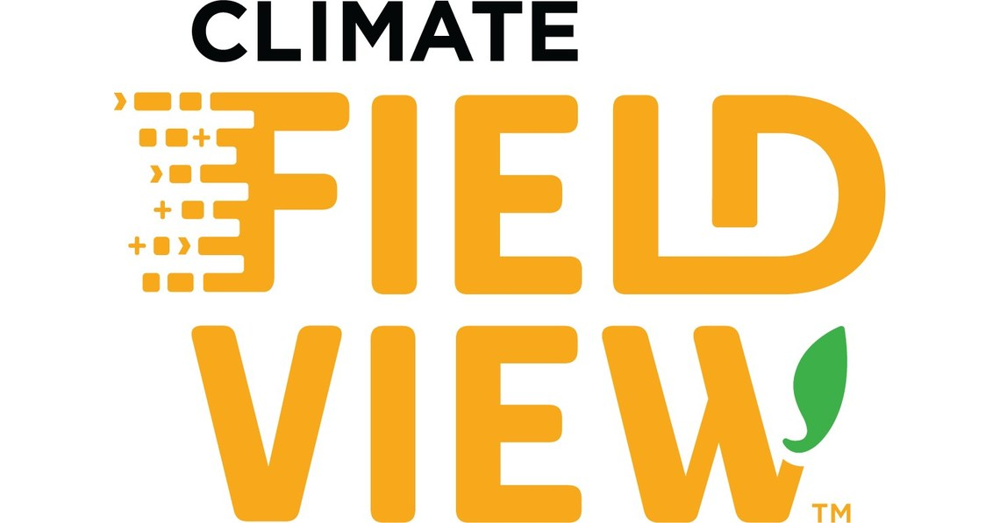                                                                   | 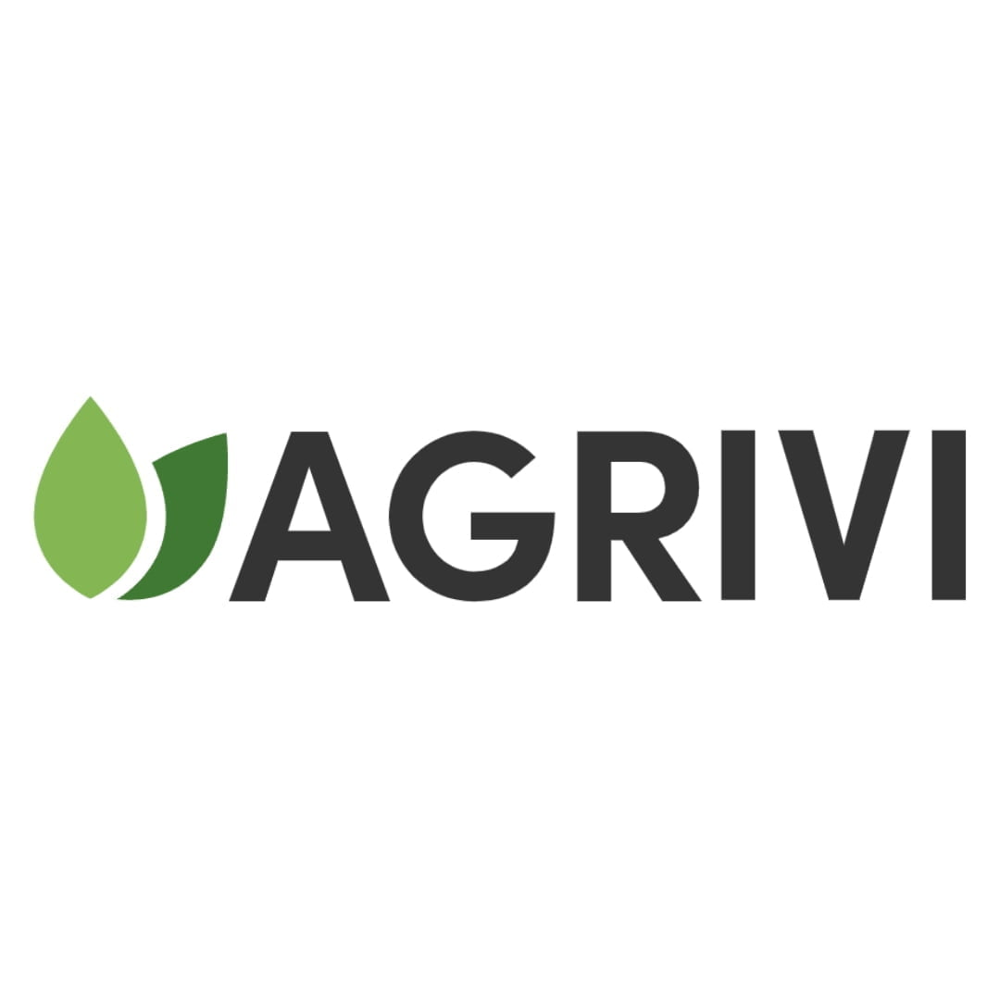                                                                                            |
| **Perfil**                                | Plataforma web distribuida e interoperable diseñada para la planificación sobre mapas interactivos, validación climática vía API externa y simulación de telemetría para operaciones de fumigación con drones.                                                                                       | Plataforma empresarial de software para mapeo aéreo, fotogrametría 3D y análisis multiespectral con drones.               | Plataforma digital corporativa enfocada en la recolección masiva de datos agronómicos terrestres y satelitales.            | Sistema integral de planificación de recursos agrícolas (Farm ERP) en la nube enfocado en gestión y cumplimiento normativo.   |
| **Ventaja competitiva**                   | Plataforma web abierta e intuitiva que integra delimitación de polígonos, consulta meteorológica en tiempo real y seguimiento de drones sin ataduras a hardware propietario.                                                                                                                         | Algoritmos líderes de procesamiento rápido de ortomosaicos y amplia compatibilidad con marcas de drones comerciales.      | Respaldo y validación agronómica global de Bayer, con integración directa a maquinaria pesada y satélites.                 | Módulo exhaustivo de trazabilidad agrícola, cumplimiento de certificaciones internacionales y gestión financiera del cultivo. |
| **¿Qué valor ofrece a los clientes?**     | Automatización accesible del flujo de fumigación, reducción del desperdicio de insumos químicos, prevención por clima adverso y visibilidad operativa en tiempo real.                                                                                                                                | Información visual de alta resolución del estado del campo y herramientas de medición de áreas y elevación.               | Optimización del rendimiento de la cosecha mediante decisiones basadas en datos climáticos e históricos del suelo.         | Centralización administrativa de la finca, control estricto de inventarios y reducción de costos operativos generales.        |
| **Mercado objetivo**                      | Pequeños y medianos agricultores (PyMAs), cooperativas agrarias y operadores técnicos de drones de fumigación.                                                                                                                                                                                       | Grandes corporaciones agrícolas, empresas de ingeniería, construcción e inspección aérea.                                 | Medianos y grandes productores agrícolas con maquinaria mecanizada y tecnificada.                                          | Medianas y grandes empresas agroexportadoras, consultores agrícolas y cadenas agroalimentarias.                               |
| **Estrategias de marketing**              | Marketing digital educativo, demostraciones en cooperativas locales, esquema freemium para visualización de parcelas y alianzas con técnicos de campo.                                                                                                                                               | Venta directa enterprise, marketing de contenidos B2B global, eventos del sector aeroespacial y certificaciones técnicas. | Distribución a través de redes de concesionarios de insumos Bayer, patrocinios agrícolas y pruebas de campo a gran escala. | Marketing inbound, presencia en conferencias globales AgTech, certificaciones digitales y canal de consultoría especializada. |
| **Productos & Servicios**                 | Aplicación web (Angular), servicio RESTful (Spring Boot), landing page informativa, módulo de clima por API y simulador de telemetría de vuelo.                                                                                                                                                      | Software en la nube, aplicación móvil de control de vuelo, módulo de análisis NDVI y visor de ortofotos 2D/3D.            | Aplicación web y móvil, dispositivo FieldView Drive para tractores, mapas satelitales y prescripciones de siembra.         | Plataforma web/móvil FMS, módulo de control de plagas, gestión de bodegas, reportes de auditoría y app de tareas de campo.    |
| **Precios & Costos**                      | Esquema de suscripción modular mensual/anual económico, adaptado por cantidad de hectáreas gestionadas.                                                                                                                                                                                              | Modelo de suscripción SaaS anual de costo elevado (desde cientos hasta miles de USD anuales por usuario).                 | Suscripción anual base más costos adicionales por dispositivos de conexión física y hectáreas monitoreadas.                | Suscripción SaaS por niveles basada en el número de hectáreas y módulos empresariales contratados (alto costo).               |
| **Canales de distribución**               | Aplicación web responsive (Desktop y Mobile) accesible desde cualquier navegador estándar y Landing Page oficial.                                                                                                                                                                                    | Plataforma web SaaS, aplicación móvil (iOS/Android) y portal en la nube.                                                  | Plataforma web, aplicaciones móviles (iOS/Android) y canal de distribución físico de hardware.                             | Plataforma web SaaS y aplicación móvil operativa para smartphones y tablets.                                                  |

---

#### Análisis SWOT (Fortalezas, Oportunidades, Debilidades y Amenazas)

A continuación, se detallan los cuadrantes estratégicos de AgriDron Solutions en contraste directo con los competidores identificados:

| Cuadrante                         | Descripción Estratégica                                                                                                                                                                                                                                                                                                                                                                                                                                                                       |
|:----------------------------------|:----------------------------------------------------------------------------------------------------------------------------------------------------------------------------------------------------------------------------------------------------------------------------------------------------------------------------------------------------------------------------------------------------------------------------------------------------------------------------------------------|
| **Fortalezas (Strengths)**        | • Plataforma web moderna construida sobre arquitectura distribuida escalable (Spring Boot y Angular).<br>• Enfoque especializado en la planificación, validación climática y monitoreo de fumigación aérea sin requerir hardware cautivo.<br>• Interfaz diseñada para una curva de aprendizaje mínima, adaptable a usuarios con alfabetización digital intermedia o baja.<br>• Integración directa con servicios externos de pronóstico meteorológico para mitigar riesgos de deriva química. |
| **Debilidades (Weaknesses)**      | • Startup en etapa inicial con menor músculo financiero y base de clientes reducida frente a gigantes consolidados.<br>• Dependencia inicial de simulación para los flujos de telemetría de drones antes de la integración con hardware físico masivo.<br>• Marca nueva sin reconocimiento previo en ferias o asociaciones agrarias regionales.                                                                                                                                               |
| **Oportunidades (Opportunities)** | • Creciente interés de pequeños y medianos agricultores por modernizar la fumigación para reducir pérdidas económicas por plagas.<br>• Brecha de mercado desatendida por competidores de alto costo (DroneDeploy, Agrivi), que no diseñan soluciones accesibles para predios de 5 a 50 hectáreas.<br>• Necesidad de cooperativas locales de centralizar la supervisión de múltiples lotes en un solo panel colaborativo.                                                                      |
| **Amenazas (Threats)**            | • Resistencia cultural al cambio tecnológico por parte de productores agrícolas acostumbrados a métodos tradicionales manuales.<br>• Expansión o reducción de precios de plataformas consolidadas (como Bayer Climate FieldView) hacia segmentos de menores extensiones.<br>• Deficiencias de infraestructura de conectividad a internet en zonas rurales que dificulten el uso de plataformas web en campo.                                                                                  |

### 2.1.2. Estrategias y tácticas frente a competidores

<p align="justify">

A partir de los hallazgos obtenidos en el análisis competitivo y la matriz SWOT, se definen las estrategias y tácticas comerciales, técnicas y operativas que AgriDron Solutions implementará para posicionarse en el mercado:

#### 1. Estrategia de Enfoque en Costos y Accesibilidad (Frente a DroneDeploy y Agrivi)
Los competidores líderes manejan esquemas de precios enterprise con tarifas anuales elevadas, orientadas principalmente a grandes corporaciones o complejos agroindustriales. AgriDron Solutions capturará la cuota de mercado desatendida mediante una propuesta económica accesible para pequeños y medianos agricultores y coperativas:
*   **Táctica de Pricing por Escala de Uso:** Implementar un modelo de suscripción flexible basado en rangos de hectáreas gestionadas o paquetes mensuales por temporada de fumigación, evitando contratos anuales forzosos.
*   **Táctica Freemium de Entrada:** Ofrecer acceso gratuito para la delimitación de parcelas y consulta de métricas básicas de terreno, incentivando la conversión a planes de pago cuando el usuario requiera planificar rutas avanzadas de fumigación y monitorear condiciones meteorológicas.

#### 2. Estrategia de Diferenciación por Interoperabilidad Abierta
Mientras que herramientas como Climate FieldView priorizan maquinaria terrestre con dispositivos propietarios y plataformas como DJI restringen su ecosistema a su propio hardware, AgriDron Solutions se posiciona como una plataforma web integradora:
*   **Táctica de Gestión Abierta de Órdenes de Servicio:** Proveer una plataforma web accesible mediante APIs RESTful que permita registrar parcelas, programar órdenes de fumigación y actualizar bitácoras de trabajo de forma manual por el operador técnico, sin requerir sincronizaciones complejas ni depender de una marca específica de dron.
*   **Táctica de Validación Climática Contextual:** Integrar servicios externos de pronóstico meteorológico hiperlocal directamente en el flujo de trazado de parcelas, alertando al usuario sobre velocidades de viento y humedad que provoquen deriva química antes de ejecutar la misión.

#### 3. Estrategia de Adopción Digital y Curva de Aprendizaje Acelerada (Usabilidad)
Sistemas como Agrivi presentan una alta complejidad funcional y curvas de aprendizaje pronunciadas que dificultan su uso por parte de agricultores con alfabetización digital intermedia. AgriDron Solutions prioriza una experiencia de usuario (UX) centrada en tareas críticas y visuales:
*   **Táctica de Interfaz Web Intuitiva y Guiada:** Diseñar un flujo de trabajo lineal estructurado en tres pasos simples: 1) Dibujar parcela en el mapa interactivo, 2) Validar condiciones climáticas automáticas, y 3) Asignar y monitorear la ruta de fumigación.
*   **Táctica Responsive Multidispositivo:** Garantizar que la interfaz web opere de forma fluida tanto en laptops de oficina como en navegadores de teléfonos inteligentes y tablets usados por operadores en campo.

#### 4. Estrategia de Penetración de Canal y Trabajo con Comunidades Agrícolas
Para contrarrestar la fuerza de ventas global y las redes corporativas de competidores como Bayer Climate FieldView, AgriDron Solutions ejecutará una estrategia directa y local:
*   **Táctica de Alianzas con Cooperativas Agrarias:** Realizar demostraciones en vivo y pruebas piloto colaborativas en asociaciones agrarias locales, permitiendo que varios agricultores compartan la experiencia de gestionar sus predios.
</p>

---

## 2.2. Entrevistas

### 2.2.1. Diseño de entrevistas

**Objetivo de la entrevista:**
El objetivo de las entrevistas es recopilar evidencia sobre los flujos operativos, limitaciones tecnológicas y necesidades críticas de pequeños agricultores y técnicos de campo que utilizan drones como técnica principal de fumigación, con el fin de modelar perfiles de usuario precisos y fundamentar el diseño funcional de la plataforma web AgriDron.

**Preguntas del segmento 1: Pequeños y Medianos Agricultores / Propietarios de Fincas**

#### Bloque A: Perfil Demográfico y Tecnológico
1. ¿Cuál es su nombre, edad y en qué distrito o valle agrícola se encuentra ubicado su predio?
2. ¿Qué tipos de cultivo maneja principalmente y cuántas hectáreas tiene bajo su administración?
3. ¿Qué dispositivos utiliza con mayor frecuencia para coordinar sus labores (computadora, laptop, smartphone Android/iOS) y qué navegador web suele utilizar (Chrome, Edge, Safari)?
4. ¿Qué aplicaciones o herramientas digitales utiliza con regularidad para comunicarse o gestionar compras/ventas (WhatsApp, banca móvil, hojas de Excel, redes sociales)?

#### Bloque B: Contexto Operativo y Puntos de Dolor - (Tecnica 5W + 2H)
*    **What (Qué):**
5. ¿Qué método utiliza actualmente para la fumigación y control de plagas en sus parcelas?
6. ¿Cómo detecta, delimita y registra la presencia de una plaga o enfermedad en un lote específico?

*    **Why (Por qué):**
7. ¿Por qué considera que los métodos de fumigación que utiliza hoy en día le generan sobrecostos, demoras o riesgos en su cosecha?

*    **Who (Quién):**
8. ¿Quiénes toman la decisión de programar una fumigación y cómo supervisa o verifica usted el trabajo realizado por los aplicadores en campo?


*    **When (Cuándo):**
9. ¿Con qué frecuencia y en qué momentos de la temporada agrícola requiere aplicar tratamientos a sus cultivos?
10. ¿Cuándo y por qué medio consulta el pronóstico del clima antes de fumigar, y cómo le afecta un cambio repentino de viento o lluvia durante la labor?

*    **Where (Dónde):**
11. ¿Dónde lleva el registro de los límites de sus parcelas, fechas de fumigación y tipos de insumos químicos aplicados?

*    **How (Cómo):**
12. Si una plataforma web le permitiera dibujar sus parcelas sobre un mapa satelital para ordenar un servicio de dron, ¿cómo le resultaría más fácil hacerlo y qué apoyo requeriría para utilizarla?

*    **How Much (Cuánto):**
13. ¿Cuánto consideraría razonable pagar mensualmente por un software web que le ayude a planificar y certificar los servicios de fumigación?

#### Bloque C: Percepción sobre la Propuesta de Valor AgriDron Web
14. ¿Qué tan útil le resultaría recibir una alerta meteorológica automática que le indique si es viable o no fumigar antes de contratar al operador?
15. En caso de que una fumigación se interrumpa por mal clima o imprevistos de campo, ¿cómo le gustaría recibir el reporte de avance y reprogramar las hectáreas pendientes desde la web?


**Preguntas del segmento 2: Operadores Técnicos y Proveedores de Servicios de Fumigación con Drones**


#### Bloque A: Perfil Demográfico y Tecnológico (Insumo para User Persona)
1. ¿Cuál es su nombre , edad y en qué valles o zonas agrícolas presta principalmente sus servicios de fumigación o consultoria agricola?
2. ¿Qué formación técnica o experiencia previa tiene en el manejo y operación de drones agrícolas o agronomía?
3. ¿Qué dispositivos utiliza habitualmente durante su jornada de trabajo (smartphone Android/iOS, tablet de campo, laptop) y qué navegadores web utiliza con frecuencia?
4. ¿Qué herramientas digitales utiliza actualmente para coordinar su agenda de clientes, facturación o rutas de trabajo (WhatsApp, Google Calendar, hojas de cálculo, correo electrónico)?

#### Bloque B: Contexto Operativo y Dolores de Gestión (5W + 2H)
*   **What (Qué):**
5. ¿Qué información técnica del predio necesita conocer antes de trasladar su equipo al campo (cultivo, tipo de producto, ubicación exacta de linderos, obstáculos visuales)?
6. ¿Qué modelo o capacidad de dron utiliza y qué tipo de servicios de fumigación ofrece habitualmente (preventivos, curativos)?
*   **Why (Por qué):**
7. ¿Por qué se presentan malentendidos o disputas con los agricultores respecto al área total realmente cubierta o la calidad de la aplicación?
8. ¿Por qué le resulta ineficiente o desgastante la forma en que coordina sus horarios y atiende las llamadas o mensajes de cotización hoy en día?
*   **Who (Quién):**
9. ¿Con quién coordina los detalles de la aplicación en el predio (dueño de finca, otro asesor técnico) y quién valida la conformidad del servicio al terminar la labor?
*   **When (Cuándo):**
10. ¿En qué momento y a través de qué fuentes evalúa las condiciones climáticas (velocidad de viento, humedad, temperatura) antes de autorizar el despegue?
*   **Where (Dónde):**
11. ¿Dónde y cómo registra la bitácora de servicios realizados (hectáreas tratadas, químicos descargados, incidencias o fallas en campo)?
*   **How (Cómo):**
12. ¿Cómo define o verifica actualmente el perímetro exacto que debe fumigar si el agricultor solo le da referencias verbales o ubicaciones aproximadas por WhatsApp?
13. Si surge un imprevisto en campo (cambio brusco de viento, lluvia repentina, avería de equipo o falta de producto), ¿cómo gestiona y documenta la suspensión para justificar el avance parcial ante el cliente?
*   **How Much (Cuánto):**
14. ¿Cuánto cobra habitualmente por hectárea fumigada?

#### Bloque C: Percepción sobre la Propuesta de Valor (AgriDron Web)
15. Si contara con una plataforma web donde pudiera ver las órdenes de servicio en un calendario con la parcela ya dibujada en un mapa satelital interactivo, ¿en qué medida agilizaría su trabajo previo al vuelo?
16. ¿Qué tan útil le resultaría contar con una bitácora web donde al finalizar la labor pueda registrar en un formulario rápido el total de hectáreas tratadas, el volumen aplicado y subir observaciones para que el agricultor las revise de inmediato?
17. Si la plataforma web le ofreciera alertas climáticas automáticas basadas en APIs meteorológicas para justificar técnicamente ante el agricultor por qué una labor debe pausarse o reprogramarse, ¿cómo impactaría en su relación con el cliente?
18. ¿Qué tan útil sería ver en tiempo real el estado del dron (batería, posición, avance) mientras se ejecuta la fumigación?


### 2.2.2. Registro de entrevistas
Para la recolección de requerimientos y el análisis de necesidades, se llevaron a cabo entrevistas a profundidad con representantes de los dos segmentos objetivo del proyecto:  **Segmento 1 (Agricultores y dueños de Fincas)** y **Segmento 2 (Operadores Técnicos de Fumigación con Drones)**.

La evidencia audiovisual consolidada se encuentra alojada en Microsoft Stream a través del siguiente enlace institucional:
* **Enlace al repositorio de video:** [Entrevistas Needfinding - AgriDron Solutions](https://youtu.be/f4bgtmrQYxk)


A continuación, se presenta la tabla de registro que sintetiza el análisis descriptivo de cada entrevista:

| Datos del Entrevistado                                                                                                                                                                                                                                                                                                                                                                                                                                                                                                                       | Evidencia en Video                                                                                                                                                                                                     | Resumen Descriptivo de la Entrevista                                                                                                                                                                                                                                                                                                                                                                                                                                                                                                                                                                                                                                                                                                                                                                                                                                                                                                                                                                                                                                                                                                                                                                                                                                                                                                                                                                                                                                                                                                                                                                                                                                                                                                                                                                                                                                                                                                                                                                                                                                                                                                                                                                                                                                                                                                                                                                                                                                                                                                                                                                                                                                                                                                                                             |
|:---------------------------------------------------------------------------------------------------------------------------------------------------------------------------------------------------------------------------------------------------------------------------------------------------------------------------------------------------------------------------------------------------------------------------------------------------------------------------------------------------------------------------------------------|:-----------------------------------------------------------------------------------------------------------------------------------------------------------------------------------------------------------------------|:---------------------------------------------------------------------------------------------------------------------------------------------------------------------------------------------------------------------------------------------------------------------------------------------------------------------------------------------------------------------------------------------------------------------------------------------------------------------------------------------------------------------------------------------------------------------------------------------------------------------------------------------------------------------------------------------------------------------------------------------------------------------------------------------------------------------------------------------------------------------------------------------------------------------------------------------------------------------------------------------------------------------------------------------------------------------------------------------------------------------------------------------------------------------------------------------------------------------------------------------------------------------------------------------------------------------------------------------------------------------------------------------------------------------------------------------------------------------------------------------------------------------------------------------------------------------------------------------------------------------------------------------------------------------------------------------------------------------------------------------------------------------------------------------------------------------------------------------------------------------------------------------------------------------------------------------------------------------------------------------------------------------------------------------------------------------------------------------------------------------------------------------------------------------------------------------------------------------------------------------------------------------------------------------------------------------------------------------------------------------------------------------------------------------------------------------------------------------------------------------------------------------------------------------------------------------------------------------------------------------------------------------------------------------------------------------------------------------------------------------------------------------------------|
| **Nombres y Apellidos:**<br>Ana Camila Bio Farías<br><br>**Edad:**<br>25 años<br><br>**Distrito / Valle:**<br>Valleca, distrito de Pachacutec<br><br>**Segmento:**<br>Segmento 1: Agricultores y Administradores de Fincas<br><br>**Ocupación:**<br>Administradora de aproximadamente 2 ha de terreno agrícola<br><br>**Fecha:**<br>10/09/2026<br><br>**Timing de Video:**<br>00:00 – 04:42 (Duración: 04:42)                                                                                                                                | <br><br>*[Ver fragmento (00:00)](https://www.youtube.com/watch?v=f4bgtmrQYxk&t=0s)*        | **Perfil Tecnológico y Dispositivos:**<br>En campo utiliza principalmente un smartphone Android por practicidad y también una laptop para tareas administrativas. En el celular utiliza principalmente Google Chrome. Utiliza WhatsApp para comunicarse con trabajadores, proveedores y compradores, banca móvil para realizar pagos y Excel para llevar cuentas de sus gastos.<br><br>**Contexto Operativo y Dolores (5W + 2H):**<br>Administra aproximadamente 2 hectáreas con cultivos principalmente de uva, arándanos y algunas parcelas de palta. Para la fumigación utiliza principalmente fumigadoras de mochila y, cuando necesita cubrir áreas grandes, contrata servicios de terceros, contratistas y maquinaria especializada. Detecta la presencia de plagas mediante recorridos de los trabajadores por las parcelas; cuando encuentran una zona afectada, la identifican de manera aproximada y a veces toman fotos que envían por WhatsApp. No cuenta con un sistema exacto para marcar en un mapa dónde se encuentra la plaga. Manifiesta problemas por la cantidad de mano de obra y tiempo requeridos por la fumigación manual, la aplicación de productos en zonas donde no siempre es necesario y los cambios del clima que pueden reducir el efecto del tratamiento. Registra los límites de las parcelas mediante la experiencia y planos, mientras que las fechas y productos se anotan en un cuaderno y algunas veces en hojas de Excel.<br><br>**Personalidad y Metas:**<br>Busca una gestión sencilla y práctica del terreno, con menos desperdicio de tiempo e insumos y sin utilizar programas complicados.<br><br>**Percepción de AgriDron Web:**<br>Considera útil una interfaz sencilla donde pueda ver el mapa de su terreno, seleccionar la parcela y marcar sus límites tocando puntos del mapa. También considera importante que el sistema muestre claramente cuánto está seleccionando. Al inicio requeriría una pequeña capacitación o tutorial. Valora mucho las alertas meteorológicas automáticas antes de contratar un servicio y, ante una suspensión, desea recibir una notificación en la página y por WhatsApp que indique qué parte de la parcela fue fumigada y cuánto quedó pendiente, para luego seleccionar los sectores pendientes y elegir una nueva fecha. También considera importante conservar el historial de lo realizado.<br><br>**Costo actual referido:**<br>Aproximadamente S/ 100 a S/ 150 por hectárea por jornada de fumigación tradicional.                                                                                                                                                                                                                                                                  |
| **Nombres y Apellidos:**<br>Santiago Vargas<br><br>**Edad:**<br>20 años<br><br>**Distrito / Valle:**<br>Valle de Huaral<br><br>**Segmento:**<br>Segmento 1: Agricultores y Administradores de Fincas<br><br>**Ocupación:**<br>Técnico de apoyo en un fundo agrícola y apoyo en la gestión de un lote de aproximadamente 15 ha<br><br>**Fecha:**<br>11/09/2026<br><br>**Timing de Video:**<br>04:42 – 10:20 (Duración: 05:38)                                                                                                                 | <br><br>*[Ver fragmento (04:42)](https://www.youtube.com/watch?v=f4bgtmrQYxk&t=282s)*            | **Perfil Tecnológico y Dispositivos:**<br>Utiliza principalmente un smartphone Android y, cuando llega a casa o a la oficina del fundo, también una laptop. Usa Google Chrome en ambos dispositivos. Para comunicarse utiliza WhatsApp; para pagos utiliza BCP; para manejar datos utiliza Excel y también Google Drive para organizar información.<br><br>**Contexto Operativo y Dolores (5W + 2H):**<br>Trabaja principalmente con frutales, sobre todo mandarina y palta, y apoya la gestión de un lote de aproximadamente 15 hectáreas. Para la fumigación utiliza mochilas pulverizadoras a motor y, para cultivos altos, a veces alquila una parihuela con mangueras. Detecta plagas mediante evaluaciones caminando por el campo, registra la incidencia en un cuaderno físico y luego intenta marcar la zona mentalmente para pasarla a Excel. Señala que el proceso consume bastante trabajo y tiempo, expone al personal a agroquímicos y, si la plaga avanza, puede generar pérdidas mayores. En época de mayor incidencia realiza fumigaciones aproximadamente cada 15 o 20 días. Para el clima utiliza aplicaciones durante la madrugada o el mismo día; el viento fuerte puede provocar deriva y desperdicio del producto.<br><br>**Personalidad y Metas:**<br>Busca simplificar el trabajo operativo, reducir desperdicios y evitar procesos manuales innecesarios.<br><br>**Percepción de AgriDron Web:**<br>Considera ideal poder acceder desde la laptop a un mapa tipo Google Maps, marcar la parcela mediante clics y contar con una interfaz intuitiva. Considera útil un video tutorial o una guía digital. Para una plataforma que reemplace el mapa físico, indique los límites y permita guardar datos, considera razonable un costo aproximado de S/ 30 a S/ 40 mensuales y señala que S/ 60 o más sería elevado. Considera muy útiles las alertas meteorológicas y desea recibir notificaciones por WhatsApp, Gmail o desde la propia aplicación para reprogramar con un botón las hectáreas pendientes.<br><br>**Registro actual:**<br>Cuenta con un Excel maestro para fechas y productos; los límites de la parcela se encuentran en un mapa impreso y, en ocasiones, usa Google Maps.                                                                                                                                                                                                                                                                                                                                                                                                                                                                                                                                                             |
| **Nombres y Apellidos:**<br>Carlos Mendoza<br><br>**Edad:**<br>42 años<br><br>**Distrito / Valle:**<br>Desconocido<br><br>**Segmento:**<br>Segmento 2: Operadores Técnicos y Proveedores de Fumigación con Drones<br><br>**Ocupación:**<br>Operador técnico y proveedor de servicios de fumigación con drones (aproximadamente 10 años de experiencia)<br><br>**Fecha:**<br>12/09/2026<br><br>**Timing de Video:**<br>10:20 – 14:25 (Duración: 04:05)                                                                                        | <br><br>*[Ver fragmento (10:20)](https://www.youtube.com/watch?v=f4bgtmrQYxk&t=620s)*             | **Perfil Tecnológico y Dispositivos:**<br>Coordina sus servicios principalmente mediante WhatsApp y llamadas telefónicas. Para organizar los trabajos utiliza también anotaciones y hojas de Excel, especialmente cuando tiene varios servicios programados.<br><br>**Contexto Operativo y Dolores (5W + 2H):**<br>Realiza servicios de fumigación con drones desde hace aproximadamente 10 años para agricultores de diferentes zonas agrícolas, principalmente para aplicaciones preventivas o para controlar plagas. Cuando un agricultor solicita un servicio, necesita conocer la ubicación del terreno, el tipo de cultivo, la cantidad de hectáreas, las calles o áreas a trabajar y los productos que se aplicarán. Uno de los problemas frecuentes es recibir ubicaciones aproximadas, lo que puede generar confusión entre el área estimada y la superficie real. La coordinación de horarios, productos y cambios le toma bastante tiempo y actualmente la mayor parte de la información se gestiona mediante mensajes. Revisa principalmente el viento y la posibilidad de lluvia antes de trabajar; si las condiciones cambian, debe detenerse y coordinar nuevamente por llamada o WhatsApp. Los servicios realizados se registran de manera manual y no existe un sistema en el que el agricultor pueda consultar directamente el trabajo ejecutado. Esto también puede generar diferencias sobre cuánto se fumigó cuando una labor queda parcialmente realizada por problemas del equipo o por otras incidencias.<br><br>**Personalidad y Metas:**<br>Busca reducir el trabajo de coordinación y disponer de toda la información del servicio en un solo lugar.<br><br>**Percepción de AgriDron Web:**<br>Considera bastante útil una plataforma donde pueda registrar y organizar sus servicios en un calendario, visualizar las parcelas en un mapa y conocer el área antes de llegar al campo. También valora poder registrar las hectáreas tratadas, el volumen aplicado y las observaciones del servicio, así como consultar alertas meteorológicas para apoyar la decisión de programar o reprogramar. El principal cambio que realizaría es tener en un solo lugar la ubicación, el área, la fecha y el trabajo realizado.                                                                                                                                                                                                                                                                                                                                                                                                                                                                                                                                |
| **Nombres y Apellidos:**<br>Valeria Sofía Mendoza Ríos<br><br>**Edad:**<br>25 años<br><br>**Distrito / Valle:**<br>Valle de Cañete (Lima Provincias)<br><br>**Segmento:**<br>Segmento 2: Operadores Técnicos y Proveedores de Fumigación con Drones<br><br>**Ocupación:**<br>Estudiante de 8vo ciclo de Ingeniería Agrícola, técnica con experiencia en aplicación agrícola y responsable de operaciones en campo<br><br>**Fecha:**<br>13/09/2026<br><br>**Timing de Video:**<br>14:25 – 23:17 (Duración: 08:52)                             | <br><br>*[Ver fragmento (14:25)](https://www.youtube.com/watch?v=f4bgtmrQYxk&t=865s)* | **Perfil Tecnológico y Dispositivos:**<br>Durante las labores de campo utiliza la tablet que viene con el control del dron y su celular personal para llamadas. Para preparar planes de vuelo, revisar mapas cartográficos y pasar sus reportes técnicos utiliza una laptop con Google Chrome. Coordina solicitudes mediante WhatsApp, intenta agendar fechas en Google Calendar y lleva el control de gastos de mantenimiento y horas de vuelo en hojas de cálculo, resultándole tedioso coordinar horarios cuando se acumulan los pedidos en campaña alta.<br><br>**Contexto Operativo y Dolores (5W + 2H):**<br>Trabaja en el Valle de Cañete y ocasionalmente se desplaza al valle de Mala o Chincha para fundos de paltos, cítricos y maíz. Utiliza drones de 30 litros con boquillas para pulverización fina y realiza aplicaciones preventivas y curativas. Señala como dificultad importante la falta de ubicación exacta y linderos antes de llegar al campo, especialmente cuando existen cables de luz, árboles altos o cercas. En ocasiones debe caminar el borde del cultivo o pilotar el dron a baja altura para marcar puntos de referencia, lo que le toma entre 40 minutos y una hora antes del primer vuelo operativo. También enfrenta diferencias entre las áreas declaradas por el agricultor y el área realmente cultivable o tratada. Registra datos como fecha, fundo, lote, número de descargas, insumos y volumen de agua en un Excel de apuntes de campo. Antes de trabajar revisa pronósticos meteorológicos y en el campo verifica condiciones como viento y temperatura; menciona como referencia evitar trabajar cuando el viento supera aproximadamente 12–15 km/h o la temperatura llega a 28 °C. Las suspensiones por clima pueden generar dificultades para explicarle la decisión al agricultor.<br><br>**Personalidad y Metas:**<br>Busca profesionalizar el servicio mediante trazabilidad y mejorar la coordinación y el uso del tiempo en campo.<br><br>**Percepción de AgriDron Web:**<br>Considera que un calendario con órdenes de servicio y parcelas ya delimitadas en un mapa satelital reduciría el tiempo de reconocimiento previo. Valora una bitácora web rápida para registrar las hectáreas reales, el volumen aplicado y observaciones, y que el cliente pueda recibir un reporte técnico. También considera muy útil contar con alertas climáticas como respaldo técnico para pausar o reprogramar trabajos. Finalmente, considera muy práctico ver en tiempo real la batería, la posición y el líquido restante del dron, tanto para controlar la operación como para permitir al agricultor visualizar estos datos desde su celular.<br><br>**Tarifa referida:**<br>Aproximadamente S/ 70 a S/ 90 por hectárea fumigada. |
| **Nombres y Apellidos:**<br>Daniel Arias Dextre (en representación de su padre, Roberto Arias)<br><br>**Edad:**<br>24 años<br><br>**Distrito / Valle:**<br>Reside en Lima (operaciones familiares en el Valle de Ica y Arequipa)<br><br>**Segmento:**<br>Segmento 2: Operadores Técnicos y Proveedores de Fumigación con Drones<br><br>**Ocupación:**<br>Asistente técnico operativo y co-gestor del negocio familiar de fumigación agroaérea<br><br>**Fecha:**<br>13/09/2026<br><br>**Timing de Video:**<br>23:17 – 29:56 (Duración: 06:39) | <br><br>*[Ver fragmento (23:17)](https://www.youtube.com/watch?v=f4bgtmrQYxk&t=1397s)*       | **Perfil Tecnológico y Dispositivos:**<br>En el campo utilizan principalmente un celular Android y una tablet de apoyo para revisar fotos o información del predio. La laptop se utiliza en casa para reportes, facturas y organización de datos en Excel. Las principales herramientas de coordinación son WhatsApp y Google Calendar; los clientes envían cotizaciones, ubicaciones y confirmaciones por WhatsApp y las fechas tentativas se colocan en el calendario.<br><br>**Contexto Operativo y Dolores (5W + 2H):**<br>Prestan servicios principalmente en el Valle de Ica y ocasionalmente en Arequipa para fundos de algodón, espárrago y vid. Utilizan principalmente un DJI T10 de 10 litros y cuentan con otro dron como respaldo para trabajos preventivos y curativos, cubriendo aproximadamente 15 a 25 ha por día con una tarifa aproximada de S/ 35 a S/ 55 por hectárea. Antes de trasladarse necesitan conocer el cultivo, producto, hectáreas, ubicación exacta y obstáculos como postes, árboles o cables. Cuando el cliente solo envía una referencia aproximada, deben recorrer el perímetro con el encargado para confirmar dónde empieza y termina la parcela, lo que puede tomar más de 30 minutos. También se presentan diferencias entre las hectáreas estimadas y el área real y dudas sobre la cobertura cuando el viento dispersa el producto. No cuentan con una bitácora digital unificada: anotan los datos en una libreta, guardan fotos en el celular y luego pasan la información a Excel. Antes de autorizar el despegue revisan Google Weather y, al llegar al campo, miden el viento con un anemómetro; señalan que no trabajan por encima de 15 km/h. Ante una suspensión por lluvia o viento no cuentan con un acta o registro formal para justificar el avance parcial frente al cliente.<br><br>**Personalidad y Metas:**<br>Busca reducir la duplicidad de tareas administrativas, agilizar la llegada al campo y evitar discrepancias con los clientes mediante registros digitales más claros.<br><br>**Percepción de AgriDron Web:**<br>Considera que una plataforma con la parcela ya dibujada en un mapa satelital permitiría llegar al campo con el terreno identificado, ahorrar aproximadamente 20 a 30 minutos por servicio y planificar mejor la ruta. Valora una bitácora web para registrar directamente desde el celular las hectáreas, productos y observaciones realizadas y que el agricultor tenga un registro claro. También considera útiles las alertas climáticas para justificar técnicamente una suspensión o reprogramación y la posibilidad de tener en un solo lugar la información del servicio.                                                                                                        |


### 2.2.3. Análisis de entrevistas

| Segmento Objetivo                                                             | Análisis Estadístico y Cualitativo de Hallazgos                                                                                                                                                                                                                                                                                                                                                                                                                                                              |
|:------------------------------------------------------------------------------|:---------------------------------------------------------------------------------------------------------------------------------------------------------------------------------------------------------------------------------------------------------------------------------------------------------------------------------------------------------------------------------------------------------------------------------------------------------------------------------------------------------------------------------------------------------------------------------------------------------------------------------------------------------------------------------------------------------------------------------------------------------------------------------------------------------------------------------------------------------------------------------------------------------------------------------------------------------------------------------------------------------------------------------------------------------------------------------------------------------------------------------------------------------------------------------------------------------------------------------------------------------------------------------------------------------------------------------------------------------------------------------------------------------------------------------------------------------------------------------------------------------------------------------------------------------------------------------------------------------------------------------------------------------------------------------------------------------------------------------------------------------------------------------------------------------------------------------------------------------------------------------------------------------------------------------------------------------------------------------------------------------------------------------------------------------------------------------------------------------------------------------------------------------------------------------------------------------------------------------------------------------------------------------------------------------------------------------------------------------------------------------------------------------------------------------------------------------------------------------------------------------------------------------------------------------------------------------------------------------------------------------------------------------------------------------------------------------------------------------------------------------------------------------------------------------------------------------------------------------------------------------------------------------------------------------------------------------------------------------------------------------------------------------------------------------------------------------------------------------------------------------------------------------------------------------------------------------------------------------------------------------------------------------------------------------------------------------------------------------------------------------------------------------------------------------------------------------------------------------------------------------------------------------------------------------------------------------------------------------------------------------------------------------------------------------------|
| **Segmento 1:**<br>Agricultores y Administradores de Fincas                   | **1. Variables Demográficas y Geográficas:**<br>• **Rango de edad:** La muestra presenta un espectro generacional distribuido en un 50% de jóvenes profesionales tecnificados (25 años) y un 50% de agricultores tradicionales de mayor experiencia.<br>• **Distribución geográfica:** 50% en el Valle de Ica (distrito de Subtanjalla) y 50% en valles costeros aledaños a Lima.<br>• **Tamaño de predio y cultivos:** Predominan cultivos de alta rentabilidad como frutales (uva de mesa, mandarina, palta) y hortalizas (espárrago), con áreas productivas que oscilan entre medianas (18 ha) y pequeñas parcelas familiares.<br><br>**2. Variables Tecnológicas y Canales de Interacción:**<br>• **Dispositivos móviles:** El 100% de los entrevistados utiliza smartphone Android como dispositivo primario de trabajo en campo.<br>• **Dispositivos de escritorio / Navegadores:** El 50% utiliza laptops para tareas administrativas al cierre del día, mientras que el 50% prescinde por completo de la computadora para la gestión agrícola. El 100% que navega en internet emplea Google Chrome.<br>• **Canales de comunicación y banca:** El 100% utiliza WhatsApp como herramienta prioritaria de coordinación operativa y transaccional con personal y proveedores, y el 100% recurre a aplicativos de banca móvil para el pago de jornales y servicios.<br><br>**3. Contexto Operativo y Puntos de Dolor (5W + 2H):**<br>• **Métodos actuales y costos:** El 100% emplea métodos tradicionales combinados (tractores con barras/parihuelas y cuadrillas con mochilas manuales a motor), reportando un gasto de entre 180 a 200 soles por hectárea tratada en pasadas convencionales.<br>• **Inconvenientes fitosanitarios y de supervisión:** El 100% manifiesta frustración por la alta exposición de los operarios a agroquímicos, el excesivo consumo de agua/producto, la compactación del suelo y el daño físico a flores y ramas. La supervisión presencial resulta agotadora e ineficiente.<br>• **Registro cartográfico y administrativo:** El 100% carece de cartografía digital; los linderos se mantienen de memoria o en planos de papel antiguos, y los registros de insumos y fechas se llevan manualmente en cuadernos de campo (el 50% los traslada posteriormente a hojas de Excel).<br>• **Impacto climático:** El 100% sufre pérdidas directas de dinero por vientos imprevistos que causan deriva y evaporación del fitosanitario fuera del lote.<br><br>**4. Percepción de la Propuesta de Valor (AgriDron Web):**<br>• **Delimitación satelital interactiva:** El 100% califica positivamente el mapeo sobre imágenes satelitales, destacando que un 50% prefiere trazo por clics en pantalla y un 50% sugiere delimitación asistida mediante GPS móvil o acompañamiento inicial.<br>• **Alertas meteorológicas:** El 100% considera indispensable recibir alertas preventivas automáticas de viento y humedad para evitar preparar caldo o coordinar visitas fallidas.<br>• **Seguimiento y reprogramación:** El 100% exige reportes visuales ágiles ante cancelaciones por mal clima que detallen claramente las hectáreas tratadas frente a las pendientes, con opción de reprogramación inmediata (idealmente vinculada a notificaciones breves).<br>• **Disposición a pagar:** Presentan una disposición de suscripción mensual que varía entre los 40 y 120 soles, directamente proporcional al tamaño del predio tecnificado.                                                                                                                                                                                                              |
| **Segmento 2:**<br>Operadores Técnicos y Proveedores de Fumigación con Drones | **1. Variables Demográficas y Perfil Profesional:**<br>• **Rango de edad:** La edad promedio observada se distribuye entre jóvenes técnicos en formación (24 a 25 años, 66.7%) y operadores consolidados (38 años, 33.3%).<br>• **Ámbito de operación:** Cobertura de valles de la costa central y sur (Cañete, Mala, Chincha, Ica y Arequipa).<br>• **Nivel formativo:** El 66.7% cuenta con formación técnica o universitaria en ciencias agrícolas (Ingeniería Agrícola / Agronomía) complementada con acreditaciones de pilotaje, mientras que el 33.3% posee una trayectoria práctica especializada de hasta 6 años en operación continua.<br><br>**2. Variables Tecnológicas y Ecosistema Digital:**<br>• **Equipamiento en campo:** El 100% utiliza smartphones Android para la coordinación diaria, un 66.7% opera además con tablets (integradas en la radiocontroladora del dron o de apoyo fotográfico) y el 100% usa laptops en gabinete para consolidación administrativa mediante Google Chrome.<br>• **Canales y herramientas de gestión:** El 100% depende de WhatsApp y llamadas telefónicas para cotizaciones y acuerdos de servicio; el 66.7% recurre a Google Calendar para agendar citas tentativas y el 100% utiliza hojas de cálculo (Google Sheets / Microsoft Excel) como bitácora y control de costos.<br><br>**3. Contexto Operativo y Puntos de Dolor (5W + 2H):**<br>• **Capacidad de servicio y tarifas:** Operan drones multirrotor de 10 a 30 litros de capacidad para aplicaciones preventivas y curativas. El rendimiento diario promedio oscila entre 15 y 35 ha/día, con tarifas cobradas al cliente entre 35 y 90 soles por hectárea fumigada.<br>• **Dolor en delimitación y reconocimiento perimetral:** El 100% coincide en que la falta de coordenadas precisas o linderos satelitales formalizados genera pérdidas de 30 a 60 minutos por servicio al tener que caminar los terrenos a pie o realizar vuelos manuales previos de reconocimiento para ubicar obstáculos (postes, acequias, árboles).<br>• **Disputas de área y justificación técnica:** El 100% reporta desconfianza y fricciones frecuentes con los agricultores debido a diferencias entre el área calculada mediante mediciones referenciales y la superficie neta pulverizada que mide el GPS del dron. Asimismo, el 100% enfrenta dificultades para justificar suspensiones por ráfagas de viento mayores a 12-15 km/h al carecer de actas o sustentos meteorológicos formales ante el cliente.<br>• **Desgaste de coordinación:** El 100% califica como ineficiente y agotador el proceso de cotizar y ajustar horarios atendiendo mensajes dispersos mientras ejecutan maniobras en campo.<br><br>**4. Percepción de la Propuesta de Valor (AgriDron Web):**<br>• **Mapas y parcelas predefinidas:** El 100% valida que recibir la parcela previamente trazada por el agricultor reduciría hasta un 80% el tiempo de alistamiento de vuelo en campo.<br>• **Bitácora digital inmediata:** El 100% considera de alta utilidad emitir un acta digital rápida al culminar la labor para registrar hectáreas reales, químicos de fumigación aplicados e incidencias, evitando disputas de cobro.<br>• **Alertas meteorológicas:** El 100% señala que las alertas climáticas integradas respaldan técnicamente la decisión de pausar o posponer una labor sin deteriorar la relación con el agricultor.<br>• **Monitoreo de estado en tiempo real:** El 100% de los consultados en este aspecto califica como una función fundamental visualizar el estado del dron (batería, ubicación , quimico restante,etc.) para brindar total transparencia y hacer un mejor trabajo. |

---

## 2.3. Needfinding

### 2.3.1. User Personas

#### Persona 1:

<div align="center">
  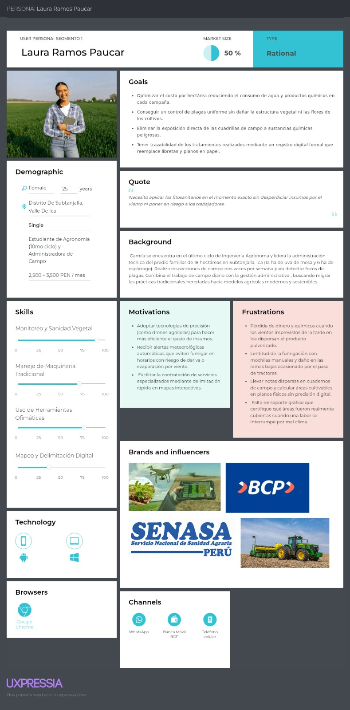
</div>
<br>
Laura cursa el 10mo ciclo de Ingeniería Agrónoma y se desempeña como administradora de campo en el distrito de Subtanjalla, Ica. Combina sus conocimientos técnicos en monitoreo y sanidad vegetal con la gestión diaria del predio agrícola familiar, buscando incorporar tecnologías de precisión para optimizar el uso de agua e insumos y mejorar el control de plagas. En su trabajo enfrenta problemas como la aplicación de productos químicos condicionada por el viento, el registro manual de tratamientos, la falta de información digital para delimitar áreas y la dificultad de coordinar labores cuando las condiciones climáticas interrumpen el trabajo.

#### Persona 2: 

<div align = "center"> 
  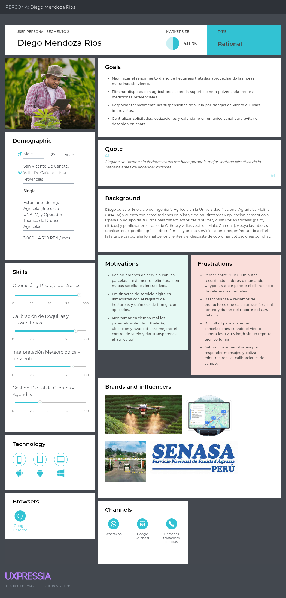
</div>
<br>
Diego cursa el 9no ciclo de Ingeniería Agrícola en la Universidad Nacional Agraria La Molina (UNALM) y cuenta con acreditaciones
en pilotaje de multirrotores y aplicación aeroagrícola. Opera un dron con tanque de 40 litros para tratamientos preventivos y curativos
en frutales (palto, vid, cítricos) y panllevar en el valle de Cañete y valles vecinos (Mala, Quilmaná). Apoya las labores técnicas
en el predio agrícola de su familia y presta servicios a terceros, enfrentando a diario la falta de cartografía formal de
los clientes y el desgaste de coordinar cotizaciones por chat.

### 2.3.2. User Task Matrix

<div> 
  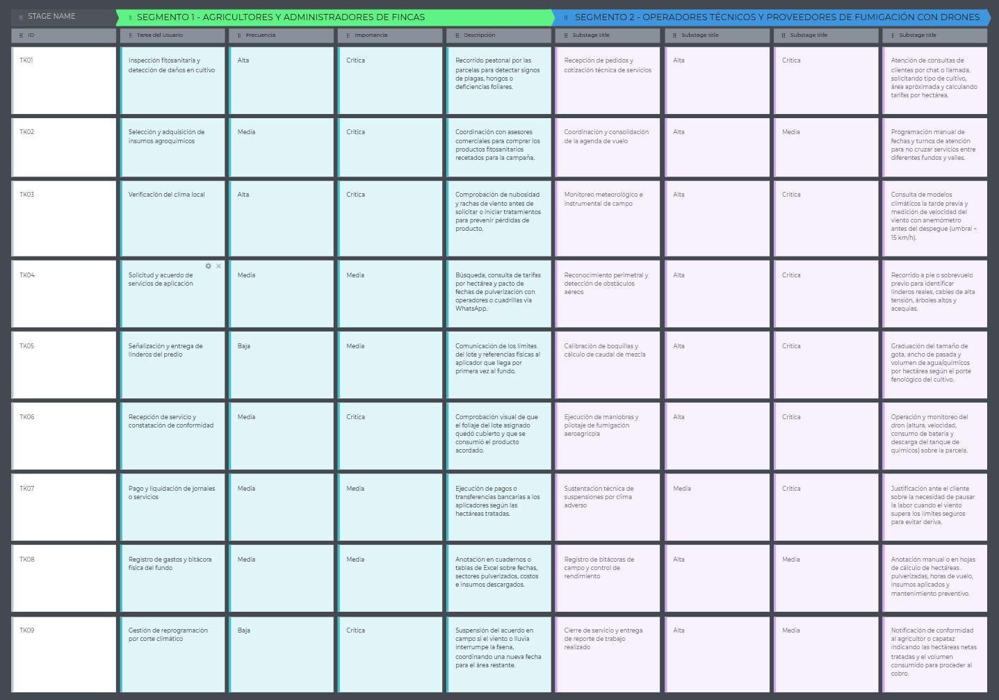
</div>

### 2.3.3. User Journey Mapping

**Segmento 1:**

<div align="center">
 
</div>

**Segmento 2:**
<div align="center">
   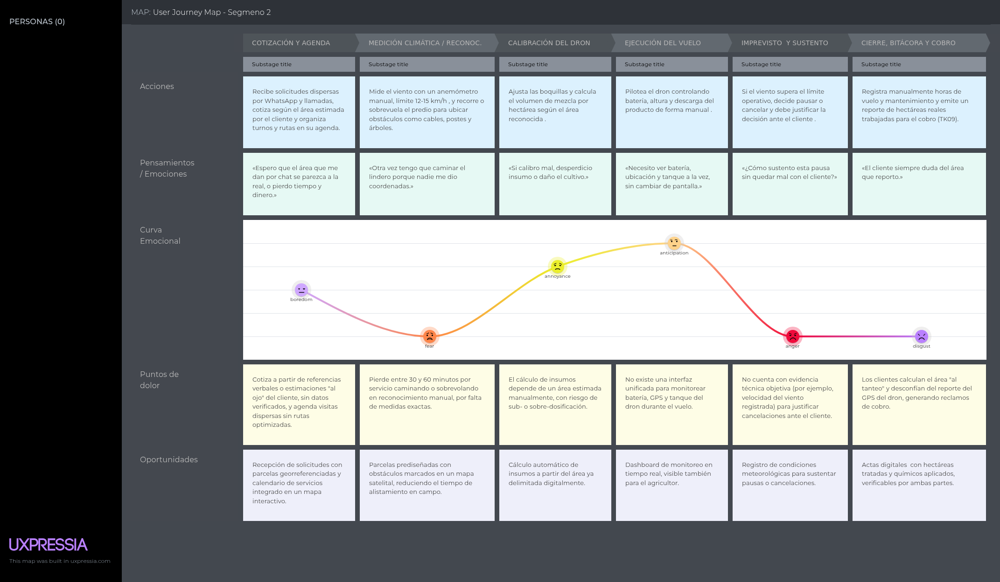
</div>

### 2.3.4. Empathy Mapping

**Segmento 1:**

<div align="center">
   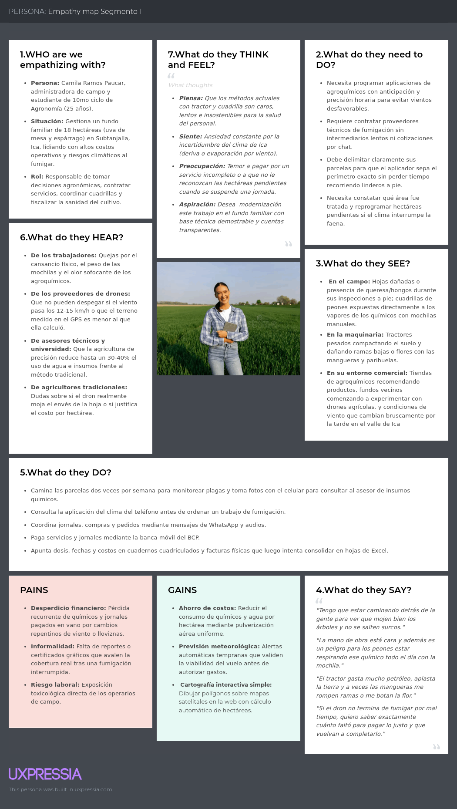
</div>

**Segmento 2:**
<div align="center">
   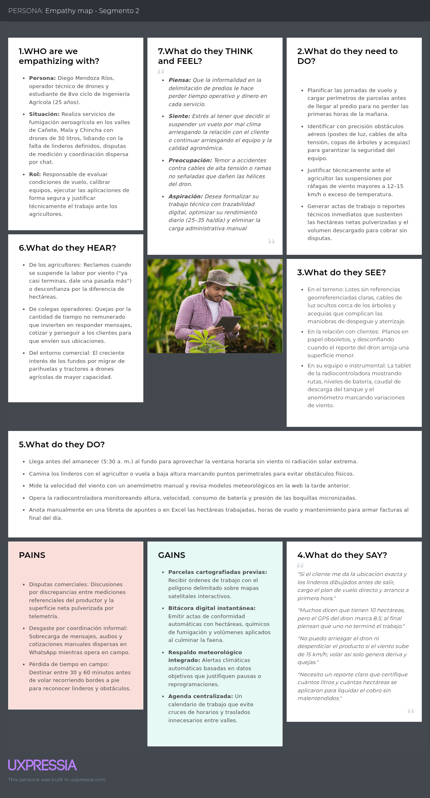
</div>
---

## 2.4. Big Picture EventStorming

<div align="center">
   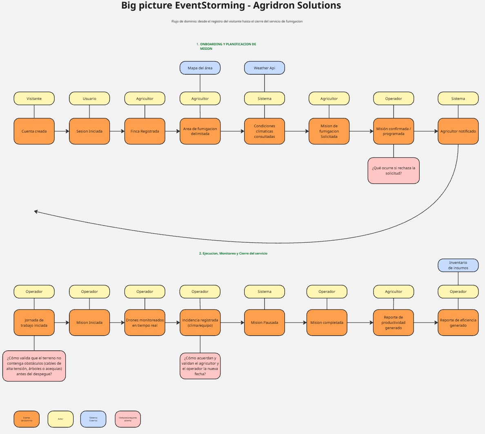
</div>

**Descripción:**

<p align="justify">

El Big Picture EventStorming representa el flujo completo del dominio de <strong>AgriDron Solutions</strong>, desde que un visitante crea su cuenta hasta el cierre del servicio de fumigación. Se construyó agrupando los eventos de dominio (en naranja, redactados en pasado) según el actor que los origina (en amarillo) y, cuando corresponde, el sistema externo involucrado (en celeste).

</p>

<p align="justify">
    
El flujo se organizó en dos grandes fases. La primera, <strong>Onboarding y Planificación de Misión</strong>, cubre desde la creación de la cuenta y el registro de la finca/parcela/terreno por parte del <em>Agricultor</em>, hasta la delimitación del área de fumigación mediante el mapa interactivo, la consulta de condiciones climáticas con la <em>Weather API</em>, la solicitud de la misión y su confirmación o programación directa por parte del <em>Operador Técnico</em>. La segunda fase, <strong>Ejecución, Monitoreo y Cierre del Servicio</strong>, abarca el inicio de la jornada de vuelo del operador, la ejecución y monitoreo de parámetros del dron, el registro de incidencias en campo (derivando en pausas si el clima es adverso), y el cierre de la misión con la generación de reportes de productividad para el agricultor y de rendimiento operativo para el técnico.
    
</p>

<p align="justify">

Durante el ejercicio se identificaron tres <strong>hotspots</strong> (en rosado) que representan preguntas abiertas sobre reglas de negocio operativas: qué flujo alternativo sigue el sistema si el operador rechaza la fecha u orden solicitada, cómo valida técnicamente el operador que el polígono trazado por el agricultor no contenga obstáculos aéreos críticos (cables de alta tensión, árboles o acequias) antes del despegue, y cuál es el mecanismo para acordar y validar una reprogramación de las hectáreas pendientes tras una suspensión climática. Estos puntos críticos orientan directamente la especificación de requerimientos en el Capítulo III.

</p>

**Link del Miro:** https://miro.com/app/board/uXjVHnbT8O4=/?share_link_id=310365063702

---

## 2.5. Ubiquitous Language

| Término | Definición |
| :--- | :--- |
| **Finca** | Predio agrícola registrado por un Agricultor en la plataforma, identificado por nombre, ubicación geográfica y tamaño en hectáreas. Puede contener una o más parcelas. |
| **Parcela / Área de fumigación** | Polígono delimitado sobre un mapa satelital dentro de los límites de una finca, sobre el cual se planifica y ejecuta una misión de fumigación. Su superficie se calcula automáticamente en hectáreas al momento de trazarla. |
| **Misión de fumigación** | Solicitud de servicio creada por un Agricultor sobre un área y cultivo específicos. Atraviesa los estados *Pendiente*, *Confirmada*, *En Progreso*, *Pausada* y *Completada* a lo largo de su ciclo de vida. |
| **Sesión de pulverización** | Periodo continuo de vuelo y aplicación aeroagrícola ejecutado en campo por el Operador, sujeto a ventanas climáticas óptimas y disponibilidad de batería y carga de fitosanitarios. |
| **Obstáculo aéreo / perimetral** | Elemento físico presente en el predio (postes, cables de alta tensión, copas de árboles, acequias) que el Operador debe identificar y registrar para evitar colisiones durante el vuelo. |
| **Operador Técnico** | Piloto acreditado que gestiona sus solicitudes de servicio, valida las parcelas, programa los vuelos, calibra los equipos y ejecuta la fumigación en campo. |
| **Agricultor** | Usuario propietario o administrador de una finca, responsable de delimitar lotes, solicitar misiones de fumigación y consultar el historial de trabajo y reportes de productividad. |
| **Incidencia** | Evento adverso imprevisto reportado por el Operador durante una misión (ráfagas de viento mayores a 12-15 km/h, lluvia repentina, fallas mecánicas), que genera la pausa del servicio. |
| **Acta de servicio** | Constancia digital inmediata emitida por el Operador al culminar la faena, donde se certifican las hectáreas netas tratadas, insumos fitosanitarios descargados y observaciones de campo. |
| **Reporte de productividad** | Documento consolidado que consulta el Agricultor con el histórico de áreas fumigadas, insumos utilizados, costos por hectárea y fechas de tratamiento por predio. |
| **Reporte de rendimiento técnico** | Resumen operativo generado por el Operador con métricas de desempeño propio (hectáreas tratadas por jornada, horas de vuelo acumuladas y volumen promedio aplicado). |
| **Condiciones meteorológicas** | Datos ambientales en tiempo real (velocidad del viento, temperatura y probabilidad de lluvia) provistos por una API externa para validar la viabilidad técnica antes del despegue. |
| **Monitoreo de vuelo simulado** | Visualización interactiva con datos emulados de telemetría (posición GPS, nivel de batería, volumen de químico restante y avance porcentual) para representar el progreso del dron durante la misión sin requerir integración con hardware físico. |

---

# Capítulo III: Requirements Specification

## 3.1. User Stories

### User Stories - Landing Page (Rol: Visitante / Visitor).

| ID     | Título                        | Descripción | Criterios de Aceptación                                                                                                                                                                                                                                                                                                                                      | Epic   |
|:-------|:------------------------------| :--- |:-------------------------------------------------------------------------------------------------------------------------------------------------------------------------------------------------------------------------------------------------------------------------------------------------------------------------------------------------------------|:-------|
| LP-001 | Visualizar propuesta de valor | Como visitante, quiero visualizar la propuesta de valor de AgriDron en la página principal, <br/>para entender rápidamente los beneficios del servicio. | 1. Escenario 1: Visualización exitosa<br>Dado que el visitante ingresa al Landing Page, cuando la página carga completamente, entonces el sistema muestra la cabecera (hero section) con el título, propuesta de valor clara y los botones principales de llamada a la acción (CTA).                                                                                                                   | EP-001 |
| LP-002 | Conocer servicios ofrecidos   | Como visitante, quiero revisar los servicios y soluciones principales de AgriDron, <br/>para evaluar si resuelven las necesidades de mi campo u operación. | 1. Escenario 1: Visualización de servicios<br>Dado que el visitante se desplaza hacia la sección "Servicios", cuando la sección entra en el viewport, entonces el sistema presenta tarjetas informativas estructuradas con iconos, títulos y descripciones de las modalidades de fumigación y monitoreo.                                                                                                    | EP-001 |
| LP-003 | Ver planes y precios          | Como visitante, quiero conocer las tarifas y planes de suscripción, <br/>para tomar una decisión informada antes de registrarme. | 1. Escenario 1: Visualización de planes<br>Dado que el visitante navega a la sección "Planes", cuando consulta la oferta disponible, entonces el sistema muestra los esquemas de pago detallando características incluidas, costo y botón de selección.                                                                                                               | EP-001 |
| LP-004 | Consultar términos y condiciones | Como visitante, quiero acceder a las políticas de uso y privacidad, <br/>para informarme sobre el tratamiento de datos y condiciones contractuales. | 1. Escenario 1: Navegación a términos legales<br>Dado que el visitante está en cualquier sección del Landing Page, cuando hace clic en el enlace "Términos y Condiciones" del pie de página, entonces el sistema redirige a la vista con el documento legal correspondiente.                                                                                                    | EP-001 |
| LP-005 | Cambiar idioma del sitio      | Como visitante, quiero alternar el idioma de la página entre español e inglés, <br/>para consultar la información en mi idioma preferido. | 1. Escenario 1: Cambio exitoso de idioma<br>Dado que el visitante hace clic en el selector de idioma de la barra de navegación, cuando selecciona inglés ("EN"), entonces todos los textos del Landing Page se renderizan inmediatamente en dicho idioma sin recargar la sesión.                                                                                                                | EP-001 |
| LP-006 | Registrarse como nuevo usuario | Como visitante, quiero registrarme ingresando mis datos básicos y seleccionando mi perfil, <br/>para acceder a las funcionalidades de la Web Application. | 1. Escenario 1: Registro exitoso<br>Dado que el visitante completa el formulario con nombre, correo electrónico válido, contraseña y selecciona su rol (Agricultor/Operador), cuando presiona "Registrarse", entonces el sistema registra la cuenta, inicia sesión y redirige al panel inicial correspondiente.<br/>2. Escenario 2: Email ya registrado<br>Dado que el visitante ingresa un correo ya existente en el sistema, cuando envía el formulario de registro, entonces el sistema muestra el mensaje "El correo electrónico ya está registrado" y no crea la cuenta. | EP-002 |
| LP-007 | Iniciar sesión en la plataforma | Como usuario registrado, quiero ingresar con mis credenciales, <br/>para acceder a mi espacio de trabajo en la Web Application. | 1. Escenario 1: Inicio de sesión exitoso<br>Dado que el usuario registrado está en el Landing Page y hace clic en "Iniciar Sesión", cuando ingresa correo y contraseña válidos, entonces el sistema autentica al usuario y redirige al Dashboard de la Web Application según su rol.<br/>2. Escenario 2: Credenciales inválidas<br>Dado que el usuario ingresa correo o contraseña incorrectos, cuando envía el formulario de login, entonces el sistema muestra el mensaje "Credenciales inválidas" y no permite el acceso.                                                                                                    | EP-002 |


### User Stories - Web Application (Roles: Agricultor y  Operador)

> Rol: Agricultor

| ID | Título | Descripción | Criterios de Aceptación | Epic |
|:---|:---|:---|:---|:---|
| WA-001 | Registrar finca y parcelas en mapa interactivo | Como agricultor, quiero registrar mis fincas y delimitar mis parcelas dibujando sobre un mapa satelital, para tener catastrados los linderos de mis cultivos. | 1. Escenario 1: Registro exitoso con dibujo de parcela<br>Dado que el agricultor está en "Mis Fincas", cuando completa los datos generales (nombre, valle/ubicación) y utiliza la herramienta de dibujo para trazar el polígono de una parcela en el mapa satelital, entonces el sistema calcula automáticamente la superficie en hectáreas, guarda el registro y lo muestra en su lista de terrenos.<br/><br/>2. Escenario 2: Parcela sin geometría cerrada<br>Dado que el agricultor intenta guardar una parcela sin haber cerrado el trazo del polígono en el mapa, cuando hace clic en "Guardar", entonces el sistema muestra el mensaje "Debe delimitar un área poligonal cerrada en el mapa" y no permite guardar. | EP-003 |
| WA-002 | Solicitar misión de fumigación con validación climática | Como agricultor, quiero solicitar una misión seleccionando la parcela, el cultivo y la fecha tentativa, para contratar el servicio técnico con dron. | 1. Escenario 1: Solicitud enviada exitosamente<br>Dado que el agricultor selecciona una parcela registrada, indica el tipo de cultivo, producto a aplicar y fecha requerida, cuando confirma la solicitud, entonces el sistema consulta la API meteorológica externa para mostrar una advertencia previa de viabilidad de viento, guarda la misión en estado "Pendiente" y notifica al Operador Técnico asignado/disponible.<br/><br/>2. Escenario 2: Datos obligatorios incompletos<br>Dado que el agricultor no selecciona una parcela o deja en blanco las especificaciones de aplicación, cuando intenta enviar la solicitud, entonces el sistema resalta los campos faltantes y no procesa la misión. | EP-004 |
| WA-003 | Consultar historial de misiones y estados | Como agricultor, quiero revisar el listado de mis solicitudes y misiones históricas por finca, para dar seguimiento al estado de mis cultivos. | 1. Escenario 1: Visualización y filtrado<br>Dado que el agricultor ingresa a "Historial de Misiones", cuando aplica filtros por finca, rango de fechas o estado (Pendiente, En Progreso, Pausada, Completada), entonces el sistema muestra la tabla actualizada con el resumen de cada orden de fumigación.<br/><br/>2. Escenario 2: Detalle de orden con mapa<br>Dado que el agricultor hace clic sobre una misión completada o pausada, cuando carga la vista de detalle, entonces el sistema muestra el polígono tratado, el estado de la labor y las observaciones técnicas registradas en campo. | EP-004 |
| WA-004 | Generar reporte y acta de tratamientos fitosanitarios | Como agricultor, quiero exportar un reporte consolidado de las fumigaciones ejecutadas en mis predios, para respaldar el control de insumos y certificar labores de sanidad vegetal. | 1. Escenario 1: Exportación exitosa de reporte<br>Dado que el agricultor accede al módulo de "Reportes", cuando selecciona una finca y un rango de fechas con servicios completados y presiona "Descargar Reporte", entonces el sistema genera un documento estructurado (PDF/hoja de cálculo) que detalla fecha, lote, hectáreas netas tratadas, fitosanitarios aplicados y actas de servicio asociadas.<br/><br/>2. Escenario 2: Sin labores en el periodo<br>Dado que el agricultor elige un rango de fechas donde no se ejecutaron misiones, cuando solicita la generación, entonces el sistema presenta el aviso "No existen registros de fumigación en el rango de fechas seleccionado". | EP-004 |


> Rol: Operador


| ID     | Título                        | Descripción | Criterios de Aceptación                                                                   | Epic   |
|:-------|:------------------------------| :--- |:-------------------------------------------------------------------------------------------------------------------------------------------------------------------------------------------------------------------------------------------------------------------------------------------------------------------------------------------------------------|:-------|
| WA-005 | Gestionar agenda de órdenes y visualizar parcelas | Como operador técnico, quiero revisar mis órdenes de servicio en un calendario con la parcela predelimitada en el mapa satelital, para planificar mis rutas de atención y verificar linderos antes de llegar al campo. | 1. Escenario 1: Visualización y confirmación de solicitud<br>Dado que el operador accede al panel "Mi Agenda", cuando revisa una solicitud en estado "Pendiente", entonces el sistema muestra la parcela trazada sobre el mapa, el área en hectáreas, el cultivo y las observaciones de acceso, permitiéndole hacer clic en "Confirmar Fecha" o "Proponer Reprogramación".<br/><br/>2. Escenario 2: Identificación de obstáculos en mapa<br>Dado que el operador inspecciona el polígono satelital del predio, cuando activa la capa de reconocimiento visual, entonces el sistema le permite registrar notas preventivas sobre árboles altos, cables o acequias antes del traslado. | EP-004 |
| WA-006 | Iniciar y monitorear sesión de pulverización | Como operador técnico, quiero registrar el inicio del vuelo y monitorear los parámetros del dron en tiempo real, para controlar la cobertura y el avance del trabajo en campo. | 1. Escenario 1: Despegue e inicio de labor<br>Dado que el operador se encuentra en el predio con la misión confirmada, cuando pulsa "Iniciar Pulverización", entonces el sistema cambia el estado a "En Progreso", marca la hora de inicio y muestra la vista de monitoreo con telemetría simulada (posición, nivel de batería, volumen restante y avance porcentual).<br/><br/>2. Escenario 2: Advertencia por condiciones climáticas críticas<br>Dado que el operador intenta iniciar la misión pero la consulta climática registra velocidades de viento superiores a 15 km/h, cuando presiona "Iniciar", entonces el sistema muestra una advertencia técnica preventiva sobre riesgo de deriva química antes de autorizar el despegue. | EP-005 |
| WA-007 | Registrar incidencias y suspensión por clima | Como operador técnico, quiero documentar interrupciones por mal tiempo o fallas mecánicas con sustento meteorológico, para justificar técnicamente la pausa de la labor ante el agricultor. | 1. Escenario 1: Registro de suspensión climática<br>Dado que el operador está en una misión en progreso y las ráfagas superan el límite seguro, cuando selecciona "Pausar por Clima" e ingresa la velocidad de viento observada, entonces el sistema congela el porcentaje de avance cubierto, cambia el estado a "Pausada" y emite una notificación al agricultor con el registro meteorológico que respalda la interrupción.<br/><br/>2. Escenario 2: Incidencia técnica o logística<br>Dado que se presenta un imprevisto operativo (falta de batería, obstrucción de boquillas o agotamiento de insumo), cuando el operador registra el evento con observaciones breves, entonces el sistema guarda el incidente en la bitácora de la orden y notifica la pausa técnica. | EP-005 |
| WA-008 | Emitir acta de servicio y bitácora técnica de vuelo | Como operador técnico, quiero registrar las hectáreas finales pulverizadas y el volumen de insumo aplicado al culminar la faena, para generar el acta de conformidad y liquidar el cobro sin disputas. | 1. Escenario 1: Emisión exitosa de acta<br>Dado que el operador finaliza la cobertura del lote, cuando pulsa "Completar Misión" y completa el formulario rápido con hectáreas netas tratadas (según telemetría), litros de caldo descargados y tipo de boquilla, entonces el sistema cambia el estado a "Completada", genera el Acta de Servicio digital y habilita la consulta instantánea para el agricultor.<br/><br/>2. Escenario 2: Cierre con avance parcial<br>Dado que una misión pausada no pudo reanudarse en la misma jornada, cuando el operador emite el acta de cierre parcial, entonces el sistema discrimina claramente las hectáreas efectivamente cubiertas frente a las hectáreas pendientes para su posterior reprogramación. | EP-005 |


### Resumen de Épicas del Proyecto

| Epic ID | Nombre de la Épica | Descripción | User Stories Asociadas | Bounded Context Relacionado |
|:---|:---|:---|:---|:---|
| **EP01** | Descubrimiento e Información Comercial (Landing Page) | Presentar la propuesta de valor de AgriDron Solutions, el catálogo de servicios de fumigación aeroagrícola, las tarifas de suscripción y los términos legales para atraer y convertir visitantes. | LP-001, LP-002, LP-003, LP-004, LP-005 | Landing Page Component |
| **EP02** | Acceso y Onboarding de Usuarios | Proveer los mecanismos de registro con diferenciación de perfiles (Agricultor y Operador Técnico) e inicio de sesión seguro para el ingreso a la Web Application. | LP-006, LP-007 | Shared / Identity |
| **EP03** | Gestión Territorial de Fincas y Parcelas | Permitir a los agricultores registrar sus predios e interactuar con herramientas cartográficas sobre mapas satelitales para catastrar y delimitar los polígonos de sus cultivos. | WA-001 | Field Management |
| **EP04** | Contratación y Trazabilidad de Fumigación | Centralizar el flujo de solicitud de misiones con validación climática, la confirmación en la agenda del operador, el historial de labores y la exportación de reportes fitosanitarios. | WA-002, WA-003, WA-004, WA-005 | Analytics & Reporting / Weather Integration |
| **EP05** | Ejecución y Bitácora Técnica de Vuelo | Gestionar el despegue, el monitoreo visual de telemetría simulada del dron, el registro de suspensiones por clima adverso y la emisión inmediata del Acta de Servicio de campo. | WA-006, WA-007, WA-008 | Flight Operations |


### Technical User Stories (Historias Técnicas e Infraestructura)

> Historias de usuario técnicas enfocadas en arquitectura, integración de APIs externas, persistencia de datos e infraestructura base para habilitar las funcionalidades de la Web Application.

| ID | Título | Descripción | Criterios de Aceptación | Epic / Bounded Context |
|:---|:---|:---|:---|:---|
| TU-001 | Configuración de Arquitectura Base en Spring Boot | Como equipo de desarrollo, queremos configurar la arquitectura multicapa base en Spring Boot, para asegurar la trazabilidad y separación de responsabilidades en el Backend. | 1. **Escenario 1: Estructura del Proyecto**<br>Dado que el desarrollador inicializa el repositorio Backend, cuando se compila el proyecto, entonces la arquitectura debe cumplir con la separación clara de controladores REST, capas de servicio, repositorios JPA y entidades del dominio.<br><br>2. **Escenario 2: Manejo Global de Excepciones**<br>Dado que ocurre un error no controlado en la API, cuando se retorna la respuesta HTTP, entonces el sistema debe devolver una estructura JSON estandarizada con el código de error y mensaje descriptivo (`HttpStatus 400/500`). | Infraestructura / Architecture |
| TU-002 | Implementación de Seguridad y Autenticación JWT | Como desarrollador Backend, quiero implementar un mecanismo de autenticación y autorización basado en JWT (JSON Web Tokens), para proteger las rutas de la API según el rol del usuario. | 1. **Escenario 1: Generación de Token**<br>Dado que un usuario autentica con credenciales válidas, cuando el sistema valida la firma, entonces retorna un Bearer JWT token firmado con tiempo de expiración.<br><br>2. **Escenario 2: Acceso Protegido por Rol**<br>Dado que un usuario con rol 'Agricultor' intenta invocar un endpoint operativo restringido al 'Operador' (como iniciar misión o emitir acta de servicio), cuando realiza la petición HTTP con su token, entonces el sistema retorna un código `403 Forbidden`. | Seguridad / Identity Context |
| TU-003 | Integración con Servicio Externo de Clima (Weather API) | Como desarrollador Backend, quiero integrar un cliente HTTP con una API externa de pronóstico meteorológico, para consultar la velocidad del viento, temperatura y probabilidad de lluvia en las parcelas. | 1. **Escenario 1: Consulta Meteorológica Externa**<br>Dado que el sistema recibe las coordenadas GPS de una parcela, cuando el cliente HTTP consulta la API de clima externa, entonces parsea y retorna la velocidad del viento (km/h) y la probabilidad de precipitación en formato JSON interno.<br><br>2. **Escenario 2: Caída de la API Externa (Fallback)**<br>Dado que la API externa no responde en un tiempo límite (timeout de 3s), cuando el sistema procesa la solicitud, entonces se activa un mecanismo de resiliencia (Fallback) que retorna el último estado climático almacenado en caché. | Weather Integration Context |
| TU-004 | Configuración de Persistencia Geoespacial de Parcelas | Como arquitecto de software, quiero estructurar la persistencia de geometrías GeoJSON en la base de datos relacional, para almacenar y recuperar con precisión las coordenadas de las parcelas delimitadas. | 1. **Escenario 1: Persistencia de Geometría de Parcela**<br>Dado que el Frontend envía las coordenadas del polígono trazado en el mapa satelital, cuando el repositorio persiste la entidad `Parcel`, entonces almacena la serie de vértices geográficos en formato estandarizado GeoJSON en el campo `geometry`.<br><br>2. **Escenario 2: Validación de Integridad de Coordenadas**<br>Dado que se envía un polígono con menos de tres pares de coordenadas o sin cerrar el ciclo geométrico, cuando el servicio valida la entidad, entonces rechaza la persistencia y retorna una excepción de dominio por formato de área inválido. | Field Management Context |
| TU-005 | Implementación de Simulador de Telemetría para Drones | Como desarrollador, quiero implementar un servicio emulador de telemetría de vuelo vía WebSockets, para simular la actualización periódica de la posición GPS, nivel de batería y avance porcentual durante la misión. | 1. **Escenario 1: Transmisión de Telemetría Simulada**<br>Dado que una misión entra en estado "En Progreso", cuando el emulador genera un evento de vuelo cada 5 segundos, entonces transmite vía WebSocket la latitud, longitud, porcentaje de batería y avance porcentual al cliente conectado.<br><br>2. **Escenario 2: Desconexión de Telemetría**<br>Dado que la transmisión se interrumpe, cuando el cliente de la Web App deja de recibir datos durante 15 segundos, entonces la interfaz emite un aviso visual de pérdida de enlace y mantiene el último estado conocido. | Flight Operations Context |
---

## 3.2. Impact Mapping

**Impact Mapping Segmento 1:**
<div align="center">
   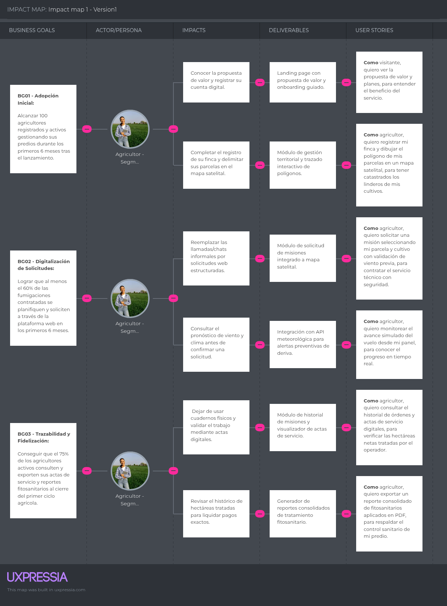
</div>


**Impact Mapping Segmento 2:**

<div align="center">
   
</div>


**Descripción:**
<p align="justify">

Diagrama que muestra la relación entre los actores clave (agricultor, operador y supervisor),
los objetivos estratégicos del proyecto y las funcionalidades necesarias para lograrlos

</p>

---

## 3.3. Product Backlog

| ID     | Epic / Módulo        | User Story / Technical Story                                                                                                                                         | Prioridad  | Story Points  | Estado |
|:-------|:---------------------|:---------------------------------------------------------------------------------------------------------------------------------------------------------------------|:-----------|:-------------:|:-------|
| TU-00  | Infraestructura      | Configuración de Arquitectura Base en Spring Boot                                                                                                                    | ALTA       |       5       | To-Do  |
| TU-002 | Seguridad            | Implementación de Seguridad y Autenticación JWT                                                                                                                      | ALTA       |       5       | To-Do  |
| TU-004 | Field Management     | Configuración de Persistencia Espacial en Base de Datos (GIS)                                                                                                        | ALTA       |       5       | To-Do  |
| LP-001 | Landing Page         | Como visitante, quiero visualizar la propuesta de valor de AgriDron en la página principal, para entender rápidamente qué ofrece el servicio.                        | ALTA       |       2       | To-Do  |
| LP-002 | Landing Page         | Como visitante, quiero ver los servicios y características principales de AgriDron, para evaluar si la solución satisface mis necesidades.                           | ALTA       |       2       | To-Do  |
| LP-003 | Landing Page         | Como visitante, quiero conocer los planes de precios y suscripción, para tomar una decisión informada sobre la contratación del servicio.                            | ALTA       |       3       | To-Do  |
| LP-004 | Landing Page         | Como visitante, quiero registrarme en la plataforma proporcionando mis datos básicos, para acceder a las funcionalidades de la Web Application.                      | ALTA       |       5       | To-Do  |
| LP-005 | Landing Page         | Como visitante registrado, quiero iniciar sesión con mis credenciales, para acceder a la Web Application.                                                            | ALTA       |       3       | To-Do  |
| LP-006 | Landing Page         | Como visitante, quiero acceder a los términos y condiciones de servicio, para conocer las políticas de uso y privacidad.                                             | BAJA       |       1       | To-Do  |
| LP-007 | Landing Page         | Como visitante, quiero cambiar el idioma del sitio entre español e inglés, para navegar en mi idioma preferido.                                                      | MEDIA      |       5       | To-Do  |
| WA-001 | Web App - Agricultor | Como agricultor, quiero registrar mis fincas en la plataforma, para gestionar mis parcelas de forma centralizada.                                                    | ALTA       |       5       | To-Do  |
| WA-002 | Web App - Agricultor | Como agricultor, quiero dibujar el área de fumigación sobre un mapa interactivo, para planificar misiones de manera precisa.                                         | ALTA       |       8       | To-Do  |
| WA-003 | Web App - Agricultor | Como agricultor, quiero crear una misión de fumigación seleccionando el área y el cultivo, para solicitar el servicio.                                               | ALTA       |       5       | To-Do  |
| TU-003 | Weather Integration  | Integración con Servicio Externo de Clima (Weather API)                                                                                                              | MEDIA      |       3       | To-Do  |
| WA-004 | Web App - Agricultor | Como agricultor, quiero consultar el historial de misiones de fumigación de mis fincas, para dar seguimiento a las operaciones realizadas.                           | MEDIA      |       5       | To-Do  |
| WA-005 | Web App - Agricultor | Como agricultor, quiero generar reportes de productividad por hectárea, para justificar inversiones y tomar decisiones estratégicas.                                 | MEDIA      |       8       | To-Do  |
| WA-006 | Web App - Operador   | Como operador, quiero visualizar las misiones de fumigación que me han sido asignadas, para planificar mi jornada de trabajo.                                        | ALTA       |       3       | To-Do  |
| WA-007 | Web App - Operador   | Como operador, quiero actualizar el estado de una misión (En Progreso / Completada), para mantener informado al agricultor y al supervisor.                          | ALTA       |       5       | To-Do  |
| WA-008 | Web App - Operador   | Como operador, quiero registrar mis horas trabajadas con verificación de ubicación, para garantizar precisión en la información de mi jornada.                       | MEDIA      |       8       | To-Do  |
| WA-009 | Web App - Operador   | Como operador, quiero registrar incidencias durante la operación (clima adverso, falla técnica, etc.), para documentar interrupciones y justificar reprogramaciones. | MEDIA      |       5       | To-Do  |
| WA-010 | Web App - Supervisor | Como supervisor, quiero asignar misiones creadas por agricultores a operadores disponibles, para coordinar las operaciones de campo.                                 | ALTA       |       5       | To-Do  |
| TU-005 | Flight Operations    | Implementación de Simulador de Telemetría para Drones (WebSockets)                                                                                                   | ALTA       |       8       | To-Do  |
| WA-011 | Web App - Supervisor | Como supervisor, quiero ver el estado y ubicación de todos los drones activos en tiempo real, para optimizar la coordinación de misiones.                            | ALTA       |       8       | To-Do  |
| WA-012 | Web App - Supervisor | Como supervisor, quiero consultar reportes de eficiencia operativa (tiempo/hectárea, costo/hectárea), para evaluar el desempeño y optimizar recursos.                | MEDIA      |       8       | To-Do  |
| WA-013 | Web App - Supervisor | Como supervisor, quiero gestionar el inventario de pesticidas y fertilizantes disponibles, para planificar compras y garantizar el abastecimiento.                   | MEDIA      |       5       | To-Do  |

---

# Capítulo IV: Product Design

## 4.1. Style Guidelines

### 4.1.1. General Style Guidelines

<p align="justify">
AgriDron Solutions adopta un sistema de diseño coherente, funcional y optimizado para la gestión de operaciones de fumigación agrícola con drones
y monitoreo de cultivos. En esta sección se establecen los lineamientos de estilo que garantizan la consistencia visual y de interacción en todo el
ecosistema digital, incluyendo la landing page y la aplicación web. Se detallan las decisiones de branding,
paleta de colores, tipografía, espaciado, tono y lenguaje de la plataforma.
</p>

<p align="justify">
Estos criterios se fundamentan en principios de diseño como jerarquía visual, legibilidad, contraste y feedback inmediato. Asimismo, responden a un
enfoque accesible e intuitivo para que los agricultores, operadores de drones y supervisores del campo puedan interactuar con la plataforma en entornos
de alta exigencia operativa sin sobrecarga cognitiva.
</p>
 
**1. Logo:**
<p align="justify">
El isotipo y logotipo de AgriDron Solutions representan la convergencia entre la tecnología de precisión y la naturaleza agrícola.
El símbolo gráfico combina hojas estilizadas que aluden al campo y a los cultivos con una disposición simétrica que simula la estructura
y rotación de los hélices de un dron agrícola. Acompañado de la tipografía de marca, transmite innovación, orden y profesionalismo
tecnológico aplicado al sector agropecuario.
</p>


**2. Branding:**

AgriDron Solutions busca proyectar una identidad visual profesional, confiable, innovadora, cercana y sostenible. La marca combina
la eficiencia tecnológica de los drones con la calidez y el valor humano del trabajo en el campo.

El branding de AgriDron se fundamenta en los siguientes conceptos clave:
- **Arquetipo de Marca:** El Experto / El Creador, posicionando a AgriDron como un socio tecnológico confiable que empodera a los productores agrícolas mediante herramientas de precisión.
- **Precisión:** Reflejada en interfaces ordenadas, grids estructurados, bordes definidos y líneas limpias para la visualización de mapas y datos telemétricos.
- **Confianza:** Proyectada mediante colores sobrios, tipografías claras y la presentación segura de métricas de salud de cultivos, consumo de insumos y reportes.
- **Innovación:** Transmitida a través de componentes dinámicos e indicadores visuales destacados para estados en tiempo real y alertas de misiones.
- **Sostenibilidad y Cercanía:** Inspiradas en una paleta orgánica y el uso de imágenes reales de campo, conectando la tecnología directamente con la realidad del agricultor.

**3. Typography:**
El sistema tipográfico de AgriDron emplea tres familias de fuentes seleccionadas para equilibrar fuerza de marca,
alta legibilidad en pantallas y precisión técnica en datos:

- **Brand / Títulos principales (Segoe UI):** Se utiliza en fuentes sans-serif para títulos (Display, Headline), encabezados
de la landing page y secciones principales de la aplicación. Aporta modernidad y estructura visual limpia.

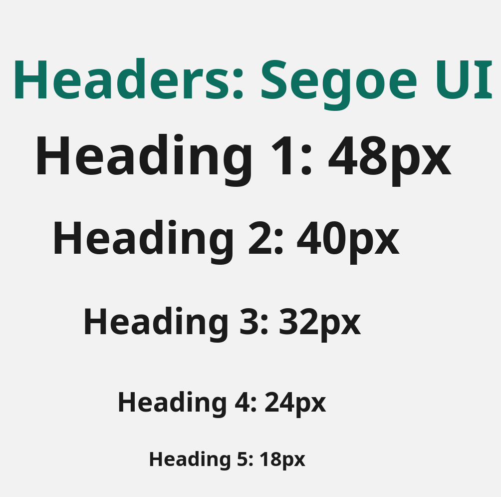

- **Plain / Cuerpo de texto (Montserrat):** Se emplea para el cuerpo de texto, párrafos, formularios, tablas, etiquetas y botones
generales. Su alto rendimiento de lectura garantiza claridad en la consulta de datos operativos.

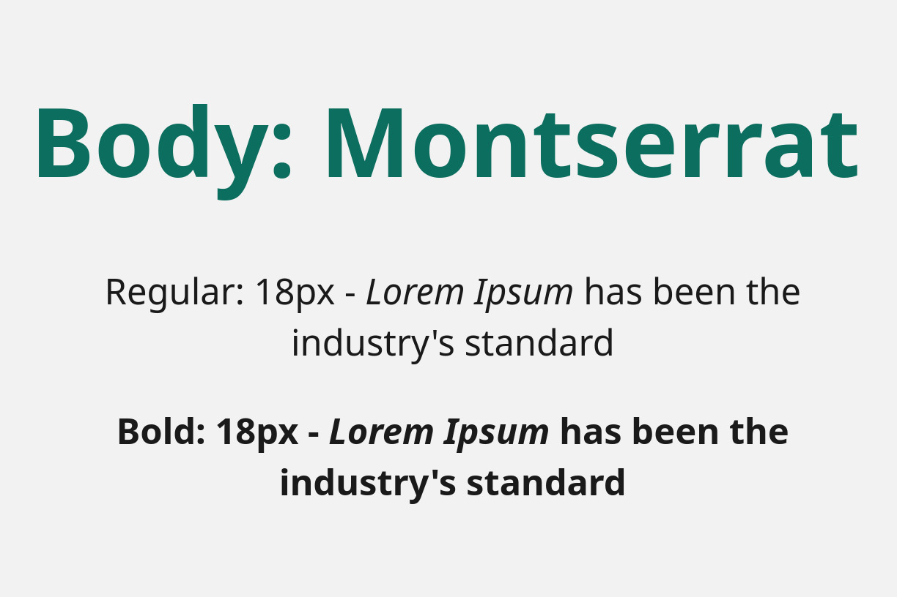

**4. Colors:**

La paleta de colores de AgriDron está inspirada en la naturaleza y el sector agrícola, complementada con tonos tecnológicos y de alto
contraste para maximizar la legibilidad en campo y gabinetes operativos:

- **Verde Bosque / Primario (#1B463C):** Transmite sostenibilidad, naturaleza y confianza agrícola. Se utiliza en headers, navegación.
- **Verde Teal / Secundario (#20AC87):** Aporta dinamismo y frescura. Se usa en botones interactivos (CTAs), estados activos de misiones y gráficos de progreso.
- **Azul Tecnológico (#1E3A8A):** Representa precisión, telemetría y fiabilidad técnica en la plataforma. Utilizado en datos de vuelo y componentes de monitoreo.   
- **Amarillo / Alerta (#F59E0B):** Destinado a estados programados, advertencias meteorológicas y notificaciones de atención.   
- **Neutros (Blanco #FFFFFF y Gris Claro #F8FAFC):** Garantizan orden, espacio respirable y balance visual en la interfaz.


**5. Spacing:**

El sistema de espaciado adopta una escala base basada en múltiplos de 8 px (8px, 16px, 24px, 32px). Este patrón asegura un diseño estructurado y modular que
facilita la lectura fluida de mapas, parcelas y paneles de control, permitiendo además una fácil adaptación responsive a tablets y dispositivos móviles.

**6. Tone:**

El tono de comunicación de AgriDron es profesional, confiable, claro, transparente y accesible. Debido a que los usuarios interactúan con datos de salud
de cultivos, mapas de parcelas y programación de fumigación, el tono debe brindar seguridad y control técnico sin resultar excesivamente complejo o burocrático.   
AgriDron busca transmitir:

- **Seguridad y Control:** al presentar métricas de avance de misión, niveles de batería e insumos.   
- **Claridad y Eficiencia:** al guiar al agricultor paso a paso en la planificación de una fumigación.   
- **Cercanía:** al usar terminología conocida por el productor agrícola (finca, parcela, cultivo, insumo).

**7. Language:**

El lenguaje del sistema será directo, breve y orientado a la acción. El idioma principal de la interfaz será
el Español (es_419), adaptado al entorno agrícola latinoamericano, contando con soporte para Inglés (en_US).

Se priorizarán frases cortas e imperativas que reduzcan la carga cognitiva:

- Nueva misión en lugar de Registrar solicitud de servicio de fumigación.
- Seleccionar parcela en lugar de Elegir área geográfica de terreno agrícola.
- Monitorear vuelo en lugar de Visualizar estado de la telemetría del dron en ejecución.
- Descargar reporte en lugar de Generar informe detallado de rendimiento de insumos.

### 4.1.2. Web Style Guidelines

Las Web Style Guidelines de AgriDron Solutions establecen los criterios visuales y de interacción que
guían el diseño de la landing page y la web application. Estas pautas aseguran consistencia entre dispositivos,
favorecen la legibilidad y permiten que tanto agricultores, operadores técnicos y supervisores naveguen de forma intuitiva por la plataforma.

**Estructura general**

AgriDron Solutions adopta un enfoque responsive web design, de modo que la interfaz se adapte correctamente a desktop,
laptop, tablet y mobile web sin perder claridad ni coherencia visual.

- **Desktop:** La navegación principal se presenta mediante sidebar lateral y header superior. Los módulos con mayor densidad informativa, como la gestión de parcelas en mapa satelital, monitoreo de misiones, inventario y reportes de productividad, aprovechan mejor el ancho disponible mediante tablas, mapas interactivos, tarjetas de métricas y filtros visibles.

- **Tablet:** La estructura se reorganiza a 6 u 8 columnas, reduciendo el número de elementos visibles por fila. Los paneles laterales pueden colapsarse y ciertas tablas o paneles de telemetría pasan a formatos más compactos para facilitar la interacción táctil en campo.

- **Mobile Web:** La estructura se simplifica a una sola columna. Los elementos se apilan verticalmente, se priorizan botones de acción principal (como iniciar misión o registrar incidencia) y la navegación se compacta mediante menú hamburguesa o navegación inferior, según el flujo de trabajo.

**Breakpoints**

Se proponen los siguientes breakpoints para asegurar una adaptación consistente en todos los entornos de uso:

- Mobile: hasta 767 px.
- Tablet: desde 768 px hasta 1023 px.
- Desktop: 1024 px en adelante.

**Componentes básicos de UI**

- Botones primarios: fondo verde bosque #1E4D2B o verde acento #10B981, texto blanco, bordes redondeados de 8 px a 12 px. Se utilizan para acciones clave como + Nueva finca, + Nueva parcela, Crear misión, Confirmar e Iniciar sesión.
- Botones secundarios: fondo blanco o gris claro #F8FAFC, borde en verde bosque #1E4D2B o gris #CBD5E1, con texto oscuro. Se emplean para acciones complementarias como Cancelar, Ver detalle, Filtrar o Volver.
- Inputs y formularios: bordes suaves (#CBD5E1), fondo claro e interno con suficiente padding para facilitar la lectura e interacción. El estado enfocado resalta mediante un borde verde acento #10B981. El estado de error utiliza un borde rojo #EF4444 con un mensaje de validación visible debajo del campo.
- Cards: contenedores rectangulares con esquinas redondeadas, padding interno de 16 px a 24 px y jerarquía clara entre título, contenido y acciones. Se usan en el dashboard principal, resumen meteorológico, métricas de cultivo, tarjetas de fincas y vistas de misiones.
- Tablas: encabezados destacados sobre fondo tenue, filas con separación visual suficiente mediante bordes sutiles y acciones agrupadas al extremo derecho. En resoluciones pequeñas, las tablas se transforman en tarjetas apiladas para mejorar la lectura rápida en dispositivos móviles de campo.
- Sidebar: navegación vertical persistente en desktop, con acceso a Dashboard (Inicio), Fincas, Parcelas, Misiones, Drones / Monitoreo, Reportes, Inventario y Configuración. En tablet y mobile web la barra lateral se colapsa automáticamente.
- Header: barra superior que alberga el nombre del usuario autenticado, su rol (Agricultor, Operador, Supervisor), buscador global, widget de notificaciones / alertas meteorológicas y acceso rápido a configuración o cierre de sesión.

**Tipografía en web**

La propuesta tipográfica de AgriDron Solutions mantiene como base las familias tipográficas Inter y Roboto, según la identidad visual previamente definida:

- Títulos principales (H1): Segoe UI, 24 px a 28 px.   
- Subtítulos (H2): Segoe UI SemiBold, 20 px a 22 px.   
- Encabezados de sección (H3): Segoe UI Medium, 18 px.  
- Texto de párrafo y descripciones: Montserrat Regular, 14 px a 16 px.   
- Texto en botones: Montserrat SemiBold, 14 px a 16 px.   
- Etiquetas de formularios y tablas: Montserrat Medium, 13 px a 14 px.   
- Datos técnicos y telemetría: Montserrat, 12 px a 14 px (utilizado para coordenadas GPS, logs del dron y métricas de vuelo).

**Interacción**

- Hover: Los botones incrementan ligeramente el contraste o brillo del color base (verde o gris). Los enlaces se subrayan o cambian a un tono más intenso del verde corporativo.  
- Focus: Todo componente interactivo muestra un estado visible de foco (anillo de resalte en verde acento #10B981), especialmente en inputs, botones y controles de mapa, para favorecer la accesibilidad y navegación por teclado.   
- Active / Click: Los botones aplican una ligera reducción de escala o sombra interna para confirmar la pulsar o interacción del usuario.  
- Feedback visual: Estados como éxito (Completada), error / advertencia (Pausada, Ráfaga de viento alto), pendiente (Programada) o información en progreso (En curso) se distinguen mediante color (verde, rojo, amarillo/ámbar, azul), iconografía representativa y texto breve de confirmación.  
- Scroll y navegación persistente: En desktop, el header superior y los controles interactivos del mapa satelital permanecen fijos (sticky) para facilitar la navegación y el monitoreo continuo durante desplazamientos verticales largos.  
- Responsive behavior: El contenido prioritario (estado de misión, mapa interactivo y botones de acción rápida) conserva visibilidad inmediata antes que elementos decorativos o información secundaria en pantallas reducidas.

### 4.1.3. Mobile Style Guidelines

Las Mobile Style Guidelines de AgriDron Solutions tienen como objetivo adaptar la experiencia de uso a pantallas reducidas sin perder funcionalidad, claridad visual ni consistencia con la propuesta general del producto. Estas pautas priorizan rapidez de interacción en campo, facilidad de lectura bajo luz solar directa y acceso inmediato a acciones frecuentes de fumigación y monitoreo.

**Estructura general**

La experiencia móvil de AgriDron Solutions está diseñada para que agricultores, operadores técnicos y supervisores puedan consultar información crítica de parcelas y ejecutar acciones esenciales de campo desde cualquier lugar.

- Pantallas en una sola columna, con contenido apilado verticalmente.   
- Header compacto, con el logo de AgriDron, nombre de la vista actual y acceso a notificaciones, alertas meteorológicas o menú desplegable.   
- Navegación simplificada, priorizando las secciones más importantes según el rol del usuario (Inicio, Fincas, Parcelas, Misiones y Monitoreo).  
- Botones de acción visibles, especialmente en flujos clave como + Nueva finca, + Nueva parcela, Crear misión o Pausar vuelo.   
- Tarjetas resumidas e interactivas, en lugar de tablas complejas, para mostrar parcelas, misiones recientes, condiciones climáticas y telemetría de drones de forma clara y directa.

**Componentes básicos en mobile**

- Botones primarios: verde bosque #1E4D2B o verde acento #10B981, texto blanco, esquinas redondeadas de 12 px y un área táctil mínima de 44 x 44 px para facilitar la interacción en terreno.   
- Botones secundarios: fondo blanco o gris claro #F8FAFC con borde visible en verde o gris y alto contraste.
- Inputs: ancho completo (100%), padding amplio y separación mínima de 16 px entre campos para evitar pulsaciones accidentales.
- Cards de resumen: usadas para misiones, parcelas, clima y telemetría (batería, altitud, flujo de insumo), con distribución vertical y jerarquía visual clara.
- Listas: los registros de fincas y misiones se organizan en bloques táctiles con título, estado, fecha, extensión en hectáreas (ha) y acción principal (Ver, Monitorear).
- Indicadores de estado: cada misión o alerta utiliza color y texto explícito para distinguir rápidamente condiciones como En curso (verde), Completada (azul), Programada (amarillo/ámbar) o Pausada / Alerta (rojo).

**Tipografía en mobile**

La adaptación móvil de AgriDron Solutions mantiene la coherencia con las familias tipográficas Inter (títulos) y Roboto (cuerpo e interfaz):

- Título principal (H1): Segoe UI Bold, 20 px a 22 px.   
- Subtítulos (H2): Segoe UI SemiBold, 16 px a 18 px.  
- Texto general y párrafos: Montserrat Regular, 14 px.   
- Botones: Montserrat SemiBold, 14 px.  
- Etiquetas pequeñas o estados: Montserrat Medium, 12 px a 13 px.   
- Datos de telemetría y coordenadas: Montserrat, 12 px a 13 px (utilizado para niveles de batería, velocidad m/s, flujo de líquido L/min y coordenadas GPS).

**Interacción en mobile**

- Acciones rápidas y flujos cortos: Se priorizan flujos simplificados (como el dibujo de parcelas o la planificación de misiones en 3 o 4 pasos) para optimizar el trabajo en el campo.  
- Dimensiones táctiles: Todos los botones y componentes interactivos respetan el tamaño mínimo de área táctil (44 x 44 px). 
- Formularios en bloques: Los formularios de registro de parcelas, cultivos e insumos se dividen en secciones o pasos breves para evitar la fatiga visual. 
- Alcance del pulgar: Las acciones críticas (como confirmar una misión o pausar una operación de emergencia) se colocan estratégicamente en la zona inferior de la pantalla al alcance natural del pulgar.   
- Feedback inmediato: Los cambios de estado de vuelo, alertas meteorológicas o el guardado de datos se muestran instantáneamente mediante mensajes visibles (toast notifications), banners contextuales e indicadores de color explícitos.

---

## 4.2. Information Architecture

La arquitectura de información de AgriDron Solutions ha sido diseñada para que los tres segmentos principales de usuarios —agricultores, operadores técnicos y supervisores de operaciones— puedan localizar información, ejecutar tareas y comprender el estado de sus operaciones de fumigación con drones de forma rápida y consistente. Esta propuesta abarca tanto la Landing Page como la Web Application, de modo que exista continuidad entre la experiencia de descubrimiento del producto y la experiencia de uso dentro de la plataforma operativa.

En el caso de la Landing Page, la arquitectura de información busca guiar al visitante desde una comprensión inicial de los retos en la fumigación tradicional hacia una acción concreta, ya sea registrarse, solicitar una demostración o explorar las funcionalidades clave según su rol en el campo. Para ello, el contenido se organiza en bloques progresivos: propuesta de valor (Hero section), funcionalidades principales (planificación, monitoreo en tiempo real, IA predictiva), proceso de funcionamiento en 4 pasos, actores principales (agricultores, operadores, supervisores), planes de precios/suscripción, nuestro equipo y llamadas a la acción (CTAs). Esta secuencia permite que el usuario comprenda qué resuelve AgriDron Solutions, a quién está dirigido y cómo puede empezar a digitalizar sus cultivos.

En la Web Application, la arquitectura de información responde a una lógica netamente operativa e interactiva. En lugar de priorizar la persuasión o el descubrimiento, la aplicación prioriza la velocidad de acceso, la visibilidad en tiempo real del estado de los vuelos y la ejecución eficiente de tareas en campo. Por ello, el contenido se distribuye en módulos funcionales diferenciados por rol, donde cada usuario accede únicamente a las secciones necesarias para gestionar fincas y parcelas sobre mapas satelitales, programar y asignar misiones de pulverización, monitorear la telemetría de los drones (batería, volumen de insumo, altitud), consultar validaciones climáticas y generar reportes de productividad.

De esta manera, la arquitectura de información de AgriDron Solutions se apoya en cuatro sistemas complementarios: Organization Systems (sistemas de organización), Labeling Systems (sistemas de etiquetado), Searching Systems (sistemas de búsqueda) y Navigation Systems (sistemas de navegación). En conjunto, estos sistemas permiten estructurar la información de forma entendible, reducir la sobrecarga cognitiva en entornos de campo y mantener una experiencia coherente entre la web pública y la plataforma transaccional.

### 4.2.1. Organization Systems

La organización del contenido en AgriDron Solutions responde a la naturaleza de cada producto digital y al tipo de tarea que el usuario necesita realizar. La Landing Page organiza información para presentar, explicar y convencer sobre los beneficios de la agricultura de precisión con drones; mientras que la Web Application organiza información para operar, monitorear el vuelo y la dispersión de insumos en tiempo real, y tomar decisiones sobre el manejo de cultivos. Por ello, se aplican distintos esquemas de organización visual y categorización según el contexto.

**Organization Systems in the Landing Page**

En la Landing Page, la información se organiza principalmente de forma jerárquica y secuencial. La jerarquía visual permite destacar de inmediato la propuesta de valor, las funcionalidades clave y los llamados a la acción (CTAs) más importantes. La secuencia guía al visitante por un recorrido progresivo: primero entiende la problemática del campo, luego conoce la solución tecnológica de AgriDron, después explora sus capacidades paso a paso y finalmente recibe estímulos para registrarse, iniciar sesión o solicitar una demostración.

La estructura general de la Landing Page sigue el siguiente flujo:

- Hero section: Presenta la propuesta de valor principal ("Revoluciona la salud de tus cultivos con precisión automatizada") y los botones de acción clave (Empieza tu prueba gratuita, Ver cómo funciona, Solicitar Demo).
- Sección de funcionalidades: Muestra los pilares tecnológicos del sistema: Planificación de misiones, Monitoreo en tiempo real e IA predictiva.
- Sección de "Cómo funciona": Muestra la secuencia operativa en 4 pasos (1. Planifica, 2. Consulta el clima, 3. Ejecuta, 4. Analiza)
- Sección de "Para quién" (audiencia): Categoriza la solución según los actores clave del sector agrícola (Agricultores, Operadores, Supervisores).
- Sección de "Nuestro equipo": Presenta a los profesionales responsables del desarrollo de la plataforma para generar confianza.
- Footer: Reúne la navegación secundaria, datos de contacto, ubicación, políticas legales y enlaces a redes sociales.

Esta estructura no es aleatoria: busca reducir fricción en el recorrido del visitante y facilitar que identifique en pocos segundos cómo la plataforma optimiza el rendimiento de sus terrenos agrícolas.

**Organization Systems in the Web Application**

En la Web Application, la organización del contenido es principalmente por tópicos, por audiencia y cronológica, según el tipo de información mostrada.

- Por tópicos: Se emplea en el menú principal (sidebar), donde las funcionalidades se agrupan en módulos como Fincas, Parcelas, Misiones, Monitoreo, Reportes, Inventario y Configuración.
- Por audiencia (roles): Se aplica al adaptar la experiencia según el tipo de usuario: Agricultor, Operador y Supervisor. Cada rol visualiza los módulos y datos relevantes para su nivel de responsabilidad en la operación.
- Cronológica: Se utiliza en los historiales de vuelo, registros de telemetría, diario de incidencias climáticas y reportes de insumos aplicados en el tiempo.
- Matricial: Se emplea en vistas donde el usuario necesita comparar múltiples variables simultáneamente, como tablas de misiones, reportes de eficiencia por hectárea o el inventario de agroquímicos.

**Organización visual del contenido**

| Tipo de organización | Aplicación en AgriDron Solutions                                                                                                                   | Justificación                                                                                                               |
|:---------------------|:---------------------------------------------------------------------------------------------------------------------------------------------------|:----------------------------------------------------------------------------------------------------------------------------|
| **Jerárquica**       | Hero section, Dashboard principal, tarjetas de métricas (KPIs) y panel de telemetría del dron.                                                     | Permite destacar estados de vuelo activos, condiciones del clima y métricas de superficie (ha) antes que datos secundarios. |
| **Secuencial**       | Registro de usuario, flujo de "Cómo funciona" y planificación de misiones en 4 pasos (*1. Parcela → 2. Tratamiento → 3. Fecha/Hora → 4. Resumen*). | Guía al agricultor o supervisor paso a paso en la definición de la fumigación, evitando errores operacionales.              |
| **Matricial**        | Historial de misiones, consumo de insumos, tablas de personal y reportes de rendimiento por hectárea.                                              | Facilita comparar atributos como hectáreas cubiertas, fecha, tipo de cultivo, estado de misión y operador asignado.         |

**Esquemas de categorización**

| Tipo de esquema   | Aplicación en AgriDron Solutions                                                        | Justificación                                                                                                    |
|:------------------|:----------------------------------------------------------------------------------------|:-----------------------------------------------------------------------------------------------------------------|
| **Por tópicos**   | Fincas, Parcelas, Misiones, Monitoreo, Reportes, Inventario, Personal y Configuración.  | Agrupa el contenido según la tarea operativa que el usuario busca realizar sobre sus terrenos o flota de drones. |
| **Cronológico**   | Historial de misiones ejecutadas, registros melemétricos de vuelo y log de incidencias. | Facilita el seguimiento temporal de las aplicaciones de fertilizantes/pesticidas y auditorías agrícolas.         |
| **Por audiencia** | Vista Agricultor, Vista Operador y Vista Supervisor.                                    | Reduce la sobrecarga cognitiva y adapta las opciones según el rol de campo o gabinete.                           |

**Esquemas no priorizados**

AgriDron Solutions no prioriza un esquema alfabético como estructura principal, ya que la gestión agrícola no depende de una búsqueda lexical, sino de interacciones geoespaciales sobre mapas satelitales, estados de misión y prioridades operativas en campo. Aunque los listados de parcelas o insumos puedan ordenarse alfabéticamente como filtro secundario, la plataforma prioriza la ubicación, la urgencia de fumigación y el estado del vuelo.

Tampoco se utiliza una organización puramente temática en la Landing Page sin jerarquía de conversión, porque la interfaz pública busca impulsar al usuario a iniciar una prueba o solicitar una demostración en el menor número de pasos posible.

**Secciones principales de AgriDron Solutions**

La aplicación se estructura en tres entornos diferenciados según el rol del usuario:

**Vista Agricultor**

| Sección                      | Descripción                                                                                                             |
|:-----------------------------|:------------------------------------------------------------------------------------------------------------------------|
| **Dashboard (Inicio)**       | Resumen del estado general: fincas registradas, parcelas, misiones activas, hectáreas totales y widget de clima actual. |
| **Fincas**                   | Registro, edición y administración de los predios agrícolas con su ubicación y extensión.                               |
| **Parcelas**                 | Delimitación y visualización de lotes sobre mapa satelital interactivo con información de cultivo y área.               |
| **Misiones (Planificación)** | Creación y solicitud de misiones de fumigación seleccionando parcela, tipo de tratamiento e insumo.                     |
| **Monitoreo de Misiones**    | Seguimiento en tiempo real del progreso del vuelo, ruta sobre la parcela y telemetría básica.                           |
| **Reportes e Historial**     | Consulta de misiones pasadas, volumen de insumos utilizados y reportes de productividad por hectárea.                   |
| **Configuración**            | Perfil del usuario, gestión de notificaciones e integración con alertas meteorológicas.                                 |

**Vista Operador**

| Sección                      | Descripción                                                                                                            |
|:-----------------------------|:-----------------------------------------------------------------------------------------------------------------------|
| **Dashboard / Mis Misiones** | Lista de misiones de fumigación asignadas para la jornada con detalles de ubicación y cultivo.                         |
| **Ejecución y Monitoreo**    | Control en tiempo real del vuelo, telemetría del dron (batería, altitud, velocidad, flujo) y actualización de estados. |
| **Registro de Incidencias**  | Documentación de interrupciones operativas en campo (vientos fuertes, fallas técnicas, lluvia).                        |
| **Horas Trabajadas**         | Registro de jornada laboral con verificación de ubicación GPS para garantizar precisión operativa.                     |


### 4.2.2. Labeling Systems

El sistema de etiquetado de AgriDron Solutions ha sido diseñado para que cada elemento de la interfaz comunique su propósito de forma inmediata. Las etiquetas se redactan con términos breves, directos y familiares para el contexto agronómico y de operaciones con drones, evitando tecnicismos innecesarios. Esto permite que el usuario comprenda con rapidez qué sección está visitando, qué acción puede ejecutar y qué resultado debe esperar.

A diferencia de un simple glosario, el sistema de etiquetado de AgriDron Solutions se aplica de manera concreta en zonas específicas de la interfaz, como la navbar de la Landing Page, el sidebar de la aplicación, los botones principales, los formularios, los breadcrumbs y los mensajes de estado.

**Labeling in the Landing Page**

En la Landing Page, las etiquetas priorizan claridad comercial y orientación a la conversión. Se emplean principalmente en:

- Navbar superior: Inicio (Home), Funcionalidades (Features), Cómo funciona (How it works), Precios (Pricing), Preguntas Frecuentes (FAQ), Iniciar sesión (Sign in).
- Botones principales del hero: Solicitar Demo, Crear cuenta, Probar gratis, Soy Agricultor, Soy Operador.
- Secciones informativas: Beneficios, Casos de uso, Nuestro equipo, Preguntas frecuentes.
- Footer: Contacto, Políticas de privacidad, Términos y condiciones, Soporte técnico.

Estas etiquetas permiten que el visitante identifique rápidamente la estructura del contenido y pueda desplazarse hacia las secciones que más le interesan antes de tomar una decisión.

**Labeling in the Web Application**

En la Web Application, las etiquetas se enfocan en apoyar la operación diaria del usuario en campo y gabinete. Se distribuyen en los siguientes puntos:

- Sidebar o menú lateral: Dashboard, Fincas, Parcelas, Misiones, Monitoreo, Inventario, Reportes, Configuración.
- Header: Notificaciones, Mi perfil, Cambiar rol, Cerrar sesión
- Botones de acción: + Nueva finca, + Nueva parcela, Crear misión, Iniciar vuelo, Pausar misión, Ver detalles, Guardar cambios, Cancelar.
- Breadcrumbs: Misiones > Detalle de Misión, Parcelas > Crear Parcela, Fincas > Lote 1, Reportes > Rendimiento por Hectárea.
- Formularios: Nombre de parcela, Extensión (ha), Tipo de cultivo, Producto / Insumo, Dosis por hectárea, Fecha de fumigación, Operador asignado.
- Mensajes de estado: En curso / En ejecución, Completada, Programada, Pausada, Alerta de clima, Stock bajo.

**Criterios del sistema de etiquetado**

El sistema de etiquetado de AgriDron Solutions sigue los siguientes criterios:

- Brevedad: Las etiquetas deben usar el menor número de palabras posible sin perder claridad.
- Consistencia: Un mismo concepto (Parcela, Misión, Insumo) debe nombrarse siempre de la misma manera en toda la plataforma.
- Familiaridad: Se priorizan términos cercanos al usuario real del dominio agrícola y técnico.
- Orientación a la acción: Los botones y acciones usan verbos claros que indican lo que ocurrirá (Crear misión, Iniciar vuelo, Descargar reporte).
- Escaneabilidad: Las etiquetas deben poder comprenderse rápidamente incluso en interfaces densas como mapas satelitales, tablas telemétricas y dashboards.

**Etiquetas principales del sistema**

| Etiqueta              | Lugar de uso                          | Descripción                                                                                       |
|:----------------------|:--------------------------------------|:--------------------------------------------------------------------------------------------------|
| **Iniciar sesión**    | Navbar, formularios de acceso         | Permite ingresar con una cuenta existente a la plataforma.                                        |
| **Crear cuenta**      | Hero section, formularios de registro | Permite registrarse como nuevo usuario agricultor, operador o supervisor.                         |
| **Dashboard**         | Sidebar, header, breadcrumbs          | Pantalla inicial con el resumen principal de métricas, fincas, parcelas y clima.                  |
| **Fincas / Parcelas** | Sidebar, títulos de vista, mapas      | Módulo para la delimitación geoespacial y administración de terrenos agrícolas.                   |
| **Crear misión**      | Botón principal, módulo de misiones   | Acción para programar y definir una nueva orden de fumigación con dron.                           |
| **Estado de misión**  | Tablas, cards, vista de monitoreo     | Indicador del avance operativo de la pulverización (*Programada, En curso, Completada, Pausada*). |
| **Telemetría**        | Panel de control del dron, mapas      | Vista en tiempo real de nivel de batería, altitud, velocidad y flujo de pulverización (L/min).    |
| **Alerta climática**  | Dashboard, header, tarjetas           | Notificación operativa sobre condiciones de viento, lluvia o humedad fuera de rango.              |
| **Inventario**        | Sidebar, títulos de vista             | Módulo de gestión y control de insumos agrícolas (agroquímicos, pesticidas, fertilizantes).       |
| **Reportes**          | Sidebar, tablas, exportables          | Módulo de análisis, visualización de métricas e historial de rendimiento por hectárea.            |
| **Configuración**     | Sidebar, header                       | Área de gestión del perfil, flota de drones, personal asignado y parámetros del sistema.          |
| **Cerrar sesión**     | Header, menú de usuario               | Acción para salir de la cuenta activa de forma segura.                                            |

### 4.2.3. SEO Tags and Meta Tags

Las etiquetas SEO y Meta Tags de AgriDron Solutions se definen para mejorar la visibilidad del producto en buscadores, reforzar la claridad del contenido presentado y optimizar la manera en que las páginas se muestran en navegadores y redes sociales. Debido a que la solución cuenta con una Landing Page pública y una Web Application privada, las decisiones de etiquetado SEO se concentran principalmente en las páginas públicas y en las pantallas principales que funcionan como punto de acceso o referencia operativa del producto.

A continuación, se detallan los principales títulos y metadatos propuestos para las páginas más relevantes de la experiencia digital:

**Home / Landing Page**

- Title: AgriDron Solutions | Smart drone spraying and crop management
- Meta Description: Optimize agricultural crop spraying, plot management, and real-time drone telemetry from one platform designed for farmers, operators, and supervisors.
- Meta Keywords: agricultural drone spraying, precision agriculture, plot management, crop health monitoring, drone telemetry, agritech software
- Meta Author: AgriDron Solutions

**Funcionalidades / Features**

- Title: AgriDron Features | Mission planning, real-time telemetry, and weather alerts
- Meta Description: Discover how AgriDron Solutions helps plan precision spraying missions, monitor drone telemetry in real time, analyze weather risks, and maximize crop yields.
- Meta Keywords: drone mission planning, flight telemetry, agricultural weather alerts, crop monitoring software, agritech features
- Meta Author: AgriDron Solutions

**Planes / Pricing**

- Title: AgriDron Pricing | Plans for farmers, operators, and enterprises
- Meta Description: Explore AgriDron Solutions plans and choose the right option to digitize plot management, spraying operations, and drone fleet tracking.
- Meta Keywords: agritech software pricing, drone spraying plans, agricultural platform subscription, farm management software
- Meta Author: AgriDron Solutions

**Login / Iniciar sesión**

- Title: Sign in | AgriDron Solutions
- Meta Description: Access your AgriDron Solutions account to manage plots, spraying missions, drone telemetry, and operational reports from one centralized platform.
- Meta Keywords: agridron login, agritech platform access, farmer dashboard, drone operator login
- Meta Author: AgriDron Solutions

**Register / Crear cuenta**

- Title: Create account | AgriDron Solutions
- Meta Description: Register in AgriDron Solutions as a farmer, operator, or supervisor and start organizing your precision spraying operations efficiently.
- Meta Keywords: agridron register, farmer account, drone operator registration, agritech software account
- Meta Author: AgriDron Solutions

**Dashboard**

- Title: Dashboard | AgriDron Solutions
- Meta Description: Review your current farm status, active spraying missions, weather forecasts, and key agricultural metrics from the main AgriDron dashboard.
- Meta Keywords: farm operations dashboard, spraying status, weather widget, active drone missions, agritech panel
- Meta Author: AgriDron Solutions

**Fincas y Parcelas / Farms & Plots**

- Title: Farms & Plots | AgriDron Solutions
- Meta Description: Delimit, organize, and inspect your agricultural plots on interactive satellite maps for precision crop spraying and health analysis.
- Meta Keywords: plot mapping, satellite farm view, crop boundary management, agricultural land mapping, farm plots
- Meta Author: AgriDron Solutions

**Misiones y Monitoreo / Spraying Missions**

- Title: Spraying Missions | AgriDron Solutions
- Meta Description: Create, schedule, and track drone spraying missions with real-time flight telemetry, dosage control, and environmental validation.
- Meta Keywords: drone spraying missions, flight tracking, chemical dosage control, telemetry monitoring, crop spraying software
- Meta Author: AgriDron Solutions

Estas etiquetas permiten diferenciar el propósito de cada página dentro del ecosistema digital, mantener coherencia entre la propuesta comercial y la experiencia operativa, y reforzar el posicionamiento del producto en búsquedas relacionadas con agricultura de precisión, fumigación automatizada con drones y gestión de cultivos.

### 4.2.4. Searching Systems

AgriDron Solutions incorpora sistemas de búsqueda y filtrado para reducir el tiempo que el usuario dedica a localizar información dentro de la plataforma. Dado que gran parte de la experiencia está orientada a tareas operativas sobre terreno y mapas satelitales, las búsquedas no solo deben encontrar datos telemétricos o registros, sino también presentarlos en un formato comprensible, geoespacial y directamente accionable.

**Searching in the Web Application**

Los mecanismos de búsqueda se aplican en módulos donde el volumen de información puede crecer rápidamente, como fincas, parcelas, misiones de fumigación, inventario de insumos, flota de drones, alertas y reportes. Cada búsqueda se acompaña de filtros específicos según el contexto del módulo.

| Sistema de búsqueda                | Ubicación                      | Descripción                                                                                                                 |
|:-----------------------------------|:-------------------------------|:----------------------------------------------------------------------------------------------------------------------------|
| **Búsqueda de parcelas y fincas**  | Fincas / Parcelas              | Permite localizar terrenos por nombre, ubicación geográfica, tipo de cultivo (uva, palta, maíz) o extensión en hectáreas.   |
| **Búsqueda de misiones**           | Misiones                       | Permite filtrar misiones por ID de orden, estado (*Programada, En curso, Completada*), operador asignado o rango de fechas. |
| **Búsqueda de insumos**            | Inventario                     | Permite encontrar agroquímicos, fertilizantes o pesticidas por nombre comercial, principio activo o categoría.              |
| **Búsqueda de drones y flota**     | Monitoreo / Drones             | Permite filtrar unidades por código de serie, modelo, disponibilidad o estado de mantenimiento.                             |
| **Filtro por tipo de cultivo**     | Parcelas y Reportes            | Reduce los listados y mapas a un tipo específico de siembra o variedad agrícola.                                            |
| **Filtro por fecha y periodo**     | Historial, reportes y misiones | Permite analizar periodos específicos de pulverización e historial telemétrico.                                             |
| **Filtro por estado y criticidad** | Dashboard, Misiones y Alertas  | Muestra únicamente registros en vuelo activo, misiones pausadas o alertas de clima desfavorable.                            |

**Visualización de resultados**

Los resultados de búsqueda en AgriDron Solutions se presentan de forma distinta según la naturaleza del contenido:

- Parcelas y Fincas: Los resultados se destacan dinámicamente sobre el mapa satelital interactivo o en una lista con datos como nombre del lote, superficie (ha), tipo de cultivo y finca asociada.
- Misiones: Los resultados se presentan en tabla o tarjetas con ID de misión, parcela destino, fecha, estado de ejecución, operador a cargo y acceso directo al panel de telemetría en tiempo real.
- Inventario de insumos: Los resultados se muestran en tablas con nombre del producto, categoría (herbicida, fungicida, nutriente), dosis recomendada por hectárea y volumen disponible en stock.
- Alertas climáticas y de vuelo: Los resultados se muestran como una lista priorizada según el nivel de criticidad (vientos fuertes, batería baja, lluvia), fecha/hora e impacto en la operación.
- Reportes e historiales: Los resultados se representan mediante tablas filtradas y gráficos dinámicos ajustados al terreno, operador o rango de tiempo seleccionado.

**Comportamiento esperado de los resultados**

Los resultados de búsqueda deben seguir estos criterios:

- Responder en tiempo razonable y con feedback visual claro mediante indicadores de carga sobre tablas y mapas.
- Mostrar solo la información necesaria para que el agricultor, operador o supervisor tome decisiones operativas inmediatas.
- Permitir ordenar o refinar el resultado (por hectáreas, fecha de fumigación o criticidad) sin reiniciar completamente la búsqueda.
- Indicar cuando no existen coincidencias mediante mensajes explícitos como "No se encontraron parcelas o misiones con los criterios seleccionados".
- Mantener visibles los filtros aplicados (chips/etiquetas activas) para que el usuario identifique claramente qué subconjunto de datos está observando.

**Searching in the Landing Page**

La Landing Page no depende de un buscador interno complejo, sino que incorpora mecanismos de exploración rápida mediante navegación por secciones y enlaces de anclaje (anchors). En este caso, la búsqueda se resuelve a través de una estructura visible y predecible que permite al visitante llegar rápidamente a información clave como funcionalidades de fumigación, planes de suscripción, casos de éxito, preguntas frecuentes o acceso directo al registro y prueba gratuita.

### 4.2.5. Navigation Systems

El sistema de navegación de AgriDron Solutions ha sido diseñado para que el usuario pueda recorrer la experiencia con claridad tanto en la Landing Page como en la Web Application. En ambos casos, la navegación busca reducir fricción, mantener consistencia y facilitar el acceso rápido a acciones clave como la delimitación de parcelas, la programación de fumigaciones y el monitoreo de vuelo en tiempo real.

**Navigation in the Landing Page**

En la Landing Page, la navegación se estructura como un recorrido progresivo orientado a la conversión. El usuario puede desplazarse por la página de forma lineal o saltar directamente a secciones específicas mediante enlaces visibles en la barra superior.

Los principales mecanismos de navegación en la Landing Page son:

- Navbar superior fija: Incluye accesos a Inicio, Funcionalidades, Cómo funciona, Para quién, Precios, FAQ e Iniciar sesión.
- Navegación por anchors (anclas): Cada opción del menú dirige suavemente a una sección concreta de la misma página.
- Hero section con CTAs principales: Botones como Solicitar Demo, Comenzar gratis, Soy Agricultor o Soy Operador redirigen al usuario al flujo correspondiente.
- CTAs secundarios distribuidos: Se repiten en secciones estratégicas para evitar que el usuario tenga que volver al inicio para actuar.
- Footer con enlaces complementarios: Contacto, políticas de privacidad, términos y accesos secundarios.

Este sistema permite que un visitante nuevo entienda rápidamente la propuesta de valor del sistema de fumigación con drones, navegue según su interés y llegue a la acción principal en pocos pasos.

**Navigation in the Web Application**

En la aplicación web, la navegación se orienta a la productividad y la ejecución de tareas operativas en campo y gabinete. Cada rol (Agricultor, Operador, Supervisor) accede a una estructura estable que prioriza las funcionalidades más utilizadas.

| Elemento de navegación              | Descripción                                                                                                                                             |
|:------------------------------------|:--------------------------------------------------------------------------------------------------------------------------------------------------------|
| **Sidebar**                         | Menú lateral persistente con acceso directo a las secciones principales del rol activo (*Fincas, Parcelas, Misiones, Monitoreo, Inventario, Reportes*). |
| **Header**                          | Barra superior con nombre de la finca activa, selector de rol, centro de notificaciones climáticas/de vuelo y menú de perfil.                           |
| **Dashboard como punto de entrada** | Pantalla inicial tras autenticación, desde donde el usuario visualiza su estado operativo general y métricas clave.                                     |
| **Breadcrumbs**                     | Indicadores de ruta para secciones de detalle (*Misiones > MS-1042*), permitiendo comprender la ubicación y retroceder fácilmente.                      |
| **Botones contextuales**            | Acciones principales visibles dentro de cada módulo, como `+ Nueva parcela` o `+ Crear misión`.                                                         |
| **Notificaciones**                  | Panel accesible desde el header para revisar alertas telemétricas o meteorológicas recientes y redirigirse a la sección relacionada.                    |
| **Cambio de vista por rol**         | En caso de usuarios con más de un rol (ej. Agricultor/Supervisor), permite alternar entre contextos sin cerrar sesión.                                  |

**Recorridos principales de navegación**

La navegación de AgriDron Solutions considera recorridos típicos como los siguientes:

- Visitante de Landing Page -> CTA principal (Comenzar gratis) -> Registro o login -> Dashboard del rol correspondiente.
- Agricultor -> Dashboard -> Parcelas -> Delimitar parcela en mapa satelital -> Guardar lote.
- Agricultor / Supervisor -> Dashboard -> Misiones -> Crear misión -> Seleccionar parcela e insumo -> Programar fecha y hora.
- Operador -> Dashboard -> Mis Misiones -> Iniciar vuelo -> Monitorear telemetría en tiempo real -> Registrar finalización o incidencia.
- Supervisor -> Dashboard -> Monitoreo de Drones -> Visualizar flota activa en mapa -> Reasignar operador o revisar inventario de agroquímicos.

**Criterios de navegación**

La navegación en AgriDron Solutions sigue los siguientes criterios:

- Consistencia: Los elementos principales conservan posición y lógica entre pantallas.
- Claridad: Cada enlace y botón comunica claramente su destino o acción.
- Economía de pasos: Las tareas frecuentes (como iniciar un monitoreo o consultar el clima) deben completarse con el menor número posible de interacciones.
- Visibilidad del estado actual: El usuario debe saber siempre en qué módulo está, qué dron o parcela está seleccionada y qué acciones puede ejecutar.
- Adaptabilidad responsive: La navegación debe mantenerse usable en desktop, tablet y mobile web para su uso en campo.

**Navegación — Landing Page**

| Elemento                       | Descripción                                                                                                                                                                                                         |
|:-------------------------------|:--------------------------------------------------------------------------------------------------------------------------------------------------------------------------------------------------------------------|
| **Navbar fija**                | Barra superior visible en todo momento durante el scroll. Contiene logo, enlaces a secciones (anclas) y botones de Iniciar sesión / Registrarse. En mobile se colapsa en menú hamburguesa.                          |
| **Anclas de sección**          | Los enlaces del navbar desplazan suavemente (*smooth scroll*) a cada sección de la página: `#hero`, `#funcionalidades`, `#como-funciona`, `#para-quien`, `#precios`, `#faq`.                                        |
| **CTA primario en Hero**       | Botón `Comenzar gratis` redirige a `/register`. Es el punto de conversión principal de la landing.                                                                                                                  |
| **CTA secundario en Hero**     | Botón `Ver cómo funciona` hace scroll a la sección `#como-funciona`, manteniendo al usuario en la landing para informarse antes de registrarse.                                                                     |
| **CTAs por segmento**          | En la sección *"¿Para quién es AgriDron?"*, cada card (*Agricultor, Operador, Supervisor*) tiene un botón que redirige a `/register` con el parámetro de rol preseleccionado (`?rol=agricultor` o `?rol=operador`). |
| **CTA en sección Precios**     | Cada plan tiene un botón que redirige a `/register` con el plan preseleccionado, reduciendo pasos en el onboarding.                                                                                                 |
| **CTA final (bottom of page)** | Sección de cierre con un último llamado a la acción antes del footer, dirigido a usuarios que llegaron al final sin convertir.                                                                                      |
| **Footer**                     | Contiene enlaces a páginas legales (política de privacidad, términos), redes sociales y el enlace de inicio de sesión para usuarios ya registrados.                                                                 |

**Navegación — Web Application**

| Elemento                         | Descripción                                                                                                                                                                                                                                                                        |
|:---------------------------------|:-----------------------------------------------------------------------------------------------------------------------------------------------------------------------------------------------------------------------------------------------------------------------------------|
| **Sidebar**                      | Menú principal fijo a la izquierda, visible en todo momento. Contiene accesos directos a todas las secciones del rol activo con ícono y etiqueta. En mobile se colapsa en hamburguesa.                                                                                             |
| **Header**                       | Barra superior con nombre de la finca seleccionada, badge del plan activo, ícono de notificaciones con contador y avatar del usuario con menú desplegable (*Perfil / Configuración / Cerrar sesión*).                                                                              |
| **Dashboard como home**          | Tras iniciar sesión, el usuario es redirigido automáticamente al Dashboard de su rol. El Dashboard funciona como hub de acceso rápido: las tarjetas de métricas (*misiones activas, alerta climática, stock bajo de insumos*) son clicables y llevan a la sección correspondiente. |
| **Breadcrumbs**                  | Visibles en vistas de detalle para indicar la ruta actual y permitir la navegación hacia atrás. Ejemplo: *Misiones > #MS-1042*.                                                                                                                                                    |
| **Botones de acción contextual** | Cada sección tiene un botón primario (`+ Nueva parcela`, `+ Crear misión`) ubicado en la esquina superior derecha del contenido, accesible sin scroll.                                                                                                                             |
| **Panel de notificaciones**      | Al hacer clic en el ícono de campana del header, se despliega un panel lateral con las alertas recientes (viento fuerte, batería baja, misión completada) ordenadas cronológicamente. Cada alerta tiene un acceso directo a la sección correspondiente.                            |
| **Modo restringido / Campo**     | El usuario u operador puede activar un modo de vista simplificada de campo desde Configuración. En este modo solo son visibles la telemetría del dron en vivo y la ruta de pulverización en el mapa, reduciendo elementos distractores.                                            |
| **Cambio de rol**                | Si un usuario tiene más de un rol (Agricultor y Supervisor), puede cambiar de vista desde un selector en el header sin cerrar sesión.                                                                                                                                              |

## 4.3. Landing Page UI Design

La propuesta de UI de la Landing Page de AgriDron Solutions traduce las decisiones previas de identidad visual, estilo y arquitectura de información en una experiencia clara, persuasiva y orientada a la conversión. Su objetivo principal es presentar la propuesta de valor del producto, explicar de manera rápida cómo ayuda a agricultores, operadores de drones y supervisores del campo, y conducir al visitante hacia una acción concreta, como registrarse, iniciar sesión, solicitar una demostración o explorar el funcionamiento de la plataforma de fumigación de precisión.

El diseño de la Landing Page se estructura en bloques progresivos que responden a una lógica de descubrimiento: primero captar la atención con una promesa clara de optimización agrícola, luego explicar la problemática de la fumigación tradicional y la gestión de cultivos, mostrar los beneficios y funcionalidades clave (planificación de misiones, telemetría en tiempo real, alertas climáticas e IA predictiva), reforzar la confianza mediante componentes visuales del sistema y un equipo transparente, y finalmente cerrar con llamadas a la acción claras. Esta organización permite que el usuario entienda qué resuelve AgriDron Solutions, cómo funciona y por qué debería utilizarlo, sin tener que navegar por una interfaz compleja ni enfrentarse a una sobrecarga de información.

A nivel visual, la interfaz aprovecha la paleta cromática definida para la marca, con predominio del verde bosque (#1E4D2B), verde acento (#10B981), azul tecnológico (#1E3A8A) y tonos neutros, para transmitir sostenibilidad agrícola, precisión tecnológica, innovación y confianza profesional. La jerarquía visual se apoya en titulares fuertes en tipografía Inter, botones de acción (CTAs) altamente visibles, tarjetas informativas modulares con bordes suavizados y bloques claramente diferenciados por un sistema de espaciado basado en 8 px, logrando que el recorrido visual sea intuitivo, accesible y consistente tanto en pantallas de escritorio como en dispositivos móviles de campo.

### 4.3.1. Landing Page Wireframe

Los wireframes de la Landing Page de AgriDron Solutions representan la fase inicial de estructuración de la experiencia pública de la plataforma web. En ellos se define la jerarquía visual, la distribución de los bloques informativos y el orden en que el visitante descubre la propuesta de valor de la fumigación automatizada con drones antes de aplicar el estilo visual definitivo. Esta etapa permitió validar que el mensaje principal sobre agricultura de precisión estuviera visible en los primeros segundos y que la secuencia del contenido guiara al usuario de forma progresiva hacia la conversión.

**Desktop**

En la versión desktop, el wireframe organiza la información en un recorrido secuencial de pantalla completa:

- Hero Section: Cabecera con el titular principal ("Revoluciona la salud de tus cultivos con precisión automatizada"), subtítulo explicativo, botones de acción primarios (Empieza tu prueba gratuita, Ver cómo funciona, Solicitar Demo) y un elemento gráfico de soporte con la previsualización del dron y la app.
- Nuestras funcionalidades: Tarjetas horizontales dedicadas a los pilares tecnológicos del producto (Planificación de misiones, Monitoreo en tiempo real e IA predictiva).
- Cómo funciona: Diagrama de proceso en 4 pasos (1. Planifica, 2. Consulta el clima, 3. Ejecuta, 4. Analiza) que explica el flujo de trabajo en campo.
- Para quién: Bloque de segmentación por roles (Agricultores, Operadores y Supervisores), especificando el valor que aporta la plataforma a cada usuario.
- Nuestro equipo: Sección de respaldo con los perfiles del equipo multidisciplinario detrás de la solución.
- Footer: Pie de página con enlaces de navegación interna, datos de contacto, ubicación y canales de redes sociales.


### 4.3.2. Landing Page Mock-up

Los mock-ups finales de la Landing Page de AgriDron Solutions representan la consolidación visual de la arquitectura y estructura planteadas en los wireframes. En esta etapa de alta fidelidad se integran la paleta cromática institucional (con predominio del verde bosque #1E4D2B y el verde acento #10B981), las familias tipográficas Inter y Roboto, la escala de espaciado modular basada en 8 px, la iconografía agrícola/tecnológica y los estándares de accesibilidad visual (WCAG 2.1 AA). El resultado es una interfaz pública coherente, moderna y persuasiva, alineada con la propuesta de valor de la agricultura de precisión y la fumigación con drones.

**Desktop**

En el mock-up desktop se evidencia una jerarquía visual clara, reforzada mediante el uso del verde bosque corporativo en componentes estructurales y el verde acento en los botones de llamada a la acción (CTAs) y puntos de énfasis. La hero section captura de inmediato la atención del visitante con el mensaje principal de la plataforma, botones destacados de conversión (Empieza tu prueba gratuita, Solicitar Demo) y un contenedor visual que muestra la interfaz telemétrica del dron sobre un mapa satelital. Las secciones posteriores organizan las funcionalidades clave, la segmentación por roles (agricultores, operadores, supervisores), la secuencia operativa de uso y el equipo multidisciplinario sobre fondos neutros claros (#FFFFFF y #F8FAFC), facilitando una lectura escaneable y fluida.


## 4.4. Web Applications UX/UI Design

La propuesta UX/UI de las Web Applications de AgriDron Solutions está diseñada para responder a las necesidades principales de sus usuarios clave: permitir que los agricultores planifiquen y soliciten misiones de fumigación de precisión sobre sus parcelas con rapidez, dar a los operadores técnicos un control telemétrico detallado durante la ejecución del vuelo en campo, y proporcionar a los supervisores visibilidad clara sobre la flota de drones, personal asignado, inventario de insumos y misiones globales. A partir de ello, la interfaz prioriza el acceso directo a módulos críticos (mapas satelitales, misiones, telemetría en vivo y alertas climáticas), la visualización rápida del estado operativo en tiempo real y la reducción de pasos en las tareas más frecuentes de la jornada agrícola.

### 4.4.1. Web Applications Wireframes

Los wireframes de las Web Applications definen la estructura base de las vistas más relevantes del sistema antes de aplicar el diseño visual definitivo. En ellos se observa la distribución de dashboards interactivos, mapas satelitales, formularios de programación de misiones en pasos, tablas telemétricas, tarjetas de métricas (KPIs), paneles laterales de control de vuelo y zonas de acción principal. Esta etapa permitió validar la relación entre la jerarquía visual, la arquitectura de información y los flujos operativos por rol (agricultor, operador y supervisor).

En escritorio, los wireframes muestran una estructura con sidebar lateral persistente, header superior con notificaciones/alertas y un área central de trabajo amplia, adecuada para la interacción con mapas cartográficos, monitoreo telemétrico y reportes gráficos de rendimiento. En mobile web, la información se reorganiza en tarjetas apiladas, paneles deslizantes y listas táctiles de fácil lectura bajo luz solar directa, reduciendo la complejidad visual sin perder funcionalidad ni velocidad de respuesta en campo.


### 4.4.2. Web Applications Wireflow Diagrams

Los diagramas de wireflow de AgriDron Solutions ilustran la secuencia e interacción de las pantallas de la aplicación web para cumplir los objetivos clave del usuario dentro del sistema de fumigación con drones. Cada flujo mapea la transición entre interfaces a partir de un propósito operativo (user goal), detallando desde el ingreso a la plataforma hasta el monitoreo telemétrico en tiempo real y la gestión del perfil.

User Goal Principal: Planificar, ejecutar y monitorear una misión de fumigación de precisión

Este flujo representa el recorrido completo del usuario (agricultor u operador) a través de la interfaz web para llevar a cabo una operación de pulverización con drones:

- Acceso y Autenticación (Pantallas 1 y 2): El usuario inicia en la Landing Page pública y transiciona al Inicio de Sesión para ingresar sus credenciales (correo y contraseña).
- Panel de Control Operativo (Pantalla 3 - Dashboard): Tras autenticarse, accede al panel inicial que muestra un resumen ejecutivo de la operación: métricas generales (fincas registradas, parcelas, misiones activas, hectáreas totales), listado de misiones recientes con estado de avance y un widget de clima en tiempo real (18 °C, viento, humedad).
- Gestión de Fincas (Pantalla 4): A través del sidebar lateral, el usuario ingresa al módulo de Mis Fincas donde visualiza las propiedades registradas (Finca Los Olivos, Finca San José, Finca La Esperanza) y sus extensiones en hectáreas.
- Gestión de Parcelas (Pantalla 5): Al seleccionar una finca, la interfaz despliega sus parcelas delimitadas sobre un mapa satelital interactivo (Lote 1, Lote 2 - Uva, Lote 3 - Palta), permitiendo agregar nuevos lotes o seleccionar uno existente para operar.
- Planificación de Misiones (Pantalla 6): El flujo avanza hacia la herramienta de configuración en 4 pasos (1. Parcela, 2. Tratamiento, 3. Fecha y hora, 4. Resumen). El usuario selecciona la parcela (Lote 1 - Uva, 2.5 ha), especifica el tipo de agroquímico (Fungicida) y valida el área sobre el mapa interactivo.
- Monitoreo de Misiones en Tiempo Real (Pantalla 7 - Misión MS-001): Durante el vuelo, el sistema muestra la ruta sobre el mapa satelital y el panel de telemetría con datos críticos en vivo: nivel de batería (68%), altitud (45 m), velocidad (5.2 m/s), modo de vuelo (Automático) y flujo de líquido (2.5 L/min), junto con una barra de progreso por etapas (Preparación 08:15 ➔ En ejecución 08:30 ➔ En pausa ➔ Finalizada).
- Reportes e Historial (Pantalla 8): Concluida la misión, los datos se almacenan en el historial general, donde se pueden filtrar por rango de fechas, finca y estado para consultar el detalle de hectáreas trabajadas y descargar reportes.
- Perfil y Configuración (Pantalla 9): Espacio donde el usuario (Juan Pérez - Rol: Agricultor) gestiona sus datos personales, seguridad y preferencias de alertas meteorológicas o notificaciones en la app.
- Vista en Dispositivos Responsivos (Pantalla 10): Muestra la adaptación y equivalencia de las pantallas clave (Fincas y Monitoreo de Misión) en formato mobile/tablet para su uso directo en campo.


**link del figma:** https://www.figma.com/design/gIhPSpNHHNel3RMWLQSl8a/Sin-t%C3%ADtulo?node-id=0-1&t=LmubQnBsex2NasC8-1

### 4.4.3. Web Applications Mock-ups

Los mock-ups de alta fidelidad de AgriDron Solutions representan la consolidación visual y funcional de la aplicación web, construidos sobre el sistema de diseño, la paleta cromática, la jerarquía tipográfica (Inter y Roboto) y la escala de espaciado modular definidos en la solución. En estas interfaces se evidencia cómo la arquitectura de información y el diseño inclusivo con alto contraste se traducen en pantallas operativas, legibles en entornos de campo y optimizadas para el trabajo en escritorio, tablet y smartphone.

En escritorio, la aplicación estructura su área de trabajo mediante un sidebar lateral persistente con menú navegable (Inicio, Fincas, Parcelas, Misiones, Drones, Reportes, Configuración), una barra superior (header) con buscador global y selector de usuario (Juan Pérez - Agricultor), y un lienzo central con tarjetas, mapas satelitales interactivos, paneles telemétricos y tablas operativas. En dispositivos móviles y tablets, la interfaz reorganiza la información en listas táctiles apiladas y tarjetas adaptativas, preservando el acceso completo a las funciones sin saturar la pantalla.

A continuación, se detallan los 8 escenarios visuales clave presentados en la propuesta de alta fidelidad:

**1. Inicio / Dashboard**

- Propósito: Vista principal y centro de control operativo tras autenticarse en la plataforma.
 **Componentes clave:**
- Tarjetas de métricas generales (KPIs): Resumen numérico con total de Fincas registradas (3), Parcelas (8), Misiones (5) y Área total (18.5 ha).
- Misiones recientes: Tabla resumida con ID de misión (MS-001, MS-002, MS-003), parcela de destino, fecha y badges de estado con código de color (En curso, Completada, Programada).
- Widget meteorológico: Panel en tiempo real que exhibe temperatura (18 °C), condición del cielo (Parcialmente nublado), velocidad del viento (12 km/h) y humedad relativa (68%)

**2. Gestión de Fincas**

- Propósito: Administrar los predios agrícolas registrados por el usuario, su ubicación y superficie total.

**Componentes clave:**

- Botón contextual destacado + Nueva finca para el registro acelerado de campos.
- Tarjetas de finca (Finca Los Olivos, Finca San José, Finca La Esperanza) que incluyen miniatura satelital, ubicación geográfica (Valle de Cañete, Valle de Mala - Lima) y extensión en hectáreas (8.5 ha, 6.2 ha, 3.8 ha) con botón directo de inspección Ver

**3. Gestión de Parcelas**

- Propósito: Visualización y delimitación cartográfica de los lotes agrícolas pertenecientes a una finca.

**Componentes clave:**

- Contenedor de mapa satelital interactivo con herramientas de zoom y trazado poligonal en vivo.
- Menú desplegable para filtrado rápido por finca (Finca Los Olivos) y lista lateral de parcelas activas (Lote 1 - Uva 2.5 ha, Lote 2 - Uva 3.2 ha, Lote 3 - Palta 2.8 ha, Lote 4 - Palta 1.9 ha) con botones de acción contextual (+ Nueva parcela).

**4. Planificación de Misiones**

- Propósito: Flujo asistido (wizard) en 4 pasos para programar una pulverización de precisión.
**Componentes clave:**

- Indicador de progreso por etapas (1. Parcela ➔ 2. Fecha y hora ➔ 3. Insumos ➔ 4. Resumen).
- Previsualización geoespacial del área a tratar (2.5 ha), selección del tipo de cultivo (Uva) y definición del agroquímico (Fungicida), con botón primario Siguiente ➔.

**5. Monitoreo de Misiones**

- Propósito: Control telemétrico en tiempo real del estado del vuelo y descarga de insumos sobre la parcela.

**Componentes clave:**

- Badge de estado en tiempo real (MS-001 - En curso) y mapa satelital con la trayectoria del dron trazada.
- Panel telemétrico en vivo: batería (68%), altitud (25 m), velocidad (5.2 m/s), nivel de señal GPS (Excelente) y caudal de flujo (2.5 L/min).
- Barra de avance lineal de misión (60%) dividida por fases (Preparación 08:15 ➔ En ejecución 08:30 ➔ En pausa ➔ Finalizada).

**6. Reportes e Historial**

- Propósito: Consulta analítica, fiscalización del consumo de insumos y auditoría de vuelos ejecutados.

**Componentes clave:**

- Navegación por pestañas (Misiones, Uso de insumos, Ahorros).
- Selector de rango de fechas (01/04/2025 - 30/04/2025) con filtro aplicable.
- Tabla con ID de orden, parcela, fecha de aplicación, hectáreas tratadas y botón directo para descargar el acta de conformidad digital.

**7. Perfil y Configuración**
- Propósito: Gestión de la información del usuario, seguridad de la cuenta y reglas de notificación.

**Componentes clave:**

- Pestañas de navegación interna (Perfil, Notificaciones, Seguridad, Integraciones).
- Ficha de usuario con opción Editar perfil (Juan Pérez - juan.perez@agro.com) y controles deslizantes (toggle switches) para activar o desactivar notificaciones por correo, alertas en la aplicación y avisos meteorológicos preventivos.


**link del figma:** https://www.figma.com/design/gIhPSpNHHNel3RMWLQSl8a/Sin-t%C3%ADtulo?node-id=0-1&t=LmubQnBsex2NasC8-1

### 4.4.4. Web Applications User Flow Diagrams

Los User Flow Diagrams de AgriDron Solutions representan los recorridos funcionales principales de los usuarios dentro de la plataforma web, detallando la lógica de navegación, las reglas de negocio, los puntos de decisión y el comportamiento del sistema ante condiciones esperadas o interrupciones operativas. A diferencia del wireflow, este diagrama se enfoca en las bifurcaciones lógicas y validaciones que determinan el avance del usuario desde el inicio hasta el cumplimiento de sus objetivos.

User Goal 1: Planificar y ejecutar una misión de fumigación de precisión.

**Happy path (Camino feliz):**

- Autenticación e inicio: El usuario inicia sesión correctamente en la aplicación web.
- Validación de infraestructura agrícola: El sistema verifica que la finca ya está registrada y que la parcela objetivo se encuentra delimitada geométricamente en el mapa satelital.
- Configuración de misión: El usuario crea la misión especificando parcela, fecha, insumos agrícolas y tipo de tratamiento fitosanitario.
- Validación meteorológica: La plataforma consulta las condiciones climáticas en tiempo real y confirma que son favorables para el vuelo.
- Asignación de personal: El sistema notifica la misión pendiente y confirma la disponibilidad de un operador técnico, asignándole la orden.
- Verificación de geocerca y campo: El operador inicia su jornada de trabajo y el sistema valida positivamente su ubicación dentro de la geocerca permitida.
- Ejecución y cierre: Se inicia el vuelo de fumigación automatizado sin incidencias, el operador completa la misión y el sistema emite automáticamente el acta digital y el reporte operativo, alcanzando el estado final Misión Completada.

**Unhappy paths y rutas alternativas (Excepciones y decisiones):**

- Finca o parcela no registrada: Si el usuario no cuenta con la finca o parcela registrada, el flujo se desvía para exigir el registro previo de los predios en la base de datos geográfica antes de continuar con la creación de la misión.
- Condición climática desfavorable: Si el análisis meteorológico detecta vientos fuertes o lluvia, el sistema bloquea la autorización y retorna al usuario a la fase de planificación para modificar la fecha o los parámetros de la misión.
- Sin operador disponible: Si no existe un operador disponible al momento de la asignación, la orden queda diferida en estado Misión pendiente de asignación.
- Fuera de la geocerca: Si al iniciar la jornada la ubicación GPS del operador no coincide con los límites de la geocerca establecida, el sistema bloquea el registro, notifica al supervisor y finaliza el intento en estado Jornada no iniciada.
- Incidencias técnicas o climáticas durante el vuelo: Si durante la pulverización surge una falla de equipo o cambio climático adverso.


**Link del Miro:** https://miro.com/app/board/uXjVHnbT8O4=/?share_link_id=310365063702

---

## 4.5. Web Applications Prototyping

[PEGAR AQUÍ EL ENLACE / EVIDENCIA DEL PROTOTIPO.]

---

## 4.6. Domain-Driven Software Architecture

### 4.6.1. Design-Level Event Storming
El **Design-Level Event Storming** permite representar el flujo principal del dominio de AgriDron Solutions mediante comandos, eventos de dominio, actores, políticas y agregados. A partir de este análisis se identifican cuatro áreas principales del dominio y se particiona la solución en los siguientes **Bounded Contexts**:

1. **Field Management**
2. **Flight Operations**
3. **Weather Integration**
4. **Analytics & Reporting**

### Flujo principal del dominio

El flujo comienza cuando un agricultor solicita un servicio de fumigación y termina con el registro de los resultados y la generación de información histórica para consulta.

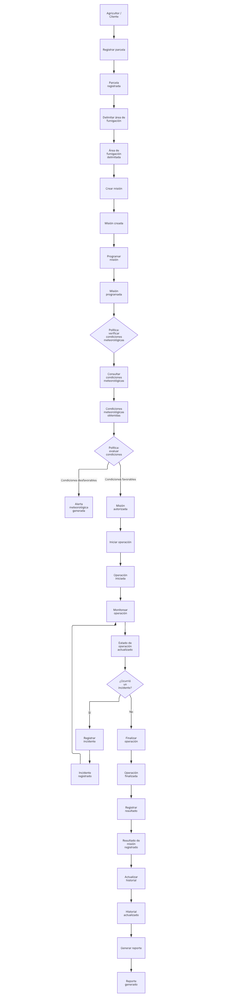

**Link de Lucidchart:** https://lucid.app/lucidchart/e8a59167-4148-4d11-ab49-19abe080e585/edit?view_items=J4zqxcoJNdUQq%2BczQQMJK5LES6g%3D&page=0_0&invitationId=inv_ac46e8d4-1e8b-4dcd-b431-e285187b3edc


### Actores principales

| Actor                             | Responsabilidad                                                                                             |
|-----------------------------------|-------------------------------------------------------------------------------------------------------------|
| **Agricultor / Cliente**          | Solicita servicios y consulta información de sus operaciones.                                               |
| **Operador técnico**              | Registra y planifica misiones, verifica condiciones, ejecuta y monitorea operaciones y registra resultados. |
| **Sistema meteorológico externo** | Proporciona información climática para apoyar la planificación.                                             |

### Comandos

| Comando                              | Origen             | Propósito                                                       |
|--------------------------------------|--------------------|-----------------------------------------------------------------|
| Registrar parcela                    | Operador           | Crear información de una parcela agrícola.                      |
| Delimitar área de fumigación         | Operador           | Definir el área que será tratada.                               |
| Crear misión                         | Operador           | Crear una operación de fumigación asociada a una parcela.       |
| Programar misión                     | Operador           | Definir fecha y hora planificadas.                              |
| Consultar condiciones meteorológicas | Sistema            | Obtener información climática de la API externa.                |
| Iniciar operación                    | Operador           | Marcar el inicio de la misión.                                  |
| Monitorear operación                 | Operador / Sistema | Actualizar estado y ubicación simulada del dron.                |
| Registrar incidente                  | Operador           | Registrar situaciones inesperadas.                              |
| Finalizar operación                  | Operador           | Marcar la finalización de la misión.                            |
| Registrar resultado                  | Operador           | Registrar hectáreas tratadas, volumen aplicado y observaciones. |
| Actualizar historial                 | Sistema            | Incorporar la misión finalizada al historial.                   |
| Generar reporte                      | Usuario / Sistema  | Generar información consolidada de la operación.                |

### Eventos de dominio

| Evento                                   | Descripción                                                          |
|------------------------------------------|----------------------------------------------------------------------|
| **Parcela registrada**                   | Se creó una parcela con su información básica.                       |
| **Área de fumigación delimitada**        | Se definió geográficamente el área que será tratada.                 |
| **Misión creada**                        | Se creó una nueva misión.                                            |
| **Misión programada**                    | La misión tiene fecha y hora planificadas.                           |
| **Condiciones meteorológicas obtenidas** | El sistema recibió información climática externa.                    |
| **Misión autorizada**                    | Las condiciones disponibles permiten continuar con la planificación. |
| **Alerta meteorológica generada**        | Las condiciones requieren advertencia, pausa o reprogramación.       |
| **Operación iniciada**                   | Comenzó la ejecución de la misión.                                   |
| **Estado de operación actualizado**      | Se actualizó el estado o ubicación simulada del dron.                |
| **Incidente registrado**                 | Se registró una situación inesperada.                                |
| **Operación finalizada**                 | Terminó la ejecución de la misión.                                   |
| **Resultado de misión registrado**       | Se registraron las métricas y observaciones finales.                 |
| **Historial actualizado**                | La misión finalizada está disponible como antecedente.               |
| **Reporte generado**                     | Se generó información consolidada.                                   |

### Políticas y reglas de negocio

| Política                              | Regla                                                                                                       |
|---------------------------------------|-------------------------------------------------------------------------------------------------------------|
| **Verificación meteorológica previa** | Antes de iniciar una misión se deben consultar las condiciones meteorológicas disponibles.                  |
| **Evaluación de condiciones**         | Si las condiciones son desfavorables, se genera una alerta para apoyar la decisión de pausar o reprogramar. |
| **Registro de incidentes**            | Una incidencia debe quedar registrada para mantener trazabilidad.                                           |
| **Registro de resultados**            | Una misión finalizada debe conservar información sobre el trabajo realizado.                                |
| **Actualización del historial**       | Los resultados de misiones finalizadas deben estar disponibles para consultas posteriores.                  |

### Agregados principales

- **Farm / Parcel:** concentra información territorial y agrícola.
- **Mission:** concentra la información principal de una operación y su ciclo de vida.
- **Drone:** representa el recurso utilizado para ejecutar una misión.
- **Mission Report:** concentra los resultados registrados al finalizar una operación.

---

# 4.6.1.1. Bounded Contexts

La partición del dominio se realiza considerando las responsabilidades y conceptos principales de la solución.

## Bounded Context 1: Field Management

**Responsabilidad:** administrar la información de campos y parcelas utilizada para planificar servicios.

**Conceptos:** campo, parcela, cultivo, ubicación, área de fumigación y coordenadas.

**Operaciones:** registrar/actualizar parcela, visualizarla en mapa, delimitar área y asociar cultivo.

**Eventos:** `ParcelaRegistrada`, `AreaFumigacionDelimitada`, `InformacionCultivoRegistrada`.

## Bounded Context 2: Flight Operations

**Responsabilidad:** gestionar la planificación, ejecución y seguimiento de misiones.

**Conceptos:** misión, dron, programación, estado, operación, incidente y hectáreas tratadas.

**Operaciones:** crear/programar misión, iniciar operación, actualizar estado, registrar incidentes, finalizar operación y registrar resultados.

**Eventos:** `MisionCreada`, `MisionProgramada`, `OperacionIniciada`, `EstadoOperacionActualizado`, `IncidenteRegistrado`, `OperacionFinalizada`.

## Bounded Context 3: Weather Integration

**Responsabilidad:** encapsular la integración con la API meteorológica y proporcionar información climática para apoyar la planificación.

**Conceptos:** consulta meteorológica, condición, viento, temperatura, humedad, precipitación y alerta.

**Operaciones:** consultar condiciones, consultar pronóstico, evaluar condiciones y generar alertas.

**Eventos:** `CondicionesMeteorologicasObtenidas`, `CondicionesEvaluadas`, `AlertaMeteorologicaGenerada`.

## Bounded Context 4: Analytics & Reporting

**Responsabilidad:** conservar y presentar información histórica de las operaciones.

**Conceptos:** historial, resultado, reporte, estadística y métrica.

**Operaciones:** registrar resultados, consultar historial, consolidar métricas y generar reportes.

**Eventos:** `ResultadoMisionRegistrado`, `HistorialActualizado`, `ReporteGenerado`.

### Relación entre Bounded Contexts


```

### Justificación

- **Field Management** mantiene la información territorial.
- **Flight Operations** gestiona el ciclo de vida de la misión.
- **Weather Integration** aísla la dependencia externa de información meteorológica.
- **Analytics & Reporting** transforma resultados en información histórica y reportes.

**link de mmiro:** https://miro.com/app/board/uXjVHl_E4nc=/?share_link_id=823387251080

### 4.6.2. Software Architecture Context Diagram
El **System Context Diagram de C4** representa el sistema como una única unidad y muestra los usuarios y sistemas externos que interactúan directamente con él. En este nivel no se detallan tecnologías internas.

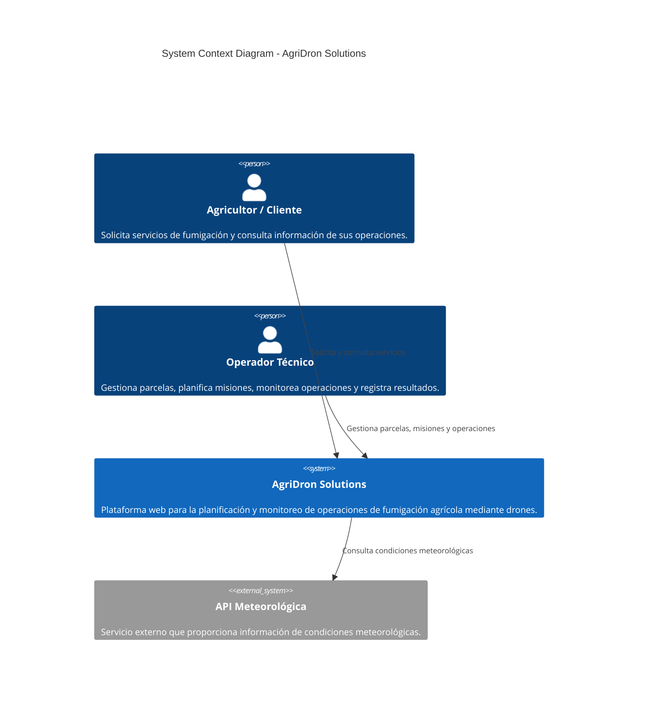
```mermaid
C4Context
  title System Context Diagram - AgriDron Solutions

  Person(farmer, "Agricultor / Cliente", "Solicita servicios de fumigación y consulta información de sus operaciones.")
  Person(operator, "Operador Técnico", "Gestiona parcelas, planifica misiones, monitorea operaciones y registra resultados.")

  System(agridron, "AgriDron Solutions", "Plataforma web para la planificación y monitoreo de operaciones de fumigación agrícola mediante drones.")

  System_Ext(weather, "API Meteorológica", "Servicio externo que proporciona información de condiciones meteorológicas.")

  Rel(farmer, agridron, "Solicita y consulta servicios")
  Rel(operator, agridron, "Gestiona parcelas, misiones y operaciones")
  Rel(agridron, weather, "Consulta condiciones meteorológicas")
```

### Descripción

**AgriDron Solutions** es el sistema principal en el alcance de la solución. El **Agricultor / Cliente** interactúa con la plataforma para solicitar y consultar información relacionada con sus servicios, mientras que el **Operador Técnico** la utiliza para gestionar parcelas, planificar misiones, monitorear operaciones y registrar resultados.

La plataforma interactúa con una **API Meteorológica externa** para obtener información utilizada en la evaluación de las condiciones de operación.

### 4.6.3. Software Architecture Container Diagrams
El **Container Diagram de C4** realiza un acercamiento al sistema y muestra sus principales aplicaciones, servicios y almacenes de datos, incluyendo las tecnologías utilizadas y sus relaciones.

Los contenedores definidos son:

1. **Landing Page**
2. **Frontend Angular**
3. **Backend Spring Boot**
4. **Base de Datos Relacional**
5. **API Meteorológica Externa**

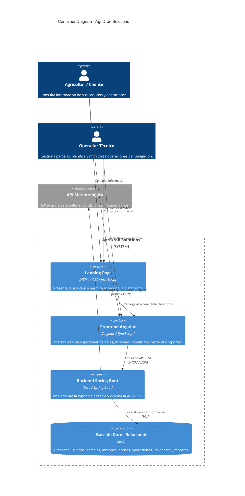
```mermaid
C4Container
  title Container Diagram - AgriDron Solutions

  Person(farmer, "Agricultor / Cliente", "Consulta información de sus servicios y operaciones.")
  Person(operator, "Operador Técnico", "Gestiona parcelas, planifica y monitorea operaciones de fumigación.")

  System_Ext(weather, "API Meteorológica", "API externa para obtener condiciones meteorológicas.")

  System_Boundary(agridron, "AgriDron Solutions") {
    Container(landing, "Landing Page", "HTML / CSS / JavaScript", "Presenta la solución y permite acceder a la plataforma.")
    Container(frontend, "Frontend Angular", "Angular / TypeScript", "Interfaz web para gestionar parcelas, misiones, monitoreo, historial y reportes.")
    Container(backend, "Backend Spring Boot", "Java / Spring Boot", "Implementa la lógica de negocio y expone la API REST.")
    ContainerDb(database, "Base de Datos Relacional", "SQL", "Almacena usuarios, parcelas, misiones, drones, operaciones, incidentes y reportes.")
  }

  Rel(farmer, landing, "Consulta información")
  Rel(operator, landing, "Consulta información")
  Rel(farmer, frontend, "Consulta servicios")
  Rel(operator, frontend, "Gestiona operaciones")
  Rel(landing, frontend, "Redirige al acceso de la plataforma")
  Rel(frontend, backend, "Consume API REST", "HTTPS / JSON")
  Rel(backend, database, "Lee y almacena información", "SQL")
  Rel(backend, weather, "Consulta condiciones meteorológicas", "HTTPS / JSON")
```

### Descripción de los contenedores

| Contenedor                   | Tecnología              | Responsabilidad                                                                                  |
|------------------------------|-------------------------|--------------------------------------------------------------------------------------------------|
| **Landing Page**             | HTML / CSS / JavaScript | Presentar AgriDron Solutions y facilitar el acceso a la plataforma.                              |
| **Frontend Angular**         | Angular / TypeScript    | Proporcionar la interfaz para gestionar parcelas, misiones, monitoreo, historial y reportes.     |
| **Backend Spring Boot**      | Java / Spring Boot      | Implementar la lógica de negocio, exponer servicios REST y coordinar datos y servicios externos. |
| **Base de Datos Relacional** | SQL                     | Persistir usuarios, parcelas, misiones, operaciones, incidentes y reportes.                      |
| **API Meteorológica**        | Servicio externo        | Proporcionar datos meteorológicos para apoyar la planificación.                                  |

### Flujo de comunicación

1. El usuario accede a la **Landing Page**.
2. El usuario utiliza el **Frontend Angular** para gestionar o consultar información.
3. El **Frontend Angular** consume el **Backend Spring Boot** mediante API REST.
4. El **Backend Spring Boot** consulta y actualiza la **Base de Datos Relacional**.
5. El **Backend Spring Boot** consulta la **API Meteorológica** cuando se requiere información climática.
6. La información procesada se presenta mediante el **Frontend Angular**.

## Trazabilidad entre dominio y arquitectura

| Bounded Context           | Responsabilidad                            | Soporte arquitectónico      |
|---------------------------|--------------------------------------------|-----------------------------|
| **Field Management**      | Campos, parcelas y áreas                   | Frontend + Backend + BD     |
| **Flight Operations**     | Misiones, drones, operaciones e incidentes | Frontend + Backend + BD     |
| **Weather Integration**   | Condiciones y alertas meteorológicas       | Backend + API Meteorológica |
| **Analytics & Reporting** | Historial, métricas y reportes             | Frontend + Backend + BD     |

La correspondencia permite mantener trazabilidad entre el análisis de dominio realizado mediante Event Storming y la arquitectura propuesta para AgriDron Solutions.

### 4.6.4. Software Architecture Components Diagrams
Esta sección presenta el diseño interno de los principales componentes de software de **AgriDron Solutions**. Se mantiene la separación entre la aplicación web, los servicios REST y las integraciones externas, alineándolos con los Bounded Contexts definidos en la arquitectura.


## 4.6.4.1. RESTful API

La API RESTful implementada con Spring Boot concentra la lógica de aplicación y dominio. Se organiza en capas de presentación, aplicación, dominio e infraestructura.

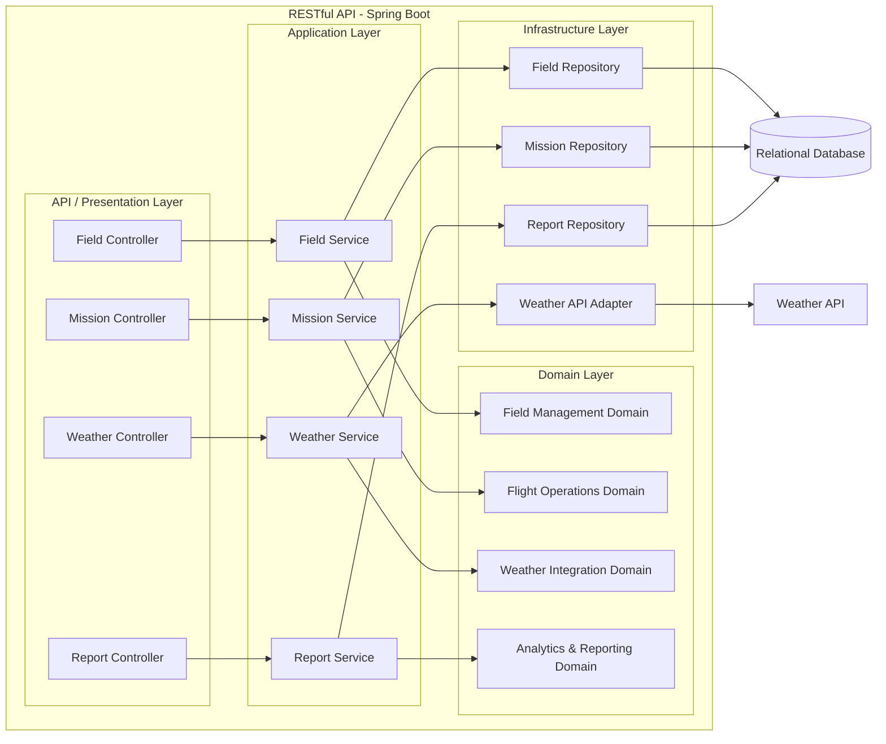
```mermaid
flowchart LR
  subgraph API["RESTful API - Spring Boot"]
    subgraph Presentation["API / Presentation Layer"]
      FC["Field Controller"]
      MC["Mission Controller"]
      WC["Weather Controller"]
      RC["Report Controller"]
    end
    subgraph Application["Application Layer"]
      FS["Field Service"]
      MS["Mission Service"]
      WS["Weather Service"]
      RS["Report Service"]
    end
    subgraph Domain["Domain Layer"]
      FD["Field Management Domain"]
      MD["Flight Operations Domain"]
      WD["Weather Integration Domain"]
      RD["Analytics & Reporting Domain"]
    end
    subgraph Infrastructure["Infrastructure Layer"]
      FR["Field Repository"]
      MR["Mission Repository"]
      RR["Report Repository"]
      WA["Weather API Adapter"]
    end
  end
  DB[("Relational Database")]
  Weather["Weather API"]
  FC --> FS
  MC --> MS
  WC --> WS
  RC --> RS
  FS --> FD
  MS --> MD
  WS --> WD
  RS --> RD
  FS --> FR
  MS --> MR
  RS --> RR
  WS --> WA
  FR --> DB
  MR --> DB
  RR --> DB
  WA --> Weather
```

### Responsabilidades

| Capa           | Responsabilidad                                                         |
|----------------|-------------------------------------------------------------------------|
| Presentation   | Recibir solicitudes HTTP y devolver respuestas mediante endpoints REST. |
| Application    | Coordinar casos de uso y orquestar operaciones del dominio.             |
| Domain         | Contener reglas y conceptos principales de cada Bounded Context.        |
| Infrastructure | Implementar persistencia e integración con servicios externos.          |

## 4.6.4.2. Web Application

La aplicación web utiliza Angular para proporcionar las funcionalidades de operadores y clientes.

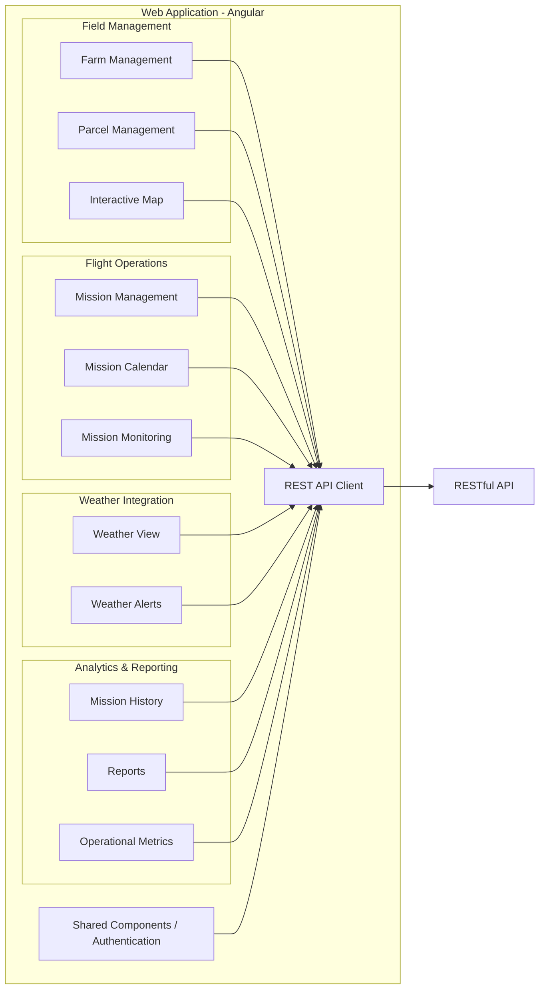
```mermaid
flowchart LR
  subgraph Web["Web Application - Angular"]
    subgraph Field["Field Management"]
      Farms["Farm Management"]
      Parcels["Parcel Management"]
      Map["Interactive Map"]
    end
    subgraph Flight["Flight Operations"]
      Missions["Mission Management"]
      Schedule["Mission Calendar"]
      Monitor["Mission Monitoring"]
    end
    subgraph Weather["Weather Integration"]
      WeatherView["Weather View"]
      Alerts["Weather Alerts"]
    end
    subgraph Reports["Analytics & Reporting"]
      History["Mission History"]
      ReportsView["Reports"]
      Metrics["Operational Metrics"]
    end
    Shared["Shared Components / Authentication"]
    APIClient["REST API Client"]
  end
  API["RESTful API"]
  Farms --> APIClient
  Parcels --> APIClient
  Map --> APIClient
  Missions --> APIClient
  Schedule --> APIClient
  Monitor --> APIClient
  WeatherView --> APIClient
  Alerts --> APIClient
  History --> APIClient
  ReportsView --> APIClient
  Metrics --> APIClient
  Shared --> APIClient
  APIClient --> API
```

### Responsabilidades

- **Field Management:** administrar campos, parcelas y áreas de fumigación.
- **Flight Operations:** crear, programar y monitorear misiones.
- **Weather Integration:** mostrar condiciones y alertas meteorológicas.
- **Analytics & Reporting:** consultar historial y reportes.
- **Shared Components:** centralizar elementos reutilizables y autenticación.
- **REST API Client:** encapsular la comunicación con el Backend.

## 4.6.4.3. Weather Integration Component

La integración meteorológica se mantiene aislada para evitar acoplar directamente la lógica de negocio con la API externa.

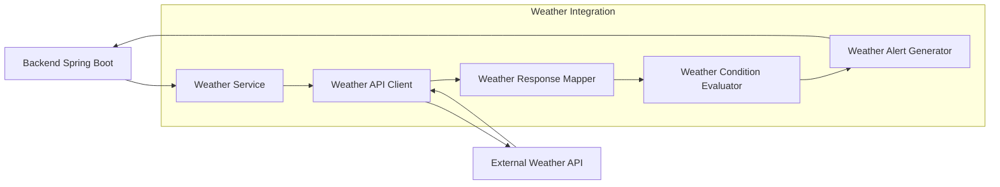
```mermaid
flowchart LR
  Backend["Backend Spring Boot"]
  subgraph WeatherIntegration["Weather Integration"]
    WS["Weather Service"]
    WClient["Weather API Client"]
    Mapper["Weather Response Mapper"]
    Evaluator["Weather Condition Evaluator"]
    Alert["Weather Alert Generator"]
  end
  External["External Weather API"]
  Backend --> WS
  WS --> WClient
  WClient --> External
  External --> WClient
  WClient --> Mapper
  Mapper --> Evaluator
  Evaluator --> Alert
  Alert --> Backend
```

El componente permite cambiar o adaptar el proveedor meteorológico sin modificar directamente los componentes de **Flight Operations**.

---

## 4.7. Software Object-Oriented Design
El diseño orientado a objetos representa los principales elementos del dominio y sus relaciones. El Project Statement solicita que los Class Diagrams incluyan clases, interfaces, enumeraciones, atributos, métodos, visibilidad, relaciones y multiplicidades cuando correspondan.

### 4.7.1. Class Diagrams

### 4.7.1.1. Field Management

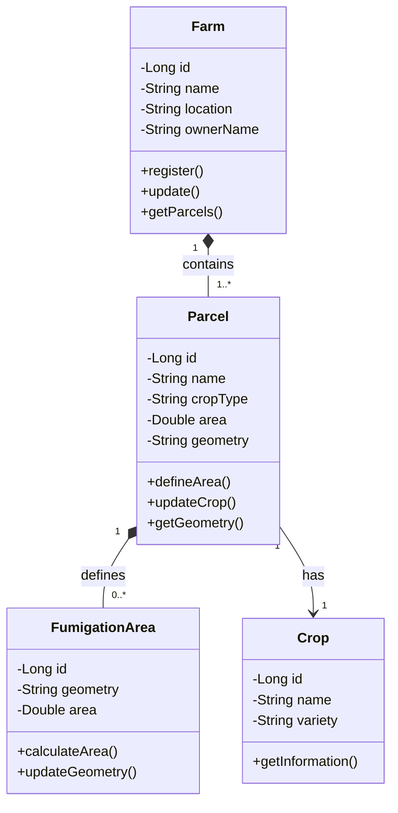
```mermaid
classDiagram
  class Farm {
    -Long id
    -String name
    -String location
    -String ownerName
    +register()
    +update()
    +getParcels()
  }
  class Parcel {
    -Long id
    -String name
    -String cropType
    -Double area
    -String geometry
    +defineArea()
    +updateCrop()
    +getGeometry()
  }
  class FumigationArea {
    -Long id
    -String geometry
    -Double area
    +calculateArea()
    +updateGeometry()
  }
  class Crop {
    -Long id
    -String name
    -String variety
    +getInformation()
  }
  Farm "1" *-- "1..*" Parcel : contains
  Parcel "1" *-- "0..*" FumigationArea : defines
  Parcel "1" --> "1" Crop : has
```

### 4.7.1.2. Flight Operations

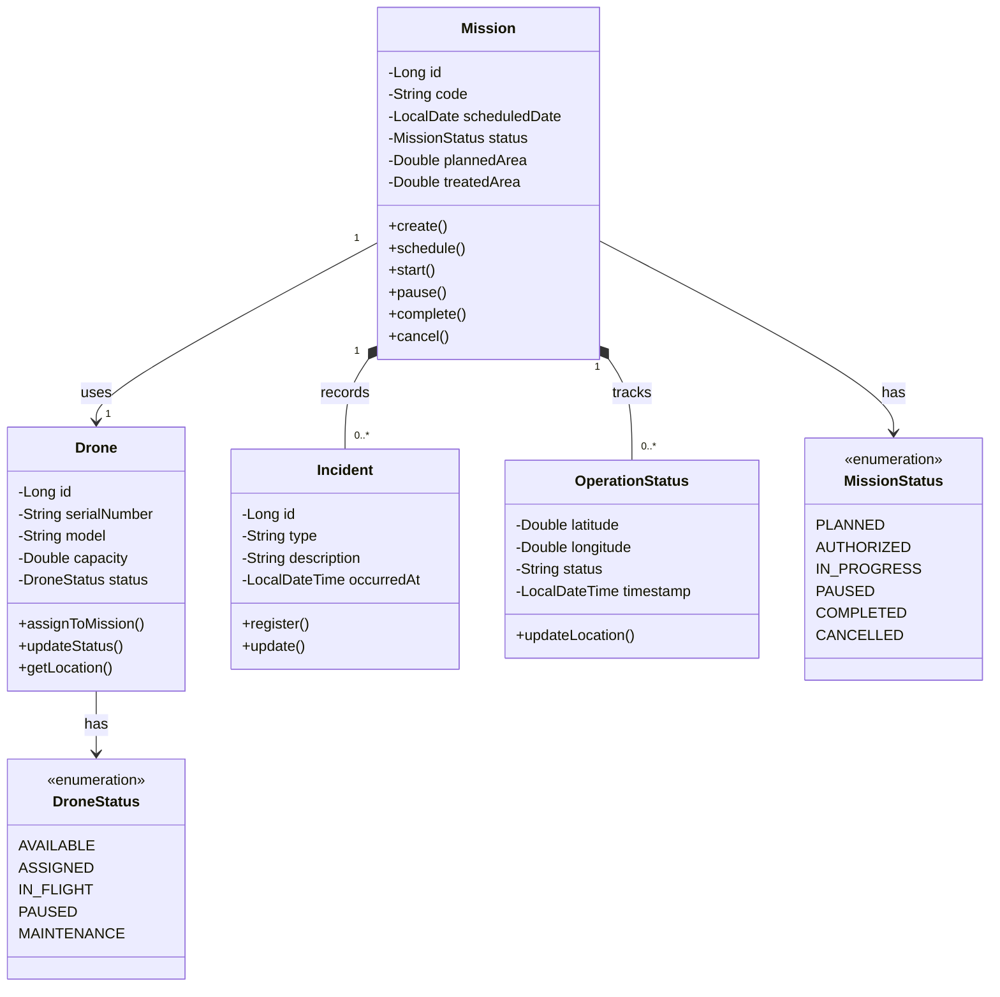
```mermaid
classDiagram
  class Mission {
    -Long id
    -String code
    -LocalDate scheduledDate
    -MissionStatus status
    -Double plannedArea
    -Double treatedArea
    +create()
    +schedule()
    +start()
    +pause()
    +complete()
    +cancel()
  }
  class Drone {
    -Long id
    -String serialNumber
    -String model
    -Double capacity
    -DroneStatus status
    +assignToMission()
    +updateStatus()
    +getLocation()
  }
  class Incident {
    -Long id
    -String type
    -String description
    -LocalDateTime occurredAt
    +register()
    +update()
  }
  class OperationStatus {
    -Double latitude
    -Double longitude
    -String status
    -LocalDateTime timestamp
    +updateLocation()
  }
  class MissionStatus {
    <<enumeration>>
    PLANNED
    AUTHORIZED
    IN_PROGRESS
    PAUSED
    COMPLETED
    CANCELLED
  }
  class DroneStatus {
    <<enumeration>>
    AVAILABLE
    ASSIGNED
    IN_FLIGHT
    PAUSED
    MAINTENANCE
  }
  Mission "1" --> "1" Drone : uses
  Mission "1" *-- "0..*" Incident : records
  Mission "1" *-- "0..*" OperationStatus : tracks
  Mission --> MissionStatus : has
  Drone --> DroneStatus : has
```

### 4.7.1.3. Weather Integration

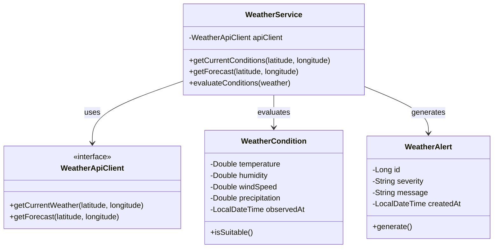
```mermaid
classDiagram
  class WeatherService {
    -WeatherApiClient apiClient
    +getCurrentConditions(latitude, longitude)
    +getForecast(latitude, longitude)
    +evaluateConditions(weather)
  }
  class WeatherApiClient {
    <<interface>>
    +getCurrentWeather(latitude, longitude)
    +getForecast(latitude, longitude)
  }
  class WeatherCondition {
    -Double temperature
    -Double humidity
    -Double windSpeed
    -Double precipitation
    -LocalDateTime observedAt
    +isSuitable()
  }
  class WeatherAlert {
    -Long id
    -String severity
    -String message
    -LocalDateTime createdAt
    +generate()
  }
  WeatherService --> WeatherApiClient : uses
  WeatherService --> WeatherCondition : evaluates
  WeatherService --> WeatherAlert : generates
```

### 4.7.1.4. Analytics & Reporting

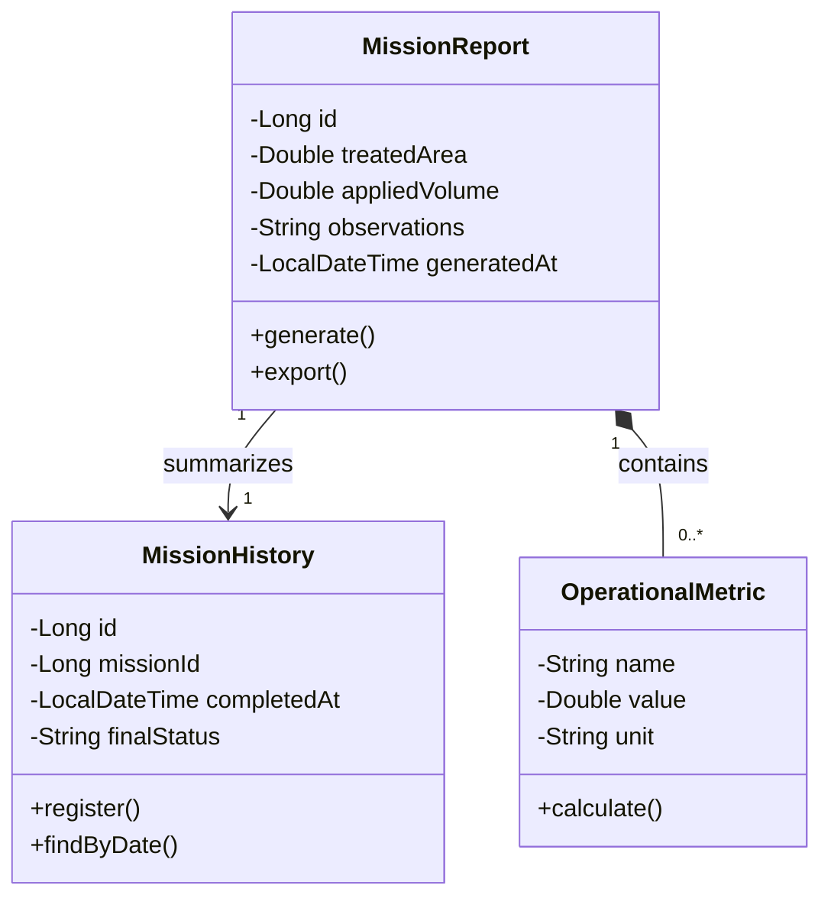
```mermaid
classDiagram
  class MissionReport {
    -Long id
    -Double treatedArea
    -Double appliedVolume
    -String observations
    -LocalDateTime generatedAt
    +generate()
    +export()
  }
  class MissionHistory {
    -Long id
    -Long missionId
    -LocalDateTime completedAt
    -String finalStatus
    +register()
    +findByDate()
  }
  class OperationalMetric {
    -String name
    -Double value
    -String unit
    +calculate()
  }
  MissionReport "1" --> "1" MissionHistory : summarizes
  MissionReport "1" *-- "0..*" OperationalMetric : contains
```

### 4.7.1.5. Shared / Identity

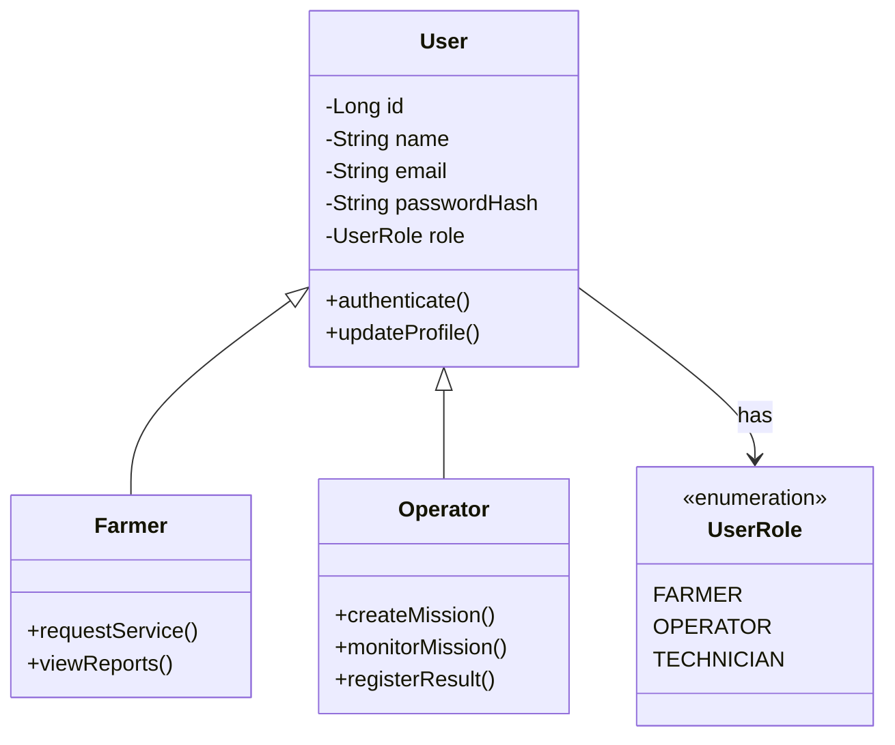
```mermaid
classDiagram
  class User {
    -Long id
    -String name
    -String email
    -String passwordHash
    -UserRole role
    +authenticate()
    +updateProfile()
  }
  class UserRole {
    <<enumeration>>
    FARMER
    OPERATOR
    TECHNICIAN
  }
  class Farmer {
    +requestService()
    +viewReports()
  }
  class Operator {
    +createMission()
    +monitorMission()
    +registerResult()
  }
  User <|-- Farmer
  User <|-- Operator
  User --> UserRole : has
```
**Link LuciChart:** https://lucid.app/lucidchart/a19c55c2-6693-47c1-a66c-347112de89c0/edit?viewport_loc=-1180%2C-484%2C5244%2C2796%2C0_0&invitationId=inv_bd423e8a-a95b-4985-ac69-5194098d2c5f

## 4.8. Database Design
El diseño de base de datos define la persistencia necesaria para los objetos de cada Bounded Context. Para almacenamiento relacional se especifican tablas, columnas, claves primarias, claves foráneas y relaciones entre tablas. Esto corresponde a lo solicitado por el Project Statement.

### 4.8.1. Database Diagrams

### 4.8.1.1. Field Management

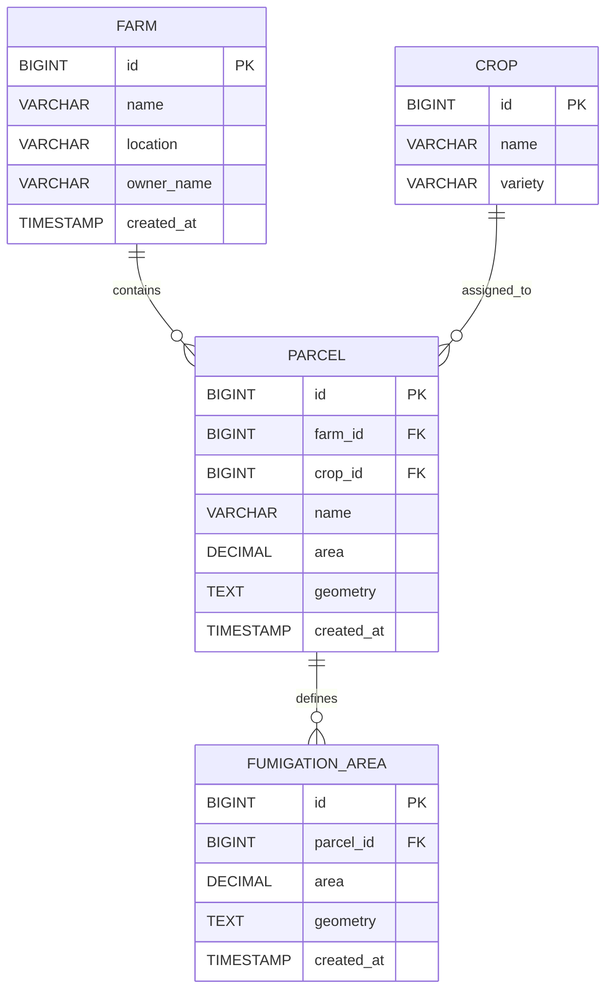
```mermaid
erDiagram
    FARM ||--o{ PARCEL : contains
    PARCEL ||--o{ FUMIGATION_AREA : defines
    CROP ||--o{ PARCEL : assigned_to
    FARM {
        BIGINT id PK
        VARCHAR name
        VARCHAR location
        VARCHAR owner_name
        TIMESTAMP created_at
    }
    PARCEL {
        BIGINT id PK
        BIGINT farm_id FK
        BIGINT crop_id FK
        VARCHAR name
        DECIMAL area
        TEXT geometry
        TIMESTAMP created_at
    }
    FUMIGATION_AREA {
        BIGINT id PK
        BIGINT parcel_id FK
        DECIMAL area
        TEXT geometry
        TIMESTAMP created_at
    }
    CROP {
        BIGINT id PK
        VARCHAR name
        VARCHAR variety
    }
```

**Restricciones principales:** `FARM.id`, `PARCEL.id`, `FUMIGATION_AREA.id` y `CROP.id` son PK; las FK mantienen las relaciones indicadas; `area` debe ser mayor que cero.

### 4.8.1.2. Flight Operations

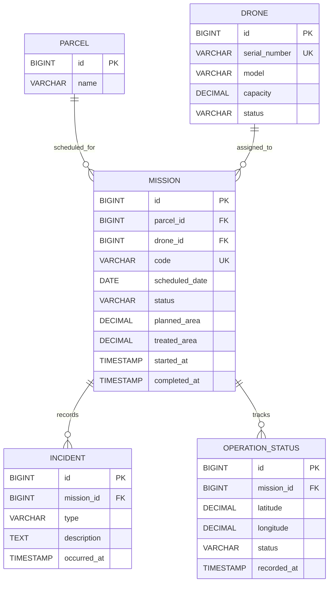
```mermaid
erDiagram
    PARCEL ||--o{ MISSION : scheduled_for
    DRONE ||--o{ MISSION : assigned_to
    MISSION ||--o{ INCIDENT : records
    MISSION ||--o{ OPERATION_STATUS : tracks
    PARCEL {
        BIGINT id PK
        VARCHAR name
    }
    DRONE {
        BIGINT id PK
        VARCHAR serial_number UK
        VARCHAR model
        DECIMAL capacity
        VARCHAR status
    }
    MISSION {
        BIGINT id PK
        BIGINT parcel_id FK
        BIGINT drone_id FK
        VARCHAR code UK
        DATE scheduled_date
        VARCHAR status
        DECIMAL planned_area
        DECIMAL treated_area
        TIMESTAMP started_at
        TIMESTAMP completed_at
    }
    INCIDENT {
        BIGINT id PK
        BIGINT mission_id FK
        VARCHAR type
        TEXT description
        TIMESTAMP occurred_at
    }
    OPERATION_STATUS {
        BIGINT id PK
        BIGINT mission_id FK
        DECIMAL latitude
        DECIMAL longitude
        VARCHAR status
        TIMESTAMP recorded_at
    }
```

**Restricciones principales:** `MISSION.parcel_id` y `MISSION.drone_id` son FK; `MISSION.code` y `DRONE.serial_number` son únicos; las FK de `INCIDENT` y `OPERATION_STATUS` referencian `MISSION.id`; las áreas no pueden ser negativas.

### 4.8.1.3. Weather Integration

Para el MVP, la información meteorológica puede almacenarse únicamente cuando sea necesaria para mantener trazabilidad de la evaluación asociada a una misión.

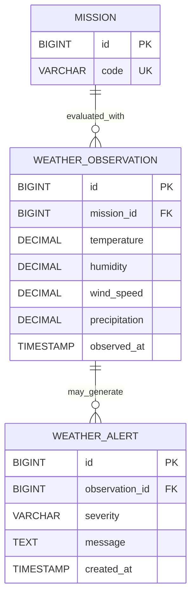
```mermaid
erDiagram
    MISSION ||--o{ WEATHER_OBSERVATION : evaluated_with
    WEATHER_OBSERVATION ||--o{ WEATHER_ALERT : may_generate
    MISSION {
        BIGINT id PK
        VARCHAR code UK
    }
    WEATHER_OBSERVATION {
        BIGINT id PK
        BIGINT mission_id FK
        DECIMAL temperature
        DECIMAL humidity
        DECIMAL wind_speed
        DECIMAL precipitation
        TIMESTAMP observed_at
    }
    WEATHER_ALERT {
        BIGINT id PK
        BIGINT observation_id FK
        VARCHAR severity
        TEXT message
        TIMESTAMP created_at
    }
```

**Restricciones principales:** `WEATHER_OBSERVATION.mission_id` y `WEATHER_ALERT.observation_id` son FK; los valores meteorológicos deben validarse según la fuente; cada observación conserva su fecha y hora.

### 4.8.1.4. Analytics & Reporting

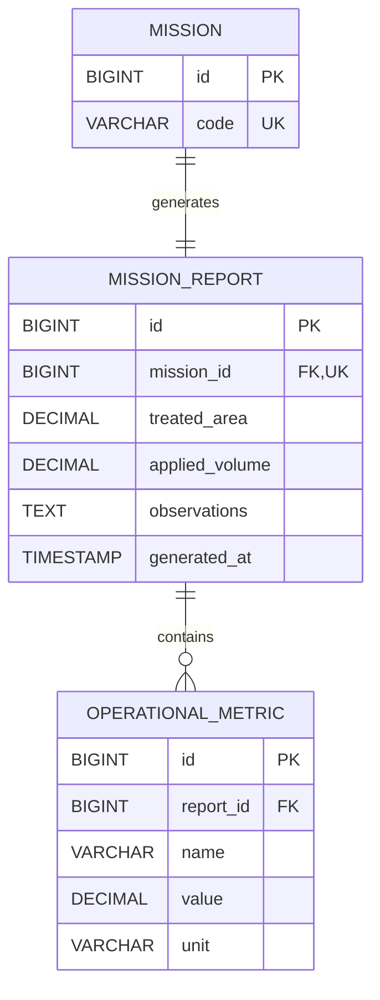
```mermaid
erDiagram
    MISSION ||--|| MISSION_REPORT : generates
    MISSION_REPORT ||--o{ OPERATIONAL_METRIC : contains
    MISSION {
        BIGINT id PK
        VARCHAR code UK
    }
    MISSION_REPORT {
        BIGINT id PK
        BIGINT mission_id FK,UK
        DECIMAL treated_area
        DECIMAL applied_volume
        TEXT observations
        TIMESTAMP generated_at
    }
    OPERATIONAL_METRIC {
        BIGINT id PK
        BIGINT report_id FK
        VARCHAR name
        DECIMAL value
        VARCHAR unit
    }
```

**Restricciones principales:** `MISSION_REPORT.mission_id` es FK y UNIQUE para mantener una relación uno a uno con la misión; `OPERATIONAL_METRIC.report_id` referencia `MISSION_REPORT.id`; `treated_area` y `applied_volume` no pueden ser negativos.

## 4.8.1.5. Vista integrada de persistencia

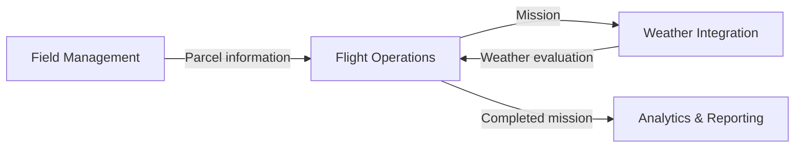
```mermaid
flowchart LR
    FM["Field Management"]
    FO["Flight Operations"]
    WI["Weather Integration"]
    AR["Analytics & Reporting"]
    FM -->|"Parcel information"| FO
    FO -->|"Mission"| WI
    WI -->|"Weather evaluation"| FO
    FO -->|"Completed mission"| AR
```

La separación por Bounded Context conserva responsabilidades claras, mientras que las relaciones entre contextos permiten soportar el flujo principal del negocio.


---

# Capítulo V: Product Implementation, Validation & Deployment

## 5.1. Software Configuration Management

El **Software Configuration Management (SCM)** de AgriDron Solutions establece las herramientas, convenciones y procedimientos que permitirán mantener la consistencia del producto durante su ciclo de vida. Esta configuración cubre el entorno de desarrollo, la gestión del código fuente, las convenciones de programación y el despliegue de los productos de software.

De acuerdo con el Project Statement, esta sección debe establecer decisiones y convenciones para mantener la consistencia durante el ciclo de vida del producto. Además, se debe considerar el entorno utilizado para actividades de gestión del proyecto, requisitos, UX/UI, desarrollo, despliegue y documentación.

La propuesta de SCM para AgriDron Solutions se alinea con la arquitectura definida previamente: **Landing Page**, **Frontend Angular**, **Backend Spring Boot** y **base de datos relacional**, además de la integración con una API meteorológica externa.

### 5.1.1. Software Development Environment Configuration

## 5.1.1.1. Propósito

El entorno de desarrollo define las herramientas que utilizará el equipo para implementar, documentar, probar y desplegar AgriDron Solutions. Se busca que todos los integrantes trabajen con una configuración homogénea, reduciendo problemas de compatibilidad y facilitando la colaboración.

El Project Statement indica que esta sección debe especificar el nombre de cada producto de software, su propósito y la ruta de referencia o descarga correspondiente, considerando las actividades de Project Management, Requirements Management, UX/UI Design, Software Development, Software Deployment y Software Documentation.

## 5.1.1.2. Herramientas del proyecto

| Categoría             | Herramienta / Tecnología | Propósito                                                                   | Referencia                             |
|-----------------------|--------------------------|-----------------------------------------------------------------------------|----------------------------------------|
| Control de versiones  | Git                      | Control local de versiones del código fuente.                               | https://git-scm.com/                   |
| Repositorios          | GitHub                   | Hospedaje de repositorios y colaboración mediante branches y Pull Requests. | https://github.com/                    |
| Gestión del proyecto  | Trello / Jira / YouTrack | Organización del backlog, tareas y seguimiento del trabajo.                 | Según herramienta seleccionada         |
| Editor / IDE Frontend | Visual Studio Code       | Desarrollo de Landing Page y Frontend Angular/TypeScript.                   | https://code.visualstudio.com/         |
| IDE Backend           | IntelliJ IDEA / Eclipse  | Desarrollo del Backend Java/Spring Boot.                                    | https://www.jetbrains.com/idea/        |
| Runtime Frontend      | Node.js + npm            | Instalación de dependencias y ejecución de herramientas Angular.            | https://nodejs.org/                    |
| Framework Frontend    | Angular                  | Implementación de la aplicación web.                                        | https://angular.dev/                   |
| Lenguaje Frontend     | TypeScript               | Desarrollo de la lógica del Frontend Angular.                               | https://www.typescriptlang.org/        |
| Lenguaje Backend      | Java                     | Implementación del Backend y lógica de negocio.                             | https://www.java.com/                  |
| Framework Backend     | Spring Boot              | Implementación de servicios REST y lógica del Backend.                      | https://spring.io/projects/spring-boot |
| Build Backend         | Maven                    | Gestión de dependencias y construcción del proyecto Spring Boot.            | https://maven.apache.org/              |
| Base de datos         | PostgreSQL / SQL         | Persistencia de la información de la plataforma.                            | https://www.postgresql.org/            |
| API testing           | Postman                  | Prueba de endpoints REST durante el desarrollo.                             | https://www.postman.com/               |
| Documentación API     | Swagger / OpenAPI        | Documentación y consulta de los servicios REST.                             | https://swagger.io/                    |
| Diseño UI/UX          | Figma                    | Diseño de wireframes, mock-ups y prototipos.                                | https://www.figma.com/                 |
| Diagramación          | Mermaid                  | Diagramas como código dentro del repositorio Markdown.                      | https://mermaid.js.org/                |
| Documentación         | Markdown                 | Elaboración de documentación técnica dentro del repositorio.                | https://www.markdownguide.org/         |

> **Nota:** Las herramientas de gestión de proyectos y los proveedores cloud deberán reemplazarse por los productos concretos que el equipo haya seleccionado en su implementación final. La tabla mantiene como propuesta las herramientas que no han sido fijadas previamente.

## 5.1.1.3. Configuración base

Todos los integrantes deberán mantener una configuración equivalente para evitar diferencias entre ambientes locales.

### Frontend

```text
Node.js
npm
Angular CLI
Angular
TypeScript
```

### Backend

```text
Java JDK
Maven
Spring Boot
IDE compatible con Java
```

### Base de datos

```text
PostgreSQL
Cliente gráfico de base de datos
```

### Control de versiones

```text
Git
GitHub
GitFlow
Conventional Commits
Semantic Versioning
```

## 5.1.1.4. Estructura de repositorios

Para mantener separadas las responsabilidades de los productos, se propone trabajar con repositorios independientes:

```text
AgriDron Solutions
│
├── agridron-landing
│   └── Landing Page
│
├── agridron-frontend
│   └── Frontend Angular
│
└── agridron-backend
    ├── Backend Spring Boot
    ├── Unit Tests
    └── Integration / Acceptance Tests
```

Esta organización sigue la indicación del Project Statement de considerar los productos **Landing Page, Web Services y Frontend Web Applications** y, en el caso de Web Services, incluir también los archivos de pruebas.


### 5.1.2. Source Code Management

## 5.1.2.1. Plataforma y repositorios

El control de versiones del proyecto se realizará mediante **Git gestionado desde GitHub**. El Project Statement establece explícitamente GitHub como plataforma de control de versiones y solicita aplicar **GitFlow Workflow, Conventional Commits y Semantic Versioning**.

Los repositorios considerados para AgriDron Solutions son:

| Producto                 | Repositorio                   | Contenido                                                     | Link de Github                                                |
|--------------------------|-------------------------------|---------------------------------------------------------------|---------------------------------------------------------------|
| Report                  | `AgiDron-LandingPage-7760-G3-Agridon-Report` | Documento en Markdown                                        | https://github.com/Opensource-UPC/1ASI0729-2620-7760-G3-Agridron-Report |
| Landing Page             | `AgiDron-LandingPage-7760-G3` | HTML, CSS y JavaScript                                        | https://github.com/Opensource-UPC/AgiDron-LandingPage-7760-G3 |
| Frontend Web Application | `AgiDron-FrontEnd-7760-G3`    | Angular y TypeScript                                          | https://github.com/Opensource-UPC/Agridron-frontend           |
| Web Services             | `AgiDron-BackEnd-7760-G3`     | Java, Spring Boot, pruebas unitarias e integración/aceptación | https://github.com/Opensource-UPC/Agridron-backend            |

## 5.1.2.2. GitFlow Workflow

Se utilizará **GitFlow** como estrategia de organización de ramas.

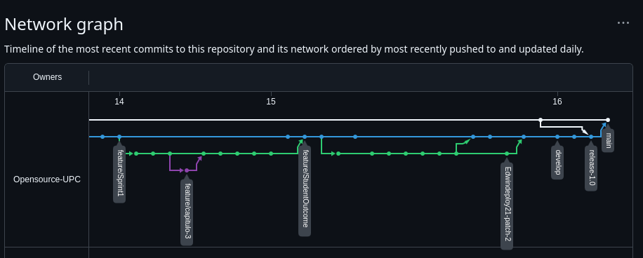

### Ramas principales

| Branch      | Propósito                                                     |
|-------------|---------------------------------------------------------------|
| `main`      | Contiene versiones estables listas para entrega o producción. |
| `develop`   | Rama de integración de funcionalidades terminadas.            |
| `feature/*` | Desarrollo aislado de una funcionalidad específica.           |
| `release/*` | Preparación de una nueva versión estable.                     |
| `hotfix/*`  | Corrección urgente de errores encontrados en producción.      |

## 5.1.2.3. Convención para Feature Branches

Cada funcionalidad debe desarrollarse en una rama independiente.

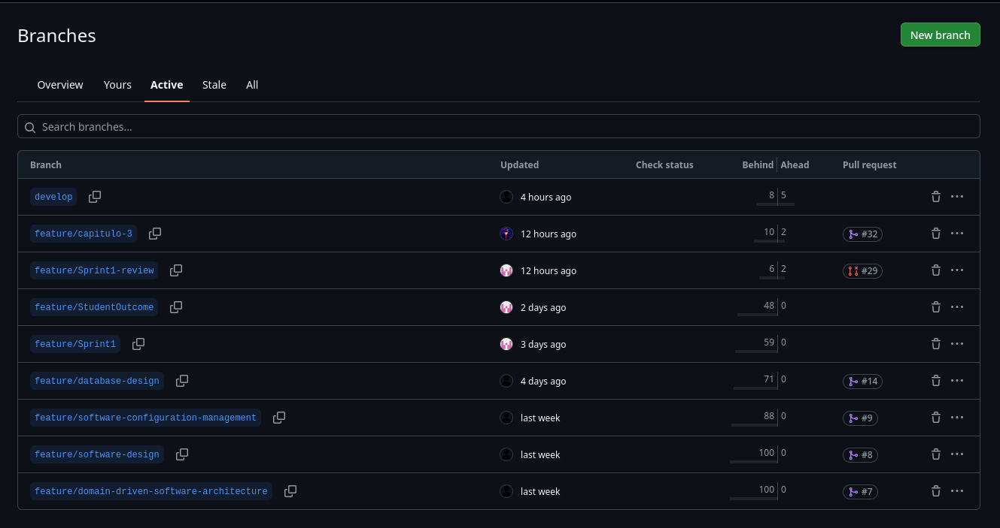

Se utilizarán nombres en **inglés**, en minúsculas y separados mediante guiones.

## 5.1.2.4. Convención para Release Branches

Formato:

```text
release/<major>.<minor>.<patch>
```

Ejemplos:

```text
release/1.0.0
release/1.1.0
release/1.1.1
```

Las release branches permiten realizar ajustes finales antes de integrar una versión estable a `main`.

## 5.1.2.5. Convención para Hotfix Branches

Formato:

```text
hotfix/<descripcion>
```

Ejemplos:

```text
hotfix/weather-api-error
hotfix/mission-status-fix
hotfix/login-validation
```

Los hotfixes estarán destinados exclusivamente a correcciones urgentes de versiones publicadas.

## 5.1.2.6. Pull Requests

Las modificaciones realizadas en `feature/*`, `release/*` y `hotfix/*` deberán integrarse mediante Pull Requests.

Flujo recomendado:

```text
feature/*
    ↓
Pull Request
    ↓
Code Review
    ↓
Tests
    ↓
Merge
    ↓
develop
```

Para una versión estable:

```text
develop
    ↓
release/x.y.z
    ↓
Validation
    ↓
main
    ↓
Tag vX.Y.Z
```

Se recomienda que ningún integrante trabaje directamente sobre `main` para funcionalidades nuevas.

## 5.1.2.7. Conventional Commits

Los mensajes de commit seguirán la especificación de **Conventional Commits**.

Formato:

```text
<type>[optional scope]: <description>
```

Ejemplos:

```text
feat(field): add parcel registration
feat(mission): add mission planning
fix(weather): handle unavailable API response
docs(api): update endpoint documentation
test(mission): add mission service tests
refactor(report): simplify report generation
chore(deps): update project dependencies
```

Tipos principales:

| Tipo       | Uso                                                       |
|------------|-----------------------------------------------------------|
| `feat`     | Nueva funcionalidad.                                      |
| `fix`      | Corrección de un error.                                   |
| `docs`     | Cambios en documentación.                                 |
| `test`     | Creación o modificación de pruebas.                       |
| `refactor` | Reestructuración sin cambiar el comportamiento funcional. |
| `style`    | Cambios de formato que no modifican la lógica.            |
| `chore`    | Tareas de mantenimiento o configuración.                  |

Conventional Commits relaciona `feat` con incrementos **MINOR**, `fix` con incrementos **PATCH** y los cambios incompatibles con incrementos **MAJOR**, facilitando su integración con Semantic Versioning.

## 5.1.2.8. Semantic Versioning

Las versiones del producto seguirán el formato:

```text
MAJOR.MINOR.PATCH
```

Ejemplo:

```text
1.0.0
```

Reglas:

- **MAJOR:** cambios incompatibles con versiones anteriores.
- **MINOR:** nuevas funcionalidades compatibles.
- **PATCH:** correcciones compatibles.

Ejemplos:

```text
1.0.0 → primera versión estable
1.1.0 → incorporación del módulo de monitoreo
1.1.1 → corrección de un error
2.0.0 → cambio incompatible de la API
```

Las versiones estables serán identificadas mediante tags de Git:

```text
v1.0.0
v1.1.0
v1.1.1
```

### 5.1.3. Source Code Style Guide & Conventions

## 5.1.3.1. Principios generales

El Project Statement establece que para los lenguajes utilizados en la solución debe aplicarse nomenclatura en **inglés**. Para AgriDron Solutions se aplicará esta regla a HTML, CSS, JavaScript, TypeScript y Java.

Principios:

1. Utilizar nombres descriptivos.
2. Mantener una nomenclatura consistente.
3. Evitar abreviaturas innecesarias.
4. Mantener métodos y clases con responsabilidades específicas.
5. Evitar duplicación de código.
6. Mantener funciones pequeñas y legibles.
7. Documentar únicamente la lógica que requiera contexto adicional.
8. Mantener las pruebas junto con el código correspondiente.
9. No incluir credenciales ni secretos dentro del código fuente.

## 5.1.3.2. HTML

Convenciones:

- Utilizar HTML5 semántico.
- Utilizar elementos semánticos como `header`, `nav`, `main`, `section` y `footer`.
- Utilizar atributos `aria-*` cuando sean necesarios para accesibilidad.
- Utilizar nombres descriptivos para clases e identificadores.
- Mantener los atributos en minúsculas.

Ejemplo:

```html
<section class="mission-summary" aria-labelledby="mission-title">
  <h2 id="mission-title">Mission Summary</h2>
</section>
```

## 5.1.3.3. CSS

Convenciones:

- Utilizar nombres de clases en inglés.
- Utilizar `kebab-case` para clases CSS.
- Evitar estilos inline cuando no sean necesarios.
- Agrupar reglas relacionadas.
- Evitar selectores excesivamente específicos.

Ejemplo:

```css
.mission-card {
  display: flex;
  gap: 1rem;
}

.mission-card__status {
  font-weight: 600;
}
```

## 5.1.3.4. JavaScript

Convenciones:

- Variables y funciones: `camelCase`.
- Constantes: `UPPER_SNAKE_CASE` cuando representen valores constantes globales.
- Clases: `PascalCase`.
- Utilizar `const` por defecto y `let` cuando sea necesario.
- Evitar variables globales.

Ejemplo:

```javascript
const DEFAULT_MISSION_STATUS = "PENDING";

function createMission(missionData) {
  // implementation
}
```

## 5.1.3.5. TypeScript / Angular

Convenciones:

| Elemento   | Convención       | Ejemplo              |
|------------|------------------|----------------------|
| Clase      | PascalCase       | `MissionService`     |
| Interface  | PascalCase       | `Mission`            |
| Variable   | camelCase        | `missionStatus`      |
| Método     | camelCase        | `createMission()`    |
| Constante  | UPPER_SNAKE_CASE | `API_BASE_URL`       |
| Archivo    | kebab-case       | `mission.service.ts` |
| Componente | kebab-case       | `mission-list`       |

Ejemplo:

```typescript
export interface Mission {
  id: number;
  parcelId: number;
  scheduledDate: string;
  status: MissionStatus;
}

export class MissionService {
  createMission(mission: Mission): void {
    // implementation
  }
}
```

## 5.1.3.6. Java / Spring Boot

Convenciones:

| Elemento | Convención       | Ejemplo                |
|----------|------------------|------------------------|
| Class    | PascalCase       | `MissionService`       |
| Method   | camelCase        | `createMission()`      |
| Variable | camelCase        | `missionStatus`        |
| Constant | UPPER_SNAKE_CASE | `MAX_MISSION_DURATION` |
| Package  | lowercase        | `com.agridron.mission` |
| DTO      | PascalCase + DTO | `MissionResponseDTO`   |
| Entity   | PascalCase       | `Mission`              |

La estructura del backend seguirá una separación lógica entre:

```text
controller/
service/
domain/
repository/
dto/
config/
exception/
```

Ejemplo:

```java
@RestController
@RequestMapping("/api/missions")
public class MissionController {

  @GetMapping("/{id}")
  public MissionResponseDTO getMission(@PathVariable Long id) {
    return missionService.getMission(id);
  }
}
```

## 5.1.3.7. API REST

Los endpoints utilizarán nombres de recursos en plural y en inglés.

Ejemplos:

```text
GET    /api/farms
GET    /api/parcels
POST   /api/parcels
GET    /api/missions
POST   /api/missions
PUT    /api/missions/{id}
DELETE /api/missions/{id}
GET    /api/weather
GET    /api/reports
```

Se utilizarán los verbos HTTP según la operación:

| Verbo  | Uso                                 |
|--------|-------------------------------------|
| GET    | Consultar recursos.                 |
| POST   | Crear recursos.                     |
| PUT    | Actualizar un recurso.              |
| PATCH  | Actualizar parcialmente un recurso. |
| DELETE | Eliminar un recurso.                |

## 5.1.3.8. Documentación y lenguaje

El idioma por defecto definido para los mensajes, interfaz de usuario e interfaz de documentación de los productos de la solución es **inglés**.

Por lo tanto:

- Variables: inglés.
- Clases: inglés.
- Métodos: inglés.
- Endpoints: inglés.
- Mensajes de API: inglés.
- Documentación técnica: inglés.
- Textos visibles para el usuario: inglés, salvo que una decisión posterior de UX establezca otro idioma.

### 5.1.4. Software Deployment Configuration

## 5.1.4.1. Objetivo

El despliegue permitirá publicar los productos de AgriDron Solutions en plataformas cloud y automatizar progresivamente el proceso de entrega.

El Project Statement establece que esta configuración debe contemplar la creación de cuentas, configuración de recursos en proveedores cloud y configuración de proyectos de desarrollo para integración o automatización del deployment. El proceso debe considerar los productos **Landing Page, Web Applications y Web Services**.

## 5.1.4.2. Arquitectura de despliegue

Se propone separar los componentes desplegables de acuerdo con la arquitectura del sistema:

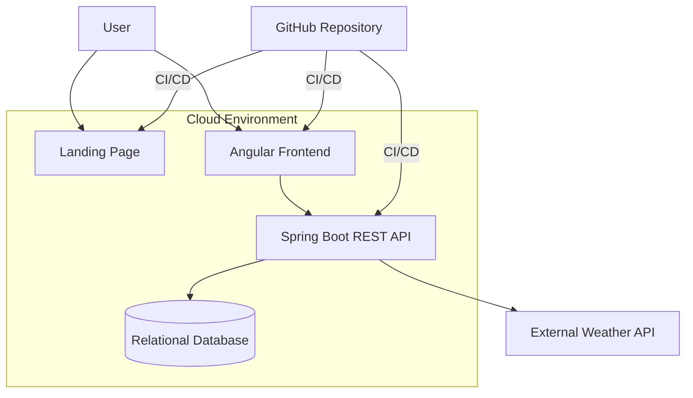
```mermaid
flowchart TB
  User["User"]
  GitHub["GitHub Repository"]

  subgraph Cloud["Cloud Environment"]
    Landing["Landing Page"]
    Frontend["Angular Frontend"]
    Backend["Spring Boot REST API"]
    Database[("Relational Database")]
  end

  Weather["External Weather API"]

  User --> Landing
  User --> Frontend
  Frontend --> Backend
  Backend --> Database
  Backend --> Weather

  GitHub -->|"CI/CD"| Landing
  GitHub -->|"CI/CD"| Frontend
  GitHub -->|"CI/CD"| Backend
```

## 5.1.4.3. Ambientes

Se utilizarán tres ambientes conceptuales:

| Ambiente    | Propósito                                     |
|-------------|-----------------------------------------------|
| Development | Desarrollo local y validaciones iniciales.    |
| Staging     | Integración y validación antes de producción. |
| Production  | Versión disponible para los usuarios.         |

Flujo:

```text
feature/*
    ↓
Development
    ↓
develop
    ↓
Staging
    ↓
release/*
    ↓
main
    ↓
Production
```

## 5.1.4.4. Integración continua

El repositorio podrá utilizar **GitHub Actions** para automatizar las tareas de integración y despliegue.

Pipeline conceptual:

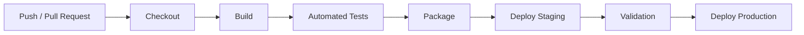
```mermaid
flowchart LR
  Commit["Push / Pull Request"]
  Checkout["Checkout"]
  Build["Build"]
  Test["Automated Tests"]
  Package["Package"]
  DeployStaging["Deploy Staging"]
  Validate["Validation"]
  DeployProd["Deploy Production"]

  Commit --> Checkout
  Checkout --> Build
  Build --> Test
  Test --> Package
  Package --> DeployStaging
  DeployStaging --> Validate
  Validate --> DeployProd
```

### Backend

```text
Checkout
↓
Install dependencies
↓
Run unit tests
↓
Run integration tests
↓
Build Spring Boot application
↓
Package application
↓
Deploy
```

### Frontend

```text
Checkout
↓
Install npm dependencies
↓
Run lint
↓
Run tests
↓
Build Angular application
↓
Deploy
```

### Landing Page

```text
Checkout
↓
Validate files
↓
Build / prepare static assets
↓
Deploy
```

## 5.1.4.5. Variables y secretos

Las credenciales, API keys, tokens y contraseñas no deberán almacenarse directamente en el repositorio.

Se utilizarán variables de entorno y secretos administrados por la plataforma de CI/CD.

Ejemplos:

```text
DATABASE_URL
DATABASE_USERNAME
DATABASE_PASSWORD
WEATHER_API_KEY
JWT_SECRET
```

Los valores reales no se incluirán en archivos versionados.

GitHub permite asociar secretos y variables a ambientes de despliegue. Además, los ambientes pueden restringir qué branches o tags tienen autorización para realizar deployments y pueden aplicar reglas de protección.

## 5.1.4.6. Configuración de base de datos

La base de datos relacional se desplegará como un servicio administrado o recurso equivalente dentro del proveedor cloud seleccionado.

La configuración deberá considerar:

- Nombre de base de datos.
- Usuario de aplicación.
- Contraseña almacenada como secreto.
- Host.
- Puerto.
- SSL/TLS cuando sea requerido.
- Variables de conexión.
- Backups.
- Restricción de acceso desde servicios autorizados.

El Backend consumirá la configuración mediante variables de entorno, por ejemplo:

```text
DB_HOST
DB_PORT
DB_NAME
DB_USER
DB_PASSWORD
```

## 5.1.4.7. Configuración de la API meteorológica

La API meteorológica será consumida exclusivamente desde el Backend.

```text
Frontend
   ↓
Backend
   ↓
Weather API
```

La clave de acceso de la API meteorológica deberá almacenarse como secreto:

```text
WEATHER_API_KEY
```

El Frontend no deberá contener directamente la clave privada del proveedor meteorológico.

## 5.1.4.8. Estrategia de deployment

La estrategia propuesta es:

1. Los desarrolladores trabajan en `feature/*`.
2. Se crea un Pull Request hacia `develop`.
3. Se ejecutan las pruebas automáticas.
4. La funcionalidad aprobada se integra en `develop`.
5. Una `release/*` prepara la versión.
6. La versión se valida en staging.
7. Se integra en `main`.
8. Se crea el tag correspondiente a Semantic Versioning.
9. El pipeline despliega la versión en production.

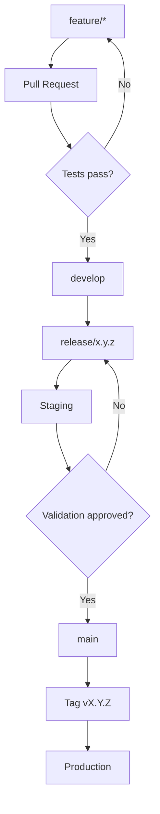
```mermaid
flowchart TD
  A["feature/*"] --> B["Pull Request"]
  B --> C{"Tests pass?"}
  C -->|"No"| A
  C -->|"Yes"| D["develop"]
  D --> E["release/x.y.z"]
  E --> F["Staging"]
  F --> G{"Validation approved?"}
  G -->|"No"| E
  G -->|"Yes"| H["main"]
  H --> I["Tag vX.Y.Z"]
  I --> J["Production"]
```

## 5.1.4.9. Trazabilidad del deployment

Cada versión desplegada deberá poder relacionarse con:

```text
Git Commit
    ↓
Pull Request
    ↓
Branch
    ↓
Release
    ↓
Semantic Version
    ↓
Deployment
```

Esto permite identificar qué cambios forman parte de una versión determinada y facilita la recuperación ante errores.

---

## 5.2. Landing Page, Services & Applications Implementation

### 5.2.1. Sprint 1

#### 5.2.1.1. Sprint Planning 1

| Campo                            | Detalle                                                                                                                                                                                                                                        |
|:---------------------------------|:-----------------------------------------------------------------------------------------------------------------------------------------------------------------------------------------------------------------------------------------------|
| Sprint #                         | 1                                                                                                                                                                                                                                              |
| Sprint Planning Background       | En este sprint se definió la base funcional de AgriDron Solutions con foco en la propuesta de valor del producto, la navegación inicial de la landing page y la estructura inicial del ecosistema web para agricultores y operadores técnicos. |
| Date                             | 15/09/2026                                                                                                                                                                                                                                     |
| Time                             | 18:30 PM                                                                                                                                                                                                                                       |
| Location                         | Reunión virtual (Google Meet / Zoom)                                                                                                                                                                                                           |
| Prepared By                      | Edwin Noe Nicho Huillcañahui                                                                                                                                                                                                                   |
| Attendees (to planning meeting)  | Italo Gianfranco Damacen Galindo, Edwin Noe Nicho Huillcañahui, Gabriel Ramírez Gutiérrez, Sebastián Leonardo Sayago Vidal, Alexander Felipe Vásquez Roncal                                                                                    |
| Sprint 1 - Review Summary        | Se validó la estructura inicial del producto, la claridad del valor para los agricultores, y la necesidad de crear una primera versión funcional de la landing page y la gestión básica de usuarios y fincas.                                  |
| Sprint 1 - Retrospective Summary | Se identificaron oportunidades para mejorar la coordinación del equipo, definir mejor la distribución de tareas y acelerar la integración entre frontend y backend en los siguientes sprint.                                                   |

#### Sprint Goal & User Stories

| Aspecto             | Descripción                                                                                                                                                                                              |
|:--------------------|:---------------------------------------------------------------------------------------------------------------------------------------------------------------------------------------------------------|
| Sprint 1 Goal       | Definir la base del producto AgriDron para que el usuario pueda entender la propuesta de valor, registrarse, iniciar sesión y gestionar los primeros datos de una finca y la programación de una misión. |
| Velocity            | 18                                                                                                                                                                                                       |
| Sum of Story Points | 18                                                                                                                                                                                                       |

Es muy importante que el equipo dedique atención a la identificación del Sprint Goal. Según el Scrum Guide, “El Sprint Goal es el objetivo individual del Sprint. Es un compromiso para los Developers, flexible en términos del trabajo exacto que se requiere para alcanzarlo. El Sprint Goal también crea coherencia y enfoque, buscando que los miembros del Scrum Team trabajen juntos en vez de ir en pos de iniciativas individuales.”

Para identificar el Sprint Goal, es recomendable enfocarse en el negocio (business) o la perspectiva de los usuarios (user-focused), como por ejemplo entregar un nuevo feature o feature set. Esta visión ayuda a priorizar lo esencial del sprint y a mantener alineado al equipo con el valor que se desea entregar.

Escribir objetivos SMART (Specific, Measurable, Attainable, Relevant, Time-bound) puede ser de mucha utilidad para que el equipo articule el Sprint Goal. La estructura propuesta por Scrum.org ofrece un ejemplo claro: “Our focus is on <Outcome> We believe it delivers <Impact> to <Customer(s)> This will be confirmed when <Event happens>”.

Por ejemplo, tomando como ejemplo un solo feature: “Our focus is on sending a basic email that contains a link to a spreadsheet. We believe it delivers confidence in the product to our organization. This will be confirmed when we have an email in an inbox”.

Es importante que el equipo se enfoque en identificar Outcome, Impact, Customer(s), así como Event. El solo hecho de aplicar el template no garantiza un buen Sprint Goal. El siguiente ejemplo es un uso incorrecto del template: “Our focus is on having SAP integrated into the Corporate system. We believe it delivers satisfaction and closure for our project manager. This will be confirmed when Epic SAP-123 is closed in Jira.” Aquí el Goal se está centrándose en el complimiento de un sistema interno, no en un valor observable para el usuario. Un mejor enfoque sería: “Our focus is on having a landing page that explains our new solution clearly and motivates sign-ups. We believe it delivers increased conversion and customer trust. This will be confirmed when the team receives at least 20 qualified leads from the demo landing page.”

Es recomendable que la redacción sea específica en términos de qué features se compromete a lograr y cómo benefician a los segmentos objetivo, sin detallar cómo. Algunos ejemplos de feature-sets con un enfoque de alto nivel:

- “A customer can place an order from a single-product catalog”.
- “Show a multi-product catalog”.
- “Show top-selling products”.
- “Make product catalog manageable for the sales department operator”.

Es muy importante que el equipo establezca en conjunto el Sprint Goal, pues de esa forma todo el equipo puede trabajar en identificar qué epics y stories deberían considerarse en principio en la iteración, en base a su contribución para ese Goal en particular.

A continuación, se presentan ejemplos de Sprint Goals. En cada ejemplo, se brinda un contexto previo para entender de mejor manera el propósito del Sprint Goal.

#### 5.2.1.2. Aspect Leaders and Collaborators

| Aspecto                              | Líder                            | Colaboradores                                          |
|:-------------------------------------|:---------------------------------|:-------------------------------------------------------|
| Product Strategy & Value Proposition | Italo Gianfranco Damacen Galindo | Sebastián Sayago Vidal, Gabriel Ramírez Gutiérrez      |
| UX / UI / Landing Page               | Sebastián Leonardo Sayago Vidal  | Alexander Felipe Vásquez Roncal, Italo Damacen Galindo |
| Backend / Services / Data Model      | Gabriel Ramírez Gutiérrez        | Edwin Noe Nicho Huillcañahui, Sebastián Sayago Vidal   |
| Testing / Validation / Evidence      | Edwin Noe Nicho Huillcañahui     | Alexander Vásquez Roncal, Gabriel Ramírez Gutiérrez    |

#### 5.2.1.3. Sprint Backlog 1

En esta sección se registra y explica el avance en términos de producto y trabajo colaborativo para el Sprint 1. Incluye las secciones internas de Sprint Planning 1, Aspect Leaders and Collaborators, Sprint Backlog 1, Development Evidence for Sprint Review, Execution Evidence for Sprint Review, Services Documentation Evidence for Sprint Review y Team Collaboration Insights during Sprint.

**Link del trello:** https://trello.com/invite/b/6aac1a270d8f45bc33ecd592/ATTIbc784176eb8dc497a26da32a3c554ea69211FF0D/agridron

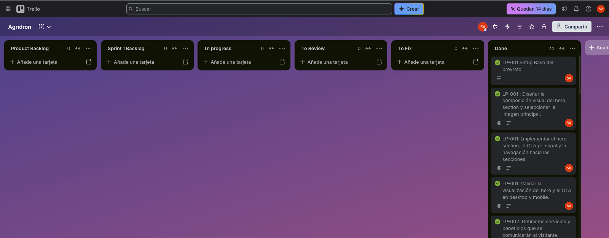


| ID     | User Story                                                                                                                                     | Tarea                                                                              | Responsable       | Estado |
|:-------|:-----------------------------------------------------------------------------------------------------------------------------------------------|:-----------------------------------------------------------------------------------|:------------------|:-------|
| LP-001 | Como visitante, quiero visualizar la propuesta de valor de AgriDron para entender rápidamente qué ofrece la solución.                          | Definir el mensaje principal y el público objetivo.                                | Italo Damacen     | Done   |
| LP-001 | Como visitante, quiero visualizar la propuesta de valor de AgriDron para entender rápidamente qué ofrece la solución.                          | Diseñar la composición visual del hero section y seleccionar la imagen principal.  | Sebastián Sayago  | Done   |
| LP-001 | Como visitante, quiero visualizar la propuesta de valor de AgriDron para entender rápidamente qué ofrece la solución.                          | Implementar el hero section, el CTA principal y la navegación hacia las secciones. | Sebastián Sayago  | Done   |
| LP-001 | Como visitante, quiero visualizar la propuesta de valor de AgriDron para entender rápidamente qué ofrece la solución.                          | Validar la visualización del hero y el CTA en desktop y mobile.                    | Edwin Nicho       | Done   |
| LP-002 | Como visitante, quiero observar los servicios principales de la plataforma para evaluar si responde a mis necesidades.                         | Definir los servicios y beneficios que se comunicarán al visitante.                | Italo Damacen     | Done   |
| LP-002 | Como visitante, quiero observar los servicios principales de la plataforma para evaluar si responde a mis necesidades.                         | Diseñar las tarjetas, iconos y jerarquía visual de la sección.                     | Alexander Vásquez | Done   |
| LP-002 | Como visitante, quiero observar los servicios principales de la plataforma para evaluar si responde a mis necesidades.                         | Implementar la sección de servicios con al menos tres opciones.                    | Sebastián Sayago  | Done   |
| LP-002 | Como visitante, quiero observar los servicios principales de la plataforma para evaluar si responde a mis necesidades.                         | Comprobar la legibilidad, orden y adaptación responsive de las tarjetas.           | Edwin Nicho       | Done   |
| LP-003 | Como visitante, quiero conocer los planes de precios y suscripción para tomar una decisión informada sobre la contratación del servicio.       | Definir los planes, precios y características que se mostrarán.                    | Italo Damacen     | Done   |
| LP-003 | Como visitante, quiero conocer los planes de precios y suscripción para tomar una decisión informada sobre la contratación del servicio.       | Diseñar la tabla o tarjetas comparativas de planes.                                | Alexander Vásquez | Done   |
| LP-003 | Como visitante, quiero conocer los planes de precios y suscripción para tomar una decisión informada sobre la contratación del servicio.       | Implementar la sección de planes y destacar la opción recomendada.                 | Sebastián Sayago  | Done   |
| LP-003 | Como visitante, quiero conocer los planes de precios y suscripción para tomar una decisión informada sobre la contratación del servicio.       | Verificar la claridad de precios, beneficios y CTA de cada plan.                   | Edwin Nicho       | Done   |
| LP-004 | Como visitante, quiero registrarme en la plataforma proporcionando mis datos básicos para acceder a las funcionalidades de la Web Application. | Definir el CTA de registro y su ubicación dentro de la landing page.               | Italo Damacen     | Done   |
| LP-004 | Como visitante, quiero registrarme en la plataforma proporcionando mis datos básicos para acceder a las funcionalidades de la Web Application. | Diseñar el formulario o modal de registro y sus estados visuales.                  | Alexander Vásquez | Done   |
| LP-004 | Como visitante, quiero registrarme en la plataforma proporcionando mis datos básicos para acceder a las funcionalidades de la Web Application. | Implementar el enlace y la navegación hacia el flujo de registro.                  | Gabriel Ramírez   | Done   |
| LP-004 | Como visitante, quiero registrarme en la plataforma proporcionando mis datos básicos para acceder a las funcionalidades de la Web Application. | Validar el CTA y la navegación de registro desde desktop y mobile.                 | Edwin Nicho       | Done   |
| LP-005 | Como visitante registrado, quiero iniciar sesión con mis credenciales para acceder a la Web Application.                                       | Definir el CTA de inicio de sesión en la navegación y en las secciones relevantes. | Italo Damacen     | Done   |
| LP-005 | Como visitante registrado, quiero iniciar sesión con mis credenciales para acceder a la Web Application.                                       | Diseñar el acceso visual al formulario de inicio de sesión.                        | Alexander Vásquez | Done   |
| LP-005 | Como visitante registrado, quiero iniciar sesión con mis credenciales para acceder a la Web Application.                                       | Implementar el enlace y la navegación hacia el flujo de inicio de sesión.          | Gabriel Ramírez   | Done   |
| LP-005 | Como visitante registrado, quiero iniciar sesión con mis credenciales para acceder a la Web Application.                                       | Comprobar que el CTA sea visible, accesible y responsive.                          | Edwin Nicho       | Done   |
| LP-006 | Como visitante, quiero acceder a los términos y condiciones de servicio para conocer las políticas de uso y privacidad.                        | Redactar y organizar el contenido de términos, condiciones y privacidad.           | Italo Damacen     | Done   |
| LP-006 | Como visitante, quiero acceder a los términos y condiciones de servicio para conocer las políticas de uso y privacidad.                        | Diseñar los enlaces legales y la estructura del footer.                            | Alexander Vásquez | Done   |
| LP-006 | Como visitante, quiero acceder a los términos y condiciones de servicio para conocer las políticas de uso y privacidad.                        | Implementar el footer y la navegación a las páginas legales.                       | Sebastián Sayago  | Done   |
| LP-006 | Como visitante, quiero acceder a los términos y condiciones de servicio para conocer las políticas de uso y privacidad.                        | Verificar los enlaces, el contraste y la lectura en dispositivos móviles.          | Edwin Nicho       | Done   |

#### 5.2.1.4. Development Evidence for Sprint Review

Durante este sprint se desarrolló la base del producto AgriDron con una landing page informativa, una estructura visual clara para servicios y un primer flujo de autenticación. Además, se inició la definición de los principales módulos de gestión de fincas y misiones, de acuerdo con la arquitectura propuesta en el proyecto.


La evidencia de desarrollo incluye la versión inicial del landing page, la propuesta visual del producto y la estructura base del sistema para registro, autenticación y gestión de misiones. En paralelo, se validó la consistencia con la propuesta de valor y los segmentos objetivo, reforzando la dirección de diseño del producto.

#### 5.2.1.5. Execution Evidence for Sprint Review

La ejecución del sprint se apoyó en reuniones de coordinación semanales, revisión de avances por módulo y validación de tareas cumplidas por cada miembro del equipo. Se utilizó la división por áreas para mantener flujo de trabajo constante y reducir bloqueos en frontend, backend y documentación.

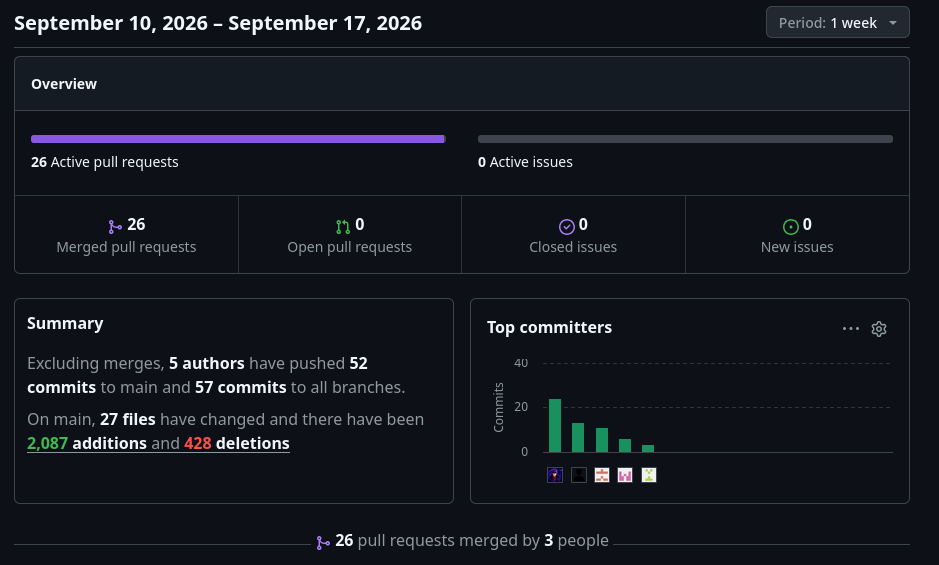

Se evidenció avance continuo en la implementación de la landing page, la estructura de la aplicación web y la definición del backend base. Además, el equipo registró avances parciales en el flujo de autenticación y en la gestión inicial de misiones, con seguimiento directo del estado de cada story.

#### 5.2.1.6. Services Documentation Evidence for Sprint Review

Se documentó la arquitectura inicial del sistema, sus componentes principales y el alcance funcional del primer sprint. La documentación cubrió los servicios propuestos para la solución, así como la relación entre la landing page, la aplicación web y el backend.

La evidencia documental del sprint se centra en:

- Definición del alcance del producto en la landing page.
- Arquitectura de componentes del sistema AgriDron.
- Reglas base de gestión para autenticación y gestión de fincas.
- Descripción de servicios web previstos para la lógica de negocio inicial.

#### 5.2.1.7. Software Deployment Evidence for Sprint Review

La primera entrega del sprint contempló la preparación de la infraestructura base del proyecto y la configuración inicial para la publicación del producto. Se establecieron los repositorios y la estructura de trabajo para permitir la evolución del proyecto en sprints posteriores.

La evidencia de despliegue inicial incluye la preparación del entorno de desarrollo, la estructura del código por módulos y la base para publicación de la landing page y los servicios web de la aplicación.


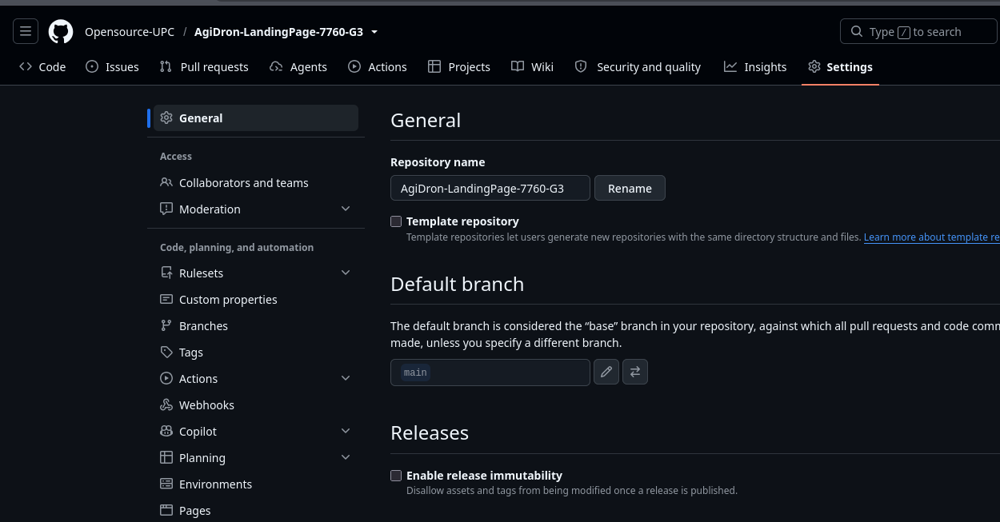

En esta imagen podemos apreciar la configuración inicial de despliegue, nos hubicamos en settings/pages.

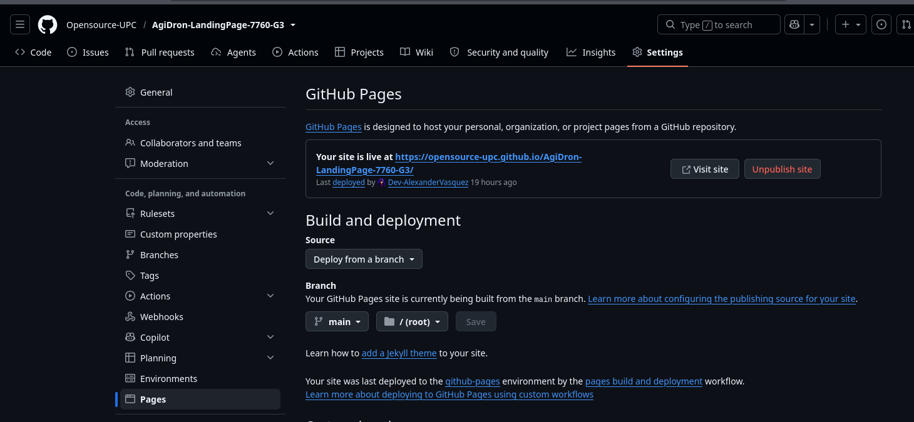

**Link del landing page:** https://opensource-upc.github.io/AgiDron-LandingPage-7760-G3/

#### 5.2.1.8. Team Collaboration Insights during Sprint

La colaboración del equipo se desarrolló con un enfoque distribuido por responsabilidades, pero con coordinación constante y revisión cruzada de entregables. La comunicación fue clave para mantener alineado el producto con la misión de AgriDron, especialmente en la definición del valor para el usuario y la priorización de funcionalidades del primer sprint.

El equipo trabajó de forma complementaria en tres dimensiones: la propuesta de valor y UX, la implementación técnica del sistema y la documentación del proyecto. Esta organización permitió avanzar en paralelo, reducir tiempos de espera y mantener una cultura de colaboración abierta, donde cada integrante asumió responsabilidades claras y contribuyó a la entrega del primer ciclo incremental.


---

## 5.3. Validation Interviews

### 5.3.1. Interview Design

[DESCRIBIR EL DISEÑO DE LAS ENTREVISTAS DE VALIDACIÓN.]

### 5.3.2. Interview Registry

[REGISTRAR LAS ENTREVISTAS DE VALIDACIÓN.]

### 5.3.3. Heuristic Evaluations

[PEGAR AQUÍ LOS RESULTADOS DE LAS EVALUACIONES HEURÍSTICAS.]

---

## 5.4. Video About-the-Product

**Enlace al video:**

[PEGAR AQUÍ EL ENLACE AL VIDEO]

**Descripción:**

[DESCRIBIR BREVEMENTE EL CONTENIDO DEL VIDEO.]

---

## Conclusiones y recomendaciones
 
<p align="justify">
 
Esta sección presenta una <strong>primera versión (avance AV1)</strong> de las conclusiones del proyecto. En esta etapa del ciclo de vida, el equipo ha completado el Capítulo I (Introducción y Lean UX Process), el Capítulo II (Requirements Elicitation & Analysis), el Capítulo III (Requirements Specification) y el Capítulo IV (Product Design), además de iniciar el Capítulo V con la configuración del entorno de desarrollo y el primer Sprint. Dado que aún no se han ejecutado las Validation Interviews (5.3) ni se cuenta con una versión funcional completa de la Web Application y el RESTful API, las conclusiones aquí presentadas son de carácter <strong>preliminar y de diseño</strong>, contrastando los artefactos elaborados contra los Problem Statements, Assumptions e Hypothesis Statements definidos en el Lean UX Process (1.2.2), y no todavía contra resultados de uso real. Esta sección se expandirá en las siguientes entregas (TB1, AV2, TB2) con hallazgos provenientes de las entrevistas de validación y del producto desplegado.
 
</p>
 
<p align="justify">
 
Respecto a los <strong>Problem Statements</strong> (1.2.2.1), el proceso de Needfinding (2.2 y 2.3) confirmó que los cuatro problemas planteados —gestión dispersa de fincas y parcelas, ausencia de sustento técnico para decisiones climáticas, falta de visibilidad del estado del dron durante el vuelo y dificultad para consultar el historial de operaciones— corresponden a fricciones reales identificadas en las entrevistas y representadas en el User Journey Map (2.3.3) y el Empathy Map (2.3.4) de Diego Mendoza Ríos. Esto es consistente con la literatura revisada: García-Munguía et al. (2024) documentan que la adopción de drones agrícolas aún enfrenta brechas operativas en la planificación y el control de las aplicaciones de fumigación, mientras que la FAO (s. f.) enmarca la protección vegetal como un proceso que requiere información oportuna para la toma de decisiones, lo cual respalda la necesidad identificada en el Problem Statement 2 sobre la consulta de condiciones meteorológicas antes de una misión.
 
</p>
 
<p align="justify">
 
Respecto a las <strong>Assumptions</strong> (1.2.2.2), estas se mantienen como creencias no validadas al cierre de esta entrega. El equipo tradujo dichas suposiciones en decisiones concretas de diseño: la gestión de fincas y parcelas se refleja en el modelo de dominio de Field Management (4.7.1.1), la consulta meteorológica en el componente de Weather Integration (4.6.4.3), y el monitoreo del dron en el Wireflow y los Mock-ups de la sección 4.4. Sin embargo, ninguna de estas decisiones ha sido puesta a prueba frente a usuarios reales fuera de las entrevistas de needfinding, por lo que la validación formal de estas asunciones queda pendiente para la sección 5.3 (Validation Interviews).
 
</p>
 
<p align="justify">
 
Respecto a los <strong>Hypothesis Statements</strong> (1.2.2.3), los cuatro enunciados definidos —reducción del tiempo y costo de fumigación, menor tiempo de respuesta ante infestaciones, mayor adopción por facilidad de uso, y mejor toma de decisiones a partir de reportes automatizados— dependen de features que a la fecha de esta entrega están diseñadas (User Stories, Wireframes, Mock-ups, Class Diagrams y Database Diagrams) pero no implementadas ni medidas. Cabe precisar que, dado el alcance académico del curso, el monitoreo de drones se sustentará en datos simulados y no en telemetría real, tal como se indicó en las Assumptions (1.2.2.2); por ello, hipótesis como la reducción del 40% en tiempo y costo de fumigación —cifra de referencia contrastada con estudios como el de Safaeinejad et al. (2025), quienes reportan reducciones de huella ambiental y energética al comparar la fumigación con drones frente a métodos convencionales— no podrán validarse con datos operativos reales dentro del ciclo de vida del curso, sino que se tratarán como una meta de referencia para el diseño de las funcionalidades.
 
</p>
 
<p align="justify">
 
En cuanto al <strong>trabajo de diseño</strong> (Capítulos II a IV), se logró trazabilidad entre los distintos artefactos: los hotspots identificados en el Big Picture EventStorming (2.4) se resolvieron como rutas alternativas explícitas en el User Flow Diagram (4.4.4), y el Design-Level EventStorming (4.6.1) junto con los Class Diagrams (4.7.1) se tradujeron de forma consistente en el Database Diagram (4.8.1). Esta trazabilidad de extremo a extremo —desde la necesidad detectada en needfinding hasta el modelo de base de datos— es el principal resultado tangible de esta primera entrega.
 
</p>

---

# Bibliografía

> Fuentes utilizadas, registradas siguiendo el formato APA 7ª edición, en orden alfabético por apellido del primer autor.

1. García-Munguía, A., Guerra-Ávila, P. L., Islas-Ojeda, E., Flores-Sánchez, J. L., Vázquez-Martínez, O., García-Munguía, A. M., & García-Munguía, O. (2024). A review of drone technology and operation processes in agricultural crop spraying. *Drones*, *8*(11), 674. https://doi.org/10.3390/drones8110674

2. Organización de las Naciones Unidas para la Alimentación y la Agricultura. (s. f.). *Acerca de producción y protección vegetal*. FAO. Recuperado el 21 de febrero de 2025, de https://www.fao.org/plant-production-protection/about/es

3. Safaeinejad, M., Karami, H., Ranjbar, S., Bakhoda, H., & Ahmadi, E. (2025). Reducing energy and environmental footprint in agriculture: A study on drone spraying vs conventional methods. *PLOS ONE*, *20*(9), e0323779. https://doi.org/10.1371/journal.pone.0323779

4. Zhang, Y., Li, H., Torres-Sánchez, J., & García, C. (2024). Drones in precision agriculture: A comprehensive review of applications, technologies, and challenges. *Drones*, *8*(11), 686. https://doi.org/10.3390/drones8110686

---

# Anexos

## Anexo A: Evidencias adicionales

**Enlace de miro:** https://miro.com/app/board/uXjVHnbT8O4=/?share_link_id=439115746776

**Link LandingPague:** https://opensource-upc.github.io/AgiDron-LandingPage-7760-G3/

**Link PPT:** https://canva.link/zzlw6fefxwlie78

**Link GitHub:** https://github.com/Opensource-UPC/1ASI0729-2620-7760-G3-Agridron-Report#31-user-stories

## Anexo B: Videos de Exposiciones

**Video de exposición:** [ENLACE]

## Anexo C: Otros

[AGREGAR OTROS ANEXOS SI CORRESPONDE.]
