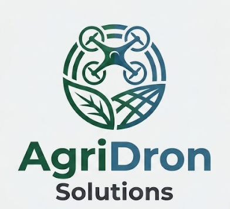
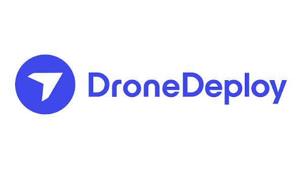

## **Universidad Peruana de Ciencias Aplicadas**
### Carrera de Ingeniería de Software
 

**Curso: Desarrollo de Aplicaciones Open Source**

**NRC: [7760]**

**Docente: [Flores Moroco, Juan Antonio]**
 

### **Informe del Trabajo Final**

**Nombre de la Startup:** [Holonix]

**Nombre del producto:** [AgriDron Solutions]
 

### **Integrantes**

<table align="center" style="border-collapse: collapse; border: none; margin-left: auto; margin-right: auto;">
    <tr>
        <th style="border: none; padding: 0 18px 6px 0; text-align: center;">Código</th>
        <th style="border: none; padding: 0 0 6px 0; text-align: center;">Apellidos y Nombres</th>
    </tr>
    <tr>
        <td style="border: none; padding: 0 18px 4px 0; text-align: center;">[CÓDIGO]</td>
        <td style="border: none; padding: 0 0 4px 0; text-align: center;">[APELLIDOS Y NOMBRES]</td>
    </tr>
    <tr>
        <td style="border: none; padding: 0 18px 4px 0; text-align: center;">[U20241G306]</td>
        <td style="border: none; padding: 0 0 4px 0; text-align: center;">[Nicho Huillcañahui , Edwin Noe]</td>
    </tr>
    <tr>
        <td style="border: none; padding: 0 18px 4px 0; text-align: center;">[CÓDIGO]</td>
        <td style="border: none; padding: 0 0 4px 0; text-align: center;">[APELLIDOS Y NOMBRES]</td>
    </tr>
    <tr>
        <td style="border: none; padding: 0 18px 4px 0; text-align: center;">[CÓDIGO]</td>
        <td style="border: none; padding: 0 0 4px 0; text-align: center;">[APELLIDOS Y NOMBRES]</td>
    </tr>
    <tr>
        <td style="border: none; padding: 0 18px 4px 0; text-align: center;">[CÓDIGO]</td>
        <td style="border: none; padding: 0 0 4px 0; text-align: center;">[APELLIDOS Y NOMBRES]</td>
    </tr>
    <tr>
        <td style="border: none; padding: 0 18px 4px 0; text-align: center;">[CÓDIGO]</td>
        <td style="border: none; padding: 0 0 4px 0; text-align: center;">[APELLIDOS Y NOMBRES]</td>
    </tr>
</table>
 

<b><i>Septiembre, 2026</i></b>

 

---

## Registro de Versiones

| Versión | Fecha | Autor | Descripción |
| :--- | :--- | :--- | :--- |
| 0.1.0 | 05/09/2026 | Sebastián Sayago | Creación inicial del documento. |
| 0.2.0 | 06/09/2026 | Sebastián Sayago | Implementación inicial del capitulo 1 |

---

# Contenido

## Tabla de Contenido

- [Contenido](#contenido)
  - [Tabla de Contenido](#tabla-de-contenido)
  - [Student Outcome](#student-outcome)
  - [Capítulo I: Introducción](#capítulo-i-introducción)
    - [1.1. Startup Profile](#11-startup-profile)
      - [1.1.1. Descripción de la Startup](#111-descripción-de-la-startup)
      - [1.1.2. Perfiles de integrantes del equipo](#112-perfiles-de-integrantes-del-equipo)
    - [1.2. Solution Profile](#12-solution-profile)
      - [1.2.1. Antecedentes y problemática](#121-antecedentes-y-problemática)
      - [1.2.2. Lean UX Process](#122-lean-ux-process)
        - [1.2.2.1. Lean UX Problem Statements](#1221-lean-ux-problem-statements)
        - [1.2.2.2. Lean UX Assumptions](#1222-lean-ux-assumptions)
        - [1.2.2.3. Lean UX Hypothesis Statements](#1223-lean-ux-hypothesis-statements)
        - [1.2.2.4. Lean UX Canvas](#1224-lean-ux-canvas)
    - [1.3. Segmentos objetivo](#13-segmentos-objetivo)
  - [Capítulo II: Requirements Elicitation & Analysis](#capítulo-ii-requirements-elicitation--analysis)
    - [2.1. Competidores](#21-competidores)
      - [2.1.1. Análisis competitivo](#211-análisis-competitivo)
      - [2.1.2. Estrategias y tácticas frente a competidores](#212-estrategias-y-tácticas-frente-a-competidores)
    - [2.2. Entrevistas](#22-entrevistas)
      - [2.2.1. Diseño de entrevistas](#221-diseño-de-entrevistas)
      - [2.2.2. Registro de entrevistas](#222-registro-de-entrevistas)
      - [2.2.3. Análisis de entrevistas](#223-análisis-de-entrevistas)
    - [2.3. Needfinding](#23-needfinding)
      - [2.3.1. User Personas](#231-user-personas)
      - [2.3.2. User Task Matrix](#232-user-task-matrix)
      - [2.3.3. User Journey Mapping](#233-user-journey-mapping)
      - [2.3.4. Empathy Mapping](#234-empathy-mapping)
    - [2.4. Big Picture EventStorming](#24-big-picture-eventstorming)
    - [2.5. Ubiquitous Language](#25-ubiquitous-language)
  - [Capítulo III: Requirements Specification](#capítulo-iii-requirements-specification)
    - [3.1. User Stories](#31-user-stories)
    - [3.2. Impact Mapping](#32-impact-mapping)
    - [3.3. Product Backlog](#33-product-backlog)
  - [Capítulo IV: Product Design](#capítulo-iv-product-design)
    - [4.1. Style Guidelines](#41-style-guidelines)
      - [4.1.1. General Style Guidelines](#411-general-style-guidelines)
      - [4.1.2. Web Style Guidelines](#412-web-style-guidelines)
    - [4.2. Information Architecture](#42-information-architecture)
      - [4.2.1. Organization Systems](#421-organization-systems)
      - [4.2.2. Labeling Systems](#422-labeling-systems)
      - [4.2.3. SEO Tags and Meta Tags](#423-seo-tags-and-meta-tags)
      - [4.2.4. Searching Systems](#424-searching-systems)
      - [4.2.5. Navigation Systems](#425-navigation-systems)
    - [4.3. Landing Page UI Design](#43-landing-page-ui-design)
      - [4.3.1. Landing Page Wireframe](#431-landing-page-wireframe)
      - [4.3.2. Landing Page Mock-up](#432-landing-page-mock-up)
    - [4.4. Web Applications UX/UI Design](#44-web-applications-uxui-design)
      - [4.4.1. Web Applications Wireframes](#441-web-applications-wireframes)
      - [4.4.2. Web Applications Wireflow Diagrams](#442-web-applications-wireflow-diagrams)
      - [4.4.3. Web Applications Mock-ups](#443-web-applications-mock-ups)
      - [4.4.4. Web Applications User Flow Diagrams](#444-web-applications-user-flow-diagrams)
    - [4.5. Web Applications Prototyping](#45-web-applications-prototyping)
    - [4.6. Domain-Driven Software Architecture](#46-domain-driven-software-architecture)
      - [4.6.1. Design-Level Event Storming](#461-design-level-event-storming)
      - [4.6.2. Software Architecture Context Diagram](#462-software-architecture-context-diagram)
      - [4.6.3. Software Architecture Container Diagrams](#463-software-architecture-container-diagrams)
      - [4.6.4. Software Architecture Components Diagrams](#464-software-architecture-components-diagrams)
    - [4.7. Software Object-Oriented Design](#47-software-object-oriented-design)
      - [4.7.1. Class Diagrams](#471-class-diagrams)
    - [4.8. Database Design](#48-database-design)
      - [4.8.1. Database Diagrams](#481-database-diagrams)
  - [Capítulo V: Product Implementation, Validation & Deployment](#capítulo-v-product-implementation-validation--deployment)
    - [5.1. Software Configuration Management](#51-software-configuration-management)
      - [5.1.1. Software Development Environment Configuration](#511-software-development-environment-configuration)
      - [5.1.2. Source Code Management](#512-source-code-management)
      - [5.1.3. Source Code Style Guide & Conventions](#513-source-code-style-guide--conventions)
      - [5.1.4. Software Deployment Configuration](#514-software-deployment-configuration)
    - [5.2. Landing Page, Services & Applications Implementation](#52-landing-page-services--applications-implementation)
      - [5.2.1. Sprint 1](#521-sprint-1)
        - [5.2.1.1. Sprint Planning 1](#5211-sprint-planning-1)
        - [5.2.1.2. Aspect Leaders and Collaborators](#5212-aspect-leaders-and-collaborators)
        - [5.2.1.3. Sprint Backlog 1](#5213-sprint-backlog-1)
        - [5.2.1.4. Development Evidence for Sprint Review](#5214-development-evidence-for-sprint-review)
        - [5.2.1.5. Execution Evidence for Sprint Review](#5215-execution-evidence-for-sprint-review)
        - [5.2.1.6. Services Documentation Evidence for Sprint Review](#5216-services-documentation-evidence-for-sprint-review)
        - [5.2.1.7. Software Deployment Evidence for Sprint Review](#5217-software-deployment-evidence-for-sprint-review)
        - [5.2.1.8. Team Collaboration Insights during Sprint](#5218-team-collaboration-insights-during-sprint)
    - [5.3. Validation Interviews](#53-validation-interviews)
      - [5.3.1. Interview Design](#531-interview-design)
      - [5.3.2. Interview Registry](#532-interview-registry)
      - [5.3.3. Heuristic Evaluations](#533-heuristic-evaluations)
    - [5.4. Video About-the-Product](#54-video-about-the-product)
  - [Conclusiones](#conclusiones)
  - [Bibliografía](#bibliografía)
  - [Anexos](#anexos)

---

## Student Outcome

> **[PEGAR AQUÍ EL STUDENT OUTCOME CORRESPONDIENTE A LA ENTREGA]**
>
> **Criterio:** [PEGAR AQUÍ EL CRITERIO]
>
> En el siguiente cuadro se describe las acciones realizadas y enunciados de conclusiones por parte del grupo, que permiten sustentar el haber alcanzado el logro del Student Outcome.

<table>
  <thead>
    <tr>
      <th>Criterio específico</th>
      <th>Acciones realizadas</th>
      <th>Conclusiones</th>
    </tr>
  </thead>
  <tbody>
    <tr>
      <td><strong>[CRITERIO ESPECÍFICO 1]</strong></td>
      <td>
        
<b>[INTEGRANTE 1]</b> 

        
<em><b>AV1</b></em> [ACCIÓN REALIZADA]

         
        <b>[INTEGRANTE 2]</b> 
        <em><b>AV1</b></em> [ACCIÓN REALIZADA]
          
        <b>[REPETIR PARA TODOS LOS INTEGRANTES]</b>
      </td>
      <td>[CONCLUSIÓN]</td>
    </tr>
    <tr>
      <td><strong>[CRITERIO ESPECÍFICO 2]</strong></td>
      <td>
        
<b>[INTEGRANTE 1]</b> 

        
<em><b>AV1</b></em> [ACCIÓN REALIZADA]

         
        <b>[INTEGRANTE 2]</b> 
        <em><b>AV1</b></em> [ACCIÓN REALIZADA]
          
        <b>[REPETIR PARA TODOS LOS INTEGRANTES]</b>
      </td>
      <td>[CONCLUSIÓN]</td>
    </tr>
  </tbody>
</table>

---

# Capítulo I: Introducción

## 1.1. Startup Profile

### 1.1.1. Descripción de la Startup

<strong>AgriDron Solutions</strong> es una startup orientada al desarrollo de soluciones tecnológicas para el sector agrícola, enfocada en mejorar la planificación y el monitoreo de operaciones de fumigación mediante drones. La startup busca centralizar en una plataforma web las principales actividades relacionadas con estas operaciones, facilitando la gestión de parcelas, la planificación de misiones, la consulta de condiciones meteorológicas y el seguimiento de las operaciones realizadas.

La propuesta de AgriDron Solutions consiste en desarrollar una plataforma web que permita a los agricultores registrar y administrar sus fincas y parcelas, seleccionar mediante un mapa interactivo el área que desean fumigar, crear y gestionar misiones de fumigación y consultar información meteorológica mediante una API externa. Asimismo, la plataforma contará con un módulo de monitoreo que permitirá visualizar el estado y la ubicación de los drones durante una misión mediante datos inicialmente simulados.

Finalmente, la solución permitirá consultar el historial de las misiones realizadas y generar reportes de las operaciones, además de manejar diferentes roles de usuario, como agricultor, operador y técnico.

Misión: [DEFINIR MISIÓN DE AGRIDRON SOLUTIONS]

Visión: [DEFINIR VISIÓN DE AGRIDRON SOLUTIONS]

Valores:

<ul> <li>[VALOR 1]</li> 
    <li>[VALOR 2]</li> 
    <li>[VALOR 3]</li> 
    <li>[VALOR 4]</li> 
</ul>

### 1.1.2. Perfiles de integrantes del equipo

> Para cada integrante, colocar foto, nombre, código, descripción y aporte/rol dentro del proyecto.

<table>
  <tr>
    <td rowspan="4" align="center">
      
    </td>
  </tr>
  <tr>
    <td><b>Nombre:</b> [NOMBRE COMPLETO]</td>
  </tr>
  <tr>
    <td><b>Código:</b> [CÓDIGO]</td>
  </tr>
  <tr>
    <td>
      <b>Descripción:</b> 
      [DESCRIPCIÓN DEL PERFIL, CONOCIMIENTOS Y HABILIDADES.]
        
      [APORTE Y FUNCIÓN DENTRO DEL EQUIPO.]
    </td>
  </tr>
    <tr>
    <td rowspan="4" align="center">
      
    </td>
  </tr>
  <tr>
    <td><b>Nombre:</b> [NOMBRE COMPLETO]</td>
  </tr>
  <tr>
    <td><b>Código:</b> [CÓDIGO]</td>
  </tr>
  <tr>
    <td>
      <b>Descripción:</b> 
      [DESCRIPCIÓN DEL PERFIL, CONOCIMIENTOS Y HABILIDADES.]
        
      [APORTE Y FUNCIÓN DENTRO DEL EQUIPO.]
    </td>
  </tr>
    <tr>
    <td rowspan="4" align="center">
      
    </td>
  </tr>
  <tr>
    <td><b>Nombre:</b> [NOMBRE COMPLETO]</td>
  </tr>
  <tr>
    <td><b>Código:</b> [CÓDIGO]</td>
  </tr>
  <tr>
    <td>
      <b>Descripción:</b> 
      [DESCRIPCIÓN DEL PERFIL, CONOCIMIENTOS Y HABILIDADES.]
        
      [APORTE Y FUNCIÓN DENTRO DEL EQUIPO.]
    </td>
  </tr>
    <tr>
    <td rowspan="4" align="center">
      
    </td>
  </tr>
  <tr>
    <td><b>Nombre:</b> [NOMBRE COMPLETO]</td>
  </tr>
  <tr>
    <td><b>Código:</b> [CÓDIGO]</td>
  </tr>
  <tr>
    <td>
      <b>Descripción:</b> 
      [DESCRIPCIÓN DEL PERFIL, CONOCIMIENTOS Y HABILIDADES.]
        
      [APORTE Y FUNCIÓN DENTRO DEL EQUIPO.]
    </td>
  </tr>
    <tr>
    <td rowspan="4" align="center">
      
    </td>
  </tr>
  <tr>
    <td><b>Nombre:</b> [NOMBRE COMPLETO]</td>
  </tr>
  <tr>
    <td><b>Código:</b> [CÓDIGO]</td>
  </tr>
  <tr>
    <td>
      <b>Descripción:</b> 
      [DESCRIPCIÓN DEL PERFIL, CONOCIMIENTOS Y HABILIDADES.]
        
      [APORTE Y FUNCIÓN DENTRO DEL EQUIPO.]
    </td>
  </tr>
</table>

 

[REPETIR BLOQUE PARA CADA INTEGRANTE.]

---

## 1.2. Solution Profile

<strong>AgriDron Solutions</strong> propone una plataforma web para la planificación y monitoreo de operaciones de fumigación agrícola mediante drones. La solución busca centralizar las actividades que intervienen en una operación, desde la gestión de las fincas y parcelas hasta la creación, seguimiento y consulta posterior de las misiones.

El usuario podrá registrar sus fincas y parcelas, seleccionar mediante un mapa interactivo el área que desea fumigar y crear una misión de fumigación. Antes de realizar la operación, podrá consultar las condiciones meteorológicas mediante una API externa. Durante la misión, el sistema permitirá visualizar el estado y ubicación del dron utilizando inicialmente datos simulados. Posteriormente, el usuario podrá consultar el historial y los reportes de las operaciones realizadas.

### 1.2.1. Antecedentes y problemática

1.2.1.1. What

El problema se relaciona con la planificación y monitoreo de operaciones de fumigación agrícola mediante drones. Estas operaciones requieren gestionar información sobre las fincas y parcelas, definir el área que será fumigada, planificar las misiones, consultar las condiciones meteorológicas y realizar un seguimiento de la operación.

Actualmente, estas actividades pueden requerir coordinación manual y el uso de diferentes medios para gestionar la información relacionada con una misión, dificultando su centralización y seguimiento.

1.2.1.2. Where

La problemática se presenta en el contexto de las operaciones agrícolas en las que se utilizan drones para realizar actividades de fumigación sobre diferentes fincas y parcelas.

1.2.1.3. When

La problemática se presenta principalmente durante las diferentes etapas de una operación de fumigación: al planificar una misión, definir el área que será fumigada, verificar las condiciones meteorológicas, realizar el seguimiento de la misión y consultar posteriormente la información de la operación.

1.2.1.4. Who

Los principales usuarios involucrados son los agricultores responsables de gestionar las operaciones de fumigación, así como los operadores y técnicos relacionados con la ejecución y supervisión de las misiones mediante drones.

1.2.1.5. Why

La problemática surge debido a la necesidad de coordinar diferentes actividades e información asociadas a una operación de fumigación. La gestión separada de las parcelas, áreas de fumigación, condiciones meteorológicas, misiones y seguimiento de los drones puede dificultar la organización y consulta de la información.

1.2.1.6. How

AgriDron Solutions abordará esta problemática mediante una plataforma web que centralice la gestión de fincas y parcelas, la definición de áreas de fumigación mediante un mapa interactivo, la creación y gestión de misiones, la consulta de información meteorológica mediante una API externa, el monitoreo simulado de los drones y la consulta de reportes e historial de operaciones.

1.2.1.7. How much

[DEFINIR MODELO DE NEGOCIO, COSTOS, PRECIOS, PROYECCIONES U OTROS ASPECTOS ECONÓMICOS DE AGRIDRON SOLUTIONS.]

### 1.2.2. Lean UX Process

#### 1.2.2.1. Lean UX Problem Statements

**Problem Statement 1**

[PEGAR AQUÍ EL PROBLEM STATEMENT.]

**Problem Statement 2**

[PEGAR AQUÍ EL PROBLEM STATEMENT.]

[AGREGAR MÁS SI CORRESPONDE.]

#### 1.2.2.2. Lean UX Assumptions

**1.2.2.2.1. ¿Quién es el usuario?**

[RESPUESTA.]

**1.2.2.2.2. ¿Dónde encaja nuestro producto en su trabajo o vida?**

[RESPUESTA.]

**1.2.2.2.3. ¿Qué problemas tiene nuestro producto y cómo se pueden resolver?**

<ul>
  <li>[PROBLEMA / SOLUCIÓN]</li>
  <li>[PROBLEMA / SOLUCIÓN]</li>
</ul>

**1.2.2.2.4. ¿Cuándo y cómo es usado nuestro producto?**

[RESPUESTA.]

**1.2.2.2.5. ¿Qué características son importantes?**

<ul>
  <li>[CARACTERÍSTICA 1]</li>
  <li>[CARACTERÍSTICA 2]</li>
  <li>[CARACTERÍSTICA 3]</li>
</ul>

**1.2.2.2.6. ¿Cómo debe verse nuestro producto y cómo debe comportarse?**

[RESPUESTA.]

**1.2.2.2.7. Business Outcomes**

<ul>
  <li>[BUSINESS OUTCOME 1]</li>
  <li>[BUSINESS OUTCOME 2]</li>
  <li>[BUSINESS OUTCOME 3]</li>
</ul>

**1.2.2.2.8. User Outcomes**

<ul>
  <li>[USER OUTCOME 1]</li>
  <li>[USER OUTCOME 2]</li>
  <li>[USER OUTCOME 3]</li>
</ul>

**1.2.2.2.9. Features**

<ul>
  <li>[FEATURE 1]</li>
  <li>[FEATURE 2]</li>
  <li>[FEATURE 3]</li>
</ul>

#### 1.2.2.3. Lean UX Hypothesis Statements

**Hypothesis Statement 1**

[PEGAR AQUÍ LA HIPÓTESIS.]

**Hypothesis Statement 2**

[PEGAR AQUÍ LA HIPÓTESIS.]

[AGREGAR MÁS SI CORRESPONDE.]

#### 1.2.2.4. Lean UX Canvas

**Descripción:**

[EXPLICAR BREVEMENTE EL LEAN UX CANVAS.]

### 1.3. Segmentos objetivo

#### 1.3.1. [SEGMENTO OBJETIVO 1]

[DESCRIPCIÓN DEL SEGMENTO, NECESIDADES Y RELACIÓN CON LA SOLUCIÓN.]

#### 1.3.2. [SEGMENTO OBJETIVO 2]

[DESCRIPCIÓN DEL SEGMENTO, NECESIDADES Y RELACIÓN CON LA SOLUCIÓN.]

[AGREGAR MÁS SEGMENTOS SI CORRESPONDE.]

---

# Capítulo II: Requirements Elicitation & Analysis

## 2.1. Competidores

Para validar la propuesta de valor de AgriDron Solutions y asegurar un posicionamiento estratégico diferenciado en el sector agro-tecnológico, se ha realizado una investigación exhaustiva de las soluciones digitales existentes en el mercado. A continuación, se detallan los tres principales competidores identificados, analizando su modelo operativo, funcionalidades clave y alcance en el soporte a las labores agrícolas:

*   **DroneDeploy:** Plataforma en la nube especializada en la captura, procesamiento y análisis de datos geoespaciales mediante drones. En el sector agrícola, opera permitiendo la planificación automatizada de vuelos sobre campos de cultivo y el procesamiento de mapas ortomosaicos e índices de vegetación (NDVI) para la detección de anomalías en los lotes. Su funcionamiento se basa en la sincronización de hardware comercial con su software web para generar reportes analíticos de salud vegetal y coordinar cuadrillas de trabajo.
*   **Climate FieldView:** Plataforma digital integral de gestión agronómica desarrollada por The Climate Corporation (división digital de Bayer). Funciona mediante la recopilación e integración de datos generados por sensores climáticos, satélites y maquinaria terrestre conectada al puerto de diagnóstico (FieldView Drive). Su software permite a los productores monitorear el desarrollo de sus campos, generar prescripciones variables de siembra y fertilizantes, y consultar datos meteorológicos hiperlocales para la toma de decisiones preventivas en campo.
*   **Agrivi:** Software integral de gestión de explotaciones agrícolas (Farm Management Software - FMS) basado en el modelo SaaS en la nube. Su funcionamiento abarca la planificación completa de labores agrícolas, administración de inventarios de insumos químicos, trazabilidad de cosechas y registro de costos de producción. Además, integra alertas meteorológicas basadas en modelos predictivos para advertir sobre el riesgo de plagas y enfermedades, permitiendo llevar una bitácora detallada de las actividades de campo.

### 2.1.1. Análisis competitivo

A continuación, se presenta el Competitive Analysis Landscape, cuyo objetivo es contrastar objetivamente las capacidades, fortalezas, debilidades y modelos comerciales de AgriDron Solutions frente a los competidores analizados:

#### Competitive Analysis Landscape

| Criterio | AgriDron Solutions | DroneDeploy | Climate FieldView | Agrivi |
| :--- | :--- | :--- | :--- | :--- |
| **¿Por qué llevar a cabo este análisis?** | El objetivo de este análisis es evaluar las soluciones digitales agropecuarias actuales para identificar brechas de mercado, validar nuestra ventaja competitiva en la planificación y monitoreo de fumigación con drones, y estructurar una oferta accesible para pequeños y medianos agricultores. | Analizar al referente global en gestión de operaciones y mapas con drones en la nube. | Evaluar al líder en analítica agronómica, clima y prescripción digital de insumos. | Analizar al líder SaaS en gestión administrativa, trazabilidad y control fitosanitario de campos. |
| **Logo / Identificador** |  |  |  |  |
| **Perfil** | Plataforma web distribuida e interoperable diseñada para la planificación sobre mapas interactivos, validación climática vía API externa y simulación de telemetría para operaciones de fumigación con drones. | Plataforma empresarial de software para mapeo aéreo, fotogrametría 3D y análisis multiespectral con drones. | Plataforma digital corporativa enfocada en la recolección masiva de datos agronómicos terrestres y satelitales. | Sistema integral de planificación de recursos agrícolas (Farm ERP) en la nube enfocado en gestión y cumplimiento normativo. |
| **Ventaja competitiva** | Plataforma web abierta e intuitiva que integra delimitación de polígonos, consulta meteorológica en tiempo real y seguimiento de drones sin ataduras a hardware propietario. | Algoritmos líderes de procesamiento rápido de ortomosaicos y amplia compatibilidad con marcas de drones comerciales. | Respaldo y validación agronómica global de Bayer, con integración directa a maquinaria pesada y satélites. | Módulo exhaustivo de trazabilidad agrícola, cumplimiento de certificaciones internacionales y gestión financiera del cultivo. |
| **¿Qué valor ofrece a los clientes?** | Automatización accesible del flujo de fumigación, reducción del desperdicio de insumos químicos, prevención por clima adverso y visibilidad operativa en tiempo real. | Información visual de alta resolución del estado del campo y herramientas de medición de áreas y elevación. | Optimización del rendimiento de la cosecha mediante decisiones basadas en datos climáticos e históricos del suelo. | Centralización administrativa de la finca, control estricto de inventarios y reducción de costos operativos generales. |
| **Mercado objetivo** | Pequeños y medianos agricultores (PyMAs), cooperativas agrarias y operadores técnicos de drones de fumigación. | Grandes corporaciones agrícolas, empresas de ingeniería, construcción e inspección aérea. | Medianos y grandes productores agrícolas con maquinaria mecanizada y tecnificada. | Medianas y grandes empresas agroexportadoras, consultores agrícolas y cadenas agroalimentarias. |
| **Estrategias de marketing** | Marketing digital educativo, demostraciones en cooperativas locales, esquema freemium para visualización de parcelas y alianzas con técnicos de campo. | Venta directa enterprise, marketing de contenidos B2B global, eventos del sector aeroespacial y certificaciones técnicas. | Distribución a través de redes de concesionarios de insumos Bayer, patrocinios agrícolas y pruebas de campo a gran escala. | Marketing inbound, presencia en conferencias globales AgTech, certificaciones digitales y canal de consultoría especializada. |
| **Productos & Servicios** | Aplicación web (Angular), servicio RESTful (Spring Boot), landing page informativa, módulo de clima por API y simulador de telemetría de vuelo. | Software en la nube, aplicación móvil de control de vuelo, módulo de análisis NDVI y visor de ortofotos 2D/3D. | Aplicación web y móvil, dispositivo FieldView Drive para tractores, mapas satelitales y prescripciones de siembra. | Plataforma web/móvil FMS, módulo de control de plagas, gestión de bodegas, reportes de auditoría y app de tareas de campo. |
| **Precios & Costos** | Esquema de suscripción modular mensual/anual económico, adaptado por cantidad de hectáreas gestionadas. | Modelo de suscripción SaaS anual de costo elevado (desde cientos hasta miles de USD anuales por usuario). | Suscripción anual base más costos adicionales por dispositivos de conexión física y hectáreas monitoreadas. | Suscripción SaaS por niveles basada en el número de hectáreas y módulos empresariales contratados (alto costo). |
| **Canales de distribución** | Aplicación web responsive (Desktop y Mobile) accesible desde cualquier navegador estándar y Landing Page oficial. | Plataforma web SaaS, aplicación móvil (iOS/Android) y portal en la nube. | Plataforma web, aplicaciones móviles (iOS/Android) y canal de distribución físico de hardware. | Plataforma web SaaS y aplicación móvil operativa para smartphones y tablets. |

---

#### Análisis SWOT (Fortalezas, Oportunidades, Debilidades y Amenazas)

A continuación, se detallan los cuadrantes estratégicos de AgriDron Solutions en contraste directo con los competidores identificados:

| Cuadrante | Descripción Estratégica |
| :--- | :--- |
| **Fortalezas (Strengths)** | • Plataforma web moderna construida sobre arquitectura distribuida escalable (Spring Boot y Angular). • Enfoque especializado en la planificación, validación climática y monitoreo de fumigación aérea sin requerir hardware cautivo. • Interfaz diseñada para una curva de aprendizaje mínima, adaptable a usuarios con alfabetización digital intermedia o baja. • Integración directa con servicios externos de pronóstico meteorológico para mitigar riesgos de deriva química. |
| **Debilidades (Weaknesses)** | • Startup en etapa inicial con menor músculo financiero y base de clientes reducida frente a gigantes consolidados. • Dependencia inicial de simulación para los flujos de telemetría de drones antes de la integración con hardware físico masivo. • Marca nueva sin reconocimiento previo en ferias o asociaciones agrarias regionales. |
| **Oportunidades (Opportunities)** | • Creciente interés de pequeños y medianos agricultores por modernizar la fumigación para reducir pérdidas económicas por plagas. • Brecha de mercado desatendida por competidores de alto costo (DroneDeploy, Agrivi), que no diseñan soluciones accesibles para predios de 5 a 50 hectáreas. • Necesidad de cooperativas locales de centralizar la supervisión de múltiples lotes en un solo panel colaborativo. |
| **Amenazas (Threats)** | • Resistencia cultural al cambio tecnológico por parte de productores agrícolas acostumbrados a métodos tradicionales manuales. • Expansión o reducción de precios de plataformas consolidadas (como Bayer Climate FieldView) hacia segmentos de menores extensiones. • Deficiencias de infraestructura de conectividad a internet en zonas rurales que dificulten el uso de plataformas web en campo. |

### 2.1.2. Estrategias y tácticas frente a competidores

    
A partir de los hallazgos obtenidos en el análisis competitivo y la matriz SWOT, se definen las estrategias y tácticas comerciales, técnicas y operativas que AgriDron Solutions implementará para posicionarse en el mercado:

#### 1. Estrategia de Enfoque en Costos y Accesibilidad (Frente a DroneDeploy y Agrivi)
Los competidores líderes manejan esquemas de precios enterprise con tarifas anuales elevadas, orientadas principalmente a grandes corporaciones o complejos agroindustriales. AgriDron Solutions capturará la cuota de mercado desatendida mediante una propuesta económica accesible para pequeños y medianos agricultores y coperativas:
*   **Táctica de Pricing por Escala de Uso:** Implementar un modelo de suscripción flexible basado en rangos de hectáreas gestionadas o paquetes mensuales por temporada de fumigación, evitando contratos anuales forzosos.
*   **Táctica Freemium de Entrada:** Ofrecer acceso gratuito para la delimitación de parcelas y consulta de métricas básicas de terreno, incentivando la conversión a planes de pago cuando el usuario requiera planificar rutas avanzadas de fumigación y monitorear condiciones meteorológicas.

#### 2. Estrategia de Diferenciación por Interoperabilidad Abierta 
Mientras que herramientas como Climate FieldView priorizan maquinaria terrestre con dispositivos propietarios y plataformas como DJI restringen su ecosistema a su propio hardware, AgriDron Solutions se posiciona como una plataforma web integradora:
*   **Táctica de Gestión Abierta de Órdenes de Servicio:** Proveer una plataforma web accesible mediante APIs RESTful que permita registrar parcelas, programar órdenes de fumigación y actualizar bitácoras de trabajo de forma manual por el operador técnico, sin requerir sincronizaciones complejas ni depender de una marca específica de dron.
*   **Táctica de Validación Climática Contextual:** Integrar servicios externos de pronóstico meteorológico hiperlocal directamente en el flujo de trazado de parcelas, alertando al usuario sobre velocidades de viento y humedad que provoquen deriva química antes de ejecutar la misión.

#### 3. Estrategia de Adopción Digital y Curva de Aprendizaje Acelerada (Usabilidad)
Sistemas como Agrivi presentan una alta complejidad funcional y curvas de aprendizaje pronunciadas que dificultan su uso por parte de agricultores con alfabetización digital intermedia. AgriDron Solutions prioriza una experiencia de usuario (UX) centrada en tareas críticas y visuales:
*   **Táctica de Interfaz Web Intuitiva y Guiada:** Diseñar un flujo de trabajo lineal estructurado en tres pasos simples: 1) Dibujar parcela en el mapa interactivo, 2) Validar condiciones climáticas automáticas, y 3) Asignar y monitorear la ruta de fumigación.
*   **Táctica Responsive Multidispositivo:** Garantizar que la interfaz web opere de forma fluida tanto en laptops de oficina como en navegadores de teléfonos inteligentes y tablets usados por operadores en campo.

#### 4. Estrategia de Penetración de Canal y Trabajo con Comunidades Agrícolas
Para contrarrestar la fuerza de ventas global y las redes corporativas de competidores como Bayer Climate FieldView, AgriDron Solutions ejecutará una estrategia directa y local:
*   **Táctica de Alianzas con Cooperativas Agrarias:** Realizar demostraciones en vivo y pruebas piloto colaborativas en asociaciones agrarias locales, permitiendo que varios agricultores compartan la experiencia de gestionar sus predios.

---

## 2.2. Entrevistas

### 2.2.1. Diseño de entrevistas

**Objetivo de la entrevista:**
El objetivo de las entrevistas es recopilar evidencia sobre los flujos operativos, limitaciones tecnológicas y necesidades críticas de pequeños agricultores y tecnicos que utilizan drones como tecnica de fumigación, con el fin de modelar perfiles de usuario precisos y fundamentar el diseño funcional y arquitectónico de la plataforma web AgriDron Solutions.

**Preguntas del segmento 1: Pequeños y Medianos Agricultores / Propietarios de Fincas**

#### Bloque A: Perfil Demográfico y Tecnológico 
1. ¿Cuál es su nombre, edad y en qué distrito o valle agrícola se encuentra ubicado su predio?
2. ¿Qué tipos de cultivo maneja principalmente y cuántas hectáreas tiene bajo su administración?
3. ¿Qué dispositivos utiliza con mayor frecuencia para coordinar sus labores (computadora, laptop, smartphone Android/iOS) y qué navegador web suele utilizar (Chrome, Edge, Safari)?
4. ¿Qué aplicaciones o herramientas digitales utiliza con regularidad para comunicarse o gestionar compras/ventas (WhatsApp, banca móvil, hojas de Excel, redes sociales)?

#### Bloque B: Contexto Operativo y Puntos de Dolor - (Tecnica 5W + 2H)
*   **What (Qué):**
    5. ¿Qué método utiliza actualmente para la fumigación y control de plagas en sus parcelas (mochila manual, tractor, servicio contratado de terceros)?
    6. ¿Cómo detecta, delimita y registra la presencia de una plaga o enfermedad en un lote específico?
*   **Why (Por qué):**
    7. ¿Por qué considera que los métodos de fumigación que utiliza hoy en día le generan sobrecostos, demoras o riesgos en su cosecha?
*   **Who (Quién):**
    8. ¿Quiénes toman la decisión de programar una fumigación y cómo supervisa o verifica usted el trabajo realizado por los aplicadores en campo?
*   **When (Cuándo):**
    9. ¿Con qué frecuencia y en qué momentos de la temporada agrícola requiere aplicar tratamientos a sus cultivos?
    10. ¿Cuándo y por qué medio consulta el pronóstico del clima antes de fumigar, y cómo le afecta un cambio repentino de viento o lluvia durante la labor?
*   **Where (Dónde):**
    11. ¿Dónde lleva el registro de los límites de sus parcelas, fechas de fumigación y tipos de insumos químicos aplicados (libretas físicas, memoria, Excel)?
*   **How (Cómo):**
    12. Si una plataforma web le permitiera dibujar sus parcelas sobre un mapa satelital para ordenar un servicio de dron, ¿cómo le resultaría más fácil hacerlo y qué apoyo requeriría para utilizarla?
*   **How Much (Cuánto):**
    13. ¿cuánto consideraría razonable pagar mensualmente por un software web que le ayude a planificar y certificar los servicios de fumigación?

#### Bloque C: Percepción sobre la Propuesta de Valor AgriDron Web
14. ¿Qué tan útil le resultaría recibir una alerta meteorológica automática que le indique si es viable o no fumigar antes de contratar al operador?
15. En caso de que una fumigación se interrumpa por mal clima o imprevistos de campo, ¿cómo le gustaría recibir el reporte de avance y reprogramar las hectáreas pendientes desde la web?

**Preguntas específicas del segmento 2: Operadores Técnicos y Proveedores de Servicios de Fumigación con Drones**

#### Bloque A: Perfil Demográfico y Tecnológico (Insumo para User Persona)
1. ¿Cuál es su nombre , edad y en qué valles o zonas agrícolas presta principalmente sus servicios de fumigación o consultoria agricola?
2. ¿Qué formación técnica o experiencia previa tiene en el manejo y operación de drones agrícolas o agronomía?
3. ¿Qué dispositivos utiliza habitualmente durante su jornada de trabajo (smartphone Android/iOS, tablet de campo, laptop) y qué navegadores web utiliza con frecuencia?
4. ¿Qué herramientas digitales utiliza actualmente para coordinar su agenda de clientes, facturación o rutas de trabajo (WhatsApp, Google Calendar, hojas de cálculo, correo electrónico)?

#### Bloque B: Contexto Operativo y Dolores de Gestión (5W + 2H)
*   **What (Qué):**
    5. ¿Qué información técnica del predio necesita conocer antes de trasladar su equipo al campo (cultivo, tipo de producto, ubicación exacta de linderos, obstáculos visuales)?
    6. ¿Qué modelo o capacidad de dron utiliza y qué tipo de servicios de fumigación ofrece habitualmente (preventivos, curativos)?
*   **Why (Por qué):**
    7. ¿Por qué se presentan malentendidos o disputas con los agricultores respecto al área total realmente cubierta o la calidad de la aplicación?
    8. ¿Por qué le resulta ineficiente o desgastante la forma en que coordina sus horarios y atiende las llamadas o mensajes de cotización hoy en día?
*   **Who (Quién):**
    9. ¿Con quién coordina los detalles de la aplicación en el predio (dueño de finca, otro asesor técnico) y quién valida la conformidad del servicio al terminar la labor?
*   **When (Cuándo):**
    10. ¿En qué momento y a través de qué fuentes evalúa las condiciones climáticas (velocidad de viento, humedad, temperatura) antes de autorizar el despegue?
*   **Where (Dónde):**
    11. ¿Dónde y cómo registra la bitácora de servicios realizados (hectáreas tratadas, químicos descargados, incidencias o fallas en campo)?
*   **How (Cómo):**
    12. ¿Cómo define o verifica actualmente el perímetro exacto que debe fumigar si el agricultor solo le da referencias verbales o ubicaciones aproximadas por WhatsApp?
    13. Si surge un imprevisto en campo (cambio brusco de viento, lluvia repentina, avería de equipo o falta de producto), ¿cómo gestiona y documenta la suspensión para justificar el avance parcial ante el cliente?
*   **How Much (Cuánto):**
    14. ¿Cuántas hectáreas es capaz de cubrir en promedio por día de trabajo y cuánto cobra habitualmente por hectárea fumigada?

#### Bloque C: Percepción sobre la Propuesta de Valor (AgriDron Web)
15. Si contara con una plataforma web donde pudiera ver las órdenes de servicio en un calendario con la parcela ya dibujada en un mapa satelital interactivo, ¿en qué medida agilizaría su trabajo previo al vuelo?
16. ¿Qué tan útil le resultaría contar con una bitácora web donde al finalizar la labor pueda registrar en un formulario rápido el total de hectáreas tratadas, el volumen aplicado y subir observaciones para que el agricultor las revise de inmediato?
17. Si la plataforma web le ofreciera alertas climáticas automáticas basadas en APIs meteorológicas para justificar técnicamente ante el agricultor por qué una labor debe pausarse o reprogramarse, ¿cómo impactaría en su relación con el cliente?

### 2.2.2. Registro de entrevistas

[PARA CADA ENTREVISTA, COMPLETAR EL SIGUIENTE FORMATO.]

#### Entrevista [NÚMERO]

| Campo | Información |
| :--- | :--- |
| Entrevistado | [NOMBRE / IDENTIFICADOR] |
| Edad | [EDAD] |
| Segmento | [SEGMENTO] |
| Fecha | [FECHA] |
| Modalidad | [PRESENCIAL / VIRTUAL] |
| Lugar | [LUGAR] |

**Registro / respuestas:**

| N.º | Pregunta | Respuesta |
| :--- | :--- | :--- |
| 1 | [PREGUNTA] | [RESPUESTA] |
| 2 | [PREGUNTA] | [RESPUESTA] |
| 3 | [PREGUNTA] | [RESPUESTA] |

**Evidencia:**

### 2.2.3. Análisis de entrevistas

[RESUMIR LOS HALLAZGOS PRINCIPALES DE LAS ENTREVISTAS.]

| Hallazgo | Evidencia / entrevista | Necesidad identificada | Implicación para la solución |
| :--- | :--- | :--- | :--- |
| [HALLAZGO] | [EVIDENCIA] | [NECESIDAD] | [IMPLICACIÓN] |
| [HALLAZGO] | [EVIDENCIA] | [NECESIDAD] | [IMPLICACIÓN] |

---

## 2.3. Needfinding

### 2.3.1. User Personas

#### Persona 1: [NOMBRE]

**Descripción:**

[DESCRIPCIÓN.]

**Necesidades:**

- [NECESIDAD 1]
- [NECESIDAD 2]

**Objetivos:**

- [OBJETIVO 1]
- [OBJETIVO 2]

**Frustraciones:**

- [FRUSTRACIÓN 1]
- [FRUSTRACIÓN 2]

#### Persona 2: [NOMBRE]

[REPETIR ESTRUCTURA.]

### 2.3.2. User Task Matrix

[PEGAR / CONSTRUIR AQUÍ LA MATRIZ DE TAREAS.]

| Tarea | Usuario | Frecuencia | Importancia | Dificultad | Problemas actuales |
| :--- | :--- | :--- | :--- | :--- | :--- |
| [TAREA] | [USUARIO] | [ALTA/MEDIA/BAJA] | [ALTA/MEDIA/BAJA] | [ALTA/MEDIA/BAJA] | [PROBLEMA] |
| [TAREA] | [USUARIO] | [ALTA/MEDIA/BAJA] | [ALTA/MEDIA/BAJA] | [ALTA/MEDIA/BAJA] | [PROBLEMA] |

### 2.3.3. User Journey Mapping

**Descripción:**

[EXPLICAR EL JOURNEY MAP Y LOS PRINCIPALES PUNTOS DE DOLOR.]

### 2.3.4. Empathy Mapping

**Descripción:**

[EXPLICAR EL EMPATHY MAP.]

---

## 2.4. Big Picture EventStorming
asdasdasdasdasfsdsd

**Descripción:**

[EXPLICAR EL FLUJO GENERAL DEL DOMINIO, EVENTOS PRINCIPALES, ACTORES Y PROCESOS IDENTIFICADOS.]

---

## 2.5. Ubiquitous Language

| Término | Definición |
| :--- | :--- |
| [TÉRMINO] | [DEFINICIÓN DENTRO DEL DOMINIO] |
| [TÉRMINO] | [DEFINICIÓN DENTRO DEL DOMINIO] |
| [TÉRMINO] | [DEFINICIÓN DENTRO DEL DOMINIO] |

---

# Capítulo III: Requirements Specification

## 3.1. User Stories

> Registrar las User Stories como texto, incluyendo criterios de aceptación.

| ID | Título | Descripción | Criterios de Aceptación | Epic |
| :--- | :--- | :--- | :--- | :--- |
| US-001 | [TÍTULO] | Como [ROL], quiero [ACCIÓN], para [BENEFICIO]. | 1. [CRITERIO] 2. [CRITERIO] | EP-001 |
| US-002 | [TÍTULO] | Como [ROL], quiero [ACCIÓN], para [BENEFICIO]. | 1. [CRITERIO] 2. [CRITERIO] | EP-001 |

---

## 3.2. Impact Mapping

**Descripción:**

[EXPLICAR EL IMPACT MAP: OBJETIVO, ACTORES, IMPACTOS Y ENTREGABLES.]

---

## 3.3. Product Backlog

| ID | Epic | User Story | Prioridad | Story Points | Estado |
| :--- | :--- | :--- | :--- | :---: | :--- |
| US-001 | [EPIC] | [USER STORY] | [ALTA/MEDIA/BAJA] | [SP] | [ESTADO] |
| US-002 | [EPIC] | [USER STORY] | [ALTA/MEDIA/BAJA] | [SP] | [ESTADO] |

---

# Capítulo IV: Product Design

## 4.1. Style Guidelines

### 4.1.1. General Style Guidelines

[PEGAR AQUÍ LAS GENERAL STYLE GUIDELINES.]

### 4.1.2. Web Style Guidelines

[PEGAR AQUÍ LAS WEB STYLE GUIDELINES.]

---

## 4.2. Information Architecture

### 4.2.1. Organization Systems

[PEGAR AQUÍ LA INFORMACIÓN.]

### 4.2.2. Labeling Systems

[PEGAR AQUÍ LA INFORMACIÓN.]

### 4.2.3. SEO Tags and Meta Tags

[PEGAR AQUÍ LA INFORMACIÓN.]

### 4.2.4. Searching Systems

[PEGAR AQUÍ LA INFORMACIÓN.]

### 4.2.5. Navigation Systems

[PEGAR AQUÍ LA INFORMACIÓN.]

---

## 4.3. Landing Page UI Design

### 4.3.1. Landing Page Wireframe

**Descripción:**

[DESCRIPCIÓN DEL WIREFRAME.]

### 4.3.2. Landing Page Mock-up

**Descripción:**

[DESCRIPCIÓN DEL MOCK-UP.]

---

## 4.4. Web Applications UX/UI Design

### 4.4.1. Web Applications Wireframes

[PEGAR AQUÍ LOS WIREFRAMES.]

### 4.4.2. Web Applications Wireflow Diagrams

[PEGAR AQUÍ LOS WIREFLOWS.]

### 4.4.3. Web Applications Mock-ups

[PEGAR AQUÍ LOS MOCK-UPS.]

### 4.4.4. Web Applications User Flow Diagrams

[PEGAR AQUÍ LOS USER FLOWS.]

---

## 4.5. Web Applications Prototyping

[PEGAR AQUÍ EL ENLACE / EVIDENCIA DEL PROTOTIPO.]

---

## 4.6. Domain-Driven Software Architecture

### 4.6.1. Design-Level Event Storming

**Descripción:**

[DESCRIPCIÓN.]

### 4.6.2. Software Architecture Context Diagram

**Descripción:**

[DESCRIPCIÓN.]

### 4.6.3. Software Architecture Container Diagrams

**Descripción:**

[DESCRIPCIÓN.]

### 4.6.4. Software Architecture Components Diagrams

**Descripción:**

[DESCRIPCIÓN.]

---

## 4.7. Software Object-Oriented Design

### 4.7.1. Class Diagrams

**Descripción:**

[DESCRIPCIÓN.]

---

## 4.8. Database Design

### 4.8.1. Database Diagrams

**Descripción:**

[DESCRIPCIÓN.]

---

# Capítulo V: Product Implementation, Validation & Deployment

## 5.1. Software Configuration Management

### 5.1.1. Software Development Environment Configuration

[DESCRIBIR LAS HERRAMIENTAS, VERSIONES, IDE, FRAMEWORKS, LIBRERÍAS Y CONFIGURACIÓN UTILIZADA.]

### 5.1.2. Source Code Management

[DESCRIBIR EL REPOSITORIO, BRANCHING STRATEGY, GITFLOW U OTRA ESTRATEGIA.]

**Repositorio:** [URL]

### 5.1.3. Source Code Style Guide & Conventions

[DESCRIBIR CONVENCIONES DE CÓDIGO, NOMENCLATURA, FORMATO, COMMITS, ETC.]

### 5.1.4. Software Deployment Configuration

[DESCRIBIR LA CONFIGURACIÓN DE DESPLIEGUE.]

---

## 5.2. Landing Page, Services & Applications Implementation

### 5.2.1. Sprint 1

#### 5.2.1.1. Sprint Planning 1

**Objetivo del Sprint:**

[OBJETIVO.]

**Fecha de inicio:** [FECHA]

**Fecha de finalización:** [FECHA]

**Meta del Sprint:**

[DESCRIPCIÓN.]

#### 5.2.1.2. Aspect Leaders and Collaborators

| Aspecto | Líder | Colaboradores |
| :--- | :--- | :--- |
| [ASPECTO] | [NOMBRE] | [NOMBRES] |
| [ASPECTO] | [NOMBRE] | [NOMBRES] |

#### 5.2.1.3. Sprint Backlog 1

| ID | User Story | Tarea | Responsable | Estado |
| :--- | :--- | :--- | :--- | :--- |
| US-001 | [USER STORY] | [TAREA] | [NOMBRE] | [ESTADO] |
| US-002 | [USER STORY] | [TAREA] | [NOMBRE] | [ESTADO] |

#### 5.2.1.4. Development Evidence for Sprint Review

[PEGAR AQUÍ CAPTURAS / EVIDENCIAS DEL DESARROLLO.]

#### 5.2.1.5. Execution Evidence for Sprint Review

[PEGAR AQUÍ CAPTURAS / EVIDENCIAS DE EJECUCIÓN.]

#### 5.2.1.6. Services Documentation Evidence for Sprint Review

[PEGAR AQUÍ LA DOCUMENTACIÓN / EVIDENCIA DE SERVICIOS.]

#### 5.2.1.7. Software Deployment Evidence for Sprint Review

[PEGAR AQUÍ LA EVIDENCIA DEL DESPLIEGUE.]

#### 5.2.1.8. Team Collaboration Insights during Sprint

[DESCRIBIR LA COLABORACIÓN DURANTE EL SPRINT.]

---

## 5.3. Validation Interviews

### 5.3.1. Interview Design

[DESCRIBIR EL DISEÑO DE LAS ENTREVISTAS DE VALIDACIÓN.]

### 5.3.2. Interview Registry

[REGISTRAR LAS ENTREVISTAS DE VALIDACIÓN.]

### 5.3.3. Heuristic Evaluations

[PEGAR AQUÍ LOS RESULTADOS DE LAS EVALUACIONES HEURÍSTICAS.]

---

## 5.4. Video About-the-Product

**Enlace al video:**

[PEGAR AQUÍ EL ENLACE AL VIDEO]

**Descripción:**

[DESCRIBIR BREVEMENTE EL CONTENIDO DEL VIDEO.]

---

# Conclusiones

## Conclusión 1

[PEGAR AQUÍ LA CONCLUSIÓN.]

## Conclusión 2

[PEGAR AQUÍ LA CONCLUSIÓN.]

## Recomendaciones

[PEGAR AQUÍ LAS RECOMENDACIONES.]

---

# Bibliografía

> Registrar las fuentes utilizadas siguiendo el formato APA 7.

1. [REFERENCIA APA 7]
2. [REFERENCIA APA 7]
3. [REFERENCIA APA 7]

---

# Anexos

## Anexo A: Evidencias adicionales

[PEGAR AQUÍ EVIDENCIAS ADICIONALES.]

## Anexo B: Videos de Exposiciones

**Video de exposición:** [ENLACE]

## Anexo C: Otros

[AGREGAR OTROS ANEXOS SI CORRESPONDE.]

