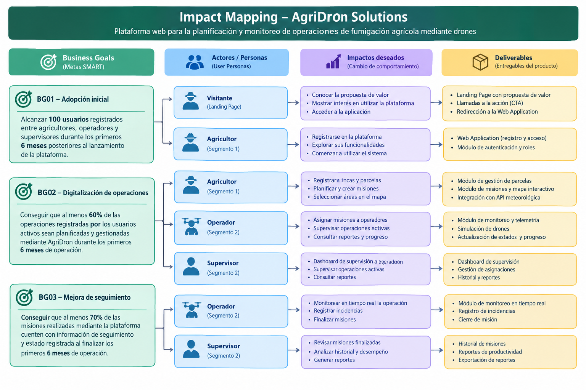
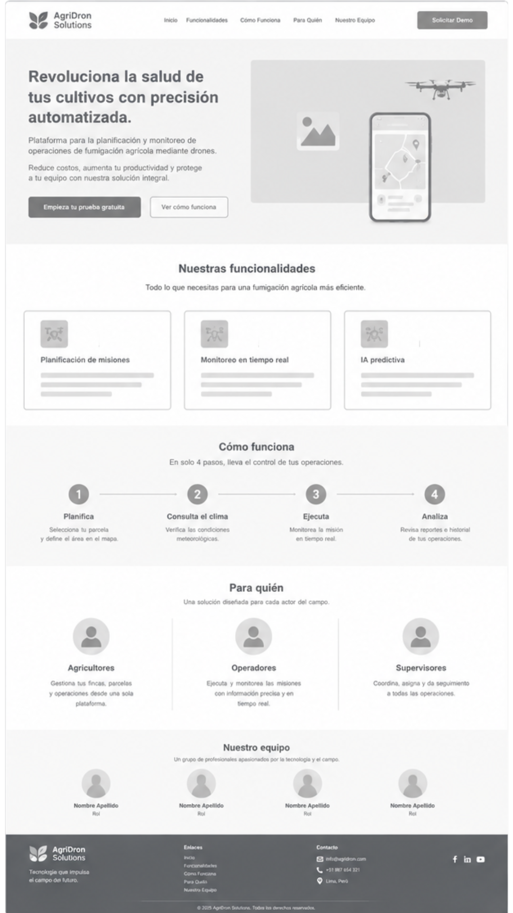
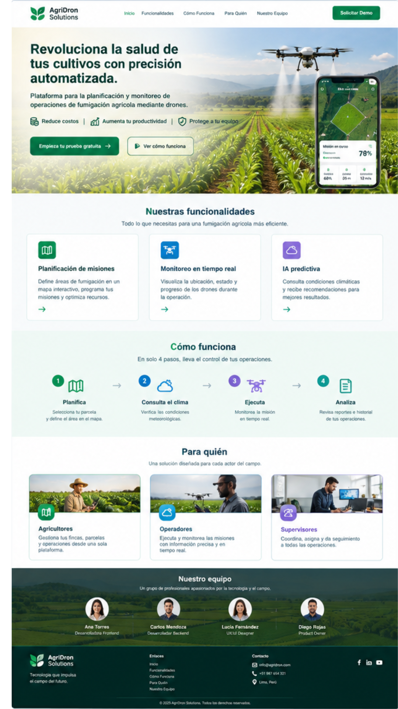
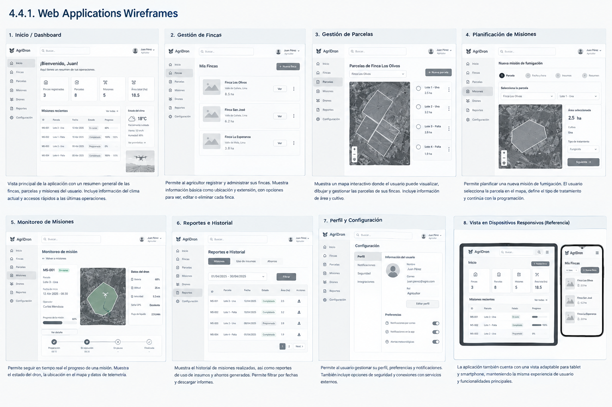
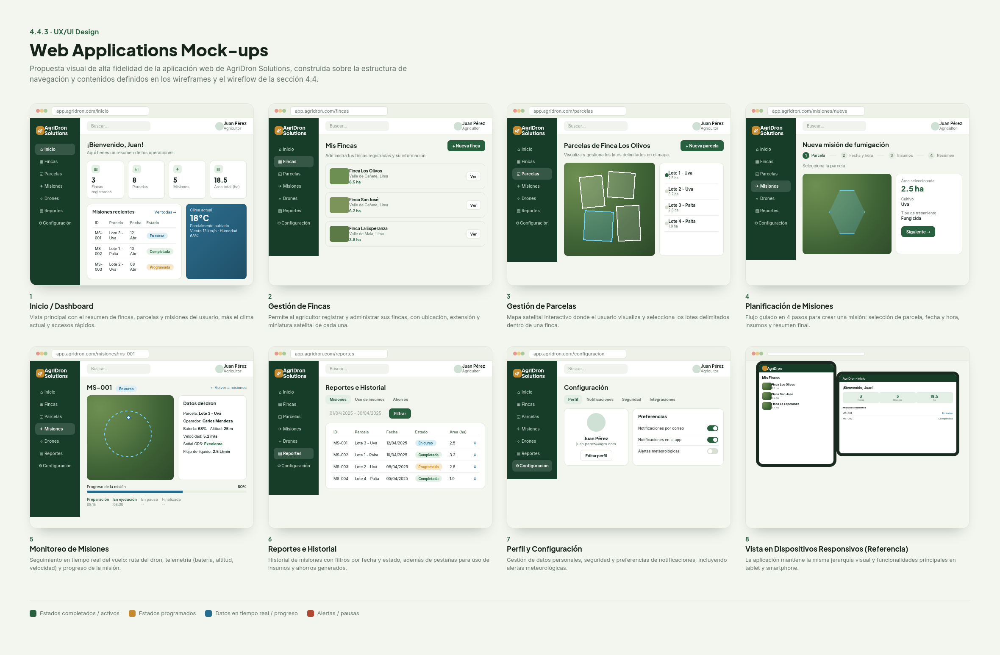
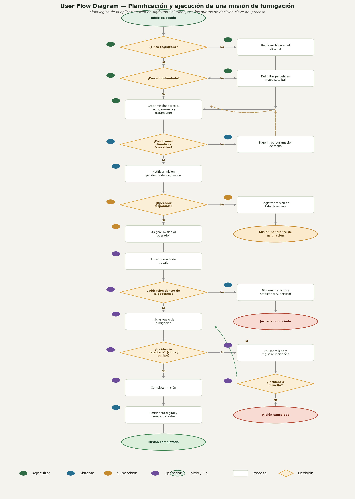

<div align="center">


## **Universidad Peruana de Ciencias Aplicadas**
### Carrera de Ingeniería de Software
<br>

**Curso: Desarrollo de Aplicaciones Open Source**

**NRC: 7760**

**Docente: FLORES MOROCCO; Juan Antonio**
<br>

### **Informe del Trabajo Final**

**Nombre de la Startup:** AgriDron

**Nombre del producto:** [NOMBRE DEL PRODUCTO]
<br>

### **Integrantes**

</div>

<table align="center" style="border-collapse: collapse; border: none; margin-left: auto; margin-right: auto;">
    <tr>
        <th style="border: none; padding: 0 18px 6px 0; text-align: center;">Código</th>
        <th style="border: none; padding: 0 0 6px 0; text-align: center;">Damacen Galindo, Italo Gianfranco</th>
    </tr>
    <tr>
        <td style="border: none; padding: 0 18px 4px 0; text-align: center;">[U20241G306]</td>
        <td style="border: none; padding: 0 0 4px 0; text-align: center;">Nicho Huillcañahui, Edwin Noe</td>
    </tr>
    <tr>
        <td style="border: none; padding: 0 18px 4px 0; text-align: center;">[CÓDIGO]</td>
        <td style="border: none; padding: 0 0 4px 0; text-align: center;">Ramirez Gutierrez, Gabriel</td>
    </tr>
    <tr>
        <td style="border: none; padding: 0 18px 4px 0; text-align: center;">U202422642</td>
        <td style="border: none; padding: 0 0 4px 0; text-align: center;">Sayago Vidal, Sebastian Leonardo</td>
    </tr>
    <tr>
        <td style="border: none; padding: 0 18px 4px 0; text-align: center;">U202222473</td>
        <td style="border: none; padding: 0 0 4px 0; text-align: center;">Vasquez Roncal, Alexander Felipe</td>
    </tr>
</table>
<br>
<div align="center">
<b><i>Septiembre, 2026</i></b>
</div>
<br>

---

## Registro de Versiones

| Versión | Fecha | Autor | Descripción |
| :--- | :--- | :--- | :--- |
| 0.1.0 | 05/09/2026 | Sebastián Sayago | Creación inicial del documento. |
| 0.2.0 | 06/09/2026 | Sebastián Sayago | Implementación inicial del capitulo 1 |


---

# Contenido

## Tabla de Contenido

- [Contenido](#contenido)
  - [Tabla de Contenido](#tabla-de-contenido)
  - [Student Outcome](#student-outcome)
  - [Capítulo I: Introducción](#capítulo-i-introducción)
    - [1.1. Startup Profile](#11-startup-profile)
      - [1.1.1. Descripción de la Startup](#111-descripción-de-la-startup)
      - [1.1.2. Perfiles de integrantes del equipo](#112-perfiles-de-integrantes-del-equipo)
    - [1.2. Solution Profile](#12-solution-profile)
      - [1.2.1. Antecedentes y problemática](#121-antecedentes-y-problemática)
      - [1.2.2. Lean UX Process](#122-lean-ux-process)
        - [1.2.2.1. Lean UX Problem Statements](#1221-lean-ux-problem-statements)
        - [1.2.2.2. Lean UX Assumptions](#1222-lean-ux-assumptions)
        - [1.2.2.3. Lean UX Hypothesis Statements](#1223-lean-ux-hypothesis-statements)
        - [1.2.2.4. Lean UX Canvas](#1224-lean-ux-canvas)
    - [1.3. Segmentos objetivo](#13-segmentos-objetivo)
  - [Capítulo II: Requirements Elicitation & Analysis](#capítulo-ii-requirements-elicitation--analysis)
    - [2.1. Competidores](#21-competidores)
      - [2.1.1. Análisis competitivo](#211-análisis-competitivo)
      - [2.1.2. Estrategias y tácticas frente a competidores](#212-estrategias-y-tácticas-frente-a-competidores)
    - [2.2. Entrevistas](#22-entrevistas)
      - [2.2.1. Diseño de entrevistas](#221-diseño-de-entrevistas)
      - [2.2.2. Registro de entrevistas](#222-registro-de-entrevistas)
      - [2.2.3. Análisis de entrevistas](#223-análisis-de-entrevistas)
    - [2.3. Needfinding](#23-needfinding)
      - [2.3.1. User Personas](#231-user-personas)
      - [2.3.2. User Task Matrix](#232-user-task-matrix)
      - [2.3.3. User Journey Mapping](#233-user-journey-mapping)
      - [2.3.4. Empathy Mapping](#234-empathy-mapping)
    - [2.4. Big Picture EventStorming](#24-big-picture-eventstorming)
    - [2.5. Ubiquitous Language](#25-ubiquitous-language)
  - [Capítulo III: Requirements Specification](#capítulo-iii-requirements-specification)
    - [3.1. User Stories](#31-user-stories)
    - [3.2. Impact Mapping](#32-impact-mapping)
    - [3.3. Product Backlog](#33-product-backlog)
  - [Capítulo IV: Product Design](#capítulo-iv-product-design)
    - [4.1. Style Guidelines](#41-style-guidelines)
      - [4.1.1. General Style Guidelines](#411-general-style-guidelines)
      - [4.1.2. Web Style Guidelines](#412-web-style-guidelines)
    - [4.2. Information Architecture](#42-information-architecture)
      - [4.2.1. Organization Systems](#421-organization-systems)
      - [4.2.2. Labeling Systems](#422-labeling-systems)
      - [4.2.3. SEO Tags and Meta Tags](#423-seo-tags-and-meta-tags)
      - [4.2.4. Searching Systems](#424-searching-systems)
      - [4.2.5. Navigation Systems](#425-navigation-systems)
    - [4.3. Landing Page UI Design](#43-landing-page-ui-design)
      - [4.3.1. Landing Page Wireframe](#431-landing-page-wireframe)
      - [4.3.2. Landing Page Mock-up](#432-landing-page-mock-up)
    - [4.4. Web Applications UX/UI Design](#44-web-applications-uxui-design)
      - [4.4.1. Web Applications Wireframes](#441-web-applications-wireframes)
      - [4.4.2. Web Applications Wireflow Diagrams](#442-web-applications-wireflow-diagrams)
      - [4.4.3. Web Applications Mock-ups](#443-web-applications-mock-ups)
      - [4.4.4. Web Applications User Flow Diagrams](#444-web-applications-user-flow-diagrams)
    - [4.5. Web Applications Prototyping](#45-web-applications-prototyping)
    - [4.6. Domain-Driven Software Architecture](#46-domain-driven-software-architecture)
      - [4.6.1. Design-Level Event Storming](#461-design-level-event-storming)
      - [4.6.2. Software Architecture Context Diagram](#462-software-architecture-context-diagram)
      - [4.6.3. Software Architecture Container Diagrams](#463-software-architecture-container-diagrams)
      - [4.6.4. Software Architecture Components Diagrams](#464-software-architecture-components-diagrams)
    - [4.7. Software Object-Oriented Design](#47-software-object-oriented-design)
      - [4.7.1. Class Diagrams](#471-class-diagrams)
    - [4.8. Database Design](#48-database-design)
      - [4.8.1. Database Diagrams](#481-database-diagrams)
  - [Capítulo V: Product Implementation, Validation & Deployment](#capítulo-v-product-implementation-validation--deployment)
    - [5.1. Software Configuration Management](#51-software-configuration-management)
      - [5.1.1. Software Development Environment Configuration](#511-software-development-environment-configuration)
      - [5.1.2. Source Code Management](#512-source-code-management)
      - [5.1.3. Source Code Style Guide & Conventions](#513-source-code-style-guide--conventions)
      - [5.1.4. Software Deployment Configuration](#514-software-deployment-configuration)
    - [5.2. Landing Page, Services & Applications Implementation](#52-landing-page-services--applications-implementation)
      - [5.2.1. Sprint 1](#521-sprint-1)
        - [5.2.1.1. Sprint Planning 1](#5211-sprint-planning-1)
        - [5.2.1.2. Aspect Leaders and Collaborators](#5212-aspect-leaders-and-collaborators)
        - [5.2.1.3. Sprint Backlog 1](#5213-sprint-backlog-1)
        - [5.2.1.4. Development Evidence for Sprint Review](#5214-development-evidence-for-sprint-review)
        - [5.2.1.5. Execution Evidence for Sprint Review](#5215-execution-evidence-for-sprint-review)
        - [5.2.1.6. Services Documentation Evidence for Sprint Review](#5216-services-documentation-evidence-for-sprint-review)
        - [5.2.1.7. Software Deployment Evidence for Sprint Review](#5217-software-deployment-evidence-for-sprint-review)
        - [5.2.1.8. Team Collaboration Insights during Sprint](#5218-team-collaboration-insights-during-sprint)
    - [5.3. Validation Interviews](#53-validation-interviews)
      - [5.3.1. Interview Design](#531-interview-design)
      - [5.3.2. Interview Registry](#532-interview-registry)
      - [5.3.3. Heuristic Evaluations](#533-heuristic-evaluations)
    - [5.4. Video About-the-Product](#54-video-about-the-product)
  - [Conclusiones](#conclusiones)
  - [Bibliografía](#bibliografía)
  - [Anexos](#anexos)

---

## Student Outcome

> **[PEGAR AQUÍ EL STUDENT OUTCOME CORRESPONDIENTE A LA ENTREGA]**
>
> **Criterio:** [PEGAR AQUÍ EL CRITERIO]
>
> En el siguiente cuadro se describe las acciones realizadas y enunciados de conclusiones por parte del grupo, que permiten sustentar el haber alcanzado el logro del Student Outcome.

<table>
  <thead>
    <tr>
      <th>Criterio específico</th>
      <th>Acciones realizadas</th>
      <th>Conclusiones</th>
    </tr>
  </thead>
  <tbody>
    <tr>
      <td><strong>[CRITERIO ESPECÍFICO 1]</strong></td>
      <td>
        <p><b>[INTEGRANTE 1]</b><br></p>
        <p><em><b>AV1</b></em><br>[ACCIÓN REALIZADA]</p>
        <br>
        <b>[INTEGRANTE 2]</b><br>
        <em><b>AV1</b></em><br>[ACCIÓN REALIZADA]
        <br><br>
        <b>[REPETIR PARA TODOS LOS INTEGRANTES]</b>
      </td>
      <td>[CONCLUSIÓN]</td>
    </tr>
    <tr>
      <td><strong>[CRITERIO ESPECÍFICO 2]</strong></td>
      <td>
        <p><b>[INTEGRANTE 1]</b><br></p>
        <p><em><b>AV1</b></em><br>[ACCIÓN REALIZADA]</p>
        <br>
        <b>[INTEGRANTE 2]</b><br>
        <em><b>AV1</b></em><br>[ACCIÓN REALIZADA]
        <br><br>
        <b>[REPETIR PARA TODOS LOS INTEGRANTES]</b>
      </td>
      <td>[CONCLUSIÓN]</td>
    </tr>
  </tbody>
</table>

---

# Capítulo I: Introducción

## 1.1. Startup Profile

### 1.1.1. Descripción de la Startup

<p align="justify">

<strong>AgriDron Solutions</strong> es una startup orientada al desarrollo de soluciones tecnológicas para el sector agrícola, enfocada en mejorar la planificación y el monitoreo de operaciones de fumigación mediante drones. La startup busca centralizar en una plataforma web las principales actividades relacionadas con estas operaciones, facilitando la gestión de parcelas, la planificación de misiones, la consulta de condiciones meteorológicas y el seguimiento de las operaciones realizadas.

</p>

<p align="justify">

La propuesta de AgriDron Solutions consiste en desarrollar una plataforma web que permita a los agricultores registrar y administrar sus fincas y parcelas, seleccionar mediante un mapa interactivo el área que desean fumigar, crear y gestionar misiones de fumigación y consultar información meteorológica mediante una API externa. Asimismo, la plataforma contará con un módulo de monitoreo que permitirá visualizar el estado y la ubicación de los drones durante una misión mediante datos inicialmente simulados.

</p>

<p align="justify">

Finalmente, la solución permitirá consultar el historial de las misiones realizadas y generar reportes de las operaciones, además de manejar diferentes roles de usuario, como agricultor, operador y técnico.

</p>

Misión: [DEFINIR MISIÓN DE AGRIDRON SOLUTIONS]

Visión: [DEFINIR VISIÓN DE AGRIDRON SOLUTIONS]

Valores:

<ul> <li>[VALOR 1]</li> 
    <li>[VALOR 2]</li> 
    <li>[VALOR 3]</li> 
    <li>[VALOR 4]</li> 
</ul>


### 1.1.2. Perfiles de integrantes del equipo

> Para cada integrante, colocar foto, nombre, código, descripción y aporte/rol dentro del proyecto.

<table>
  <tr>
    <td rowspan="4" align="center">
      
    </td>
  </tr>
  <tr>
    <td><b>Nombre:</b> [NOMBRE COMPLETO]</td>
  </tr>
  <tr>
    <td><b>Código:</b> [CÓDIGO]</td>
  </tr>
  <tr>
    <td>
      <b>Descripción:</b><br/>
      [DESCRIPCIÓN DEL PERFIL, CONOCIMIENTOS Y HABILIDADES.]
      <br/><br/>
      [APORTE Y FUNCIÓN DENTRO DEL EQUIPO.]
    </td>
  </tr>
    <tr>
    <td rowspan="4" align="center">
      
    </td>
  </tr>
  <tr>
    <td><b>Nombre:</b> [NOMBRE COMPLETO]</td>
  </tr>
  <tr>
    <td><b>Código:</b> [CÓDIGO]</td>
  </tr>
  <tr>
    <td>
      <b>Descripción:</b><br/>
      [DESCRIPCIÓN DEL PERFIL, CONOCIMIENTOS Y HABILIDADES.]
      <br/><br/>
      [APORTE Y FUNCIÓN DENTRO DEL EQUIPO.]
    </td>
  </tr>
    <tr>
    <td rowspan="4" align="center">
      
    </td>
  </tr>
  <tr>
    <td><b>Nombre:</b> [NOMBRE COMPLETO]</td>
  </tr>
  <tr>
    <td><b>Código:</b> [CÓDIGO]</td>
  </tr>
  <tr>
    <td>
      <b>Descripción:</b><br/>
      [DESCRIPCIÓN DEL PERFIL, CONOCIMIENTOS Y HABILIDADES.]
      <br/><br/>
      [APORTE Y FUNCIÓN DENTRO DEL EQUIPO.]
    </td>
  </tr>
    <tr>
    <td rowspan="4" align="center">
      
    </td>
  </tr>
  <tr>
    <td><b>Nombre:</b> [NOMBRE COMPLETO]</td>
  </tr>
  <tr>
    <td><b>Código:</b> [CÓDIGO]</td>
  </tr>
  <tr>
    <td>
      <b>Descripción:</b><br/>
      [DESCRIPCIÓN DEL PERFIL, CONOCIMIENTOS Y HABILIDADES.]
      <br/><br/>
      [APORTE Y FUNCIÓN DENTRO DEL EQUIPO.]
    </td>
  </tr>
    <tr>
    <td rowspan="4" align="center">
      
    </td>
  </tr>
  <tr>
    <td><b>Nombre:</b> [NOMBRE COMPLETO]</td>
  </tr>
  <tr>
    <td><b>Código:</b> [CÓDIGO]</td>
  </tr>
  <tr>
    <td>
      <b>Descripción:</b><br/>
      [DESCRIPCIÓN DEL PERFIL, CONOCIMIENTOS Y HABILIDADES.]
      <br/><br/>
      [APORTE Y FUNCIÓN DENTRO DEL EQUIPO.]
    </td>
  </tr>
</table>

<br>

[REPETIR BLOQUE PARA CADA INTEGRANTE.]

---

## 1.2. Solution Profile

<p align="justify">

<strong>AgriDron Solutions</strong> propone una plataforma web para la planificación y monitoreo de operaciones de fumigación agrícola mediante drones. La solución busca centralizar las actividades que intervienen en una operación, desde la gestión de las fincas y parcelas hasta la creación, seguimiento y consulta posterior de las misiones.

</p>

<p align="justify">

El usuario podrá registrar sus fincas y parcelas, seleccionar mediante un mapa interactivo el área que desea fumigar y crear una misión de fumigación. Antes de realizar la operación, podrá consultar las condiciones meteorológicas mediante una API externa. Durante la misión, el sistema permitirá visualizar el estado y ubicación del dron utilizando inicialmente datos simulados. Posteriormente, el usuario podrá consultar el historial y los reportes de las operaciones realizadas.

</p>

### 1.2.1. Antecedentes y problemática

1.2.1.1. What

<p align="justify">

El problema se relaciona con la planificación y monitoreo de operaciones de fumigación agrícola mediante drones. Estas operaciones requieren gestionar información sobre las fincas y parcelas, definir el área que será fumigada, planificar las misiones, consultar las condiciones meteorológicas y realizar un seguimiento de la operación.

</p>

<p align="justify">

Actualmente, estas actividades pueden requerir coordinación manual y el uso de diferentes medios para gestionar la información relacionada con una misión, dificultando su centralización y seguimiento.

</p>

1.2.1.2. Where

<p align="justify">

La problemática se presenta en el contexto de las operaciones agrícolas en las que se utilizan drones para realizar actividades de fumigación sobre diferentes fincas y parcelas.

</p>

1.2.1.3. When

<p align="justify">

La problemática se presenta principalmente durante las diferentes etapas de una operación de fumigación: al planificar una misión, definir el área que será fumigada, verificar las condiciones meteorológicas, realizar el seguimiento de la misión y consultar posteriormente la información de la operación.

</p>

1.2.1.4. Who

<p align="justify">

Los principales usuarios involucrados son los agricultores responsables de gestionar las operaciones de fumigación, así como los operadores y técnicos relacionados con la ejecución y supervisión de las misiones mediante drones.

</p>

1.2.1.5. Why

<p align="justify">

La problemática surge debido a la necesidad de coordinar diferentes actividades e información asociadas a una operación de fumigación. La gestión separada de las parcelas, áreas de fumigación, condiciones meteorológicas, misiones y seguimiento de los drones puede dificultar la organización y consulta de la información.

</p>

1.2.1.6. How

<p align="justify">

AgriDron Solutions abordará esta problemática mediante una plataforma web que centralice la gestión de fincas y parcelas, la definición de áreas de fumigación mediante un mapa interactivo, la creación y gestión de misiones, la consulta de información meteorológica mediante una API externa, el monitoreo simulado de los drones y la consulta de reportes e historial de operaciones.

</p>

1.2.1.7. How much

<p align="justify">

[DEFINIR MODELO DE NEGOCIO, COSTOS, PRECIOS, PROYECCIONES U OTROS ASPECTOS ECONÓMICOS DE AGRIDRON SOLUTIONS.]

</p>

### 1.2.2. Lean UX Process

#### 1.2.2.1. Lean UX Problem Statements

Problem Statement 1

<p align="justify">

Los agricultores necesitan una forma centralizada de gestionar sus fincas, parcelas y áreas de fumigación, debido a que estas actividades forman parte de la planificación de sus operaciones con drones y pueden requerir coordinación manual.

</p>

Problem Statement 2

<p align="justify">

Los responsables de las operaciones de fumigación necesitan consultar las condiciones meteorológicas antes de realizar una misión, debido a que esta información es relevante para la planificación de la operación.

</p>

Problem Statement 3

<p align="justify">

Los responsables de una misión necesitan realizar un seguimiento del estado y ubicación del dron durante una operación, debido a que requieren conocer el progreso de la misión.

</p>

Problem Statement 4

<p align="justify">

Los usuarios necesitan consultar el historial y los reportes de las misiones realizadas, debido a que requieren mantener un registro de las operaciones de fumigación gestionadas.

</p>

#### 1.2.2.2. Lean UX Assumptions

**1.2.2.2.1. ¿Quién es el usuario?**

<p align="justify">

Los principales usuarios de la solución son agricultores, operadores y técnicos relacionados con la planificación, ejecución y supervisión de operaciones de fumigación agrícola mediante drones.

</p>

**1.2.2.2.2. ¿Dónde encaja nuestro producto en su trabajo o vida?**

<p align="justify">

La plataforma se utilizará como una herramienta de apoyo para gestionar las operaciones de fumigación agrícola. Permitirá centralizar actividades como el registro de parcelas, la planificación de misiones, la consulta de condiciones meteorológicas, el monitoreo de drones y la consulta de reportes.

</p>

**1.2.2.2.3. ¿Qué problemas tiene nuestro producto y cómo se pueden resolver?**

<ul> 
    <li><strong>Gestión dispersa de la información:</strong> centralizar la información de fincas, parcelas y misiones dentro de una misma plataforma.</li> 
    <li><strong>Dificultad para definir el área de fumigación:</strong> utilizar un mapa interactivo para seleccionar el área que será fumigada.</li> 
    <li><strong>Consulta de condiciones meteorológicas:</strong> integrar una API externa para obtener información climática.</li> 
    <li><strong>Seguimiento de las misiones:</strong> incorporar un módulo de monitoreo con datos simulados sobre el estado y ubicación del dron.</li> 
    <li><strong>Consulta de operaciones anteriores:</strong> almacenar el historial y generar reportes de las misiones realizadas.</li> 
</ul>

**1.2.2.2.4. ¿Cuándo y cómo es usado nuestro producto?**

<p align="justify">

La plataforma será utilizada antes, durante y después de una operación de fumigación. Antes de la misión, el usuario podrá gestionar la parcela, definir el área de fumigación, crear la misión y consultar las condiciones meteorológicas. Durante la operación podrá consultar el estado y ubicación del dron. Después de la misión podrá consultar el historial y los reportes generados.

</p>

**1.2.2.2.5. ¿Qué características son importantes?**

<ul> 
    <li>Gestión de fincas y parcelas.</li> 
    <li>Mapa interactivo para definir áreas de fumigación.</li> 
    <li>Creación y gestión de misiones.</li> <li>Consulta de condiciones meteorológicas mediante una API externa.</li> 
    <li>Monitoreo del estado y ubicación de los drones.</li> <li>Historial y reportes de las operaciones.</li> 
    <li>Gestión de roles de usuario.</li> 
</ul>

**1.2.2.2.6. ¿Cómo debe verse nuestro producto y cómo debe comportarse?**

<p align="justify">

La plataforma debe presentar una interfaz web clara y organizada, que permita a los usuarios acceder de manera sencilla a las principales funciones relacionadas con la gestión de sus operaciones. La información de las parcelas, misiones, condiciones meteorológicas y monitoreo deberá presentarse de manera comprensible, diferenciando las funcionalidades disponibles según el rol del usuario.

</p>

**1.2.2.2.7. Business Outcomes**

<ul> 
    <li>Centralizar la planificación y monitoreo de operaciones de fumigación agrícola mediante drones.</li> 
    <li>Ofrecer una solución tecnológica especializada para la gestión de operaciones agrícolas.</li> 
    <li>Facilitar la organización y disponibilidad de información relacionada con las misiones de fumigación.</li> 
</ul>

**1.2.2.2.8. User Outcomes**

<ul> 
    <li>Gestionar sus fincas y parcelas desde una única plataforma.</li> 
    <li>Planificar misiones y definir las áreas de fumigación mediante un mapa.</li> 
    <li>Consultar las condiciones meteorológicas antes de una misión.</li> 
    <li>Monitorear el estado y ubicación del dron durante una operación.</li> 
    <li>Consultar el historial y reportes de las misiones realizadas.</li> 
</ul>

**1.2.2.2.9. Features**

<ul> <li>Módulo de gestión de fincas y parcelas.</li> 
    <li>Mapa interactivo para selección del área de fumigación.</li> 
    <li>Módulo de creación y gestión de misiones.</li> 
    <li>Integración con API meteorológica.</li> 
    <li>Módulo de monitoreo de drones con datos simulados.</li> 
    <li>Historial y generación de reportes.</li> 
    <li>Gestión de roles: agricultor, operador y técnico.</li> 
</ul>

#### 1.2.2.3. Lean UX Hypothesis Statements

Hypothesis Statement 1

<p align="justify">

Creemos que centralizar la gestión de fincas, parcelas y misiones en una plataforma web permitirá a los agricultores organizar de manera más eficiente sus operaciones de fumigación. Sabremos que esto es cierto cuando los usuarios puedan gestionar estos elementos desde un único sistema y completen el flujo de planificación de una misión.

</p>

Hypothesis Statement 2

<p align="justify">

Creemos que permitir la selección del área de fumigación mediante un mapa interactivo facilitará la planificación de las misiones. Sabremos que esto es cierto cuando los usuarios puedan definir correctamente el área que desean fumigar utilizando el mapa.

</p>

Hypothesis Statement 3

<p align="justify">

Creemos que integrar información meteorológica mediante una API externa ayudará a los usuarios a considerar las condiciones climáticas durante la planificación de una misión. Sabremos que esto es cierto cuando los usuarios puedan consultar dicha información antes de gestionar una operación.

</p>

Hypothesis Statement 4

<p align="justify">

Creemos que visualizar el estado y ubicación del dron durante una misión permitirá a los usuarios realizar un mejor seguimiento de la operación. Sabremos que esto es cierto cuando puedan identificar el estado y posición del dron durante una misión simulada.

</p>
#### 1.2.2.4. Lean UX Canvas

<div align="center">


</div>

Descripción:

<p align="justify">

El Lean UX Canvas de AgriDron Solutions permite organizar las principales hipótesis relacionadas con el problema, los usuarios, los resultados esperados y la solución propuesta. El canvas se utilizará como herramienta para orientar el diseño y validación de la plataforma, tomando como punto de partida las necesidades relacionadas con la planificación y monitoreo de operaciones de fumigación agrícola mediante drones.

</p>

### 1.3. Segmentos objetivo

1.3.1. Agricultores

<p align="justify">

Los agricultores constituyen el principal segmento objetivo de AgriDron Solutions. Son responsables de gestionar sus fincas y parcelas y requieren planificar las operaciones de fumigación que se realizarán mediante drones. La plataforma les permitirá registrar y administrar sus parcelas, definir las áreas de fumigación mediante un mapa, crear misiones, consultar las condiciones meteorológicas y revisar posteriormente el historial y los reportes de las operaciones.

</p>

1.3.2. Operadores y técnicos

<p align="justify">

Los operadores y técnicos constituyen un segmento relacionado con la ejecución y supervisión de las operaciones de fumigación. Estos usuarios podrán interactuar con las funcionalidades asociadas a la gestión y monitoreo de las misiones, de acuerdo con los permisos correspondientes a cada rol.

</p>
---

# Capítulo II: Requirements Elicitation & Analysis

## 2.1. Competidores

### 2.1.1. Análisis competitivo

[PEGAR AQUÍ LA MATRIZ / TABLA DE ANÁLISIS COMPETITIVO.]

| Criterio | Competidor 1 | Competidor 2 | Competidor 3 | Nuestra solución |
| :--- | :--- | :--- | :--- | :--- |
| [CRITERIO] | [DATO] | [DATO] | [DATO] | [DATO] |
| [CRITERIO] | [DATO] | [DATO] | [DATO] | [DATO] |
| [CRITERIO] | [DATO] | [DATO] | [DATO] | [DATO] |

### 2.1.2. Estrategias y tácticas frente a competidores

<p align="justify">

[DESCRIBIR LAS ESTRATEGIAS Y TÁCTICAS QUE PERMITIRÁN DIFERENCIAR LA SOLUCIÓN.]

</p>

---

## 2.2. Entrevistas

### 2.2.1. Diseño de entrevistas

**Objetivo de la entrevista:**

[DESCRIBIR OBJETIVO.]

**Segmento entrevistado:**

[DESCRIBIR SEGMENTO.]

**Cantidad de entrevistados:**

[CANTIDAD]

**Preguntas generales**

1. [PREGUNTA]
2. [PREGUNTA]
3. [PREGUNTA]

**Preguntas específicas del segmento 1**

1. [PREGUNTA]
2. [PREGUNTA]
3. [PREGUNTA]

**Preguntas específicas del segmento 2**

1. [PREGUNTA]
2. [PREGUNTA]
3. [PREGUNTA]

### 2.2.2. Registro de entrevistas

[PARA CADA ENTREVISTA, COMPLETAR EL SIGUIENTE FORMATO.]

#### Entrevista [NÚMERO]

| Campo | Información |
| :--- | :--- |
| Entrevistado | [NOMBRE / IDENTIFICADOR] |
| Edad | [EDAD] |
| Segmento | [SEGMENTO] |
| Fecha | [FECHA] |
| Modalidad | [PRESENCIAL / VIRTUAL] |
| Lugar | [LUGAR] |

**Registro / respuestas:**

| N.º | Pregunta | Respuesta |
| :--- | :--- | :--- |
| 1 | [PREGUNTA] | [RESPUESTA] |
| 2 | [PREGUNTA] | [RESPUESTA] |
| 3 | [PREGUNTA] | [RESPUESTA] |

**Evidencia:**


### 2.2.3. Análisis de entrevistas

<p align="justify">

[RESUMIR LOS HALLAZGOS PRINCIPALES DE LAS ENTREVISTAS.]

</p>

| Hallazgo | Evidencia / entrevista | Necesidad identificada | Implicación para la solución |
| :--- | :--- | :--- | :--- |
| [HALLAZGO] | [EVIDENCIA] | [NECESIDAD] | [IMPLICACIÓN] |
| [HALLAZGO] | [EVIDENCIA] | [NECESIDAD] | [IMPLICACIÓN] |

---

## 2.3. Needfinding

### 2.3.1. User Personas

#### Persona 1: [NOMBRE]


**Descripción:**

[DESCRIPCIÓN.]

**Necesidades:**

- [NECESIDAD 1]
- [NECESIDAD 2]

**Objetivos:**

- [OBJETIVO 1]
- [OBJETIVO 2]

**Frustraciones:**

- [FRUSTRACIÓN 1]
- [FRUSTRACIÓN 2]

#### Persona 2: [NOMBRE]


[REPETIR ESTRUCTURA.]

### 2.3.2. User Task Matrix

[PEGAR / CONSTRUIR AQUÍ LA MATRIZ DE TAREAS.]

| Tarea | Usuario | Frecuencia | Importancia | Dificultad | Problemas actuales |
| :--- | :--- | :--- | :--- | :--- | :--- |
| [TAREA] | [USUARIO] | [ALTA/MEDIA/BAJA] | [ALTA/MEDIA/BAJA] | [ALTA/MEDIA/BAJA] | [PROBLEMA] |
| [TAREA] | [USUARIO] | [ALTA/MEDIA/BAJA] | [ALTA/MEDIA/BAJA] | [ALTA/MEDIA/BAJA] | [PROBLEMA] |

### 2.3.3. User Journey Mapping

<div align="center">


</div>

**Descripción:**

<p align="justify">

[EXPLICAR EL JOURNEY MAP Y LOS PRINCIPALES PUNTOS DE DOLOR.]

</p>

### 2.3.4. Empathy Mapping

<div align="center">


</div>

**Descripción:**

<p align="justify">

[EXPLICAR EL EMPATHY MAP.]

</p>

---

## 2.4. Big Picture EventStorming

<div align="center">


</div>

**Descripción:**

<p align="justify">

[EXPLICAR EL FLUJO GENERAL DEL DOMINIO, EVENTOS PRINCIPALES, ACTORES Y PROCESOS IDENTIFICADOS.]

</p>

---

## 2.5. Ubiquitous Language

| Término | Definición |
| :--- | :--- |
| [TÉRMINO] | [DEFINICIÓN DENTRO DEL DOMINIO] |
| [TÉRMINO] | [DEFINICIÓN DENTRO DEL DOMINIO] |
| [TÉRMINO] | [DEFINICIÓN DENTRO DEL DOMINIO] |

---

# Capítulo III: Requirements Specification

## 3.1. User Stories

> User Stories - Landing Page (Rol: Visitante / Visitor).

| ID     | Título                        | Descripción | Criterios de Aceptación                                                                                                                                                                                                                                                                                                                                      | Epic   |
|:-------|:------------------------------| :--- |:-------------------------------------------------------------------------------------------------------------------------------------------------------------------------------------------------------------------------------------------------------------------------------------------------------------------------------------------------------------|:-------|
| LP-001 | Visualizar propuesta de valor | Como visitante, quiero visualizar la propuesta de valor de AgriDron en la página principal, <br/>para entender rápidamente qué ofrece el servicio. | 1. Escenario 1: Visualización exitosa<br>Dado que el visitante ingresa al Landing Page, cuando la página carga completamente, entonces el sistema muestra el hero section con el título, subtítulo y un llamado a la acción (CTA) visible.                                                                                                                   | EP-001 |
| LP-002 | Conocer servicios ofrecidos   | Como visitante, quiero ver los servicios y características principales de AgriDron, para evaluar si la solución satisface mis necesidades. | 1. Escenario 1: Visualización de servicios<br>Dado que el visitante está en el Landing Page, cuando hace scroll hacia la sección "Servicios", entonces el sistema muestra al menos 3 tarjetas con iconos, títulos y descripciones breves de los servicios                                                                                                    | EP-002 |
| LP-003 | Ver planes y precios   | Como visitante, quiero conocer los planes de precios y suscripción, para tomar una decisión informada sobre la contratación del servicio. | 1. Escenario 1: Visualización de planes<br>Dado que el visitante está en el Landing Page, cuando hace scroll hacia la sección "Planes", entonces el sistema muestra al menos 2 opciones de planes con sus precios y características incluidas.                                                                                                               | EP-003 |
| LP-004 | Registrarse como nuevo usuario   | Como visitante, quiero registrarme en la plataforma proporcionando mis datos básicos, para acceder a las funcionalidades de la Web Application. | 1. Escenario 1: Registro exitoso<br>Dado que el visitante está en el Landing Page y hace clic en "Registrarse", cuando completa el formulario con nombre, email, contraseña y selecciona su rol (Agricultor/Operador/Supervisor), entonces el sistema crea la cuenta y redirige al Dashboard de la Web Application.<br/>2. Escenario 2: Email ya registrado<br>Dado que el visitante ingresa un email que ya existe en el sistema, cuando envía el formulario de registro, entonces el sistema muestra el mensaje "El correo electrónico ya está registrado" y no crea la cuenta. | EP-004 |
| LP-005 | Iniciar sesión en la plataforma   | Como visitante registrado, quiero iniciar sesión con mis credenciales, para acceder a la Web Application. | 1. Escenario 1:  Inicio de sesión exitoso<br>Dado que el visitante está en el Landing Page y hace clic en "Iniciar Sesión", cuando ingresa email y contraseña válidos, entonces el sistema autentica al usuario y redirige al Dashboard de la Web Application.<br/>2. Escenario 2: Credenciales inválidas<br>Dado que el visitante ingresa email o contraseña incorrectos, cuando envía el formulario de login, entonces el sistema muestra el mensaje "Credenciales inválidas" y no permite el acceso.                                                                                                    | EP-005 |
| LP-006 | Consultar términos y condiciones   | Como visitante, quiero acceder a los términos y condiciones de servicio, para conocer las políticas de uso y privacidad. | 1. Escenario 1: Visualización de términos<br>Dado que el visitante está en el Landing Page y hace clic en el enlace "Términos y Condiciones" en el footer, entonces el sistema navega a la página de términos y condiciones con el contenido completo.                                                                                                    | EP-006 |

> User Stories - Web Application (Roles: Agricultor, Operador, Supervisor)
> Rol: Agricultor

| ID     | Título                        | Descripción | Criterios de Aceptación                                                                                                                                                                                                                                                                                                                                                                                                                                                                                                                                                                    | Epic   |
|:-------|:------------------------------| :--- |:-------------------------------------------------------------------------------------------------------------------------------------------------------------------------------------------------------------------------------------------------------------------------------------------------------------------------------------------------------------------------------------------------------------------------------------------------------------------------------------------------------------------------------------------------------------------------------------------|:-------|
| WA-001 | Registrar una finca | Como agricultor, quiero registrar mis fincas en la plataforma, para gestionar mis parcelas de forma centralizada. | 1. Escenario 1: Registro exitoso<br>Dado que el agricultor está autenticado en el Dashboard, cuando accede a "Gestión de Fincas" y completa el formulario con nombre, ubicación (seleccionando en mapa), tamaño en hectáreas y tipo de cultivo, entonces el sistema guarda la finca y la muestra en el listado.<br/>2. Escenario 2: Nombre duplicado<br>Dado que el agricultor ingresa un nombre de finca que ya existe, cuando envía el formulario, entonces el sistema muestra el mensaje "Ya existe una finca con este nombre" y no la registra.                                        | EP-007 |
| WA-002 | Dibujar área de fumigación   | Como agricultor, quiero dibujar el área de fumigación sobre un mapa interactivo, para planificar misiones de manera precisa. | 1. Escenario 1: Dibujo exitoso<br>Dado que el agricultor está en la sección "Crear Misión", cuando selecciona "Dibujar Área" y traza un polígono cerrado sobre el mapa, entonces el sistema calcula el área en hectáreas y la muestra.<br/>2. Escenario 2: Área fuera de límites<br/>Dado que el agricultor dibuja un área fuera de los límites de su finca registrada, cuando intenta guardar la misión, entonces el sistema muestra el mensaje "El área seleccionada excede los límites de su finca" y no permite continuar.                                                             | EP-008 |
| WA-003 | Crear misión de fumigación   | Como agricultor, quiero crear una misión de fumigación seleccionando el área y el cultivo, para solicitar el servicio. | 1. Escenario 1: Creación exitosa<br>Dado que el agricultor ha dibujado un área válida, cuando selecciona el tipo de cultivo, ingresa observaciones y confirma la misión, entonces el sistema guarda la misión con estado "Pendiente" y genera una notificación para el Supervisor.<br/>2. Escenario 2: Datos incompletos<br/>Dado que el agricultor no ha dibujado un área, cuando intenta crear la misión, entonces el sistema muestra el mensaje "Debe seleccionar un área para la misión" y no permite continuar.                                                                       | EP-009 |
| WA-004 | Ver historial de misiones   | Como agricultor, quiero consultar el historial de misiones de fumigación de mis fincas, para dar seguimiento a las operaciones realizadas. | 1. Escenario 1: Visualización de historial<br>Dado que el agricultor está en el Dashboard, cuando accede a "Historial de Misiones", entonces el sistema muestra un listado con todas las misiones filtradas por finca, con fecha, estado, área y tipo de cultivo.<br/>2. Escenario 2: Filtrado por fecha<br>Dado que el agricultor necesita buscar misiones de un período específico, cuando selecciona un rango de fechas, entonces el sistema muestra solo las misiones dentro de ese rango.                                                                                             | EP-010 |
| WA-005 | Generar reporte de productividad   | Como agricultor, quiero generar reportes de productividad por hectárea, para justificar inversiones y tomar decisiones estratégicas. | 1. Escenario 1:  Generación exitosa<br>Dado que el agricultor está en la sección "Reportes", cuando selecciona una finca y un rango de fechas y hace clic en "Generar Reporte", entonces el sistema genera un reporte en PDF con área total fumigada, insumos utilizados, horas de operación, costo por hectárea y rendimiento estimado.<br/>2. Escenario 2: Sin datos<br>Dado que el agricultor selecciona un rango de fechas sin misiones registradas, cuando intenta generar el reporte, entonces el sistema muestra el mensaje "No hay datos disponibles para el período seleccionado".| EP-011 |

> Rol: Operador

| ID     | Título                        | Descripción | Criterios de Aceptación                                                                                                                                                                                                                                                                                                                                                                                                                                                                                                                                                                     | Epic   |
|:-------|:------------------------------| :--- |:--------------------------------------------------------------------------------------------------------------------------------------------------------------------------------------------------------------------------------------------------------------------------------------------------------------------------------------------------------------------------------------------------------------------------------------------------------------------------------------------------------------------------------------------------------------------------------------------|:-------|
| WA-006 | Consultar misiones asignadas | Como operador, quiero visualizar las misiones de fumigación que me han sido asignadas, para planificar mi jornada de trabajo. | 1. Escenario 1: Visualización de misiones<br>Dado que el operador está autenticado en el Dashboard, cuando accede a "Mis Misiones", entonces el sistema muestra un listado de las misiones asignadas con estado (Pendiente/En Progreso/Completada), fecha, finca y área.<br/>2. Escenario 2: Detalle de misión<br>Dado que el operador selecciona una misión específica, cuando hace clic en "Ver Detalle", entonces el sistema muestra la ubicación en el mapa, el área a fumigar, el tipo de cultivo y las observaciones.                                                                 | EP-012 |
| WA-007 | Actualizar estado de misión   | Como operador, quiero actualizar el estado de una misión (En Progreso / Completada), para mantener informado al agricultor y al supervisor. | 1. Escenario 1: Inicio de misión<br>Dado que el operador está en el detalle de una misión con estado "Pendiente", cuando hace clic en "Iniciar Misión", entonces el sistema cambia el estado a "En Progreso" y registra la hora de inicio.<br/>2. Escenario 2: Completar misión<br/>Dado que el operador está en el detalle de una misión con estado "En Progreso", cuando hace clic en "Completar Misión", entonces el sistema cambia el estado a "Completada", registra la hora de finalización y calcula el área efectivamente fumigada.                                                 | EP-013 |
| WA-008 | Registrar horas trabajadas   | Como operador, quiero registrar mis horas trabajadas con verificación de ubicación, para garantizar precisión en la información de mi jornada. | 1. Escenario 1: Registro automático<br>Dado que el operador llega a la finca registrada, cuando el GPS confirma que está dentro de la geocerca autorizada, entonces el sistema inicia automáticamente el registro de la jornada.<br/>2. Escenario 2: Fuera de zona<br/>Dado que el operador intenta registrar horas fuera de la geocerca de la finca, cuando intenta iniciar el registro, entonces el sistema muestra el mensaje "Ubicación no válida para registro automático" y solicita verificación manual al supervisor.                                                               | EP-014 |
| WA-009 | Registrar incidencias en campo   | Como operador, quiero registrar incidencias durante la operación (clima adverso, falla técnica, etc.), para documentar interrupciones y justificar reprogramaciones. | 1. Escenario 1: Registro de incidencia<br>Dado que el operador está en el detalle de una misión en progreso, cuando hace clic en "Reportar Incidencia" y completa el formulario con tipo (clima/equipo/otro), descripción y adjunta una foto, entonces el sistema guarda la incidencia y notifica al Supervisor.<br/>2. Escenario 2: Incidencia crítica<br>Dado que el operador reporta una incidencia de tipo "Falla crítica", cuando confirma el registro, entonces el sistema cambia automáticamente el estado de la misión a "Pausada" y envía una alerta prioritaria al Supervisor.    | EP-015 |

> Rol: Supervisor

| ID     | Título                        | Descripción | Criterios de Aceptación                                                                                                                                                                                                                                                                                                                                                                                                                                                                                                                                                                         | Epic   |
|:-------|:------------------------------| :--- |:------------------------------------------------------------------------------------------------------------------------------------------------------------------------------------------------------------------------------------------------------------------------------------------------------------------------------------------------------------------------------------------------------------------------------------------------------------------------------------------------------------------------------------------------------------------------------------------------|:-------|
| WA-010 | Asignar misiones a operadores | Como supervisor, quiero asignar misiones creadas por agricultores a operadores disponibles, para coordinar las operaciones de campo | 1. Escenario 1: Asignación exitosa<br>Dado que el supervisor está en el listado de misiones "Pendientes", cuando selecciona una misión, elige un operador disponible y confirma la asignación, entonces el sistema cambia el estado de la misión a "Asignada" y envía una notificación al operador.<br/>2. Escenario 2: Sin operadores disponibles<br>Dado que el supervisor intenta asignar una misión pero no hay operadores con disponibilidad, cuando confirma la asignación, entonces el sistema muestra el mensaje "No hay operadores disponibles para esta fecha" y sugiere reprogramar. | EP-012 |
| WA-011 | Monitorear múltiples drones   | Como supervisor, quiero ver el estado y ubicación de todos los drones activos en tiempo real, para optimizar la coordinación de misiones. | 1. Escenario 1: Supervisión en tiempo real<br>Dado que el supervisor está en el panel "Monitoreo en Tiempo Real", cuando accede a la vista de drones, entonces el sistema muestra todos los drones activos con posición GPS, nivel de batería, estado de misión (en vuelo/en carga/detenido) y progreso porcentual, actualizados cada 5 segundos.<br/>2. Escenario 2: Pérdida de conexión<br/>Dado que uno o más drones pierden señal, cuando el sistema detecta la pérdida, entonces muestra un ícono de alerta y el mensaje "Conexión perdida con Dron-X. Intentando reconexión...            | EP-013 |
| WA-012 | Consultar reportes de eficiencia   | Como supervisor, quiero consultar reportes de eficiencia operativa (tiempo/hectárea, costo/hectárea), para evaluar el desempeño y optimizar recursos. | 1. Escenario 1: Reporte de eficiencia<br>Dado que el supervisor está en la sección "Reportes de Eficiencia", cuando selecciona un rango de fechas y hace clic en "Generar", entonces el sistema calcula y muestra métricas como tiempo promedio por hectárea, costo por hectárea, eficiencia de insumos y horas-hombre invertidas.<br/>2. Escenario 2: Comparativa<br/>Dado que el supervisor necesita comparar el desempeño entre operadores, cuando selecciona "Comparar Operadores", entonces el sistema muestra una tabla comparativa con las métricas de cada uno.                         | EP-014 |
| WA-013 | Gestionar inventario de insumos   | Como supervisor, quiero gestionar el inventario de pesticidas y fertilizantes disponibles, para planificar compras y garantizar el abastecimiento. | 1. Escenario 1: Visualización de inventario<br>Dado que el supervisor está en la sección "Inventario", cuando accede al módulo, entonces el sistema muestra la lista de insumos con stock actual, umbral mínimo y estado de alerta.<br/>2. Escenario 2: Alerta de stock bajo<br>Dado que un insumo tiene stock por debajo del umbral mínimo, cuando el supervisor accede al inventario, entonces el sistema resalta el producto en rojo y muestra la alerta "Stock crítico - Realizar pedido".                                                                                                  | EP-015 |


---

## 3.2. Impact Mapping

<div align="center">



</div>

**Descripción:**

<p align="justify">

Diagrama que muestra la relación entre los actores clave (agricultor, operador y supervisor), 
los objetivos estratégicos del proyecto y las funcionalidades necesarias para lograrlos

</p>

---

## 3.3. Product Backlog

| ID     | Epic | User Story | Prioridad         | Story Points | Estado   |
|:-------| :--- | :--- |:------------------|:------------:|:---------|
| LP-001 | Landing Page | Como visitante, quiero visualizar la propuesta de valor de AgriDron en la página principal, para entender rápidamente qué ofrece el servicio. | ALTA              |      2       | To-Do    |
| LP-002 | Landing Page | Como visitante, quiero ver los servicios y características principales de AgriDron, para evaluar si la solución satisface mis necesidades. | ALTA              |      2       | To-Do    |
| LP-003 | Landing Page | Como visitante, quiero conocer los planes de precios y suscripción, para tomar una decisión informada sobre la contratación del servicio. | ALTA              |      3       | To-Do    |
| LP-004 | Landing Page | Como visitante, quiero registrarme en la plataforma proporcionando mis datos básicos, para acceder a las funcionalidades de la Web Application. | ALTA              |      5       | To-Do    |
| LP-005 | Landing Page | Como visitante registrado, quiero iniciar sesión con mis credenciales, para acceder a la Web Application. | ALTA              |      3       | To-Do    |
| LP-006 | Landing Page | Como visitante, quiero acceder a los términos y condiciones de servicio, para conocer las políticas de uso y privacidad. | BAJA              |      1       | To-Do    |
| LP-007 | Landing Page | Como visitante, quiero cambiar el idioma del sitio entre español e inglés, para navegar en mi idioma preferido. | MEDIA             |      5       | To-Do    |
| WA-008 | Web App - Agricultor | Como agricultor, quiero registrar mis fincas en la plataforma, para gestionar mis parcelas de forma centralizada. | ALTA              |      5       | To-Do    |
| WA-009 | Web App - Agricultor | Como agricultor, quiero dibujar el área de fumigación sobre un mapa interactivo, para planificar misiones de manera precisa. | ALTA              |      8       | To-Do    |
| WA-010 | Web App - Agricultor | Como agricultor, quiero crear una misión de fumigación seleccionando el área y el cultivo, para solicitar el servicio. | ALTA              |      5       | To-Do    |
| WA-011 | Web App - Agricultor | Como agricultor, quiero consultar el historial de misiones de fumigación de mis fincas, para dar seguimiento a las operaciones realizadas. | MEDIA             |      5       | To-Do    |
| WA-012 | Web App - Agricultor | Como agricultor, quiero generar reportes de productividad por hectárea, para justificar inversiones y tomar decisiones estratégicas. | MEDIA             |      8       | To-Do    |
| WA-013 | Web App - Operador | Como operador, quiero visualizar las misiones de fumigación que me han sido asignadas, para planificar mi jornada de trabajo. | ALTA              |      3       | To-Do    |
| WA-014 | Web App - Operador | Como operador, quiero actualizar el estado de una misión (En Progreso / Completada), para mantener informado al agricultor y al supervisor. | ALTA              |      5       | To-Do    |
| WA-015 | Web App - Operador | Como operador, quiero registrar mis horas trabajadas con verificación de ubicación, para garantizar precisión en la información de mi jornada. | MEDIA             |      8       | To-Do    |
| WA-016 | Web App - Operador | Como operador, quiero registrar incidencias durante la operación (clima adverso, falla técnica, etc.), para documentar interrupciones y justificar reprogramaciones. | MEDIA             |      5       | To-Do    |
| WA-017 | Web App - Supervisor | Como supervisor, quiero asignar misiones creadas por agricultores a operadores disponibles, para coordinar las operaciones de campo. | ALTA              |      5       | To-Do    |
| WA-018 | Web App - Supervisor | Como supervisor, quiero ver el estado y ubicación de todos los drones activos en tiempo real, para optimizar la coordinación de misiones. | ALTA              |      8       | To-Do    |
| WA-019 | Web App - Supervisor | Como supervisor, quiero consultar reportes de eficiencia operativa (tiempo/hectárea, costo/hectárea), para evaluar el desempeño y optimizar recursos. | MEDIA             |      8       | To-Do    |
| WA-020 | Web App - Supervisor | Como supervisor, quiero gestionar el inventario de pesticidas y fertilizantes disponibles, para planificar compras y garantizar el abastecimiento. | MEDIA       |      5       | To-Do     |


---

# Capítulo IV: Product Design

## 4.1. Style Guidelines

### 4.1.1. General Style Guidelines

> Branding (Identidad de Marca)

| Elemento | Descripcion        | 
|:---------|:-------------------| 
| Nombre de la Startup   | AgriDron Solutions |
| Nombre del Producto   | AgriDron           | 
| Eslogan   | "Smart Farming, Precision Agriculture" / "Agricultura Inteligente, Precisión que Cosecha Resultados"       | 
| Concepto de Marca   | La marca combina la tecnología de los drones (componente tecnológico y de precisión) con los valores del campo y la agricultura (componente natural y humano). El nombre "AgriDron" fusiona "Agriculture" y "Drone", representando la convergencia entre el mundo agrícola tradicional y la innovación tecnológica        | 
| Arquetipo de Marca   | El Experto / El Creador — AgriDron se posiciona como un socio tecnológico confiable y especializado, que empodera a los agricultores con herramientas de precisión para optimizar sus cultivos .       | 
| Personalidad de Marca   | Profesional, confiable, innovador, cercano, accesible y transparente.       | 

> Valores Visuales

| Valor                  | Aplicacion                                                                                                                                                                                                                                                                                                         | 
|:-----------------------|:-------------------------------------------------------------------------------------------------------------------------------------------------------------------------------------------------------------------------------------------------------------------------------------------------------------------| 
| Precisión              | Líneas limpias, bordes definidos, grids estructurados.                                                                                                                                                                                                                                                                                                |
| Confianza              | Colores sobrios (verde oscuro, azul), tipografía legible y profesional.                                                                                                                                                                                                                                                                                                           | 
| Innovación             | Toques de color vibrante (teal, amarillo) para elementos interactivos (CTAs, iconos, estados activos)                                                                                                                                                                                                              | 
| Cercanía               | Uso de fotografía real de campos y cultivos (evitar imágenes genéricas de stock)  | 
| Sostenibilidad         | Paleta de colores inspirada en la naturaleza y la agricultura                                                                                                                   | 

> Typography (Tipografía)

| Role                  | Familia Tipográfica  | Uso                                                                         | 
|:----------------------|:---------------------|:----------------------------------------------------------------------------|  
| Brand                 | Inter (sans-serif)   | Títulos principales (Display, Headline), elementos de marca, hero sections. |
| Plain                 | Roboto (sans-serif)  | Cuerpo de texto, párrafos, etiquetas, botones, contenido general.           |
| Mono                  | Roboto Mono          | Código, datos técnicos, logs (aplicación interna).                          |

> Type Scale (Jerarquía Tipográfica)

| Style           | Size | Weight | Line Height | Uso                             |                                                                   
|:----------------|:-----|:-------|:------------|:--------------------------------|    
| Display Large   | 57px | 400    | 64px        | Hero text (Landing Page)        |
| Display Medium  | 45px | 400    | 52px        | Títulos principales de sección  |
| Display Small   | 36px | 400    | 44px        | Subtítulos de sección           |
| Headline Large  | 32px | 400    | 40px        | Títulos de página (Dashboard)   |
| Headline Medium | 28px | 400    | 36px        | Títulos de sección (Dashboard)  |
| Headline Small  | 24px | 400    | 32px        | Títulos de tarjetas             |
| Title Large     | 22px | 500    | 28px        | Títulos de App Bar              |
| Title Medium    | 16px | 500    | 24px        | Títulos de elementos de lista   |
| Title Smal      | 14px | 500    | 20px        | Tabs, navegación                |
| Body Large      | 16px | 400    | 24px        | Texto principal                 |
| Body Medium     | 14px | 400    | 20px        | Texto secundario, descripciones |
| Body Small      | 12px | 400    | 16px        | Captions, notas a pie           |
| Label Large     | 14px | 500    | 20px        | Texto de botones                |
| Label Medium    | 12px | 500    | 16px        | Etiquetas de navegación         |
| Label Small     | 11px | 500    | 16px        | Badges, contadores              |

> Colors (Paleta de Colores)

| Role              | Color         | Hex  | Uso  |                                                                   
|:------------------|:--------------|:-----|:-----|   
| Primary           | Forest Green  | 400  | 64px |
| Primary Light     | 45px          | 400  | 52px |
| Secondary         | 36px          | 400  | 44px |
| Tertiary / Accent | 32px          | 400  | 40px |
| Headline Medium   | 28px          | 400  | 36px |
| Surface           | 24px          | 400  | 32px |
| Background        | 22px          | 500  | 28px |
| Text Primary      | 16px          | 500  | 24px |
| Text Secondary    | 14px          | 500  | 20px |
| Error             | 16px          | 400  | 24px |
| Success           | 14px          | 400  | 20px |
| Warning           | 12px          | 400  | 16px |

[PEGAR AQUÍ LAS GENERAL STYLE GUIDELINES.]
---

## 4.2. Information Architecture

### 4.2.1. Organization Systems

> Jerarquía de Contenido

| Nivel                  | Landing Page                                     | Web Application                                                 |                                                                   
|:-----------------------|:-------------------------------------------------|:----------------------------------------------------------------|   
| Nivel 1 (Global)       | Header<br/>(Logo + Navegación principal)         | App Bar (Logo + Menú principal + Perfil de usuario)             |
| Nivel 2 (Secciones)    | Hero, Servicios, Beneficios, Planes, Testimonios | Dashboard, Misiones, Fincas, Monitoreo, Reportes, Configuración |
| Nivel 3 (Subsecciones) | Detalle de cada sección                          | Pantallas de detalle de cada módulo                             |
| Nivel 4 (Acciones)     | CTAs<br/>(Registro, Login, Ver Planes)           | Formularios, tablas, mapas, acciones específicas                |

> Esquemas de Organización por Contexto

| Contexto             | Esquema de Organización        | Descripción                                                                                                                       |                                                                   
|:---------------------|:-------------------------------|:----------------------------------------------------------------------------------------------------------------------------------|   
| Landing Page         | Secuencial (Step-by-Step)      | El contenido guía al visitante desde el descubrimiento hasta la conversión:<br/>Hero → Beneficios → Servicios → Planes → Registro |
| Dashboard (Web App)  | Jerárquica (Visual Hierarchy)  | Organización por importancia: KPIs principales arriba, gráficos y tablas debajo, accesos rápidos en el lateral                    |
| Módulo de Fincas     | Por Tópicos (Topical)          | Agrupación por fincas, cada finca contiene parcelas y sus detalles                                                                |
| Módulo de Misiones   | Cronológico (Chronological)    | Las misiones se organizan por fecha, desde la más reciente a la más antigua                                                       |
| Módulo de Operadores | Por Audiencia (Audience-based) | Los perfiles se organizan por rol (Operador, Supervisor) y por disponibilidad                                                     |
| Reportes             | Matricial (Matrix)             | Combinación de filtros: por finca, por fecha, por tipo de cultivo, por operador                                                   |

> Visual Hierarchy (Jerarquía Visual)

| Nivel        | Elementos                | Landing Page                                | Web Application                                                           |                                                                   
|:-------------|:-------------------------|:--------------------------------------------|:--------------------------------------------------------------------------|   
| Primario     | Contenido más importante | Hero section<br/>(propuesta de valor + CTA) | KPIs principales (misiones activas, hectáreas fumigadas, ahorro estimado) |
| Secundario   | Contenido de soporte     | Secciones de Servicios y Beneficios         | Tablas de misiones, gráficos de rendimiento                               |
| Terciario    | Detalles y opciones      | Testimonios, planes de precios              | Historial, configuraciones, detalles de misiones                          |
| Cuaternario  | Elementos globales       | Footer<br/>(enlaces legales, redes sociales)| App Bar, navegación lateral, pie de página                                |


### 4.2.2. Labeling Systems

> Tabla de Etiquetas por Contexto

| Contexto                | Etiqueta en Español | Etiqueta en Inglés | Descripción / Uso                           |                                                                   
|:------------------------|:--------------------|:-------------------|:--------------------------------------------|   
| Navegación Global       |                     |                    |                                             |
|                         | Inicio              | Home               | Página principal                            |
|                         | Misiones            | Missions           | Gestión de misiones de fumigación           |
|                         | Fincas              | Farms              | Gestión de fincas y parcelas                |
|                         | Monitoreo           | Monitoring         | Visualización de drones en tiempo real      |
|                         | Reportes            | Reports            | Generación y consulta de reportes           |
|                         | Configuración       | Settings           | Ajustes de cuenta y preferencias            |
|                         | Cerrar Sesión       | Logout             | Cerrar la sesión actual                     |
| Secciones del Dashboard |                     |                    |                                             |
|                         | Resumen             | Overview           | KPIs y métricas principales                 |
|                         | Mis Fincas          | My Farms           | Listado de fincas registradas               |
|                         | Mis Misiones        | My Missions        | Misiones del agricultor autenticado         |
|                         | Asignar Misiones    | Assign Missions    | Panel del supervisor para asignar           |
|                         | Misiones Asignadas  | Assigned Missions  | Misiones recibidas por el operador          |
|                         | Estado de Drones    | Drone Status       | Monitoreo de drones activos                 |
|                         | Historial           | History            | Historial de operaciones realizadas         |
| Acciones Comunes        |                     |                    |                                             |
|                         | Crear               | Create             | Crear un nuevo registro                     |
|                         | Editar              | Edit               | Modificar un registro existente             |
|                         | Eliminar            | Delete             | Eliminar un registro                        |
|                         | Guardar             | Save               | Guardar cambios                             |
|                         | Cancelar            | Cancel             | Cancelar la operación actual                |
|                         | Generar             | Generate           | Generar un reporte o documento              |
|                         | Descargar           | Download           | Descargar un archivo                        |
|                         | Asignar             | Assign             | Asignar un recurso o tarea                  |
|                         | Iniciar             | Start              | Iniciar una misión o proceso                |
|                         | Completar           | Complete           | Completar una misión                        |
|                         | Reprogramar         | Reschedule         | Reprogramar una misión                      |
|                         | Buscar              | Search             | Iniciar una búsqueda                        |
| Entidades del Dominio   |                     |                    |                                             |
|                         | Finca               | Farm               | Propiedad agrícola registrada               |
|                         | Parcela             | Parcel             | Subdivisión de una finca                    |
|                         | Misión              | Mission            | Operación de fumigación planificada         |
|                         | Dron                | Drone              | Unidad aérea para fumigación                |
|                         | Operador            | Operator           | Personal asignado a misiones                |
|                         | Supervisor          | Supervisor         | Coordinador de operaciones                  |
|                         | Insumo              | Input              | Pesticidas, fertilizantes y otros productos |
|                         | Reporte             | Report             | Documento con datos y análisis              |
|                         | Incidencia          | Incident           | Evento no planificado durante la operación  |
|                         | Cultivo             | Crop               | Tipo de planta cultivada                    |
| Atributos y Estados     |                     |                    |                                             |
|                         | Pendiente           | Pending            | Estado inicial de una misión                |
|                         | Asignada            | Assigned           | Misión asignada a un operador               |
|                         | En Progreso         | In Progress        | Misión en ejecución                         |
|                         | Completada          | Completed          | Misión finalizada exitosamente              |
|                         | Cancelada           | Cancelled          | Misión cancelada                            |
|                         | Pausada             | Paused             | Misión detenida temporalmente               |
|                         | Activo              | Active             | Dron o usuario en operación                 |
|                         | Inactivo            | Inactive           | Dron o usuario sin actividad                |
|                         | Disponible          | Available          | Operador o recurso disponible               |
|                         | Ocupado             | Busy               | Operador o recurso no disponible            |
|                         | Crítico             | Critical           | Alerta de alta prioridad                    |
| Mensajes de Feedback    |                     |                    |                                             |
|                         | Éxito               | Success            | Operación completada correctamente          |
|                         | Error               | Error              | Fallo en la operación                       |
|                         | Advertencia         | Warning            | Situación que requiere atención             |
|                         | Cargando...         | Loading...         | Procesamiento de datos en curso             |
|                         | Sin datos           | No data            | No hay información para mostrar             |
|                         | ¿Está seguro?       | Are you sure?      | Confirmación de acción destructiva          |


### 4.2.3. SEO Tags and Meta Tags

> Landing Page - SEO Tags y Meta Tags

| Tag                   | Valor                                                                                                                                                                          | Justificación                                                                                                                                                                |
|:----------------------|:-------------------------------------------------------------------------------------------------------------------------------------------------------------------------------|:-----------------------------------------------------------------------------------------------------------------------------------------------------------------------------|
| **Title**             | `AgriDron Solutions - Agricultura de Precisión con Drones \| Smart Farming`                                                                                                    | El título incluye la marca, el servicio principal (agricultura de precisión con drones) y un keyword secundario (smart farming). Longitud: 60 caracteres.                    |
| **Description**       | `AgriDron Solutions ofrece fumigación autónoma con drones, monitoreo en tiempo real y reportes inteligentes para agricultores. Reduce costos y optimiza tus cosechas.`         | Describe el valor del servicio, incluye keywords principales (fumigación con drones, monitoreo en tiempo real, reportes) y el beneficio principal. Longitud: 158 caracteres. |
| **Keywords**          | `fumigación con drones, agricultura de precisión, monitoreo de cultivos, drones agrícolas, fumigación autónoma, AgriDron, agricultura inteligente`                             | Palabras clave relevantes para el sector agrícola y la tecnología de drones.                                                                                                 |
| **Author**            | `AgriDron Solutions Team`                                                                                                                                                      | Identifica al autor del contenido.                                                                                                                                           |
| **Robots**            | `index, follow`                                                                                                                                                                | Permite a los motores de búsqueda indexar y seguir enlaces.                                                                                                                  |
| **Canonical**         | `https://www.agridron.com/`                                                                                                                                                    | URL canónica de la página principal.                                                                                                                                         |
| **Open Graph (OG)**   |                                                                                                                                                                                |                                                                                                                                                                              |
| `og:title`            | `AgriDron Solutions - Agricultura de Precisión con Drones`                                                                                                                     | Título para compartir en redes sociales.                                                                                                                                     |
| `og:description`      | `Optimiza tus cultivos con fumigación autónoma, monitoreo en tiempo real y reportes inteligentes. AgriDron transforma la agricultura tradicional en agricultura de precisión.` | Descripción para compartir en redes sociales.                                                                                                                                |
| `og:type`             | `website`                                                                                                                                                                      | Tipo de contenido.                                                                                                                                                           |
| `og:url`              | `https://www.agridron.com/`                                                                                                                                                    | URL de la página.                                                                                                                                                            |
| `og:image`            | `https://www.agridron.com/assets/img/og-image.jpg`                                                                                                                             | Imagen representativa (1200x630px).                                                                                                                                          |
| **Twitter Card**      |                                                                                                                                                                                |                                                                                                                                                                              |
| `twitter:card`        | `summary_large_image`                                                                                                                                                          | Formato de tarjeta para Twitter.                                                                                                                                             |
| `twitter:title`       | `AgriDron Solutions - Agricultura de Precisión con Drones`                                                                                                                     | Título para Twitter.                                                                                                                                                         |
| `twitter:description` | `Optimiza tus cultivos con fumigación autónoma, monitoreo en tiempo real y reportes inteligentes con AgriDron.`                                                                | Descripción para Twitter.                                                                                                                                                    |
| `twitter:image`       | `https://www.agridron.com/assets/img/og-image.jpg`                                                                                                                             | Imagen para Twitter.                                                                                                                                                         |


> Landing Page - SEO Tags y Meta Tags

| Tag                         | Valor                                                                                                                           | Justificación                             |
|:----------------------------|:--------------------------------------------------------------------------------------------------------------------------------|:------------------------------------------|
| **Title (Dashboard)**       | `AgriDron - Panel de Control \| Smart Farming`                                                                                  | Título del Dashboard (con autenticación). |
| **Description (Dashboard)** | `Gestiona tus fincas, misiones de fumigación y monitorea el rendimiento de tus cultivos desde el panel de control de AgriDron.` | Descripción del Dashboard.                |


### 4.2.4. Searching Systems

> Alcance de Búsqueda

| Contexto       | Elementos Buscables                                             | Descripción                                  |
|:---------------|:----------------------------------------------------------------|:---------------------------------------------|
| **Misiones**   | ID de misión, nombre de finca, fecha, estado, operador asignado | Búsqueda de misiones por múltiples criterios |
| **Fincas**     | Nombre de finca, ubicación, tipo de cultivo                     | Búsqueda de fincas registradas               |
| **Operadores** | Nombre, apellido, rol, disponibilidad                           | Búsqueda de personal                         |
| **Reportes**   | Fecha, finca, tipo de cultivo, operador                         | Búsqueda de reportes generados               |
| **Insumos**    | Nombre del producto, tipo, stock                                | Búsqueda de inventario                       |

> Tipos de Búsqueda

| Tipo                   | Descripción                                                           | Contexto de Uso                                 |
|:-----------------------|:----------------------------------------------------------------------|:------------------------------------------------|
| **Búsqueda Simple**    | Campo de texto único con autocompletado y sugerencias                 | Búsqueda rápida de fincas, misiones, operadores |
| **Búsqueda Avanzada**  | Múltiples filtros combinados (fecha, estado, tipo, etc.)              | Panel de Reportes, Historial de Misiones        |
| **Filtros de Listado** | Filtros predefinidos en la interfaz (por estado, por tipo, por fecha) | Listados de misiones, operadores, fincas        |

> Búsqueda por Contexto

| Contexto       | Tipo de Búsqueda           | Filtros Disponibles                       | Comportamiento                                                        |
|:---------------|:---------------------------|:------------------------------------------|:----------------------------------------------------------------------|
| **Misiones**   | Búsqueda Simple + Avanzada | Estado, Fecha, Finca, Operador, Cultivo   | Resultados en tabla paginada. Orden predeterminado: fecha descendente |
| **Fincas**     | Búsqueda Simple            | Nombre, Ubicación                         | Resultados en lista con vista de tarjetas.                            |
| **Operadores** | Búsqueda Simple + Filtros  | Rol (Operador/Supervisor), Disponibilidad | Resultados en tabla con paginación.                                   |
| **Historial**  | Búsqueda Avanzada          | Fecha (rango), Finca, Tipo de Operación   | Resultados en tabla con exportación a CSV/Excel.                      |

> Mensajes de Búsqueda

| Escenario                | Mensaje en Español                                                                               | Mensaje en Inglés                                                               |
|:-------------------------|:-------------------------------------------------------------------------------------------------|:--------------------------------------------------------------------------------|
| **Sin resultados**       | "No se encontraron resultados para tu búsqueda. Prueba con otros términos o ajusta los filtros." | "No results found for your search. Try different terms or adjust your filters." |
| **Búsqueda en progreso** | "Buscando..."                                                                                    | "Searching..."                                                                  |
| **Error en la búsqueda** | "Ocurrió un error al realizar la búsqueda. Por favor, intenta nuevamente."                       | "An error occurred while searching. Please try again."                          |


### 4.2.5. Navigation Systems

> Landing Page - Estructura de Navegación

```
┌───────────────────────────────────────────────────────────────────────────────────┐
│  [Logo AgriDron]  │  Inicio │ Servicios │ Planes │ Contacto │ [Login] [Registro]  │
├───────────────────────────────────────────────────────────────────────────────────┤
│                                                                                   │
│                                  Hero Section                                     │
│                       (Propuesta de valor + CTA principal)                        │
│                                                                                   │
├───────────────────────────────────────────────────────────────────────────────────┤
│                             Sección de Servicios                                  │
│                           (3-4 tarjetas con iconos)                               │
├───────────────────────────────────────────────────────────────────────────────────┤
│                              Sección de Beneficios                                │
│                         (Lista de beneficios con iconos)                          │
├───────────────────────────────────────────────────────────────────────────────────┤
│                                 Sección de Planes                                 │
│                          (2-3 opciones de precios + CTA)                          │
├───────────────────────────────────────────────────────────────────────────────────┤
│                              Sección de Testimonios                               │
│                             (Frases de usuarios reales)                           │
├───────────────────────────────────────────────────────────────────────────────────┤
│                                       Footer                                      │
│              [Logo] │ Términos │ Privacidad │ Contacto │ Redes Sociales           │
└───────────────────────────────────────────────────────────────────────────────────┘
```

> Web Application - Estructura de Navegación

```
┌─────────────────────────────────────────────────────────────────┐
│  [Logo AgriDron]                 │  [Notificaciones] │ [Perfil] │
├──────────┬──────────────────────────────────────────────────────┤
│          │                                                      │
│ 📊       │              ÁREA DE CONTENIDO                       │
│ Dashboard│                                                      │
│          │            (Panel principal según                    │
│ 🏠       │             el módulo seleccionado)                  │
│ Fincas   │                                                      │
│          │                                                      │
│ ✈️       │                                                      │
│ Misiones │                                                      │
│          │                                                      │
│ 📡       │                                                      │
│ Monitoreo│                                                      │
│          │                                                      │
│ 📈       │                                                      │
│ Reportes │                                                      │
│          │                                                      │
│ 📦       │                                                      │
│Inventario│                                                      │
│          │                                                      │
│ 👥       │                                                      │
│ Personal │                                                      │
│          │                                                      │
│ ⚙️       │                                                      │
│ Config.  │                                                      │
│          │                                                      │
│ 🚪       │                                                      │
│ Cerrar   │                                                      │
│ Sesión   │                                                      │
├──────────┴──────────────────────────────────────────────────────┤
│  © 2026 AgriDron Solutions - Todos los derechos reservados      │
└─────────────────────────────────────────────────────────────────┘
```

> Tipos de Navegación

| Tipo de Navegación           | Descripción                                                 | Contexto de Uso                                            |
|:-----------------------------|:------------------------------------------------------------|:-----------------------------------------------------------|
| **Global (Principal)**       | Navegación lateral (sidebar) con acceso a todos los módulos | Web Application (todas las páginas)                        |
| **Secundaria (Tabs)**        | Pestañas dentro de un módulo para cambiar entre vistas      | Misiones: "Pendientes", "En Progreso", "Completadas"       |
| **Contextual (Breadcrumbs)** | Ruta de navegación que muestra la ubicación actual          | Reportes > Historial > Detalle de Misión                   |
| **De Acción (Botones)**      | Botones que realizan acciones específicas                   | Crear, Editar, Eliminar, Generar, Asignar                  |
| **De Paginación**            | Navegación entre páginas de listados largos                 | Tablas de misiones, historial, operadores                  |
| **De Enlaces Internos**      | Enlaces que permiten navegar entre páginas relacionadas     | Desde el detalle de una misión, enlace a la finca asociada |

> Patrones de Navegación por Rol

| Rol            | Módulos Principales                                              | Accesos Rápidos                                   |
|:---------------|:-----------------------------------------------------------------|:--------------------------------------------------|
| **Agricultor** | Dashboard, Fincas, Misiones, Reportes, Historial                 | Crear Misión, Ver Fincas, Generar Reporte         |
| **Operador**   | Dashboard, Mis Misiones, Incidencias, Horas Trabajadas           | Iniciar Misión, Reportar Incidencia               |
| **Supervisor** | Dashboard, Misiones, Operadores, Monitoreo, Reportes, Inventario | Asignar Misión, Monitorear Drones, Ver Eficiencia |
---

## 4.3. Landing Page UI Design

### 4.3.1. Landing Page Wireframe



**Descripción:**

El wireframe de la Landing Page en versión Desktop presenta la estructura y distribución de los principales elementos que conforman la página web de AgriDron Solutions, sin aplicar todavía los estilos visuales definitivos. Su objetivo es definir la jerarquía de información y organizar el recorrido que realizará el visitante.

### 4.3.2. Landing Page Mock-up



**Descripción:**

El mockup de la Landing Page en versión Desktop representa la propuesta visual de alta fidelidad de AgriDron Solutions. A partir de la estructura definida en el wireframe, se incorporan colores, tipografías, imágenes, iconografía, botones y demás elementos gráficos relacionados con la identidad de la plataforma.

---

## 4.4. Web Applications UX/UI Design

### 4.4.1. Web Applications Wireframes




### 4.4.2. Web Applications Wireflow Diagrams


### 4.4.3. Web Applications Mock-ups



### 4.4.4. Web Applications User Flow Diagrams



---

## 4.5. Web Applications Prototyping

[PEGAR AQUÍ EL ENLACE / EVIDENCIA DEL PROTOTIPO.]

---

## 4.6. Domain-Driven Software Architecture

### 4.6.1. Design-Level Event Storming


**Descripción:**

[DESCRIPCIÓN.]

### 4.6.2. Software Architecture Context Diagram


**Descripción:**

[DESCRIPCIÓN.]

### 4.6.3. Software Architecture Container Diagrams


**Descripción:**

[DESCRIPCIÓN.]

### 4.6.4. Software Architecture Components Diagrams


**Descripción:**

[DESCRIPCIÓN.]

---

## 4.7. Software Object-Oriented Design

### 4.7.1. Class Diagrams


**Descripción:**

[DESCRIPCIÓN.]

---

## 4.8. Database Design

### 4.8.1. Database Diagrams


**Descripción:**

[DESCRIPCIÓN.]

---

# Capítulo V: Product Implementation, Validation & Deployment

## 5.1. Software Configuration Management

### 5.1.1. Software Development Environment Configuration

[DESCRIBIR LAS HERRAMIENTAS, VERSIONES, IDE, FRAMEWORKS, LIBRERÍAS Y CONFIGURACIÓN UTILIZADA.]

### 5.1.2. Source Code Management

[DESCRIBIR EL REPOSITORIO, BRANCHING STRATEGY, GITFLOW U OTRA ESTRATEGIA.]

**Repositorio:** [URL]


### 5.1.3. Source Code Style Guide & Conventions

[DESCRIBIR CONVENCIONES DE CÓDIGO, NOMENCLATURA, FORMATO, COMMITS, ETC.]

### 5.1.4. Software Deployment Configuration

[DESCRIBIR LA CONFIGURACIÓN DE DESPLIEGUE.]

---

## 5.2. Landing Page, Services & Applications Implementation

### 5.2.1. Sprint 1

#### 5.2.1.1. Sprint Planning 1

**Objetivo del Sprint:**

[OBJETIVO.]

**Fecha de inicio:** [FECHA]

**Fecha de finalización:** [FECHA]

**Meta del Sprint:**

[DESCRIPCIÓN.]

#### 5.2.1.2. Aspect Leaders and Collaborators

| Aspecto | Líder | Colaboradores |
| :--- | :--- | :--- |
| [ASPECTO] | [NOMBRE] | [NOMBRES] |
| [ASPECTO] | [NOMBRE] | [NOMBRES] |

#### 5.2.1.3. Sprint Backlog 1

| ID | User Story | Tarea | Responsable | Estado |
| :--- | :--- | :--- | :--- | :--- |
| US-001 | [USER STORY] | [TAREA] | [NOMBRE] | [ESTADO] |
| US-002 | [USER STORY] | [TAREA] | [NOMBRE] | [ESTADO] |

#### 5.2.1.4. Development Evidence for Sprint Review

[PEGAR AQUÍ CAPTURAS / EVIDENCIAS DEL DESARROLLO.]


#### 5.2.1.5. Execution Evidence for Sprint Review

[PEGAR AQUÍ CAPTURAS / EVIDENCIAS DE EJECUCIÓN.]


#### 5.2.1.6. Services Documentation Evidence for Sprint Review

[PEGAR AQUÍ LA DOCUMENTACIÓN / EVIDENCIA DE SERVICIOS.]

#### 5.2.1.7. Software Deployment Evidence for Sprint Review

[PEGAR AQUÍ LA EVIDENCIA DEL DESPLIEGUE.]

#### 5.2.1.8. Team Collaboration Insights during Sprint

[DESCRIBIR LA COLABORACIÓN DURANTE EL SPRINT.]


---

## 5.3. Validation Interviews

### 5.3.1. Interview Design

[DESCRIBIR EL DISEÑO DE LAS ENTREVISTAS DE VALIDACIÓN.]

### 5.3.2. Interview Registry

[REGISTRAR LAS ENTREVISTAS DE VALIDACIÓN.]

### 5.3.3. Heuristic Evaluations

[PEGAR AQUÍ LOS RESULTADOS DE LAS EVALUACIONES HEURÍSTICAS.]

---

## 5.4. Video About-the-Product

**Enlace al video:**

[PEGAR AQUÍ EL ENLACE AL VIDEO]

**Descripción:**

[DESCRIBIR BREVEMENTE EL CONTENIDO DEL VIDEO.]

---

# Conclusiones

## Conclusión 1

[PEGAR AQUÍ LA CONCLUSIÓN.]

## Conclusión 2

[PEGAR AQUÍ LA CONCLUSIÓN.]

## Recomendaciones

[PEGAR AQUÍ LAS RECOMENDACIONES.]

---

# Bibliografía

> Registrar las fuentes utilizadas siguiendo el formato APA 7.

1. [REFERENCIA APA 7]
2. [REFERENCIA APA 7]
3. [REFERENCIA APA 7]

---

# Anexos

## Anexo A: Evidencias adicionales

[PEGAR AQUÍ EVIDENCIAS ADICIONALES.]

## Anexo B: Videos de Exposiciones

**Video de exposición:** [ENLACE]

## Anexo C: Otros

[AGREGAR OTROS ANEXOS SI CORRESPONDE.]


