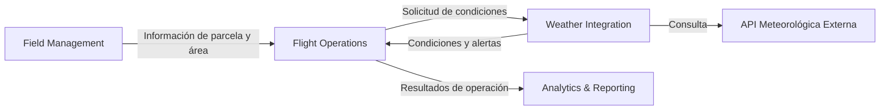
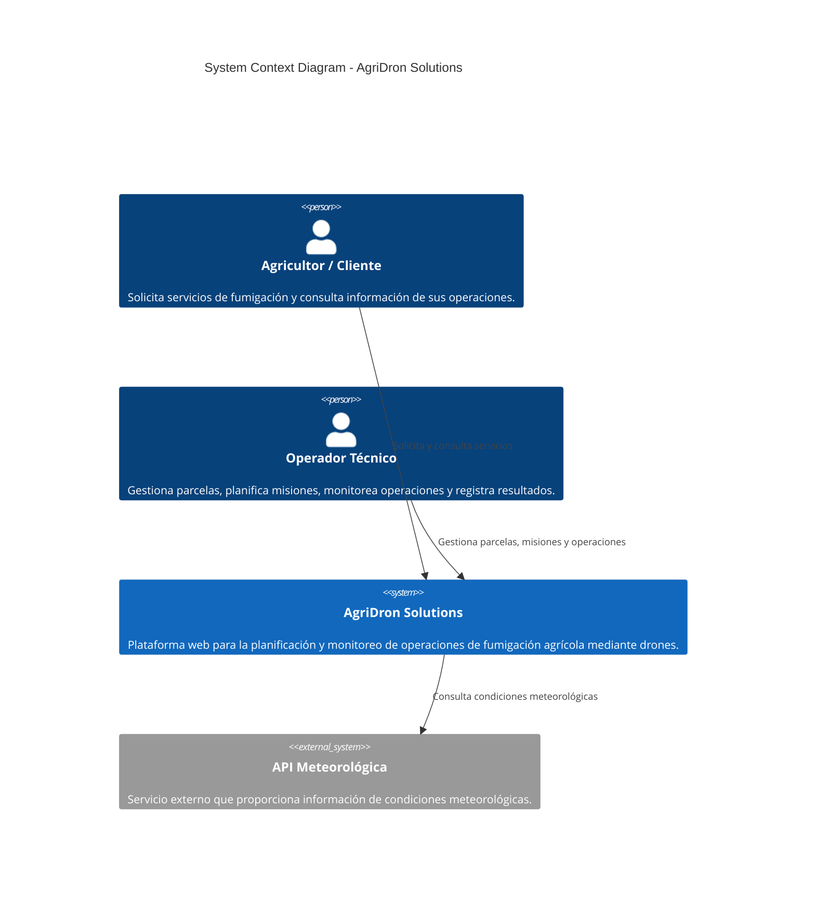
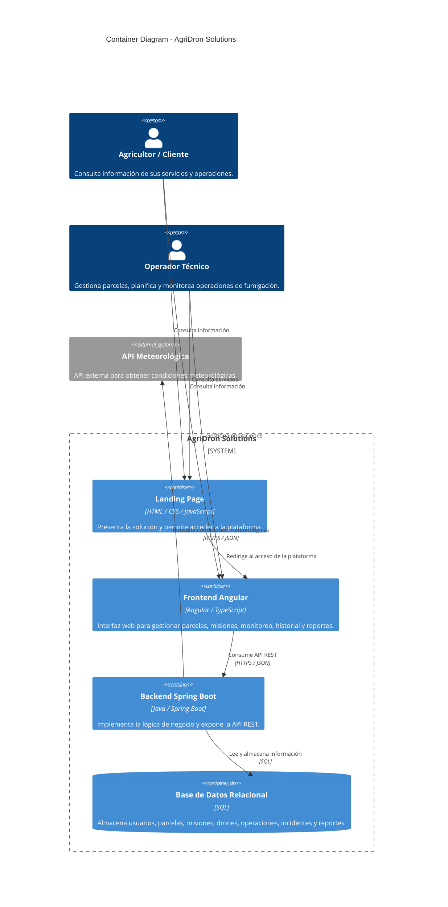

## **Universidad Peruana de Ciencias Aplicadas**
### Carrera de Ingeniería de Software
 

**Curso: Desarrollo de Aplicaciones Open Source**

**NRC: [NRC]**

**Docente: [NOMBRE DEL DOCENTE]**
 

### **Informe del Trabajo Final**

**Nombre de la Startup:** [NOMBRE DE LA STARTUP]

**Nombre del producto:** [NOMBRE DEL PRODUCTO]
 

### **Integrantes**

<table align="center" style="border-collapse: collapse; border: none; margin-left: auto; margin-right: auto;">
    <tr>
        <th style="border: none; padding: 0 18px 6px 0; text-align: center;">Código</th>
        <th style="border: none; padding: 0 0 6px 0; text-align: center;">Apellidos y Nombres</th>
    </tr>
    <tr>
        <td style="border: none; padding: 0 18px 4px 0; text-align: center;">[CÓDIGO]</td>
        <td style="border: none; padding: 0 0 4px 0; text-align: center;">[APELLIDOS Y NOMBRES]</td>
    </tr>
    <tr>
        <td style="border: none; padding: 0 18px 4px 0; text-align: center;">[CÓDIGO]</td>
        <td style="border: none; padding: 0 0 4px 0; text-align: center;">[APELLIDOS Y NOMBRES]</td>
    </tr>
    <tr>
        <td style="border: none; padding: 0 18px 4px 0; text-align: center;">[CÓDIGO]</td>
        <td style="border: none; padding: 0 0 4px 0; text-align: center;">[APELLIDOS Y NOMBRES]</td>
    </tr>
    <tr>
        <td style="border: none; padding: 0 18px 4px 0; text-align: center;">[CÓDIGO]</td>
        <td style="border: none; padding: 0 0 4px 0; text-align: center;">[APELLIDOS Y NOMBRES]</td>
    </tr>
    <tr>
        <td style="border: none; padding: 0 18px 4px 0; text-align: center;">[CÓDIGO]</td>
        <td style="border: none; padding: 0 0 4px 0; text-align: center;">[APELLIDOS Y NOMBRES]</td>
    </tr>
    <tr>
        <td style="border: none; padding: 0 18px 4px 0; text-align: center;">[CÓDIGO]</td>
        <td style="border: none; padding: 0 0 4px 0; text-align: center;">[APELLIDOS Y NOMBRES]</td>
    </tr>
</table>
 

<b><i>Septiembre, 2026</i></b>

 

---

## Registro de Versiones

| Versión | Fecha | Autor | Descripción |
| :--- | :--- | :--- | :--- |
| 0.1.0 | 05/09/2026 | Sebastián Sayago | Creación inicial del documento. |
| 0.2.0 | 06/09/2026 | Sebastián Sayago | Implementación inicial del capitulo 1 |

---

# Contenido

## Tabla de Contenido

- [Contenido](#contenido)
  - [Tabla de Contenido](#tabla-de-contenido)
  - [Student Outcome](#student-outcome)
  - [Capítulo I: Introducción](#capítulo-i-introducción)
    - [1.1. Startup Profile](#11-startup-profile)
      - [1.1.1. Descripción de la Startup](#111-descripción-de-la-startup)
      - [1.1.2. Perfiles de integrantes del equipo](#112-perfiles-de-integrantes-del-equipo)
    - [1.2. Solution Profile](#12-solution-profile)
      - [1.2.1. Antecedentes y problemática](#121-antecedentes-y-problemática)
      - [1.2.2. Lean UX Process](#122-lean-ux-process)
        - [1.2.2.1. Lean UX Problem Statements](#1221-lean-ux-problem-statements)
        - [1.2.2.2. Lean UX Assumptions](#1222-lean-ux-assumptions)
        - [1.2.2.3. Lean UX Hypothesis Statements](#1223-lean-ux-hypothesis-statements)
        - [1.2.2.4. Lean UX Canvas](#1224-lean-ux-canvas)
    - [1.3. Segmentos objetivo](#13-segmentos-objetivo)
  - [Capítulo II: Requirements Elicitation & Analysis](#capítulo-ii-requirements-elicitation--analysis)
    - [2.1. Competidores](#21-competidores)
      - [2.1.1. Análisis competitivo](#211-análisis-competitivo)
      - [2.1.2. Estrategias y tácticas frente a competidores](#212-estrategias-y-tácticas-frente-a-competidores)
    - [2.2. Entrevistas](#22-entrevistas)
      - [2.2.1. Diseño de entrevistas](#221-diseño-de-entrevistas)
      - [2.2.2. Registro de entrevistas](#222-registro-de-entrevistas)
      - [2.2.3. Análisis de entrevistas](#223-análisis-de-entrevistas)
    - [2.3. Needfinding](#23-needfinding)
      - [2.3.1. User Personas](#231-user-personas)
      - [2.3.2. User Task Matrix](#232-user-task-matrix)
      - [2.3.3. User Journey Mapping](#233-user-journey-mapping)
      - [2.3.4. Empathy Mapping](#234-empathy-mapping)
    - [2.4. Big Picture EventStorming](#24-big-picture-eventstorming)
    - [2.5. Ubiquitous Language](#25-ubiquitous-language)
  - [Capítulo III: Requirements Specification](#capítulo-iii-requirements-specification)
    - [3.1. User Stories](#31-user-stories)
    - [3.2. Impact Mapping](#32-impact-mapping)
    - [3.3. Product Backlog](#33-product-backlog)
  - [Capítulo IV: Product Design](#capítulo-iv-product-design)
    - [4.1. Style Guidelines](#41-style-guidelines)
      - [4.1.1. General Style Guidelines](#411-general-style-guidelines)
      - [4.1.2. Web Style Guidelines](#412-web-style-guidelines)
    - [4.2. Information Architecture](#42-information-architecture)
      - [4.2.1. Organization Systems](#421-organization-systems)
      - [4.2.2. Labeling Systems](#422-labeling-systems)
      - [4.2.3. SEO Tags and Meta Tags](#423-seo-tags-and-meta-tags)
      - [4.2.4. Searching Systems](#424-searching-systems)
      - [4.2.5. Navigation Systems](#425-navigation-systems)
    - [4.3. Landing Page UI Design](#43-landing-page-ui-design)
      - [4.3.1. Landing Page Wireframe](#431-landing-page-wireframe)
      - [4.3.2. Landing Page Mock-up](#432-landing-page-mock-up)
    - [4.4. Web Applications UX/UI Design](#44-web-applications-uxui-design)
      - [4.4.1. Web Applications Wireframes](#441-web-applications-wireframes)
      - [4.4.2. Web Applications Wireflow Diagrams](#442-web-applications-wireflow-diagrams)
      - [4.4.3. Web Applications Mock-ups](#443-web-applications-mock-ups)
      - [4.4.4. Web Applications User Flow Diagrams](#444-web-applications-user-flow-diagrams)
    - [4.5. Web Applications Prototyping](#45-web-applications-prototyping)
    - [4.6. Domain-Driven Software Architecture](#46-domain-driven-software-architecture)
      - [4.6.1. Design-Level Event Storming](#461-design-level-event-storming)
      - [4.6.2. Software Architecture Context Diagram](#462-software-architecture-context-diagram)
      - [4.6.3. Software Architecture Container Diagrams](#463-software-architecture-container-diagrams)
      - [4.6.4. Software Architecture Components Diagrams](#464-software-architecture-components-diagrams)
    - [4.7. Software Object-Oriented Design](#47-software-object-oriented-design)
      - [4.7.1. Class Diagrams](#471-class-diagrams)
    - [4.8. Database Design](#48-database-design)
      - [4.8.1. Database Diagrams](#481-database-diagrams)
  - [Capítulo V: Product Implementation, Validation & Deployment](#capítulo-v-product-implementation-validation--deployment)
    - [5.1. Software Configuration Management](#51-software-configuration-management)
      - [5.1.1. Software Development Environment Configuration](#511-software-development-environment-configuration)
      - [5.1.2. Source Code Management](#512-source-code-management)
      - [5.1.3. Source Code Style Guide & Conventions](#513-source-code-style-guide--conventions)
      - [5.1.4. Software Deployment Configuration](#514-software-deployment-configuration)
    - [5.2. Landing Page, Services & Applications Implementation](#52-landing-page-services--applications-implementation)
      - [5.2.1. Sprint 1](#521-sprint-1)
        - [5.2.1.1. Sprint Planning 1](#5211-sprint-planning-1)
        - [5.2.1.2. Aspect Leaders and Collaborators](#5212-aspect-leaders-and-collaborators)
        - [5.2.1.3. Sprint Backlog 1](#5213-sprint-backlog-1)
        - [5.2.1.4. Development Evidence for Sprint Review](#5214-development-evidence-for-sprint-review)
        - [5.2.1.5. Execution Evidence for Sprint Review](#5215-execution-evidence-for-sprint-review)
        - [5.2.1.6. Services Documentation Evidence for Sprint Review](#5216-services-documentation-evidence-for-sprint-review)
        - [5.2.1.7. Software Deployment Evidence for Sprint Review](#5217-software-deployment-evidence-for-sprint-review)
        - [5.2.1.8. Team Collaboration Insights during Sprint](#5218-team-collaboration-insights-during-sprint)
    - [5.3. Validation Interviews](#53-validation-interviews)
      - [5.3.1. Interview Design](#531-interview-design)
      - [5.3.2. Interview Registry](#532-interview-registry)
      - [5.3.3. Heuristic Evaluations](#533-heuristic-evaluations)
    - [5.4. Video About-the-Product](#54-video-about-the-product)
  - [Conclusiones](#conclusiones)
  - [Bibliografía](#bibliografía)
  - [Anexos](#anexos)

---

## Student Outcome

> **[PEGAR AQUÍ EL STUDENT OUTCOME CORRESPONDIENTE A LA ENTREGA]**
>
> **Criterio:** [PEGAR AQUÍ EL CRITERIO]
>
> En el siguiente cuadro se describe las acciones realizadas y enunciados de conclusiones por parte del grupo, que permiten sustentar el haber alcanzado el logro del Student Outcome.

<table>
  <thead>
    <tr>
      <th>Criterio específico</th>
      <th>Acciones realizadas</th>
      <th>Conclusiones</th>
    </tr>
  </thead>
  <tbody>
    <tr>
      <td><strong>[CRITERIO ESPECÍFICO 1]</strong></td>
      <td>
        
<b>[INTEGRANTE 1]</b> 

        
<em><b>AV1</b></em> [ACCIÓN REALIZADA]

         
        <b>[INTEGRANTE 2]</b> 
        <em><b>AV1</b></em> [ACCIÓN REALIZADA]
          
        <b>[REPETIR PARA TODOS LOS INTEGRANTES]</b>
      </td>
      <td>[CONCLUSIÓN]</td>
    </tr>
    <tr>
      <td><strong>[CRITERIO ESPECÍFICO 2]</strong></td>
      <td>
        
<b>[INTEGRANTE 1]</b> 

        
<em><b>AV1</b></em> [ACCIÓN REALIZADA]

         
        <b>[INTEGRANTE 2]</b> 
        <em><b>AV1</b></em> [ACCIÓN REALIZADA]
          
        <b>[REPETIR PARA TODOS LOS INTEGRANTES]</b>
      </td>
      <td>[CONCLUSIÓN]</td>
    </tr>
  </tbody>
</table>

---

# Capítulo I: Introducción

## 1.1. Startup Profile

### 1.1.1. Descripción de la Startup

<strong>AgriDron Solutions</strong> es una startup orientada al desarrollo de soluciones tecnológicas para el sector agrícola, enfocada en mejorar la planificación y el monitoreo de operaciones de fumigación mediante drones. La startup busca centralizar en una plataforma web las principales actividades relacionadas con estas operaciones, facilitando la gestión de parcelas, la planificación de misiones, la consulta de condiciones meteorológicas y el seguimiento de las operaciones realizadas.

La propuesta de AgriDron Solutions consiste en desarrollar una plataforma web que permita a los agricultores registrar y administrar sus fincas y parcelas, seleccionar mediante un mapa interactivo el área que desean fumigar, crear y gestionar misiones de fumigación y consultar información meteorológica mediante una API externa. Asimismo, la plataforma contará con un módulo de monitoreo que permitirá visualizar el estado y la ubicación de los drones durante una misión mediante datos inicialmente simulados.

Finalmente, la solución permitirá consultar el historial de las misiones realizadas y generar reportes de las operaciones, además de manejar diferentes roles de usuario, como agricultor, operador y técnico.

Misión: [DEFINIR MISIÓN DE AGRIDRON SOLUTIONS]

Visión: [DEFINIR VISIÓN DE AGRIDRON SOLUTIONS]

Valores:

<ul> <li>[VALOR 1]</li> 
    <li>[VALOR 2]</li> 
    <li>[VALOR 3]</li> 
    <li>[VALOR 4]</li> 
</ul>

### 1.1.2. Perfiles de integrantes del equipo

> Para cada integrante, colocar foto, nombre, código, descripción y aporte/rol dentro del proyecto.

<table>
  <tr>
    <td rowspan="4" align="center">
      
    </td>
  </tr>
  <tr>
    <td><b>Nombre:</b> [NOMBRE COMPLETO]</td>
  </tr>
  <tr>
    <td><b>Código:</b> [CÓDIGO]</td>
  </tr>
  <tr>
    <td>
      <b>Descripción:</b> 
      [DESCRIPCIÓN DEL PERFIL, CONOCIMIENTOS Y HABILIDADES.]
        
      [APORTE Y FUNCIÓN DENTRO DEL EQUIPO.]
    </td>
  </tr>
    <tr>
    <td rowspan="4" align="center">
      
    </td>
  </tr>
  <tr>
    <td><b>Nombre:</b> [NOMBRE COMPLETO]</td>
  </tr>
  <tr>
    <td><b>Código:</b> [CÓDIGO]</td>
  </tr>
  <tr>
    <td>
      <b>Descripción:</b> 
      [DESCRIPCIÓN DEL PERFIL, CONOCIMIENTOS Y HABILIDADES.]
        
      [APORTE Y FUNCIÓN DENTRO DEL EQUIPO.]
    </td>
  </tr>
    <tr>
    <td rowspan="4" align="center">
      
    </td>
  </tr>
  <tr>
    <td><b>Nombre:</b> [NOMBRE COMPLETO]</td>
  </tr>
  <tr>
    <td><b>Código:</b> [CÓDIGO]</td>
  </tr>
  <tr>
    <td>
      <b>Descripción:</b> 
      [DESCRIPCIÓN DEL PERFIL, CONOCIMIENTOS Y HABILIDADES.]
        
      [APORTE Y FUNCIÓN DENTRO DEL EQUIPO.]
    </td>
  </tr>
    <tr>
    <td rowspan="4" align="center">
      
    </td>
  </tr>
  <tr>
    <td><b>Nombre:</b> [NOMBRE COMPLETO]</td>
  </tr>
  <tr>
    <td><b>Código:</b> [CÓDIGO]</td>
  </tr>
  <tr>
    <td>
      <b>Descripción:</b> 
      [DESCRIPCIÓN DEL PERFIL, CONOCIMIENTOS Y HABILIDADES.]
        
      [APORTE Y FUNCIÓN DENTRO DEL EQUIPO.]
    </td>
  </tr>
    <tr>
    <td rowspan="4" align="center">
      
    </td>
  </tr>
  <tr>
    <td><b>Nombre:</b> [NOMBRE COMPLETO]</td>
  </tr>
  <tr>
    <td><b>Código:</b> [CÓDIGO]</td>
  </tr>
  <tr>
    <td>
      <b>Descripción:</b> 
      [DESCRIPCIÓN DEL PERFIL, CONOCIMIENTOS Y HABILIDADES.]
        
      [APORTE Y FUNCIÓN DENTRO DEL EQUIPO.]
    </td>
  </tr>
</table>

 

[REPETIR BLOQUE PARA CADA INTEGRANTE.]

---

## 1.2. Solution Profile

<strong>AgriDron Solutions</strong> propone una plataforma web para la planificación y monitoreo de operaciones de fumigación agrícola mediante drones. La solución busca centralizar las actividades que intervienen en una operación, desde la gestión de las fincas y parcelas hasta la creación, seguimiento y consulta posterior de las misiones.

El usuario podrá registrar sus fincas y parcelas, seleccionar mediante un mapa interactivo el área que desea fumigar y crear una misión de fumigación. Antes de realizar la operación, podrá consultar las condiciones meteorológicas mediante una API externa. Durante la misión, el sistema permitirá visualizar el estado y ubicación del dron utilizando inicialmente datos simulados. Posteriormente, el usuario podrá consultar el historial y los reportes de las operaciones realizadas.

### 1.2.1. Antecedentes y problemática

1.2.1.1. What

El problema se relaciona con la planificación y monitoreo de operaciones de fumigación agrícola mediante drones. Estas operaciones requieren gestionar información sobre las fincas y parcelas, definir el área que será fumigada, planificar las misiones, consultar las condiciones meteorológicas y realizar un seguimiento de la operación.

Actualmente, estas actividades pueden requerir coordinación manual y el uso de diferentes medios para gestionar la información relacionada con una misión, dificultando su centralización y seguimiento.

1.2.1.2. Where

La problemática se presenta en el contexto de las operaciones agrícolas en las que se utilizan drones para realizar actividades de fumigación sobre diferentes fincas y parcelas.

1.2.1.3. When

La problemática se presenta principalmente durante las diferentes etapas de una operación de fumigación: al planificar una misión, definir el área que será fumigada, verificar las condiciones meteorológicas, realizar el seguimiento de la misión y consultar posteriormente la información de la operación.

1.2.1.4. Who

Los principales usuarios involucrados son los agricultores responsables de gestionar las operaciones de fumigación, así como los operadores y técnicos relacionados con la ejecución y supervisión de las misiones mediante drones.

1.2.1.5. Why

La problemática surge debido a la necesidad de coordinar diferentes actividades e información asociadas a una operación de fumigación. La gestión separada de las parcelas, áreas de fumigación, condiciones meteorológicas, misiones y seguimiento de los drones puede dificultar la organización y consulta de la información.

1.2.1.6. How

AgriDron Solutions abordará esta problemática mediante una plataforma web que centralice la gestión de fincas y parcelas, la definición de áreas de fumigación mediante un mapa interactivo, la creación y gestión de misiones, la consulta de información meteorológica mediante una API externa, el monitoreo simulado de los drones y la consulta de reportes e historial de operaciones.

1.2.1.7. How much

[DEFINIR MODELO DE NEGOCIO, COSTOS, PRECIOS, PROYECCIONES U OTROS ASPECTOS ECONÓMICOS DE AGRIDRON SOLUTIONS.]

### 1.2.2. Lean UX Process

#### 1.2.2.1. Lean UX Problem Statements

**Problem Statement 1**

[PEGAR AQUÍ EL PROBLEM STATEMENT.]

**Problem Statement 2**

[PEGAR AQUÍ EL PROBLEM STATEMENT.]

[AGREGAR MÁS SI CORRESPONDE.]

#### 1.2.2.2. Lean UX Assumptions

**1.2.2.2.1. ¿Quién es el usuario?**

[RESPUESTA.]

**1.2.2.2.2. ¿Dónde encaja nuestro producto en su trabajo o vida?**

[RESPUESTA.]

**1.2.2.2.3. ¿Qué problemas tiene nuestro producto y cómo se pueden resolver?**

<ul>
  <li>[PROBLEMA / SOLUCIÓN]</li>
  <li>[PROBLEMA / SOLUCIÓN]</li>
</ul>

**1.2.2.2.4. ¿Cuándo y cómo es usado nuestro producto?**

[RESPUESTA.]

**1.2.2.2.5. ¿Qué características son importantes?**

<ul>
  <li>[CARACTERÍSTICA 1]</li>
  <li>[CARACTERÍSTICA 2]</li>
  <li>[CARACTERÍSTICA 3]</li>
</ul>

**1.2.2.2.6. ¿Cómo debe verse nuestro producto y cómo debe comportarse?**

[RESPUESTA.]

**1.2.2.2.7. Business Outcomes**

<ul>
  <li>[BUSINESS OUTCOME 1]</li>
  <li>[BUSINESS OUTCOME 2]</li>
  <li>[BUSINESS OUTCOME 3]</li>
</ul>

**1.2.2.2.8. User Outcomes**

<ul>
  <li>[USER OUTCOME 1]</li>
  <li>[USER OUTCOME 2]</li>
  <li>[USER OUTCOME 3]</li>
</ul>

**1.2.2.2.9. Features**

<ul>
  <li>[FEATURE 1]</li>
  <li>[FEATURE 2]</li>
  <li>[FEATURE 3]</li>
</ul>

#### 1.2.2.3. Lean UX Hypothesis Statements

**Hypothesis Statement 1**

[PEGAR AQUÍ LA HIPÓTESIS.]

**Hypothesis Statement 2**

[PEGAR AQUÍ LA HIPÓTESIS.]

[AGREGAR MÁS SI CORRESPONDE.]

#### 1.2.2.4. Lean UX Canvas

**Descripción:**

[EXPLICAR BREVEMENTE EL LEAN UX CANVAS.]

### 1.3. Segmentos objetivo

#### 1.3.1. [SEGMENTO OBJETIVO 1]

[DESCRIPCIÓN DEL SEGMENTO, NECESIDADES Y RELACIÓN CON LA SOLUCIÓN.]

#### 1.3.2. [SEGMENTO OBJETIVO 2]

[DESCRIPCIÓN DEL SEGMENTO, NECESIDADES Y RELACIÓN CON LA SOLUCIÓN.]

[AGREGAR MÁS SEGMENTOS SI CORRESPONDE.]

---

# Capítulo II: Requirements Elicitation & Analysis

## 2.1. Competidores

### 2.1.1. Análisis competitivo

[PEGAR AQUÍ LA MATRIZ / TABLA DE ANÁLISIS COMPETITIVO.]

| Criterio | Competidor 1 | Competidor 2 | Competidor 3 | Nuestra solución |
| :--- | :--- | :--- | :--- | :--- |
| [CRITERIO] | [DATO] | [DATO] | [DATO] | [DATO] |
| [CRITERIO] | [DATO] | [DATO] | [DATO] | [DATO] |
| [CRITERIO] | [DATO] | [DATO] | [DATO] | [DATO] |

### 2.1.2. Estrategias y tácticas frente a competidores

[DESCRIBIR LAS ESTRATEGIAS Y TÁCTICAS QUE PERMITIRÁN DIFERENCIAR LA SOLUCIÓN.]

---

## 2.2. Entrevistas

### 2.2.1. Diseño de entrevistas

**Objetivo de la entrevista:**

[DESCRIBIR OBJETIVO.]

**Segmento entrevistado:**

[DESCRIBIR SEGMENTO.]

**Cantidad de entrevistados:**

[CANTIDAD]

**Preguntas generales**

1. [PREGUNTA]
2. [PREGUNTA]
3. [PREGUNTA]

**Preguntas específicas del segmento 1**

1. [PREGUNTA]
2. [PREGUNTA]
3. [PREGUNTA]

**Preguntas específicas del segmento 2**

1. [PREGUNTA]
2. [PREGUNTA]
3. [PREGUNTA]

### 2.2.2. Registro de entrevistas

[PARA CADA ENTREVISTA, COMPLETAR EL SIGUIENTE FORMATO.]

#### Entrevista [NÚMERO]

| Campo | Información |
| :--- | :--- |
| Entrevistado | [NOMBRE / IDENTIFICADOR] |
| Edad | [EDAD] |
| Segmento | [SEGMENTO] |
| Fecha | [FECHA] |
| Modalidad | [PRESENCIAL / VIRTUAL] |
| Lugar | [LUGAR] |

**Registro / respuestas:**

| N.º | Pregunta | Respuesta |
| :--- | :--- | :--- |
| 1 | [PREGUNTA] | [RESPUESTA] |
| 2 | [PREGUNTA] | [RESPUESTA] |
| 3 | [PREGUNTA] | [RESPUESTA] |

**Evidencia:**

### 2.2.3. Análisis de entrevistas

[RESUMIR LOS HALLAZGOS PRINCIPALES DE LAS ENTREVISTAS.]

| Hallazgo | Evidencia / entrevista | Necesidad identificada | Implicación para la solución |
| :--- | :--- | :--- | :--- |
| [HALLAZGO] | [EVIDENCIA] | [NECESIDAD] | [IMPLICACIÓN] |
| [HALLAZGO] | [EVIDENCIA] | [NECESIDAD] | [IMPLICACIÓN] |

---

## 2.3. Needfinding

### 2.3.1. User Personas

#### Persona 1: [NOMBRE]

**Descripción:**

[DESCRIPCIÓN.]

**Necesidades:**

- [NECESIDAD 1]
- [NECESIDAD 2]

**Objetivos:**

- [OBJETIVO 1]
- [OBJETIVO 2]

**Frustraciones:**

- [FRUSTRACIÓN 1]
- [FRUSTRACIÓN 2]

#### Persona 2: [NOMBRE]

[REPETIR ESTRUCTURA.]

### 2.3.2. User Task Matrix

[PEGAR / CONSTRUIR AQUÍ LA MATRIZ DE TAREAS.]

| Tarea | Usuario | Frecuencia | Importancia | Dificultad | Problemas actuales |
| :--- | :--- | :--- | :--- | :--- | :--- |
| [TAREA] | [USUARIO] | [ALTA/MEDIA/BAJA] | [ALTA/MEDIA/BAJA] | [ALTA/MEDIA/BAJA] | [PROBLEMA] |
| [TAREA] | [USUARIO] | [ALTA/MEDIA/BAJA] | [ALTA/MEDIA/BAJA] | [ALTA/MEDIA/BAJA] | [PROBLEMA] |

### 2.3.3. User Journey Mapping

**Descripción:**

[EXPLICAR EL JOURNEY MAP Y LOS PRINCIPALES PUNTOS DE DOLOR.]

### 2.3.4. Empathy Mapping

**Descripción:**

[EXPLICAR EL EMPATHY MAP.]

---

## 2.4. Big Picture EventStorming
asdasdasdasdasfsdsd

**Descripción:**

[EXPLICAR EL FLUJO GENERAL DEL DOMINIO, EVENTOS PRINCIPALES, ACTORES Y PROCESOS IDENTIFICADOS.]

---

## 2.5. Ubiquitous Language

| Término | Definición |
| :--- | :--- |
| [TÉRMINO] | [DEFINICIÓN DENTRO DEL DOMINIO] |
| [TÉRMINO] | [DEFINICIÓN DENTRO DEL DOMINIO] |
| [TÉRMINO] | [DEFINICIÓN DENTRO DEL DOMINIO] |

---

# Capítulo III: Requirements Specification

## 3.1. User Stories

> Registrar las User Stories como texto, incluyendo criterios de aceptación.

| ID | Título | Descripción | Criterios de Aceptación | Epic |
| :--- | :--- | :--- | :--- | :--- |
| US-001 | [TÍTULO] | Como [ROL], quiero [ACCIÓN], para [BENEFICIO]. | 1. [CRITERIO] 2. [CRITERIO] | EP-001 |
| US-002 | [TÍTULO] | Como [ROL], quiero [ACCIÓN], para [BENEFICIO]. | 1. [CRITERIO] 2. [CRITERIO] | EP-001 |

---

## 3.2. Impact Mapping

**Descripción:**

[EXPLICAR EL IMPACT MAP: OBJETIVO, ACTORES, IMPACTOS Y ENTREGABLES.]

---

## 3.3. Product Backlog

| ID | Epic | User Story | Prioridad | Story Points | Estado |
| :--- | :--- | :--- | :--- | :---: | :--- |
| US-001 | [EPIC] | [USER STORY] | [ALTA/MEDIA/BAJA] | [SP] | [ESTADO] |
| US-002 | [EPIC] | [USER STORY] | [ALTA/MEDIA/BAJA] | [SP] | [ESTADO] |

---

# Capítulo IV: Product Design

## 4.1. Style Guidelines

### 4.1.1. General Style Guidelines

[PEGAR AQUÍ LAS GENERAL STYLE GUIDELINES.]

### 4.1.2. Web Style Guidelines

[PEGAR AQUÍ LAS WEB STYLE GUIDELINES.]

---

## 4.2. Information Architecture

### 4.2.1. Organization Systems

[PEGAR AQUÍ LA INFORMACIÓN.]

### 4.2.2. Labeling Systems

[PEGAR AQUÍ LA INFORMACIÓN.]

### 4.2.3. SEO Tags and Meta Tags

[PEGAR AQUÍ LA INFORMACIÓN.]

### 4.2.4. Searching Systems

[PEGAR AQUÍ LA INFORMACIÓN.]

### 4.2.5. Navigation Systems

[PEGAR AQUÍ LA INFORMACIÓN.]

---

## 4.3. Landing Page UI Design

### 4.3.1. Landing Page Wireframe

**Descripción:**

[DESCRIPCIÓN DEL WIREFRAME.]

### 4.3.2. Landing Page Mock-up

**Descripción:**

[DESCRIPCIÓN DEL MOCK-UP.]

---

## 4.4. Web Applications UX/UI Design

### 4.4.1. Web Applications Wireframes

[PEGAR AQUÍ LOS WIREFRAMES.]

### 4.4.2. Web Applications Wireflow Diagrams

[PEGAR AQUÍ LOS WIREFLOWS.]

### 4.4.3. Web Applications Mock-ups

[PEGAR AQUÍ LOS MOCK-UPS.]

### 4.4.4. Web Applications User Flow Diagrams

[PEGAR AQUÍ LOS USER FLOWS.]

---

## 4.5. Web Applications Prototyping

[PEGAR AQUÍ EL ENLACE / EVIDENCIA DEL PROTOTIPO.]

---

## 4.6. Domain-Driven Software Architecture

### 4.6.1. Design-Level Event Storming
El **Design-Level Event Storming** permite representar el flujo principal del dominio de AgriDron Solutions mediante comandos, eventos de dominio, actores, políticas y agregados. A partir de este análisis se identifican cuatro áreas principales del dominio y se particiona la solución en los siguientes **Bounded Contexts**:

1. **Field Management**
2. **Flight Operations**
3. **Weather Integration**
4. **Analytics & Reporting**

### Flujo principal del dominio

El flujo comienza cuando un agricultor solicita un servicio de fumigación y termina con el registro de los resultados y la generación de información histórica para consulta.

```mermaid
flowchart LR
    A["Agricultor / Cliente"] --> C1["Registrar parcela"]
    C1 --> E1["Parcela registrada"]
    E1 --> C2["Delimitar área de fumigación"]
    C2 --> E2["Área de fumigación delimitada"]
    E2 --> C3["Crear misión"]
    C3 --> E3["Misión creada"]
    E3 --> C4["Programar misión"]
    C4 --> E4["Misión programada"]
    E4 --> P1{"Política: verificar condiciones meteorológicas"}
    P1 --> C5["Consultar condiciones meteorológicas"]
    C5 --> E5["Condiciones meteorológicas obtenidas"]
    E5 --> P2{"Política: evaluar condiciones"}
    P2 -->|Condiciones favorables| E6["Misión autorizada"]
    P2 -->|Condiciones desfavorables| E7["Alerta meteorológica generada"]
    E6 --> C6["Iniciar operación"]
    C6 --> E8["Operación iniciada"]
    E8 --> C7["Monitorear operación"]
    C7 --> E9["Estado de operación actualizado"]
    E9 --> P3{"¿Ocurrió un incidente?"}
    P3 -->|Sí| C8["Registrar incidente"]
    C8 --> E10["Incidente registrado"]
    E10 --> C7
    P3 -->|No| C9["Finalizar operación"]
    C9 --> E11["Operación finalizada"]
    E11 --> C10["Registrar resultado"]
    C10 --> E12["Resultado de misión registrado"]
    E12 --> C11["Actualizar historial"]
    C11 --> E13["Historial actualizado"]
    E13 --> C12["Generar reporte"]
    C12 --> E14["Reporte generado"]
```

### Actores principales

| Actor | Responsabilidad |
|---|---|
| **Agricultor / Cliente** | Solicita servicios y consulta información de sus operaciones. |
| **Operador técnico** | Registra y planifica misiones, verifica condiciones, ejecuta y monitorea operaciones y registra resultados. |
| **Sistema meteorológico externo** | Proporciona información climática para apoyar la planificación. |

### Comandos

| Comando | Origen | Propósito |
|---|---|---|
| Registrar parcela | Operador | Crear información de una parcela agrícola. |
| Delimitar área de fumigación | Operador | Definir el área que será tratada. |
| Crear misión | Operador | Crear una operación de fumigación asociada a una parcela. |
| Programar misión | Operador | Definir fecha y hora planificadas. |
| Consultar condiciones meteorológicas | Sistema | Obtener información climática de la API externa. |
| Iniciar operación | Operador | Marcar el inicio de la misión. |
| Monitorear operación | Operador / Sistema | Actualizar estado y ubicación simulada del dron. |
| Registrar incidente | Operador | Registrar situaciones inesperadas. |
| Finalizar operación | Operador | Marcar la finalización de la misión. |
| Registrar resultado | Operador | Registrar hectáreas tratadas, volumen aplicado y observaciones. |
| Actualizar historial | Sistema | Incorporar la misión finalizada al historial. |
| Generar reporte | Usuario / Sistema | Generar información consolidada de la operación. |

### Eventos de dominio

| Evento | Descripción |
|---|---|
| **Parcela registrada** | Se creó una parcela con su información básica. |
| **Área de fumigación delimitada** | Se definió geográficamente el área que será tratada. |
| **Misión creada** | Se creó una nueva misión. |
| **Misión programada** | La misión tiene fecha y hora planificadas. |
| **Condiciones meteorológicas obtenidas** | El sistema recibió información climática externa. |
| **Misión autorizada** | Las condiciones disponibles permiten continuar con la planificación. |
| **Alerta meteorológica generada** | Las condiciones requieren advertencia, pausa o reprogramación. |
| **Operación iniciada** | Comenzó la ejecución de la misión. |
| **Estado de operación actualizado** | Se actualizó el estado o ubicación simulada del dron. |
| **Incidente registrado** | Se registró una situación inesperada. |
| **Operación finalizada** | Terminó la ejecución de la misión. |
| **Resultado de misión registrado** | Se registraron las métricas y observaciones finales. |
| **Historial actualizado** | La misión finalizada está disponible como antecedente. |
| **Reporte generado** | Se generó información consolidada. |

### Políticas y reglas de negocio

| Política | Regla |
|---|---|
| **Verificación meteorológica previa** | Antes de iniciar una misión se deben consultar las condiciones meteorológicas disponibles. |
| **Evaluación de condiciones** | Si las condiciones son desfavorables, se genera una alerta para apoyar la decisión de pausar o reprogramar. |
| **Registro de incidentes** | Una incidencia debe quedar registrada para mantener trazabilidad. |
| **Registro de resultados** | Una misión finalizada debe conservar información sobre el trabajo realizado. |
| **Actualización del historial** | Los resultados de misiones finalizadas deben estar disponibles para consultas posteriores. |

### Agregados principales

- **Farm / Parcel:** concentra información territorial y agrícola.
- **Mission:** concentra la información principal de una operación y su ciclo de vida.
- **Drone:** representa el recurso utilizado para ejecutar una misión.
- **Mission Report:** concentra los resultados registrados al finalizar una operación.

---

# 4.6.1.1. Bounded Contexts

La partición del dominio se realiza considerando las responsabilidades y conceptos principales de la solución.

## Bounded Context 1: Field Management

**Responsabilidad:** administrar la información de campos y parcelas utilizada para planificar servicios.

**Conceptos:** campo, parcela, cultivo, ubicación, área de fumigación y coordenadas.

**Operaciones:** registrar/actualizar parcela, visualizarla en mapa, delimitar área y asociar cultivo.

**Eventos:** `ParcelaRegistrada`, `AreaFumigacionDelimitada`, `InformacionCultivoRegistrada`.

## Bounded Context 2: Flight Operations

**Responsabilidad:** gestionar la planificación, ejecución y seguimiento de misiones.

**Conceptos:** misión, dron, programación, estado, operación, incidente y hectáreas tratadas.

**Operaciones:** crear/programar misión, iniciar operación, actualizar estado, registrar incidentes, finalizar operación y registrar resultados.

**Eventos:** `MisionCreada`, `MisionProgramada`, `OperacionIniciada`, `EstadoOperacionActualizado`, `IncidenteRegistrado`, `OperacionFinalizada`.

## Bounded Context 3: Weather Integration

**Responsabilidad:** encapsular la integración con la API meteorológica y proporcionar información climática para apoyar la planificación.

**Conceptos:** consulta meteorológica, condición, viento, temperatura, humedad, precipitación y alerta.

**Operaciones:** consultar condiciones, consultar pronóstico, evaluar condiciones y generar alertas.

**Eventos:** `CondicionesMeteorologicasObtenidas`, `CondicionesEvaluadas`, `AlertaMeteorologicaGenerada`.

## Bounded Context 4: Analytics & Reporting

**Responsabilidad:** conservar y presentar información histórica de las operaciones.

**Conceptos:** historial, resultado, reporte, estadística y métrica.

**Operaciones:** registrar resultados, consultar historial, consolidar métricas y generar reportes.

**Eventos:** `ResultadoMisionRegistrado`, `HistorialActualizado`, `ReporteGenerado`.

### Relación entre Bounded Contexts

### Justificación

- **Field Management** mantiene la información territorial.
- **Flight Operations** gestiona el ciclo de vida de la misión.
- **Weather Integration** aísla la dependencia externa de información meteorológica.
- **Analytics & Reporting** transforma resultados en información histórica y reportes.

### 4.6.2. Software Architecture Context Diagram
El **System Context Diagram de C4** representa el sistema como una única unidad y muestra los usuarios y sistemas externos que interactúan directamente con él. En este nivel no se detallan tecnologías internas.

### Descripción

**AgriDron Solutions** es el sistema principal en el alcance de la solución. El **Agricultor / Cliente** interactúa con la plataforma para solicitar y consultar información relacionada con sus servicios, mientras que el **Operador Técnico** la utiliza para gestionar parcelas, planificar misiones, monitorear operaciones y registrar resultados.

La plataforma interactúa con una **API Meteorológica externa** para obtener información utilizada en la evaluación de las condiciones de operación.

### 4.6.3. Software Architecture Container Diagrams
El **Container Diagram de C4** realiza un acercamiento al sistema y muestra sus principales aplicaciones, servicios y almacenes de datos, incluyendo las tecnologías utilizadas y sus relaciones.

Los contenedores definidos son:

1. **Landing Page**
2. **Frontend Angular**
3. **Backend Spring Boot**
4. **Base de Datos Relacional**
5. **API Meteorológica Externa**

### Descripción de los contenedores

| Contenedor | Tecnología | Responsabilidad |
|---|---|---|
| **Landing Page** | HTML / CSS / JavaScript | Presentar AgriDron Solutions y facilitar el acceso a la plataforma. |
| **Frontend Angular** | Angular / TypeScript | Proporcionar la interfaz para gestionar parcelas, misiones, monitoreo, historial y reportes. |
| **Backend Spring Boot** | Java / Spring Boot | Implementar la lógica de negocio, exponer servicios REST y coordinar datos y servicios externos. |
| **Base de Datos Relacional** | SQL | Persistir usuarios, parcelas, misiones, operaciones, incidentes y reportes. |
| **API Meteorológica** | Servicio externo | Proporcionar datos meteorológicos para apoyar la planificación. |

### Flujo de comunicación

1. El usuario accede a la **Landing Page**.
2. El usuario utiliza el **Frontend Angular** para gestionar o consultar información.
3. El **Frontend Angular** consume el **Backend Spring Boot** mediante API REST.
4. El **Backend Spring Boot** consulta y actualiza la **Base de Datos Relacional**.
5. El **Backend Spring Boot** consulta la **API Meteorológica** cuando se requiere información climática.
6. La información procesada se presenta mediante el **Frontend Angular**.

## Trazabilidad entre dominio y arquitectura

| Bounded Context | Responsabilidad | Soporte arquitectónico |
|---|---|---|
| **Field Management** | Campos, parcelas y áreas | Frontend + Backend + BD |
| **Flight Operations** | Misiones, drones, operaciones e incidentes | Frontend + Backend + BD |
| **Weather Integration** | Condiciones y alertas meteorológicas | Backend + API Meteorológica |
| **Analytics & Reporting** | Historial, métricas y reportes | Frontend + Backend + BD |

La correspondencia permite mantener trazabilidad entre el análisis de dominio realizado mediante Event Storming y la arquitectura propuesta para AgriDron Solutions.

### 4.6.4. Software Architecture Components Diagrams

**Descripción:**

[DESCRIPCIÓN.]

---

## 4.7. Software Object-Oriented Design

### 4.7.1. Class Diagrams

**Descripción:**

[DESCRIPCIÓN.]

---

## 4.8. Database Design

### 4.8.1. Database Diagrams

**Descripción:**

[DESCRIPCIÓN.]

---

# Capítulo V: Product Implementation, Validation & Deployment

## 5.1. Software Configuration Management

### 5.1.1. Software Development Environment Configuration

[DESCRIBIR LAS HERRAMIENTAS, VERSIONES, IDE, FRAMEWORKS, LIBRERÍAS Y CONFIGURACIÓN UTILIZADA.]

### 5.1.2. Source Code Management

[DESCRIBIR EL REPOSITORIO, BRANCHING STRATEGY, GITFLOW U OTRA ESTRATEGIA.]

**Repositorio:** [URL]

### 5.1.3. Source Code Style Guide & Conventions

[DESCRIBIR CONVENCIONES DE CÓDIGO, NOMENCLATURA, FORMATO, COMMITS, ETC.]

### 5.1.4. Software Deployment Configuration

[DESCRIBIR LA CONFIGURACIÓN DE DESPLIEGUE.]

---

## 5.2. Landing Page, Services & Applications Implementation

### 5.2.1. Sprint 1

#### 5.2.1.1. Sprint Planning 1

**Objetivo del Sprint:**

[OBJETIVO.]

**Fecha de inicio:** [FECHA]

**Fecha de finalización:** [FECHA]

**Meta del Sprint:**

[DESCRIPCIÓN.]

#### 5.2.1.2. Aspect Leaders and Collaborators

| Aspecto | Líder | Colaboradores |
| :--- | :--- | :--- |
| [ASPECTO] | [NOMBRE] | [NOMBRES] |
| [ASPECTO] | [NOMBRE] | [NOMBRES] |

#### 5.2.1.3. Sprint Backlog 1

| ID | User Story | Tarea | Responsable | Estado |
| :--- | :--- | :--- | :--- | :--- |
| US-001 | [USER STORY] | [TAREA] | [NOMBRE] | [ESTADO] |
| US-002 | [USER STORY] | [TAREA] | [NOMBRE] | [ESTADO] |

#### 5.2.1.4. Development Evidence for Sprint Review

[PEGAR AQUÍ CAPTURAS / EVIDENCIAS DEL DESARROLLO.]

#### 5.2.1.5. Execution Evidence for Sprint Review

[PEGAR AQUÍ CAPTURAS / EVIDENCIAS DE EJECUCIÓN.]

#### 5.2.1.6. Services Documentation Evidence for Sprint Review

[PEGAR AQUÍ LA DOCUMENTACIÓN / EVIDENCIA DE SERVICIOS.]

#### 5.2.1.7. Software Deployment Evidence for Sprint Review

[PEGAR AQUÍ LA EVIDENCIA DEL DESPLIEGUE.]

#### 5.2.1.8. Team Collaboration Insights during Sprint

[DESCRIBIR LA COLABORACIÓN DURANTE EL SPRINT.]

---

## 5.3. Validation Interviews

### 5.3.1. Interview Design

[DESCRIBIR EL DISEÑO DE LAS ENTREVISTAS DE VALIDACIÓN.]

### 5.3.2. Interview Registry

[REGISTRAR LAS ENTREVISTAS DE VALIDACIÓN.]

### 5.3.3. Heuristic Evaluations

[PEGAR AQUÍ LOS RESULTADOS DE LAS EVALUACIONES HEURÍSTICAS.]

---

## 5.4. Video About-the-Product

**Enlace al video:**

[PEGAR AQUÍ EL ENLACE AL VIDEO]

**Descripción:**

[DESCRIBIR BREVEMENTE EL CONTENIDO DEL VIDEO.]

---

# Conclusiones

## Conclusión 1

[PEGAR AQUÍ LA CONCLUSIÓN.]

## Conclusión 2

[PEGAR AQUÍ LA CONCLUSIÓN.]

## Recomendaciones

[PEGAR AQUÍ LAS RECOMENDACIONES.]

---

# Bibliografía

> Registrar las fuentes utilizadas siguiendo el formato APA 7.

1. [REFERENCIA APA 7]
2. [REFERENCIA APA 7]
3. [REFERENCIA APA 7]

---

# Anexos

## Anexo A: Evidencias adicionales

[PEGAR AQUÍ EVIDENCIAS ADICIONALES.]

## Anexo B: Videos de Exposiciones

**Video de exposición:** [ENLACE]

## Anexo C: Otros

[AGREGAR OTROS ANEXOS SI CORRESPONDE.]

