<div align="center">


## **Universidad Peruana de Ciencias Aplicadas**
### Carrera de Ingeniería de Software
<br>

**Curso: Desarrollo de Aplicaciones Open Source**

**NRC: 7760**

**Docente: FLORES MOROCCO; Juan Antonio**
<br>

### **Informe del Trabajo Final**

**Nombre de la Startup:** AgriDron

**Nombre del producto:** [AgriDron Solutions]
<br>

### **Integrantes**

</div>

<table align="center" style="border-collapse: collapse; border: none; margin-left: auto; margin-right: auto;">
    <tr>
        <th style="border: none; padding: 0 18px 6px 0; text-align: center;">Código</th>
        <th style="border: none; padding: 0 0 6px 0; text-align: center;">Damacen Galindo, Italo Gianfranco</th>
    </tr>
    <tr>
        <td style="border: none; padding: 0 18px 4px 0; text-align: center;">[U20241G306]</td>
        <td style="border: none; padding: 0 0 4px 0; text-align: center;">Nicho Huillcañahui, Edwin Noe</td>
    </tr>
    <tr>
        <td style="border: none; padding: 0 18px 4px 0; text-align: center;">[U20241G306]</td>
        <td style="border: none; padding: 0 0 4px 0; text-align: center;">[Nicho Huillcañahui , Edwin Noe]</td>
    </tr>
    <tr>
        <td style="border: none; padding: 0 18px 4px 0; text-align: center;">U202422642</td>
        <td style="border: none; padding: 0 0 4px 0; text-align: center;">Sayago Vidal, Sebastian Leonardo</td>
    </tr>
    <tr>
        <td style="border: none; padding: 0 18px 4px 0; text-align: center;">U202222473</td>
        <td style="border: none; padding: 0 0 4px 0; text-align: center;">Vasquez Roncal, Alexander Felipe</td>
    </tr>
</table>
<br>
<div align="center">
<b><i>Septiembre, 2026</i></b>
</div>
<br>

---

## Registro de Versiones

| Versión | Fecha | Autor | Descripción |
| :--- | :--- | :--- | :--- |
| 0.1.0 | 05/09/2026 | Sebastián Sayago | Creación inicial del documento. |
| 0.2.0 | 06/09/2026 | Sebastián Sayago | Implementación inicial del capitulo 1 |


---

# Contenido

## Tabla de Contenido

- [Contenido](#contenido)
  - [Tabla de Contenido](#tabla-de-contenido)
  - [Student Outcome](#student-outcome)
  - [Capítulo I: Introducción](#capítulo-i-introducción)
    - [1.1. Startup Profile](#11-startup-profile)
      - [1.1.1. Descripción de la Startup](#111-descripción-de-la-startup)
      - [1.1.2. Perfiles de integrantes del equipo](#112-perfiles-de-integrantes-del-equipo)
    - [1.2. Solution Profile](#12-solution-profile)
      - [1.2.1. Antecedentes y problemática](#121-antecedentes-y-problemática)
      - [1.2.2. Lean UX Process](#122-lean-ux-process)
        - [1.2.2.1. Lean UX Problem Statements](#1221-lean-ux-problem-statements)
        - [1.2.2.2. Lean UX Assumptions](#1222-lean-ux-assumptions)
        - [1.2.2.3. Lean UX Hypothesis Statements](#1223-lean-ux-hypothesis-statements)
        - [1.2.2.4. Lean UX Canvas](#1224-lean-ux-canvas)
    - [1.3. Segmentos objetivo](#13-segmentos-objetivo)
  - [Capítulo II: Requirements Elicitation & Analysis](#capítulo-ii-requirements-elicitation--analysis)
    - [2.1. Competidores](#21-competidores)
      - [2.1.1. Análisis competitivo](#211-análisis-competitivo)
      - [2.1.2. Estrategias y tácticas frente a competidores](#212-estrategias-y-tácticas-frente-a-competidores)
    - [2.2. Entrevistas](#22-entrevistas)
      - [2.2.1. Diseño de entrevistas](#221-diseño-de-entrevistas)
      - [2.2.2. Registro de entrevistas](#222-registro-de-entrevistas)
      - [2.2.3. Análisis de entrevistas](#223-análisis-de-entrevistas)
    - [2.3. Needfinding](#23-needfinding)
      - [2.3.1. User Personas](#231-user-personas)
      - [2.3.2. User Task Matrix](#232-user-task-matrix)
      - [2.3.3. User Journey Mapping](#233-user-journey-mapping)
      - [2.3.4. Empathy Mapping](#234-empathy-mapping)
    - [2.4. Big Picture EventStorming](#24-big-picture-eventstorming)
    - [2.5. Ubiquitous Language](#25-ubiquitous-language)
  - [Capítulo III: Requirements Specification](#capítulo-iii-requirements-specification)
    - [3.1. User Stories](#31-user-stories)
    - [3.2. Impact Mapping](#32-impact-mapping)
    - [3.3. Product Backlog](#33-product-backlog)
  - [Capítulo IV: Product Design](#capítulo-iv-product-design)
    - [4.1. Style Guidelines](#41-style-guidelines)
      - [4.1.1. General Style Guidelines](#411-general-style-guidelines)
      - [4.1.2. Web Style Guidelines](#412-web-style-guidelines)
    - [4.2. Information Architecture](#42-information-architecture)
      - [4.2.1. Organization Systems](#421-organization-systems)
      - [4.2.2. Labeling Systems](#422-labeling-systems)
      - [4.2.3. SEO Tags and Meta Tags](#423-seo-tags-and-meta-tags)
      - [4.2.4. Searching Systems](#424-searching-systems)
      - [4.2.5. Navigation Systems](#425-navigation-systems)
    - [4.3. Landing Page UI Design](#43-landing-page-ui-design)
      - [4.3.1. Landing Page Wireframe](#431-landing-page-wireframe)
      - [4.3.2. Landing Page Mock-up](#432-landing-page-mock-up)
    - [4.4. Web Applications UX/UI Design](#44-web-applications-uxui-design)
      - [4.4.1. Web Applications Wireframes](#441-web-applications-wireframes)
      - [4.4.2. Web Applications Wireflow Diagrams](#442-web-applications-wireflow-diagrams)
      - [4.4.3. Web Applications Mock-ups](#443-web-applications-mock-ups)
      - [4.4.4. Web Applications User Flow Diagrams](#444-web-applications-user-flow-diagrams)
    - [4.5. Web Applications Prototyping](#45-web-applications-prototyping)
    - [4.6. Domain-Driven Software Architecture](#46-domain-driven-software-architecture)
      - [4.6.1. Design-Level Event Storming](#461-design-level-event-storming)
      - [4.6.2. Software Architecture Context Diagram](#462-software-architecture-context-diagram)
      - [4.6.3. Software Architecture Container Diagrams](#463-software-architecture-container-diagrams)
      - [4.6.4. Software Architecture Components Diagrams](#464-software-architecture-components-diagrams)
    - [4.7. Software Object-Oriented Design](#47-software-object-oriented-design)
      - [4.7.1. Class Diagrams](#471-class-diagrams)
    - [4.8. Database Design](#48-database-design)
      - [4.8.1. Database Diagrams](#481-database-diagrams)
  - [Capítulo V: Product Implementation, Validation & Deployment](#capítulo-v-product-implementation-validation--deployment)
    - [5.1. Software Configuration Management](#51-software-configuration-management)
      - [5.1.1. Software Development Environment Configuration](#511-software-development-environment-configuration)
      - [5.1.2. Source Code Management](#512-source-code-management)
      - [5.1.3. Source Code Style Guide & Conventions](#513-source-code-style-guide--conventions)
      - [5.1.4. Software Deployment Configuration](#514-software-deployment-configuration)
    - [5.2. Landing Page, Services & Applications Implementation](#52-landing-page-services--applications-implementation)
      - [5.2.1. Sprint 1](#521-sprint-1)
        - [5.2.1.1. Sprint Planning 1](#5211-sprint-planning-1)
        - [5.2.1.2. Aspect Leaders and Collaborators](#5212-aspect-leaders-and-collaborators)
        - [5.2.1.3. Sprint Backlog 1](#5213-sprint-backlog-1)
        - [5.2.1.4. Development Evidence for Sprint Review](#5214-development-evidence-for-sprint-review)
        - [5.2.1.5. Execution Evidence for Sprint Review](#5215-execution-evidence-for-sprint-review)
        - [5.2.1.6. Services Documentation Evidence for Sprint Review](#5216-services-documentation-evidence-for-sprint-review)
        - [5.2.1.7. Software Deployment Evidence for Sprint Review](#5217-software-deployment-evidence-for-sprint-review)
        - [5.2.1.8. Team Collaboration Insights during Sprint](#5218-team-collaboration-insights-during-sprint)
    - [5.3. Validation Interviews](#53-validation-interviews)
      - [5.3.1. Interview Design](#531-interview-design)
      - [5.3.2. Interview Registry](#532-interview-registry)
      - [5.3.3. Heuristic Evaluations](#533-heuristic-evaluations)
    - [5.4. Video About-the-Product](#54-video-about-the-product)
  - [Conclusiones](#conclusiones)
  - [Bibliografía](#bibliografía)
  - [Anexos](#anexos)

---

## Student Outcome

> **[PEGAR AQUÍ EL STUDENT OUTCOME CORRESPONDIENTE A LA ENTREGA]**
>
> **Criterio:** [PEGAR AQUÍ EL CRITERIO]
>
> En el siguiente cuadro se describe las acciones realizadas y enunciados de conclusiones por parte del grupo, que permiten sustentar el haber alcanzado el logro del Student Outcome.

<table>
  <thead>
    <tr>
      <th>Criterio específico</th>
      <th>Acciones realizadas</th>
      <th>Conclusiones</th>
    </tr>
  </thead>
  <tbody>
    <tr>
      <td><strong>[CRITERIO ESPECÍFICO 1]</strong></td>
      <td>
        <p><b>[INTEGRANTE 1]</b><br></p>
        <p><em><b>AV1</b></em><br>[ACCIÓN REALIZADA]</p>
        <br>
        <b>[INTEGRANTE 2]</b><br>
        <em><b>AV1</b></em><br>[ACCIÓN REALIZADA]
        <br><br>
        <b>[REPETIR PARA TODOS LOS INTEGRANTES]</b>
      </td>
      <td>[CONCLUSIÓN]</td>
    </tr>
    <tr>
      <td><strong>[CRITERIO ESPECÍFICO 2]</strong></td>
      <td>
        <p><b>[INTEGRANTE 1]</b><br></p>
        <p><em><b>AV1</b></em><br>[ACCIÓN REALIZADA]</p>
        <br>
        <b>[INTEGRANTE 2]</b><br>
        <em><b>AV1</b></em><br>[ACCIÓN REALIZADA]
        <br><br>
        <b>[REPETIR PARA TODOS LOS INTEGRANTES]</b>
      </td>
      <td>[CONCLUSIÓN]</td>
    </tr>
  </tbody>
</table>
---

# Capítulo I: Introducción

## 1.1. Startup Profile

<p align="justify">

<strong>AgriDron Solutions</strong> es una startup tecnológica orientada a mejorar la gestión de cultivos mediante el uso de drones para fumigación y monitoreo. La plataforma busca facilitar estas tareas y hacer que las operaciones sean más rápidas y fáciles de controlar.

</p>

<p align="justify">

AgriDron Solutions ofrece una plataforma que permite planificar misiones de fumigación, monitorear el trabajo en tiempo real y consultar reportes de las operaciones realizadas. El objetivo es que agricultores y personal técnico puedan controlar estas tareas desde una sola aplicación.

</p>

**Misión:** Mejorar la gestión de cultivos mediante drones y una plataforma accesible que permita reducir costos y tiempo en las operaciones de fumigación.

**Visión:** Convertirnos en una solución tecnológica de confianza para el sector agrícola, ayudando a modernizar la forma en que se gestionan y supervisan las operaciones de fumigación.

Valores:

<ul>
  <li><strong>Innovación:</strong> buscamos utilizar nuevas tecnologías para mejorar las operaciones agrícolas.</li>
  <li><strong>Eficiencia:</strong> buscamos reducir el tiempo, los costos y el uso de recursos.</li>
  <li><strong>Confiabilidad:</strong> buscamos que las operaciones y los datos mostrados en la plataforma sean claros y precisos.</li>
  <li><strong>Compromiso:</strong> buscamos ofrecer una solución útil y accesible para agricultores y personal técnico.</li>
</ul>

### 1.1.1. Descripción de la Startup

<p align="justify">

<strong>AgriDron Solutions</strong> es una startup que busca mejorar la protección de cultivos mediante drones y una plataforma de monitoreo. El sistema permitirá gestionar las operaciones de fumigación desde una sola plataforma.

</p>

<p align="justify">

La plataforma permitirá registrar fincas y parcelas, seleccionar áreas de fumigación mediante un mapa, crear misiones, consultar el clima, monitorear los drones y revisar el historial de las operaciones.

</p>

Pilares de valor:

<ul>
  <li><strong>Innovación tecnológica:</strong> uso de drones aplicados a la agricultura.</li>
  <li><strong>Eficiencia operativa:</strong> reducción de costos y tiempos frente a métodos tradicionales de fumigación.</li>
  <li><strong>Confiabilidad de datos:</strong> información clara y disponible durante y después de las operaciones.</li>
  <li><strong>Compromiso social y ambiental:</strong> reducción de riesgos para los trabajadores y del impacto de la fumigación.</li>
</ul>

### 1.1.2. Perfiles de integrantes del equipo

> Para cada integrante, colocar foto, nombre, código, carrera, descripción y aporte/rol dentro del proyecto.

<table>
  <tr>
    <td rowspan="4" align="center">
      
    </td>
  </tr>
  <tr>
    <td><b>Nombre:</b> Damacen Galindo, Italo Gianfranco</td>
  </tr>
  <tr>
    <td><b>Código:</b> U202421392 &nbsp;|&nbsp; <b>Carrera:</b> [CARRERA]</td>
  </tr>
  <tr>
    <td>
      <b>Descripción:</b><br/>
      [DESCRIPCIÓN DEL PERFIL, CONOCIMIENTOS Y HABILIDADES.]
      <br/><br/>
      <b>Aporte y función dentro del equipo:</b><br/>
      [APORTE Y FUNCIÓN DENTRO DEL EQUIPO.]
    </td>
  </tr>
  <tr>
    <td rowspan="4" align="center">
      
    </td>
  </tr>
  <tr>
    <td><b>Nombre:</b> Nicho Huillcánahui, Edwin Noe</td>
  </tr>
  <tr>
    <td><b>Código:</b> U20241G306 &nbsp;|&nbsp; <b>Carrera:</b> [CARRERA]</td>
  </tr>
  <tr>
    <td>
      <b>Descripción:</b><br/>
      [DESCRIPCIÓN DEL PERFIL, CONOCIMIENTOS Y HABILIDADES.]
      <br/><br/>
      <b>Aporte y función dentro del equipo:</b><br/>
      [APORTE Y FUNCIÓN DENTRO DEL EQUIPO.]
    </td>
  </tr>
  <tr>
    <td rowspan="4" align="center">
      
    </td>
  </tr>
  <tr>
    <td><b>Nombre:</b> Ramirez Gutierrez, Gabriel</td>
  </tr>
  <tr>
    <td><b>Código:</b> U202416053 &nbsp;|&nbsp; <b>Carrera:</b> [CARRERA]</td>
  </tr>
  <tr>
    <td>
      <b>Descripción:</b><br/>
      [DESCRIPCIÓN DEL PERFIL, CONOCIMIENTOS Y HABILIDADES.]
      <br/><br/>
      <b>Aporte y función dentro del equipo:</b><br/>
      [APORTE Y FUNCIÓN DENTRO DEL EQUIPO.]
    </td>
  </tr>
  <tr>
    <td rowspan="4" align="center">
      
    </td>
  </tr>
  <tr>
    <td><b>Nombre:</b> Sayago Vidal, Sebastian Leonardo</td>
  </tr>
  <tr>
    <td><b>Código:</b> U202422642 &nbsp;|&nbsp; <b>Carrera:</b> [CARRERA]</td>
  </tr>
  <tr>
    <td>
      <b>Descripción:</b><br/>
      [DESCRIPCIÓN DEL PERFIL, CONOCIMIENTOS Y HABILIDADES.]
      <br/><br/>
      <b>Aporte y función dentro del equipo:</b><br/>
      [APORTE Y FUNCIÓN DENTRO DEL EQUIPO.]
    </td>
  </tr>
  <tr>
    <td rowspan="4" align="center">
      
    </td>
  </tr>
  <tr>
    <td><b>Nombre:</b> Vasquez Roncal, Alexander Felipe</td>
  </tr>
  <tr>
    <td><b>Código:</b> U202222473 &nbsp;|&nbsp; <b>Carrera:</b> [CARRERA]</td>
  </tr>
  <tr>
    <td>
      <b>Descripción:</b><br/>
      [DESCRIPCIÓN DEL PERFIL, CONOCIMIENTOS Y HABILIDADES.]
      <br/><br/>
      <b>Aporte y función dentro del equipo:</b><br/>
      [APORTE Y FUNCIÓN DENTRO DEL EQUIPO.]
    </td>
  </tr>
</table>

<br>

---

## 1.2. Solution Profile

<p align="justify">

<strong>AgriDron Solutions</strong> propone una plataforma que centraliza la planificación, ejecución y monitoreo de operaciones de fumigación agrícola mediante drones. El usuario podrá programar misiones, supervisar los drones y consultar información de las operaciones desde una sola plataforma.

</p>

<p align="justify">

El usuario podrá registrar sus fincas y parcelas, seleccionar en un mapa el área que desea fumigar y crear una misión. Antes de realizar la operación podrá consultar las condiciones meteorológicas mediante una API externa. Durante la misión podrá ver el estado y ubicación del dron. Después podrá revisar el historial y los reportes de las operaciones realizadas.

</p>

### 1.2.1. Antecedentes y problemática

1.2.1.1. What

<p align="justify">

El problema central es la presencia recurrente de plagas y parásitos en los cultivos, lo que reduce el rendimiento y la calidad de la cosecha. Los métodos tradicionales de fumigación, ya sean manuales o con tractor, pueden ser lentos, costosos e imprecisos. Además, pueden exponer a los trabajadores a productos químicos.

</p>

1.2.1.2. Where

<p align="justify">

La problemática se presenta en terrenos agrícolas donde no existe una correcta gestión y monitoreo de las operaciones. Esto puede dificultar el control de plagas y afectar la producción.

</p>

1.2.1.3. When

<p align="justify">

El problema de las plagas ocurre principalmente durante las temporadas de crecimiento de los cultivos. El monitoreo y las aplicaciones de fumigación se realizan durante todo el ciclo de cultivo, ya sea de forma preventiva o cuando aparecen signos de infestación.

</p>

1.2.1.4. Who

<p align="justify">

El ecosistema de AgriDron Solutions involucra a agricultores, cooperativas agrícolas, ingenieros agrónomos, técnicos de campo y operadores de drones. Los agricultores y cooperativas serán los principales clientes, mientras que el personal técnico podrá utilizar la plataforma para supervisar y gestionar las operaciones.

</p>

1.2.1.5. Why

<p align="justify">

La causa principal es la falta de un sistema que permita gestionar y monitorear las operaciones de fumigación de forma centralizada. Esto puede generar pérdidas económicas y aumentar la exposición de los trabajadores a los riesgos de los métodos tradicionales.

</p>

1.2.1.6. How

<p align="justify">

AgriDron Solutions abordará esta problemática mediante una plataforma web que permita gestionar fincas y parcelas, seleccionar áreas de fumigación en un mapa, crear misiones con drones, consultar información meteorológica, monitorear los drones y revisar reportes e historial de operaciones.

</p>

1.2.1.7. How much

<p align="justify">

Según la FAO (2023), se estima que hasta un 40% de la producción agrícola mundial se pierde cada año debido a plagas y enfermedades. Esto muestra la importancia de contar con mejores herramientas para el monitoreo y control de plagas.

</p>

### 1.2.2. Lean UX Process

#### 1.2.2.1. Lean UX Problem Statements

Problem Statement 1

<p align="justify">

Los agricultores necesitan una forma centralizada de gestionar sus fincas, parcelas y áreas de fumigación, debido a que estas actividades forman parte de la planificación de sus operaciones con drones y pueden requerir coordinación manual.

</p>

Problem Statement 2

<p align="justify">

Los responsables de las operaciones de fumigación necesitan consultar las condiciones meteorológicas antes de realizar una misión, debido a que esta información es relevante para la planificación de la operación.

</p>

Problem Statement 3

<p align="justify">

Los responsables de una misión necesitan realizar un seguimiento del estado y ubicación del dron durante una operación, debido a que requieren conocer el progreso de la misión.

</p>

Problem Statement 4

<p align="justify">

Los usuarios necesitan consultar el historial y los reportes de las misiones realizadas, debido a que requieren mantener un registro de las operaciones de fumigación gestionadas.

</p>

#### 1.2.2.2. Lean UX Assumptions

**1.2.2.2.1. ¿Quién es el usuario?**

<p align="justify">

Los principales usuarios de la solución son agricultores, operadores y técnicos relacionados con la planificación, ejecución y supervisión de operaciones de fumigación agrícola mediante drones.

</p>

<p align="justify">

La plataforma se utilizará como una herramienta de apoyo para gestionar las operaciones de fumigación agrícola. Permitirá centralizar actividades como el registro de parcelas, la planificación de misiones, la consulta de condiciones meteorológicas, el monitoreo de drones y la consulta de reportes.

</p>

**1.2.2.2.3. ¿Qué problemas tiene nuestro producto y cómo se pueden resolver?**

<ul> 
    <li><strong>Gestión dispersa de la información:</strong> centralizar la información de fincas, parcelas y misiones dentro de una misma plataforma.</li> 
    <li><strong>Dificultad para definir el área de fumigación:</strong> utilizar un mapa interactivo para seleccionar el área que será fumigada.</li> 
    <li><strong>Consulta de condiciones meteorológicas:</strong> integrar una API externa para obtener información climática.</li> 
    <li><strong>Seguimiento de las misiones:</strong> incorporar un módulo de monitoreo con datos simulados sobre el estado y ubicación del dron.</li> 
    <li><strong>Consulta de operaciones anteriores:</strong> almacenar el historial y generar reportes de las misiones realizadas.</li> 
</ul>

**1.2.2.2.4. ¿Cuándo y cómo es usado nuestro producto?**

<p align="justify">

La plataforma será utilizada antes, durante y después de una operación de fumigación. Antes de la misión, el usuario podrá gestionar la parcela, definir el área de fumigación, crear la misión y consultar las condiciones meteorológicas. Durante la operación podrá consultar el estado y ubicación del dron. Después de la misión podrá consultar el historial y los reportes generados.

</p>

#### 1.2.2.2. Lean UX Assumptions

**1.2.2.2.1. Business Assumptions**

<ul> 
    <li>Gestión de fincas y parcelas.</li> 
    <li>Mapa interactivo para definir áreas de fumigación.</li> 
    <li>Creación y gestión de misiones.</li> <li>Consulta de condiciones meteorológicas mediante una API externa.</li> 
    <li>Monitoreo del estado y ubicación de los drones.</li> <li>Historial y reportes de las operaciones.</li> 
    <li>Gestión de roles de usuario.</li> 
</ul>

**1.2.2.2.6. ¿Cómo debe verse nuestro producto y cómo debe comportarse?**

<p align="justify">

La plataforma debe presentar una interfaz web clara y organizada, que permita a los usuarios acceder de manera sencilla a las principales funciones relacionadas con la gestión de sus operaciones. La información de las parcelas, misiones, condiciones meteorológicas y monitoreo deberá presentarse de manera comprensible, diferenciando las funcionalidades disponibles según el rol del usuario.

<ul>
  <li>Reducción del 40% en el tiempo y costo de la aplicación de pesticidas frente a los métodos tradicionales.</li>
  <li>Reducción en el tiempo de respuesta ante una infestación de plagas gracias al monitoreo continuo de los cultivos.</li>
  <li>Aumento del 25% en la retención de clientes después del primer ciclo de cultivo.</li>
  <li>Incremento del 40% en la adopción de funciones premium tras el periodo de prueba gratuito.</li>
</ul>

**1.2.2.2.3. User Assumptions**

<ul>
  <li>Los usuarios principales son pequeños y medianos agricultores (PyMAs), así como ingenieros agrónomos y técnicos de campo.</li>
  <li><strong>Necesidad:</strong> los agricultores priorizan soluciones que les ahorren tiempo y reduzcan la incertidumbre en el manejo de plagas.</li>
  <li><strong>Comportamiento:</strong> los usuarios están dispuestos a adoptar nuevas tecnologías si la interfaz es intuitiva y el entrenamiento es mínimo.</li>
  <li><strong>Dolor:</strong> la falta de datos en tiempo real sobre las operaciones de fumigación es un problema para la toma de decisiones.</li>
  <li><strong>Contexto:</strong> los agricultores y técnicos prefieren supervisar operaciones desde dispositivos móviles debido a la distancia de las zonas de cultivo.</li>
</ul>

**1.2.2.2.4. User Outcome and Benefit Assumptions**

<ul>
  <li>Evitar pérdidas económicas por plagas.</li>
  <li>Tener control de sus campos y parcelas.</li>
  <li>Acceder a datos en tiempo real sobre las operaciones.</li>
  <li>Mejorar la productividad y rentabilidad.</li>
  <li>Reducir la exposición de los trabajadores a químicos peligrosos.</li>
</ul>

**1.2.2.2.5. Feature Assumptions**

<ul>
  <li><strong>Funcionalidad:</strong> los drones autónomos cubrirán las hectáreas de cultivo con mayor precisión y velocidad que los métodos tradicionales.</li>
  <li><strong>Tecnología:</strong> la plataforma permitirá controlar y monitorear las operaciones de los drones desde la aplicación en tiempo real.</li>
  <li><strong>Experiencia:</strong> la plataforma web/móvil será adoptada rápidamente incluso por usuarios con baja alfabetización digital.</li>
  <li><strong>Integración:</strong> los reportes automáticos de fumigación, incluyendo área cubierta, insumos usados y tiempo, serán útiles para la gestión de las operaciones.</li>
</ul>

#### 1.2.2.3. Lean UX Hypothesis Statements

Hypothesis Statement 1

<p align="justify">

We believe we will achieve a 40% reduction in spraying time and cost if small and medium farmers (PyMAs) attain precise and efficient crop coverage with the autonomous drone spraying feature.

</p>

Hypothesis Statement 2

<p align="justify">

We believe we will achieve a faster response time to pest infestations if farmers and agricultural technical staff attain continuous, real-time visibility of field and drone status with the mission monitoring and control feature.

</p>

**Hypothesis Statement 3**

<p align="justify">

We believe we will achieve higher platform adoption and customer retention if farmers with low digital literacy attain an intuitive and easy-to-learn experience with the web/mobile monitoring platform.

</p>

**Hypothesis Statement 4**

<p align="justify">

We believe we will achieve increased adoption of premium features and improved operational decision-making if farmers and technical staff attain valuable, ready-to-use operational data with the automated spraying and usage report feature.

</p>

<p align="justify">

Creemos que integrar información meteorológica mediante una API externa ayudará a los usuarios a considerar las condiciones climáticas durante la planificación de una misión. Sabremos que esto es cierto cuando los usuarios puedan consultar dicha información antes de gestionar una operación.

</p>

Hypothesis Statement 4

<p align="justify">

Creemos que visualizar el estado y ubicación del dron durante una misión permitirá a los usuarios realizar un mejor seguimiento de la operación. Sabremos que esto es cierto cuando puedan identificar el estado y posición del dron durante una misión simulada.

</p>
#### 1.2.2.4. Lean UX Canvas

<div align="center">


</div>

Descripción:

<p align="justify">

El Lean UX Canvas (Iteración 1) resume el modelo de negocio de AgriDron Solutions. El <strong>Business Problem</strong> describe la necesidad de mejorar la forma en que los agricultores y el personal técnico gestionan las operaciones de fumigación. Las <strong>Solutions</strong> propuestas incluyen fumigación con drones, monitoreo en tiempo real y una app móvil/web. Los <strong>Business Outcomes</strong> esperados incluyen reducir el tiempo y costo de fumigación, disminuir el tiempo de respuesta ante infestaciones y aumentar la retención de clientes.

</p>

<p align="justify">

En cuanto a los <strong>Users & Customers</strong>, los principales segmentos son los pequeños y medianos agricultores (PyMAs) y el personal técnico. Sus <strong>User Outcomes & Benefits</strong> incluyen tener mayor control de sus campos, acceder a información de sus operaciones y reducir su exposición a productos químicos. Las <strong>Hypotheses</strong> buscan validar si los usuarios están dispuestos a pagar por el servicio y si las funciones de fumigación, monitoreo y reporte generan valor. El siguiente paso será validar la disposición de pago y el valor percibido mediante entrevistas y pruebas piloto.

</p>

### 1.3. Segmentos objetivo

#### 1.3.1. Pequeños y Medianos Agricultores (PyMAs)

<p align="justify">

Este es el segmento principal de AgriDron Solutions. Está conformado por productores agrícolas con extensiones de 5 a 50 hectáreas, que cultivan principalmente para el mercado local y regional. Pueden trabajar de forma independiente o agrupados en cooperativas y buscan reducir costos y proteger el rendimiento de sus cultivos.

</p>

<p align="justify">

<strong>Características cuantitativas:</strong> edad entre 28 y 60 años, extensión de cultivo de 5 a 50 hectáreas, nivel educativo variado desde educación básica hasta técnica, familiaridad tecnológica media-baja, con adopción creciente de smartphones.

</p>

<p align="justify">

<strong>Características cualitativas:</strong> su principal motivación es reducir costos y mejorar el rendimiento de sus cultivos. Sus principales problemas son las pérdidas por plagas, los costos de mano de obra y la falta de información para tomar decisiones.

</p>

<p align="justify">

<strong>Relación con la solución:</strong> este segmento utilizará la plataforma para gestionar fincas y parcelas, seleccionar áreas de fumigación en el mapa, crear misiones, consultar el clima y revisar reportes e historial de sus operaciones.

</p>

#### 1.3.2. Personal Técnico (Ingenieros Agrónomos y Técnicos de Campo)

<p align="justify">

Este segmento está conformado por ingenieros agrónomos, técnicos agrícolas y operadores de drones. Son usuarios de la plataforma que se encargan de revisar la información, planificar las operaciones y supervisar las misiones de fumigación.

</p>

<p align="justify">

<strong>Características cuantitativas:</strong> edad entre 22 y 45 años, formación técnica o universitaria en agronomía, ingeniería agrícola o carreras afines, experiencia de 1 a 15 años en campo, a cargo de la supervisión de múltiples parcelas o unidades productivas de forma simultánea.

</p>

<p align="justify">

<strong>Características cualitativas:</strong> cuentan con mayor familiaridad tecnológica que el agricultor promedio y valoran herramientas que les ayuden a ahorrar tiempo. Su principal motivación es contar con información precisa para planificar las operaciones. Su principal problema es la dificultad para supervisar varios campos al mismo tiempo.

</p>

<p align="justify">

<strong>Relación con la solución:</strong> este segmento utilizará la plataforma para revisar información de las operaciones, planificar y ejecutar misiones de fumigación mediante el software de control de drones y supervisar varias unidades productivas a la vez.

</p>

---

# Capítulo II: Requirements Elicitation & Analysis

## 2.1. Competidores

Para validar la propuesta de valor de AgriDron Solutions y asegurar un posicionamiento estratégico diferenciado en el sector agro-tecnológico, se ha realizado una investigación exhaustiva de las soluciones digitales existentes en el mercado. A continuación, se detallan los tres principales competidores identificados, analizando su modelo operativo, funcionalidades clave y alcance en el soporte a las labores agrícolas:

*   **DroneDeploy:** Plataforma en la nube especializada en la captura, procesamiento y análisis de datos geoespaciales mediante drones. En el sector agrícola, opera permitiendo la planificación automatizada de vuelos sobre campos de cultivo y el procesamiento de mapas ortomosaicos e índices de vegetación (NDVI) para la detección de anomalías en los lotes. Su funcionamiento se basa en la sincronización de hardware comercial con su software web para generar reportes analíticos de salud vegetal y coordinar cuadrillas de trabajo.
*   **Climate FieldView:** Plataforma digital integral de gestión agronómica desarrollada por The Climate Corporation (división digital de Bayer). Funciona mediante la recopilación e integración de datos generados por sensores climáticos, satélites y maquinaria terrestre conectada al puerto de diagnóstico (FieldView Drive). Su software permite a los productores monitorear el desarrollo de sus campos, generar prescripciones variables de siembra y fertilizantes, y consultar datos meteorológicos hiperlocales para la toma de decisiones preventivas en campo.
*   **Agrivi:** Software integral de gestión de explotaciones agrícolas (Farm Management Software - FMS) basado en el modelo SaaS en la nube. Su funcionamiento abarca la planificación completa de labores agrícolas, administración de inventarios de insumos químicos, trazabilidad de cosechas y registro de costos de producción. Además, integra alertas meteorológicas basadas en modelos predictivos para advertir sobre el riesgo de plagas y enfermedades, permitiendo llevar una bitácora detallada de las actividades de campo.

### 2.1.1. Análisis competitivo

A continuación, se presenta el Competitive Analysis Landscape, cuyo objetivo es contrastar objetivamente las capacidades, fortalezas, debilidades y modelos comerciales de AgriDron Solutions frente a los competidores analizados:

#### Competitive Analysis Landscape

| Criterio | AgriDron Solutions | DroneDeploy | Climate FieldView | Agrivi |
| :--- | :--- | :--- | :--- | :--- |
| **¿Por qué llevar a cabo este análisis?** | El objetivo de este análisis es evaluar las soluciones digitales agropecuarias actuales para identificar brechas de mercado, validar nuestra ventaja competitiva en la planificación y monitoreo de fumigación con drones, y estructurar una oferta accesible para pequeños y medianos agricultores. | Analizar al referente global en gestión de operaciones y mapas con drones en la nube. | Evaluar al líder en analítica agronómica, clima y prescripción digital de insumos. | Analizar al líder SaaS en gestión administrativa, trazabilidad y control fitosanitario de campos. |
| **Logo / Identificador** |  |  |  |  |
| **Perfil** | Plataforma web distribuida e interoperable diseñada para la planificación sobre mapas interactivos, validación climática vía API externa y simulación de telemetría para operaciones de fumigación con drones. | Plataforma empresarial de software para mapeo aéreo, fotogrametría 3D y análisis multiespectral con drones. | Plataforma digital corporativa enfocada en la recolección masiva de datos agronómicos terrestres y satelitales. | Sistema integral de planificación de recursos agrícolas (Farm ERP) en la nube enfocado en gestión y cumplimiento normativo. |
| **Ventaja competitiva** | Plataforma web abierta e intuitiva que integra delimitación de polígonos, consulta meteorológica en tiempo real y seguimiento de drones sin ataduras a hardware propietario. | Algoritmos líderes de procesamiento rápido de ortomosaicos y amplia compatibilidad con marcas de drones comerciales. | Respaldo y validación agronómica global de Bayer, con integración directa a maquinaria pesada y satélites. | Módulo exhaustivo de trazabilidad agrícola, cumplimiento de certificaciones internacionales y gestión financiera del cultivo. |
| **¿Qué valor ofrece a los clientes?** | Automatización accesible del flujo de fumigación, reducción del desperdicio de insumos químicos, prevención por clima adverso y visibilidad operativa en tiempo real. | Información visual de alta resolución del estado del campo y herramientas de medición de áreas y elevación. | Optimización del rendimiento de la cosecha mediante decisiones basadas en datos climáticos e históricos del suelo. | Centralización administrativa de la finca, control estricto de inventarios y reducción de costos operativos generales. |
| **Mercado objetivo** | Pequeños y medianos agricultores (PyMAs), cooperativas agrarias y operadores técnicos de drones de fumigación. | Grandes corporaciones agrícolas, empresas de ingeniería, construcción e inspección aérea. | Medianos y grandes productores agrícolas con maquinaria mecanizada y tecnificada. | Medianas y grandes empresas agroexportadoras, consultores agrícolas y cadenas agroalimentarias. |
| **Estrategias de marketing** | Marketing digital educativo, demostraciones en cooperativas locales, esquema freemium para visualización de parcelas y alianzas con técnicos de campo. | Venta directa enterprise, marketing de contenidos B2B global, eventos del sector aeroespacial y certificaciones técnicas. | Distribución a través de redes de concesionarios de insumos Bayer, patrocinios agrícolas y pruebas de campo a gran escala. | Marketing inbound, presencia en conferencias globales AgTech, certificaciones digitales y canal de consultoría especializada. |
| **Productos & Servicios** | Aplicación web (Angular), servicio RESTful (Spring Boot), landing page informativa, módulo de clima por API y simulador de telemetría de vuelo. | Software en la nube, aplicación móvil de control de vuelo, módulo de análisis NDVI y visor de ortofotos 2D/3D. | Aplicación web y móvil, dispositivo FieldView Drive para tractores, mapas satelitales y prescripciones de siembra. | Plataforma web/móvil FMS, módulo de control de plagas, gestión de bodegas, reportes de auditoría y app de tareas de campo. |
| **Precios & Costos** | Esquema de suscripción modular mensual/anual económico, adaptado por cantidad de hectáreas gestionadas. | Modelo de suscripción SaaS anual de costo elevado (desde cientos hasta miles de USD anuales por usuario). | Suscripción anual base más costos adicionales por dispositivos de conexión física y hectáreas monitoreadas. | Suscripción SaaS por niveles basada en el número de hectáreas y módulos empresariales contratados (alto costo). |
| **Canales de distribución** | Aplicación web responsive (Desktop y Mobile) accesible desde cualquier navegador estándar y Landing Page oficial. | Plataforma web SaaS, aplicación móvil (iOS/Android) y portal en la nube. | Plataforma web, aplicaciones móviles (iOS/Android) y canal de distribución físico de hardware. | Plataforma web SaaS y aplicación móvil operativa para smartphones y tablets. |

---

#### Análisis SWOT (Fortalezas, Oportunidades, Debilidades y Amenazas)

A continuación, se detallan los cuadrantes estratégicos de AgriDron Solutions en contraste directo con los competidores identificados:

| Cuadrante | Descripción Estratégica |
| :--- | :--- |
| **Fortalezas (Strengths)** | • Plataforma web moderna construida sobre arquitectura distribuida escalable (Spring Boot y Angular).<br>• Enfoque especializado en la planificación, validación climática y monitoreo de fumigación aérea sin requerir hardware cautivo.<br>• Interfaz diseñada para una curva de aprendizaje mínima, adaptable a usuarios con alfabetización digital intermedia o baja.<br>• Integración directa con servicios externos de pronóstico meteorológico para mitigar riesgos de deriva química. |
| **Debilidades (Weaknesses)** | • Startup en etapa inicial con menor músculo financiero y base de clientes reducida frente a gigantes consolidados.<br>• Dependencia inicial de simulación para los flujos de telemetría de drones antes de la integración con hardware físico masivo.<br>• Marca nueva sin reconocimiento previo en ferias o asociaciones agrarias regionales. |
| **Oportunidades (Opportunities)** | • Creciente interés de pequeños y medianos agricultores por modernizar la fumigación para reducir pérdidas económicas por plagas.<br>• Brecha de mercado desatendida por competidores de alto costo (DroneDeploy, Agrivi), que no diseñan soluciones accesibles para predios de 5 a 50 hectáreas.<br>• Necesidad de cooperativas locales de centralizar la supervisión de múltiples lotes en un solo panel colaborativo. |
| **Amenazas (Threats)** | • Resistencia cultural al cambio tecnológico por parte de productores agrícolas acostumbrados a métodos tradicionales manuales.<br>• Expansión o reducción de precios de plataformas consolidadas (como Bayer Climate FieldView) hacia segmentos de menores extensiones.<br>• Deficiencias de infraestructura de conectividad a internet en zonas rurales que dificulten el uso de plataformas web en campo. |

### 2.1.2. Estrategias y tácticas frente a competidores

<p align="justify">
    
A partir de los hallazgos obtenidos en el análisis competitivo y la matriz SWOT, se definen las estrategias y tácticas comerciales, técnicas y operativas que AgriDron Solutions implementará para posicionarse en el mercado:

#### 1. Estrategia de Enfoque en Costos y Accesibilidad (Frente a DroneDeploy y Agrivi)
Los competidores líderes manejan esquemas de precios enterprise con tarifas anuales elevadas, orientadas principalmente a grandes corporaciones o complejos agroindustriales. AgriDron Solutions capturará la cuota de mercado desatendida mediante una propuesta económica accesible para pequeños y medianos agricultores y coperativas:
*   **Táctica de Pricing por Escala de Uso:** Implementar un modelo de suscripción flexible basado en rangos de hectáreas gestionadas o paquetes mensuales por temporada de fumigación, evitando contratos anuales forzosos.
*   **Táctica Freemium de Entrada:** Ofrecer acceso gratuito para la delimitación de parcelas y consulta de métricas básicas de terreno, incentivando la conversión a planes de pago cuando el usuario requiera planificar rutas avanzadas de fumigación y monitorear condiciones meteorológicas.

#### 2. Estrategia de Diferenciación por Interoperabilidad Abierta 
Mientras que herramientas como Climate FieldView priorizan maquinaria terrestre con dispositivos propietarios y plataformas como DJI restringen su ecosistema a su propio hardware, AgriDron Solutions se posiciona como una plataforma web integradora:
*   **Táctica de Gestión Abierta de Órdenes de Servicio:** Proveer una plataforma web accesible mediante APIs RESTful que permita registrar parcelas, programar órdenes de fumigación y actualizar bitácoras de trabajo de forma manual por el operador técnico, sin requerir sincronizaciones complejas ni depender de una marca específica de dron.
*   **Táctica de Validación Climática Contextual:** Integrar servicios externos de pronóstico meteorológico hiperlocal directamente en el flujo de trazado de parcelas, alertando al usuario sobre velocidades de viento y humedad que provoquen deriva química antes de ejecutar la misión.

#### 3. Estrategia de Adopción Digital y Curva de Aprendizaje Acelerada (Usabilidad)
Sistemas como Agrivi presentan una alta complejidad funcional y curvas de aprendizaje pronunciadas que dificultan su uso por parte de agricultores con alfabetización digital intermedia. AgriDron Solutions prioriza una experiencia de usuario (UX) centrada en tareas críticas y visuales:
*   **Táctica de Interfaz Web Intuitiva y Guiada:** Diseñar un flujo de trabajo lineal estructurado en tres pasos simples: 1) Dibujar parcela en el mapa interactivo, 2) Validar condiciones climáticas automáticas, y 3) Asignar y monitorear la ruta de fumigación.
*   **Táctica Responsive Multidispositivo:** Garantizar que la interfaz web opere de forma fluida tanto en laptops de oficina como en navegadores de teléfonos inteligentes y tablets usados por operadores en campo.

#### 4. Estrategia de Penetración de Canal y Trabajo con Comunidades Agrícolas
Para contrarrestar la fuerza de ventas global y las redes corporativas de competidores como Bayer Climate FieldView, AgriDron Solutions ejecutará una estrategia directa y local:
*   **Táctica de Alianzas con Cooperativas Agrarias:** Realizar demostraciones en vivo y pruebas piloto colaborativas en asociaciones agrarias locales, permitiendo que varios agricultores compartan la experiencia de gestionar sus predios.
</p>

---

## 2.2. Entrevistas

### 2.2.1. Diseño de entrevistas

**Objetivo de la entrevista:**
El objetivo de las entrevistas es recopilar evidencia sobre los flujos operativos, limitaciones tecnológicas y necesidades críticas de pequeños agricultores y técnicos de campo que utilizan drones como técnica principal de fumigación, con el fin de modelar perfiles de usuario precisos y fundamentar el diseño funcional de la plataforma web AgriDron.

**Preguntas del segmento 1: Pequeños y Medianos Agricultores / Propietarios de Fincas**

#### Bloque A: Perfil Demográfico y Tecnológico 
1. ¿Cuál es su nombre, edad y en qué distrito o valle agrícola se encuentra ubicado su predio?
2. ¿Qué tipos de cultivo maneja principalmente y cuántas hectáreas tiene bajo su administración?
3. ¿Qué dispositivos utiliza con mayor frecuencia para coordinar sus labores (computadora, laptop, smartphone Android/iOS) y qué navegador web suele utilizar (Chrome, Edge, Safari)?
4. ¿Qué aplicaciones o herramientas digitales utiliza con regularidad para comunicarse o gestionar compras/ventas (WhatsApp, banca móvil, hojas de Excel, redes sociales)?

#### Bloque B: Contexto Operativo y Puntos de Dolor - (Tecnica 5W + 2H)
*    **What (Qué):**
5. ¿Qué método utiliza actualmente para la fumigación y control de plagas en sus parcelas?
6. ¿Cómo detecta, delimita y registra la presencia de una plaga o enfermedad en un lote específico?

*    **Why (Por qué):**
7. ¿Por qué considera que los métodos de fumigación que utiliza hoy en día le generan sobrecostos, demoras o riesgos en su cosecha?

*    **Who (Quién):** 
8. ¿Quiénes toman la decisión de programar una fumigación y cómo supervisa o verifica usted el trabajo realizado por los aplicadores en campo?


*    **When (Cuándo):** 
9. ¿Con qué frecuencia y en qué momentos de la temporada agrícola requiere aplicar tratamientos a sus cultivos?
10. ¿Cuándo y por qué medio consulta el pronóstico del clima antes de fumigar, y cómo le afecta un cambio repentino de viento o lluvia durante la labor?

*    **Where (Dónde):**
11. ¿Dónde lleva el registro de los límites de sus parcelas, fechas de fumigación y tipos de insumos químicos aplicados?

*    **How (Cómo):**
12. Si una plataforma web le permitiera dibujar sus parcelas sobre un mapa satelital para ordenar un servicio de dron, ¿cómo le resultaría más fácil hacerlo y qué apoyo requeriría para utilizarla?

*    **How Much (Cuánto):** 
13. ¿Cuánto consideraría razonable pagar mensualmente por un software web que le ayude a planificar y certificar los servicios de fumigación?

#### Bloque C: Percepción sobre la Propuesta de Valor AgriDron Web
14. ¿Qué tan útil le resultaría recibir una alerta meteorológica automática que le indique si es viable o no fumigar antes de contratar al operador?
15. En caso de que una fumigación se interrumpa por mal clima o imprevistos de campo, ¿cómo le gustaría recibir el reporte de avance y reprogramar las hectáreas pendientes desde la web?


**Preguntas del segmento 2: Operadores Técnicos y Proveedores de Servicios de Fumigación con Drones**


#### Bloque A: Perfil Demográfico y Tecnológico (Insumo para User Persona)
1. ¿Cuál es su nombre , edad y en qué valles o zonas agrícolas presta principalmente sus servicios de fumigación o consultoria agricola?
2. ¿Qué formación técnica o experiencia previa tiene en el manejo y operación de drones agrícolas o agronomía?
3. ¿Qué dispositivos utiliza habitualmente durante su jornada de trabajo (smartphone Android/iOS, tablet de campo, laptop) y qué navegadores web utiliza con frecuencia?
4. ¿Qué herramientas digitales utiliza actualmente para coordinar su agenda de clientes, facturación o rutas de trabajo (WhatsApp, Google Calendar, hojas de cálculo, correo electrónico)?

#### Bloque B: Contexto Operativo y Dolores de Gestión (5W + 2H)
*   **What (Qué):**
5. ¿Qué información técnica del predio necesita conocer antes de trasladar su equipo al campo (cultivo, tipo de producto, ubicación exacta de linderos, obstáculos visuales)?
6. ¿Qué modelo o capacidad de dron utiliza y qué tipo de servicios de fumigación ofrece habitualmente (preventivos, curativos)?
*   **Why (Por qué):**
7. ¿Por qué se presentan malentendidos o disputas con los agricultores respecto al área total realmente cubierta o la calidad de la aplicación?
8. ¿Por qué le resulta ineficiente o desgastante la forma en que coordina sus horarios y atiende las llamadas o mensajes de cotización hoy en día?
*   **Who (Quién):**
9. ¿Con quién coordina los detalles de la aplicación en el predio (dueño de finca, otro asesor técnico) y quién valida la conformidad del servicio al terminar la labor?
*   **When (Cuándo):**
10. ¿En qué momento y a través de qué fuentes evalúa las condiciones climáticas (velocidad de viento, humedad, temperatura) antes de autorizar el despegue?
*   **Where (Dónde):**
11. ¿Dónde y cómo registra la bitácora de servicios realizados (hectáreas tratadas, químicos descargados, incidencias o fallas en campo)?
*   **How (Cómo):**
12. ¿Cómo define o verifica actualmente el perímetro exacto que debe fumigar si el agricultor solo le da referencias verbales o ubicaciones aproximadas por WhatsApp?
13. Si surge un imprevisto en campo (cambio brusco de viento, lluvia repentina, avería de equipo o falta de producto), ¿cómo gestiona y documenta la suspensión para justificar el avance parcial ante el cliente?
*   **How Much (Cuánto):**
14. ¿Cuánto cobra habitualmente por hectárea fumigada?

#### Bloque C: Percepción sobre la Propuesta de Valor (AgriDron Web)
15. Si contara con una plataforma web donde pudiera ver las órdenes de servicio en un calendario con la parcela ya dibujada en un mapa satelital interactivo, ¿en qué medida agilizaría su trabajo previo al vuelo?
16. ¿Qué tan útil le resultaría contar con una bitácora web donde al finalizar la labor pueda registrar en un formulario rápido el total de hectáreas tratadas, el volumen aplicado y subir observaciones para que el agricultor las revise de inmediato?
17. Si la plataforma web le ofreciera alertas climáticas automáticas basadas en APIs meteorológicas para justificar técnicamente ante el agricultor por qué una labor debe pausarse o reprogramarse, ¿cómo impactaría en su relación con el cliente?
18. ¿Qué tan útil sería ver en tiempo real el estado del dron (batería, posición, avance) mientras se ejecuta la fumigación?


### 2.2.2. Registro de entrevistas
Para la recolección de requerimientos y el análisis de necesidades, se llevaron a cabo entrevistas a profundidad con representantes de los dos segmentos objetivo del proyecto:  **Segmento 1 (Agricultores y dueños de Fincas)** y **Segmento 2 (Operadores Técnicos de Fumigación con Drones)**. 

La evidencia audiovisual consolidada se encuentra alojada en Microsoft Stream a través del siguiente enlace institucional:
* **Enlace al repositorio de video:** [Entrevistas Needfinding - AgriDron Solutions](https://web.microsoftstream.com/video/placeholder-agridron-needfinding) => LINK DEL VIDEO


A continuación, se presenta la tabla de registro que sintetiza el análisis descriptivo de cada entrevista:

| Datos del Entrevistado | Evidencia en Video | Resumen Descriptivo de la Entrevista |
| :--- | :--- | :--- |
| **Nombres y Apellidos:**<br>Camila Ramos Paucar<br><br>**Edad:**<br>25 años<br><br>**Distrito / Valle:**<br>Distrito de Subtanjalla, Valle de Ica<br><br>**Segmento:**<br>Segmento 1: Agricultores y Administradores de Fincas<br><br>**Ocupación:**<br>Estudiante de 10mo ciclo de Agronomía y administradora de campo (Fundo familiar de 18 ha)<br><br>**Fecha:**<br>10/09/2026<br><br>**Timing de Video:**<br>POR CONFIRMAR (Duración: POR CONFIRMAR) | <br><br>*[Ver fragmento (00:00)](https://web.microsoftstream.com/video/placeholder-agridron-needfinding?t=0)* | **Perfil Tecnológico y Dispositivos:**<br>En campo opera de forma intensiva con un smartphone Android y por las noches consolida información en su laptop mediante Google Chrome[cite: 6]. Utiliza WhatsApp como canal prioritario para coordinar con cuadrillas y proveedores, banca móvil para transacciones y hojas de cálculo de Microsoft Excel para contabilidad y fechas[cite: 6].<br><br>**Contexto Operativo y Dolores (5W + 2H):**<br>Administra 18 hectáreas (12 ha de uva de mesa y 6 ha de espárrago)[cite: 6]. Controla plagas combinando un tractor de brazos rociadores en zonas planas con cuadrillas de mochilas manuales a motor en zonas densas[cite: 6]. Manifiesta frustración por el excesivo consumo de agua y agroquímicos del tractor, el daño mecánico a ramas bajas y el alto riesgo fitosanitario/humano de las mochilas[cite: 6]. Registra las parcelas e incidencias de plagas a mano en cuadernos y planos en papel, pasándolos luego a Excel[cite: 6]. Sufre constantes pérdidas económicas cuando el viento de la tarde en Ica provoca deriva del producto o evaporación[cite: 6].<br><br>**Personalidad y Metas:**<br>Metódica, analítica y orientada a la tecnificación sustentable. Busca optimizar costos por hectárea y modernizar la gestión de su fundo sin complicaciones burocráticas.<br><br>**Percepción de AgriDron Web:**<br>Considera intuitivo delimitar sus lotes haciendo clics en un mapa satelital interactivo (similar a Google Maps) con una breve inducción[cite: 6]. Valora de forma crítica las alertas meteorológicas automáticas para evitar gastos en vano de insumos y exige que, ante suspensiones climáticas, la plataforma le indique visualmente qué franja fue tratada y cuál quedó pendiente para reprogramarla[cite: 6]. Dispuesta a pagar una suscripción mensual de entre 80 a 120 soles[cite: 6]. |
| **Nombres y Apellidos:**<br>Desconocido<br><br>**Edad:**<br>Desconocido<br><br>**Distrito / Valle:**<br>Desconocido<br><br>**Segmento:**<br>Segmento 1: Agricultores y Administradores de Fincas<br><br>**Ocupación:**<br>Agricultor independiente (Cultivo de mandarina y palta)<br><br>**Fecha:**<br>10/09/2026<br><br>**Timing de Video:**<br>POR CONFIRMAR (Duración: POR CONFIRMAR) | <br><br>*[Ver fragmento (00:00)](https://web.microsoftstream.com/video/placeholder-agridron-needfinding?t=0)* | **Perfil Tecnológico y Dispositivos:**<br>Trabaja casi exclusivamente desde su smartphone Android de marca Samsung y utiliza Google Chrome móvil para consultas en la web; no utiliza computadora para la gestión agrícola. Sus canales prioritarios de interacción son WhatsApp (para coordinar con jornales, técnicos y proveedores de fertilizantes) y la banca móvil del BCP para pago de jornales y transferencias rápidas.<br><br>**Contexto Operativo y Dolores (5W + 2H):**<br>Produce mandarina y palta. Para el control fitosanitario emplea mochilas manuales en mandarina y contrata a un tercero con tractor, parihuela y mangueras para los paltos de mayor altura. Detecta anomalías mediante inspección visual directa y consultas por foto vía WhatsApp al asesor comercial de insumos. Manifiesta frustración por el encarecimiento de los jornales, la exposición química de los operarios, el consumo elevado de combustible del tractor, la compactación del suelo y los daños a las ramas y floración por el arrastre de mangueras. La supervisión es agotadora y presencial. Aplica cada 15 a 20 días en brotación o alta humedad. No posee cartografía digital: conserva los linderos de memoria y lleva fechas y gastos en un cuaderno cuadriculado y comprobantes en papel. Enfrenta mermas severas cuando vientos imprevistos desvían la aplicación hacia predios colindantes.<br><br>**Personalidad y Metas:**<br>Práctico, tradicional, enfocado en el rendimiento económico directo y la simplificación de tareas. Busca evitar el desperdicio de insumos, eliminar la complejidad operativa y proteger la salud de su personal.<br><br>**Percepción de AgriDron Web:**<br>Considera que delimitar parcelas manualmente en una pantalla móvil pequeña puede ser engorroso; sugiere capacitación inicial o una opción asistida que trace los límites caminando el borde con el GPS del teléfono. Valora como fundamental recibir alertas tempranas de viento y humedad para evitar preparar caldo o pagar servicios en vano. Requiere que los reportes de interrupción le lleguen simplificados por WhatsApp con métricas claras (hectáreas tratadas vs. pendientes) y un botón de reprogramación directa. Dispuesto a pagar una suscripción mensual de entre 40 a 50 soles. |
| **Nombres y Apellidos:**<br>Valeria Sofía Mendoza Ríos<br><br>**Edad:**<br>25 años<br><br>**Distrito / Valle:**<br>Valle de Cañete (Lima Provincias)<br><br>**Segmento:**<br>Segmento 2: Operadores Técnicos y Proveedores de Fumigación con Drones<br><br>**Ocupación:**<br>Estudiante de 8vo ciclo de Ing. Agrícola, técnica de campo y operadora de drones agrícolas<br><br>**Fecha:**<br>POR CONFIRMAR<br><br>**Timing de Video:**<br>POR CONFIRMAR (Duración: POR CONFIRMAR) | <br><br>*[Ver fragmento (00:00)](https://web.microsoftstream.com/video/placeholder-agridron-needfinding?t=0)* | **Perfil Tecnológico y Dispositivos:**<br>Durante las labores de campo utiliza la tablet integrada en el control del dron y su teléfono inteligente para llamadas operativas. Al finalizar la jornada, emplea su laptop personal mediante el navegador Google Chrome para la planificación de vuelos, cartografía y generación de reportes. Coordina citas y solicitudes mediante WhatsApp, organiza compromisos en Google Calendar y gestiona métricas de costos y mantenimiento en Google Sheets, resultándole desgastante atender consultas dispersas y cotizar mientras manipula equipos.<br><br>**Contexto Operativo y Dolores (5W + 2H):**<br>Opera en el valle de Cañete (con salidas hacia Mala y Chincha) en cultivos de palto, cítricos y maíz. Emplea drones de 30 litros con boquillas pulverizadoras finas para aplicaciones preventivas y curativas, con una tarifa de 70 a 90 soles por hectárea. Identifica como dificultad crítica la carencia de planos precisos: debe caminar linderos o volar a baja altura para marcar puntos manualmente, perdiendo entre 40 y 60 minutos antes de despegar por falta de datos previos sobre obstáculos (cables, árboles o acequias). Afronta reclamos de clientes por diferencias entre el área declarada en papel y la superficie neta tratada por el GPS del dron. Registra sus bitácoras en hojas de cálculo pero admite omisiones por fatiga. Ante condiciones climáticas adversas (vientos superiores a 12-15 km/h o temperaturas mayores a 28 °C), la suspensión del servicio genera fricciones con los agricultores por falta de reportes técnicos inmediatos.<br><br>**Personalidad y Metas:**<br>Analítica, técnica, proactiva y orientada a la seguridad de vuelo. Aspira a profesionalizar la provisión de sus servicios mediante trazabilidad digital y optimizar sus tiempos de coordinación en campo.<br><br>**Percepción de AgriDron Web:**<br>Considera altamente beneficioso visualizar pedidos programados con parcelas georreferenciadas en un mapa interactivo para reducir el reconocimiento previo. Valora positivamente una bitácora web rápida que emita actas instantáneas para formalizar cobros y sustentar el volumen descargado. Respalda la incorporación de alertas climáticas basadas en datos meteorológicos para transparentar cancelaciones técnicas ante el productor. Finalmente, califica de muy práctica la supervisión en tiempo real del dron (batería, avance y ubicación) para optimizar el control de vuelo y brindar seguimiento directo al cliente desde el celular. |
| **Nombres y Apellidos:**<br>Carlos Mendoza<br><br>**Edad:**<br>38 años<br><br>**Distrito / Valle:**<br>Desconocido<br><br>**Segmento:**<br>Segmento 2: Operadores Técnicos y Proveedores de Fumigación con Drones<br><br>**Ocupación:**<br>Operador técnico y proveedor de servicios de pulverización agrícola con drones (6 años de experiencia)<br><br>**Fecha:**<br>PORCONFIRMAR<br><br>**Timing de Video:**<br>POR CONFIRMAR (Duración: POR CONFIRMAR) | <br><br>*[Ver fragmento (00:00)](https://web.microsoftstream.com/video/placeholder-agridron-needfinding?t=0)* | **Perfil Tecnológico y Dispositivos:**<br>Gestiona sus operaciones principalmente a través de su smartphone Android para llamadas, mensajería y revisión de aplicaciones meteorológicas; complementa la administración de servicios cargando datos en hojas de cálculo de Microsoft Excel en computadora cuando maneja varios trabajos en paralelo. Utiliza WhatsApp y llamadas telefónicas como sus canales centrales y casi exclusivos de interacción con los clientes.<br><br>**Contexto Operativo y Dolores (5W + 2H):**<br>Presta servicios de aplicación preventiva y curativa contra plagas para diversos agricultores. La coordinación previa es altamente desgastante: atiende solicitudes dispersas entre chats de WhatsApp y llamadas, debiendo solicitar manualmente datos como cultivo, área estimada, producto a aplicar y obstáculos físicos (árboles, postes, cables). Enfrenta problemas frecuentes por la falta de precisión geográfica de los clientes, quienes envían referencias verbales o ubicaciones aproximadas, así como discrepancias entre las hectáreas estimadas 'al ojo' y la superficie real en campo. Registra los servicios de forma descentralizada entre notas rápidas en el celular, hojas sueltas y tablas de Excel. Ante variaciones imprevistas de viento o lluvia, se ve obligado a pausar la labor notificando por chat o llamada, afrontando dificultades para justificar y demostrar con exactitud cuánto terreno se avanzó y cuánto quedó pendiente por falta de un registro técnico respaldado.<br><br>**Personalidad y Metas:**<br>Experimentado, pragmático, responsable y enfocado en la eficiencia operativa. Busca reducir el desgaste administrativo de coordinar clientes dispersos, evitar malentendidos sobre el área realmente trabajada y centralizar su flujo de trabajo en una sola plataforma.<br><br>**Percepción de AgriDron Web:**<br>Considera altamente conveniente contar con un calendario web integrado a mapas satelitales para visualizar linderos y áreas antes de desplazarse al predio. Valora positivamente el registro digital de bitácoras (hectáreas tratadas, volumen de insumo aplicado y notas de campo) como un soporte transparente para prevenir reclamos o discrepancias con los clientes. Aprueba la integración de alertas meteorológicas preventivas para orientar la toma de decisiones antes de movilizar equipos al campo. Destaca como prioridad que la plataforma consolide cliente, terreno, fechas y reportes finales en un único sistema accesible. |
| **Nombres y Apellidos:**<br>Daniel Arias Dextre (en representación de su padre, Roberto Arias)<br><br>**Edad:**<br>24 años<br><br>**Distrito / Valle:**<br>Reside en Lima (operaciones familiares en el Valle de Ica y Arequipa)<br><br>**Segmento:**<br>Segmento 2: Operadores Técnicos y Proveedores de Fumigación con Drones<br><br>**Ocupación:**<br>Asistente técnico operativo y co-gestor del negocio familiar de fumigación agroaérea<br><br>**Fecha:**<br>CONFIRMAR<br><br>**Timing de Video:**<br>POR CONFIRMAR (Duración: POR CONFIRMAR) | <br><br>*[Ver fragmento (00:00)](https://web.microsoftstream.com/video/placeholder-agridron-needfinding?t=0)* | **Perfil Tecnológico y Dispositivos:**<br>En campo apoyan las operaciones mediante un smartphone Android convencional con navegador Google Chrome y una tablet de apoyo para revisión fotográfica. Para el cierre administrativo utilizan una laptop en casa donde procesan facturas y organizan datos en Microsoft Excel. Sus herramientas digitales de coordinación se reducen a WhatsApp para comunicación continua con clientes y Google Calendar para agendar fechas tentativas, experimentando desorden y pérdida recurrente de información por la dispersión de mensajes.<br><br>**Contexto Operativo y Dolores (5W + 2H):**<br>Prestan servicios técnicos en fundos de algodón, espárrago y vid (principalmente en Ica y eventualmente Arequipa) utilizando un dron DJI T10 (capacidad de 10 litros) junto a una unidad de respaldo para labores preventivas y curativas, cubriendo de 15 a 25 ha/día con una tarifa de 35 a 55 soles/ha. La coordinación previa es caótica y manual: los clientes envían referencias imprecisas, en lugar de coordenadas exactas, obligándolos a recorrer el perímetro a pie junto al capataz perdiendo más de 30 minutos antes de operar. Enfrentan desconfianza y quejas por diferencias entre las hectáreas estimadas por el agricultor y las reales, así como por la dispersión del producto causada por el viento. No cuentan con bitácora digital: anotan datos en libretas de papel que luego transcriben a Excel y conservan fotos dispersas en el móvil. Monitorean el clima con Google Weather y un anemómetro manual (límite operativo de 15 km/h), pero carecen de actas formales para justificar suspensiones por mal tiempo o lluvias imprevistas ante el cliente.<br><br>**Personalidad y Metas:**<br>Joven, colaborador, pragmático, observador y con visión modernizadora sobre el negocio de su padre. Busca eliminar la duplicidad de tareas administrativas, agilizar la llegada a campo y erradicar las discrepancias con los clientes mediante registros digitales claros.<br><br>**Percepción de AgriDron Web:**<br>Considera altamente provechoso visualizar las parcelas prediseñadas en un mapa satelital interactivo, estimando un ahorro de 20 a 30 minutos por servicio al suprimir la inspección perimetral manual. Valora la bitácora web rápida para ingresar hectáreas tratadas e insumos desde el celular al culminar el vuelo, eliminando el papeleo de libretas y otorgando transparencia al cliente. Asimismo, respalda firmemente la planificación anticipada de rutas de vuelo sobre el mapa antes de arribar al predio para ejecutar la labor directamente y optimizar la ventana climática. |


### 2.2.3. Análisis de entrevistas

### 2.2.3. Análisis de entrevistas

| Segmento Objetivo | Análisis Estadístico y Cualitativo de Hallazgos |
| :--- | :--- |
| **Segmento 1:**<br>Agricultores y Administradores de Fincas | **1. Variables Demográficas y Geográficas:**<br>• **Rango de edad:** La muestra presenta un espectro generacional distribuido en un 50% de jóvenes profesionales tecnificados (25 años) y un 50% de agricultores tradicionales de mayor experiencia.<br>• **Distribución geográfica:** 50% en el Valle de Ica (distrito de Subtanjalla) y 50% en valles costeros aledaños a Lima.<br>• **Tamaño de predio y cultivos:** Predominan cultivos de alta rentabilidad como frutales (uva de mesa, mandarina, palta) y hortalizas (espárrago), con áreas productivas que oscilan entre medianas (18 ha) y pequeñas parcelas familiares.<br><br>**2. Variables Tecnológicas y Canales de Interacción:**<br>• **Dispositivos móviles:** El 100% de los entrevistados utiliza smartphone Android como dispositivo primario de trabajo en campo.<br>• **Dispositivos de escritorio / Navegadores:** El 50% utiliza laptops para tareas administrativas al cierre del día, mientras que el 50% prescinde por completo de la computadora para la gestión agrícola. El 100% que navega en internet emplea Google Chrome.<br>• **Canales de comunicación y banca:** El 100% utiliza WhatsApp como herramienta prioritaria de coordinación operativa y transaccional con personal y proveedores, y el 100% recurre a aplicativos de banca móvil para el pago de jornales y servicios.<br><br>**3. Contexto Operativo y Puntos de Dolor (5W + 2H):**<br>• **Métodos actuales y costos:** El 100% emplea métodos tradicionales combinados (tractores con barras/parihuelas y cuadrillas con mochilas manuales a motor), reportando un gasto de entre 180 a 200 soles por hectárea tratada en pasadas convencionales.<br>• **Inconvenientes fitosanitarios y de supervisión:** El 100% manifiesta frustración por la alta exposición de los operarios a agroquímicos, el excesivo consumo de agua/producto, la compactación del suelo y el daño físico a flores y ramas. La supervisión presencial resulta agotadora e ineficiente.<br>• **Registro cartográfico y administrativo:** El 100% carece de cartografía digital; los linderos se mantienen de memoria o en planos de papel antiguos, y los registros de insumos y fechas se llevan manualmente en cuadernos de campo (el 50% los traslada posteriormente a hojas de Excel).<br>• **Impacto climático:** El 100% sufre pérdidas directas de dinero por vientos imprevistos que causan deriva y evaporación del fitosanitario fuera del lote.<br><br>**4. Percepción de la Propuesta de Valor (AgriDron Web):**<br>• **Delimitación satelital interactiva:** El 100% califica positivamente el mapeo sobre imágenes satelitales, destacando que un 50% prefiere trazo por clics en pantalla y un 50% sugiere delimitación asistida mediante GPS móvil o acompañamiento inicial.<br>• **Alertas meteorológicas:** El 100% considera indispensable recibir alertas preventivas automáticas de viento y humedad para evitar preparar caldo o coordinar visitas fallidas.<br>• **Seguimiento y reprogramación:** El 100% exige reportes visuales ágiles ante cancelaciones por mal clima que detallen claramente las hectáreas tratadas frente a las pendientes, con opción de reprogramación inmediata (idealmente vinculada a notificaciones breves).<br>• **Disposición a pagar:** Presentan una disposición de suscripción mensual que varía entre los 40 y 120 soles, directamente proporcional al tamaño del predio tecnificado. |
| **Segmento 2:**<br>Operadores Técnicos y Proveedores de Fumigación con Drones | **1. Variables Demográficas y Perfil Profesional:**<br>• **Rango de edad:** La edad promedio observada se distribuye entre jóvenes técnicos en formación (24 a 25 años, 66.7%) y operadores consolidados (38 años, 33.3%).<br>• **Ámbito de operación:** Cobertura de valles de la costa central y sur (Cañete, Mala, Chincha, Ica y Arequipa).<br>• **Nivel formativo:** El 66.7% cuenta con formación técnica o universitaria en ciencias agrícolas (Ingeniería Agrícola / Agronomía) complementada con acreditaciones de pilotaje, mientras que el 33.3% posee una trayectoria práctica especializada de hasta 6 años en operación continua.<br><br>**2. Variables Tecnológicas y Ecosistema Digital:**<br>• **Equipamiento en campo:** El 100% utiliza smartphones Android para la coordinación diaria, un 66.7% opera además con tablets (integradas en la radiocontroladora del dron o de apoyo fotográfico) y el 100% usa laptops en gabinete para consolidación administrativa mediante Google Chrome.<br>• **Canales y herramientas de gestión:** El 100% depende de WhatsApp y llamadas telefónicas para cotizaciones y acuerdos de servicio; el 66.7% recurre a Google Calendar para agendar citas tentativas y el 100% utiliza hojas de cálculo (Google Sheets / Microsoft Excel) como bitácora y control de costos.<br><br>**3. Contexto Operativo y Puntos de Dolor (5W + 2H):**<br>• **Capacidad de servicio y tarifas:** Operan drones multirrotor de 10 a 30 litros de capacidad para aplicaciones preventivas y curativas. El rendimiento diario promedio oscila entre 15 y 35 ha/día, con tarifas cobradas al cliente entre 35 y 90 soles por hectárea fumigada.<br>• **Dolor en delimitación y reconocimiento perimetral:** El 100% coincide en que la falta de coordenadas precisas o linderos satelitales formalizados genera pérdidas de 30 a 60 minutos por servicio al tener que caminar los terrenos a pie o realizar vuelos manuales previos de reconocimiento para ubicar obstáculos (postes, acequias, árboles).<br>• **Disputas de área y justificación técnica:** El 100% reporta desconfianza y fricciones frecuentes con los agricultores debido a diferencias entre el área calculada mediante mediciones referenciales y la superficie neta pulverizada que mide el GPS del dron. Asimismo, el 100% enfrenta dificultades para justificar suspensiones por ráfagas de viento mayores a 12-15 km/h al carecer de actas o sustentos meteorológicos formales ante el cliente.<br>• **Desgaste de coordinación:** El 100% califica como ineficiente y agotador el proceso de cotizar y ajustar horarios atendiendo mensajes dispersos mientras ejecutan maniobras en campo.<br><br>**4. Percepción de la Propuesta de Valor (AgriDron Web):**<br>• **Mapas y parcelas predefinidas:** El 100% valida que recibir la parcela previamente trazada por el agricultor reduciría hasta un 80% el tiempo de alistamiento de vuelo en campo.<br>• **Bitácora digital inmediata:** El 100% considera de alta utilidad emitir un acta digital rápida al culminar la labor para registrar hectáreas reales, químicos de fumigación aplicados e incidencias, evitando disputas de cobro.<br>• **Alertas meteorológicas:** El 100% señala que las alertas climáticas integradas respaldan técnicamente la decisión de pausar o posponer una labor sin deteriorar la relación con el agricultor.<br>• **Monitoreo de estado en tiempo real:** El 100% de los consultados en este aspecto califica como una función fundamental visualizar el estado del dron (batería, ubicación , quimico restante,etc.) para brindar total transparencia y hacer un mejor trabajo. |


---

## 2.3. Needfinding

### 2.3.1. User Personas

#### Persona 1: [NOMBRE]


**Descripción:**

[DESCRIPCIÓN.]

**Necesidades:**

- [NECESIDAD 1]
- [NECESIDAD 2]

**Objetivos:**

- [OBJETIVO 1]
- [OBJETIVO 2]

**Frustraciones:**

- [FRUSTRACIÓN 1]
- [FRUSTRACIÓN 2]

#### Persona 2: [NOMBRE]


[REPETIR ESTRUCTURA.]

### 2.3.2. User Task Matrix

[PEGAR / CONSTRUIR AQUÍ LA MATRIZ DE TAREAS.]

| Tarea | Usuario | Frecuencia | Importancia | Dificultad | Problemas actuales |
| :--- | :--- | :--- | :--- | :--- | :--- |
| [TAREA] | [USUARIO] | [ALTA/MEDIA/BAJA] | [ALTA/MEDIA/BAJA] | [ALTA/MEDIA/BAJA] | [PROBLEMA] |
| [TAREA] | [USUARIO] | [ALTA/MEDIA/BAJA] | [ALTA/MEDIA/BAJA] | [ALTA/MEDIA/BAJA] | [PROBLEMA] |

### 2.3.3. User Journey Mapping

<div align="center">


</div>

**Descripción:**

<p align="justify">

[EXPLICAR EL JOURNEY MAP Y LOS PRINCIPALES PUNTOS DE DOLOR.]

</p>

### 2.3.4. Empathy Mapping

<div align="center">


</div>

**Descripción:**

<p align="justify">

[EXPLICAR EL EMPATHY MAP.]

</p>

---

## 2.4. Big Picture EventStorming
asdasdasdasdasfsdsd

<div align="center">


</div>

**Descripción:**

<p align="justify">

[EXPLICAR EL FLUJO GENERAL DEL DOMINIO, EVENTOS PRINCIPALES, ACTORES Y PROCESOS IDENTIFICADOS.]

</p>

---

## 2.5. Ubiquitous Language

| Término | Definición |
| :--- | :--- |
| [TÉRMINO] | [DEFINICIÓN DENTRO DEL DOMINIO] |
| [TÉRMINO] | [DEFINICIÓN DENTRO DEL DOMINIO] |
| [TÉRMINO] | [DEFINICIÓN DENTRO DEL DOMINIO] |

---

# Capítulo III: Requirements Specification

## 3.1. User Stories

> User Stories - Landing Page (Rol: Visitante / Visitor).

| ID     | Título                        | Descripción | Criterios de Aceptación                                                                                                                                                                                                                                                                                                                                      | Epic   |
|:-------|:------------------------------| :--- |:-------------------------------------------------------------------------------------------------------------------------------------------------------------------------------------------------------------------------------------------------------------------------------------------------------------------------------------------------------------|:-------|
| LP-001 | Visualizar propuesta de valor | Como visitante, quiero visualizar la propuesta de valor de AgriDron en la página principal, <br/>para entender rápidamente qué ofrece el servicio. | 1. Escenario 1: Visualización exitosa<br>Dado que el visitante ingresa al Landing Page, cuando la página carga completamente, entonces el sistema muestra el hero section con el título, subtítulo y un llamado a la acción (CTA) visible.                                                                                                                   | EP-001 |
| LP-002 | Conocer servicios ofrecidos   | Como visitante, quiero ver los servicios y características principales de AgriDron, para evaluar si la solución satisface mis necesidades. | 1. Escenario 1: Visualización de servicios<br>Dado que el visitante está en el Landing Page, cuando hace scroll hacia la sección "Servicios", entonces el sistema muestra al menos 3 tarjetas con iconos, títulos y descripciones breves de los servicios                                                                                                    | EP-002 |
| LP-003 | Ver planes y precios   | Como visitante, quiero conocer los planes de precios y suscripción, para tomar una decisión informada sobre la contratación del servicio. | 1. Escenario 1: Visualización de planes<br>Dado que el visitante está en el Landing Page, cuando hace scroll hacia la sección "Planes", entonces el sistema muestra al menos 2 opciones de planes con sus precios y características incluidas.                                                                                                               | EP-003 |
| LP-004 | Registrarse como nuevo usuario   | Como visitante, quiero registrarme en la plataforma proporcionando mis datos básicos, para acceder a las funcionalidades de la Web Application. | 1. Escenario 1: Registro exitoso<br>Dado que el visitante está en el Landing Page y hace clic en "Registrarse", cuando completa el formulario con nombre, email, contraseña y selecciona su rol (Agricultor/Operador/Supervisor), entonces el sistema crea la cuenta y redirige al Dashboard de la Web Application.<br/>2. Escenario 2: Email ya registrado<br>Dado que el visitante ingresa un email que ya existe en el sistema, cuando envía el formulario de registro, entonces el sistema muestra el mensaje "El correo electrónico ya está registrado" y no crea la cuenta. | EP-004 |
| LP-005 | Iniciar sesión en la plataforma   | Como visitante registrado, quiero iniciar sesión con mis credenciales, para acceder a la Web Application. | 1. Escenario 1:  Inicio de sesión exitoso<br>Dado que el visitante está en el Landing Page y hace clic en "Iniciar Sesión", cuando ingresa email y contraseña válidos, entonces el sistema autentica al usuario y redirige al Dashboard de la Web Application.<br/>2. Escenario 2: Credenciales inválidas<br>Dado que el visitante ingresa email o contraseña incorrectos, cuando envía el formulario de login, entonces el sistema muestra el mensaje "Credenciales inválidas" y no permite el acceso.                                                                                                    | EP-005 |
| LP-006 | Consultar términos y condiciones   | Como visitante, quiero acceder a los términos y condiciones de servicio, para conocer las políticas de uso y privacidad. | 1. Escenario 1: Visualización de términos<br>Dado que el visitante está en el Landing Page y hace clic en el enlace "Términos y Condiciones" en el footer, entonces el sistema navega a la página de términos y condiciones con el contenido completo.                                                                                                    | EP-006 |

> User Stories - Web Application (Roles: Agricultor, Operador, Supervisor)
> Rol: Agricultor

| ID     | Título                        | Descripción | Criterios de Aceptación                                                                                                                                                                                                                                                                                                                                                                                                                                                                                                                                                                    | Epic   |
|:-------|:------------------------------| :--- |:-------------------------------------------------------------------------------------------------------------------------------------------------------------------------------------------------------------------------------------------------------------------------------------------------------------------------------------------------------------------------------------------------------------------------------------------------------------------------------------------------------------------------------------------------------------------------------------------|:-------|
| WA-001 | Registrar una finca | Como agricultor, quiero registrar mis fincas en la plataforma, para gestionar mis parcelas de forma centralizada. | 1. Escenario 1: Registro exitoso<br>Dado que el agricultor está autenticado en el Dashboard, cuando accede a "Gestión de Fincas" y completa el formulario con nombre, ubicación (seleccionando en mapa), tamaño en hectáreas y tipo de cultivo, entonces el sistema guarda la finca y la muestra en el listado.<br/>2. Escenario 2: Nombre duplicado<br>Dado que el agricultor ingresa un nombre de finca que ya existe, cuando envía el formulario, entonces el sistema muestra el mensaje "Ya existe una finca con este nombre" y no la registra.                                        | EP-007 |
| WA-002 | Dibujar área de fumigación   | Como agricultor, quiero dibujar el área de fumigación sobre un mapa interactivo, para planificar misiones de manera precisa. | 1. Escenario 1: Dibujo exitoso<br>Dado que el agricultor está en la sección "Crear Misión", cuando selecciona "Dibujar Área" y traza un polígono cerrado sobre el mapa, entonces el sistema calcula el área en hectáreas y la muestra.<br/>2. Escenario 2: Área fuera de límites<br/>Dado que el agricultor dibuja un área fuera de los límites de su finca registrada, cuando intenta guardar la misión, entonces el sistema muestra el mensaje "El área seleccionada excede los límites de su finca" y no permite continuar.                                                             | EP-008 |
| WA-003 | Crear misión de fumigación   | Como agricultor, quiero crear una misión de fumigación seleccionando el área y el cultivo, para solicitar el servicio. | 1. Escenario 1: Creación exitosa<br>Dado que el agricultor ha dibujado un área válida, cuando selecciona el tipo de cultivo, ingresa observaciones y confirma la misión, entonces el sistema guarda la misión con estado "Pendiente" y genera una notificación para el Supervisor.<br/>2. Escenario 2: Datos incompletos<br/>Dado que el agricultor no ha dibujado un área, cuando intenta crear la misión, entonces el sistema muestra el mensaje "Debe seleccionar un área para la misión" y no permite continuar.                                                                       | EP-009 |
| WA-004 | Ver historial de misiones   | Como agricultor, quiero consultar el historial de misiones de fumigación de mis fincas, para dar seguimiento a las operaciones realizadas. | 1. Escenario 1: Visualización de historial<br>Dado que el agricultor está en el Dashboard, cuando accede a "Historial de Misiones", entonces el sistema muestra un listado con todas las misiones filtradas por finca, con fecha, estado, área y tipo de cultivo.<br/>2. Escenario 2: Filtrado por fecha<br>Dado que el agricultor necesita buscar misiones de un período específico, cuando selecciona un rango de fechas, entonces el sistema muestra solo las misiones dentro de ese rango.                                                                                             | EP-010 |
| WA-005 | Generar reporte de productividad   | Como agricultor, quiero generar reportes de productividad por hectárea, para justificar inversiones y tomar decisiones estratégicas. | 1. Escenario 1:  Generación exitosa<br>Dado que el agricultor está en la sección "Reportes", cuando selecciona una finca y un rango de fechas y hace clic en "Generar Reporte", entonces el sistema genera un reporte en PDF con área total fumigada, insumos utilizados, horas de operación, costo por hectárea y rendimiento estimado.<br/>2. Escenario 2: Sin datos<br>Dado que el agricultor selecciona un rango de fechas sin misiones registradas, cuando intenta generar el reporte, entonces el sistema muestra el mensaje "No hay datos disponibles para el período seleccionado".| EP-011 |

> Rol: Operador

| ID     | Título                        | Descripción | Criterios de Aceptación                                                                                                                                                                                                                                                                                                                                                                                                                                                                                                                                                                     | Epic   |
|:-------|:------------------------------| :--- |:--------------------------------------------------------------------------------------------------------------------------------------------------------------------------------------------------------------------------------------------------------------------------------------------------------------------------------------------------------------------------------------------------------------------------------------------------------------------------------------------------------------------------------------------------------------------------------------------|:-------|
| WA-006 | Consultar misiones asignadas | Como operador, quiero visualizar las misiones de fumigación que me han sido asignadas, para planificar mi jornada de trabajo. | 1. Escenario 1: Visualización de misiones<br>Dado que el operador está autenticado en el Dashboard, cuando accede a "Mis Misiones", entonces el sistema muestra un listado de las misiones asignadas con estado (Pendiente/En Progreso/Completada), fecha, finca y área.<br/>2. Escenario 2: Detalle de misión<br>Dado que el operador selecciona una misión específica, cuando hace clic en "Ver Detalle", entonces el sistema muestra la ubicación en el mapa, el área a fumigar, el tipo de cultivo y las observaciones.                                                                 | EP-012 |
| WA-007 | Actualizar estado de misión   | Como operador, quiero actualizar el estado de una misión (En Progreso / Completada), para mantener informado al agricultor y al supervisor. | 1. Escenario 1: Inicio de misión<br>Dado que el operador está en el detalle de una misión con estado "Pendiente", cuando hace clic en "Iniciar Misión", entonces el sistema cambia el estado a "En Progreso" y registra la hora de inicio.<br/>2. Escenario 2: Completar misión<br/>Dado que el operador está en el detalle de una misión con estado "En Progreso", cuando hace clic en "Completar Misión", entonces el sistema cambia el estado a "Completada", registra la hora de finalización y calcula el área efectivamente fumigada.                                                 | EP-013 |
| WA-008 | Registrar horas trabajadas   | Como operador, quiero registrar mis horas trabajadas con verificación de ubicación, para garantizar precisión en la información de mi jornada. | 1. Escenario 1: Registro automático<br>Dado que el operador llega a la finca registrada, cuando el GPS confirma que está dentro de la geocerca autorizada, entonces el sistema inicia automáticamente el registro de la jornada.<br/>2. Escenario 2: Fuera de zona<br/>Dado que el operador intenta registrar horas fuera de la geocerca de la finca, cuando intenta iniciar el registro, entonces el sistema muestra el mensaje "Ubicación no válida para registro automático" y solicita verificación manual al supervisor.                                                               | EP-014 |
| WA-009 | Registrar incidencias en campo   | Como operador, quiero registrar incidencias durante la operación (clima adverso, falla técnica, etc.), para documentar interrupciones y justificar reprogramaciones. | 1. Escenario 1: Registro de incidencia<br>Dado que el operador está en el detalle de una misión en progreso, cuando hace clic en "Reportar Incidencia" y completa el formulario con tipo (clima/equipo/otro), descripción y adjunta una foto, entonces el sistema guarda la incidencia y notifica al Supervisor.<br/>2. Escenario 2: Incidencia crítica<br>Dado que el operador reporta una incidencia de tipo "Falla crítica", cuando confirma el registro, entonces el sistema cambia automáticamente el estado de la misión a "Pausada" y envía una alerta prioritaria al Supervisor.    | EP-015 |

> Rol: Supervisor

| ID     | Título                        | Descripción | Criterios de Aceptación                                                                                                                                                                                                                                                                                                                                                                                                                                                                                                                                                                         | Epic   |
|:-------|:------------------------------| :--- |:------------------------------------------------------------------------------------------------------------------------------------------------------------------------------------------------------------------------------------------------------------------------------------------------------------------------------------------------------------------------------------------------------------------------------------------------------------------------------------------------------------------------------------------------------------------------------------------------|:-------|
| WA-010 | Asignar misiones a operadores | Como supervisor, quiero asignar misiones creadas por agricultores a operadores disponibles, para coordinar las operaciones de campo | 1. Escenario 1: Asignación exitosa<br>Dado que el supervisor está en el listado de misiones "Pendientes", cuando selecciona una misión, elige un operador disponible y confirma la asignación, entonces el sistema cambia el estado de la misión a "Asignada" y envía una notificación al operador.<br/>2. Escenario 2: Sin operadores disponibles<br>Dado que el supervisor intenta asignar una misión pero no hay operadores con disponibilidad, cuando confirma la asignación, entonces el sistema muestra el mensaje "No hay operadores disponibles para esta fecha" y sugiere reprogramar. | EP-012 |
| WA-011 | Monitorear múltiples drones   | Como supervisor, quiero ver el estado y ubicación de todos los drones activos en tiempo real, para optimizar la coordinación de misiones. | 1. Escenario 1: Supervisión en tiempo real<br>Dado que el supervisor está en el panel "Monitoreo en Tiempo Real", cuando accede a la vista de drones, entonces el sistema muestra todos los drones activos con posición GPS, nivel de batería, estado de misión (en vuelo/en carga/detenido) y progreso porcentual, actualizados cada 5 segundos.<br/>2. Escenario 2: Pérdida de conexión<br/>Dado que uno o más drones pierden señal, cuando el sistema detecta la pérdida, entonces muestra un ícono de alerta y el mensaje "Conexión perdida con Dron-X. Intentando reconexión...            | EP-013 |
| WA-012 | Consultar reportes de eficiencia   | Como supervisor, quiero consultar reportes de eficiencia operativa (tiempo/hectárea, costo/hectárea), para evaluar el desempeño y optimizar recursos. | 1. Escenario 1: Reporte de eficiencia<br>Dado que el supervisor está en la sección "Reportes de Eficiencia", cuando selecciona un rango de fechas y hace clic en "Generar", entonces el sistema calcula y muestra métricas como tiempo promedio por hectárea, costo por hectárea, eficiencia de insumos y horas-hombre invertidas.<br/>2. Escenario 2: Comparativa<br/>Dado que el supervisor necesita comparar el desempeño entre operadores, cuando selecciona "Comparar Operadores", entonces el sistema muestra una tabla comparativa con las métricas de cada uno.                         | EP-014 |
| WA-013 | Gestionar inventario de insumos   | Como supervisor, quiero gestionar el inventario de pesticidas y fertilizantes disponibles, para planificar compras y garantizar el abastecimiento. | 1. Escenario 1: Visualización de inventario<br>Dado que el supervisor está en la sección "Inventario", cuando accede al módulo, entonces el sistema muestra la lista de insumos con stock actual, umbral mínimo y estado de alerta.<br/>2. Escenario 2: Alerta de stock bajo<br>Dado que un insumo tiene stock por debajo del umbral mínimo, cuando el supervisor accede al inventario, entonces el sistema resalta el producto en rojo y muestra la alerta "Stock crítico - Realizar pedido".                                                                                                  | EP-015 |


---

## 3.2. Impact Mapping

<div align="center">


</div>

**Descripción:**

<p align="justify">

Diagrama que muestra la relación entre los actores clave (agricultor, operador y supervisor), 
los objetivos estratégicos del proyecto y las funcionalidades necesarias para lograrlos

</p>

---

## 3.3. Product Backlog

| ID     | Epic | User Story | Prioridad         | Story Points | Estado   |
|:-------| :--- | :--- |:------------------|:------------:|:---------|
| LP-001 | Landing Page | Como visitante, quiero visualizar la propuesta de valor de AgriDron en la página principal, para entender rápidamente qué ofrece el servicio. | ALTA              |      2       | To-Do    |
| LP-002 | Landing Page | Como visitante, quiero ver los servicios y características principales de AgriDron, para evaluar si la solución satisface mis necesidades. | ALTA              |      2       | To-Do    |
| LP-003 | Landing Page | Como visitante, quiero conocer los planes de precios y suscripción, para tomar una decisión informada sobre la contratación del servicio. | ALTA              |      3       | To-Do    |
| LP-004 | Landing Page | Como visitante, quiero registrarme en la plataforma proporcionando mis datos básicos, para acceder a las funcionalidades de la Web Application. | ALTA              |      5       | To-Do    |
| LP-005 | Landing Page | Como visitante registrado, quiero iniciar sesión con mis credenciales, para acceder a la Web Application. | ALTA              |      3       | To-Do    |
| LP-006 | Landing Page | Como visitante, quiero acceder a los términos y condiciones de servicio, para conocer las políticas de uso y privacidad. | BAJA              |      1       | To-Do    |
| LP-007 | Landing Page | Como visitante, quiero cambiar el idioma del sitio entre español e inglés, para navegar en mi idioma preferido. | MEDIA             |      5       | To-Do    |
| WA-008 | Web App - Agricultor | Como agricultor, quiero registrar mis fincas en la plataforma, para gestionar mis parcelas de forma centralizada. | ALTA              |      5       | To-Do    |
| WA-009 | Web App - Agricultor | Como agricultor, quiero dibujar el área de fumigación sobre un mapa interactivo, para planificar misiones de manera precisa. | ALTA              |      8       | To-Do    |
| WA-010 | Web App - Agricultor | Como agricultor, quiero crear una misión de fumigación seleccionando el área y el cultivo, para solicitar el servicio. | ALTA              |      5       | To-Do    |
| WA-011 | Web App - Agricultor | Como agricultor, quiero consultar el historial de misiones de fumigación de mis fincas, para dar seguimiento a las operaciones realizadas. | MEDIA             |      5       | To-Do    |
| WA-012 | Web App - Agricultor | Como agricultor, quiero generar reportes de productividad por hectárea, para justificar inversiones y tomar decisiones estratégicas. | MEDIA             |      8       | To-Do    |
| WA-013 | Web App - Operador | Como operador, quiero visualizar las misiones de fumigación que me han sido asignadas, para planificar mi jornada de trabajo. | ALTA              |      3       | To-Do    |
| WA-014 | Web App - Operador | Como operador, quiero actualizar el estado de una misión (En Progreso / Completada), para mantener informado al agricultor y al supervisor. | ALTA              |      5       | To-Do    |
| WA-015 | Web App - Operador | Como operador, quiero registrar mis horas trabajadas con verificación de ubicación, para garantizar precisión en la información de mi jornada. | MEDIA             |      8       | To-Do    |
| WA-016 | Web App - Operador | Como operador, quiero registrar incidencias durante la operación (clima adverso, falla técnica, etc.), para documentar interrupciones y justificar reprogramaciones. | MEDIA             |      5       | To-Do    |
| WA-017 | Web App - Supervisor | Como supervisor, quiero asignar misiones creadas por agricultores a operadores disponibles, para coordinar las operaciones de campo. | ALTA              |      5       | To-Do    |
| WA-018 | Web App - Supervisor | Como supervisor, quiero ver el estado y ubicación de todos los drones activos en tiempo real, para optimizar la coordinación de misiones. | ALTA              |      8       | To-Do    |
| WA-019 | Web App - Supervisor | Como supervisor, quiero consultar reportes de eficiencia operativa (tiempo/hectárea, costo/hectárea), para evaluar el desempeño y optimizar recursos. | MEDIA             |      8       | To-Do    |
| WA-020 | Web App - Supervisor | Como supervisor, quiero gestionar el inventario de pesticidas y fertilizantes disponibles, para planificar compras y garantizar el abastecimiento. | MEDIA       |      5       | To-Do     |


---

# Capítulo IV: Product Design

## 4.1. Style Guidelines

### 4.1.1. General Style Guidelines

> Branding (Identidad de Marca)

| Elemento | Descripcion        | 
|:---------|:-------------------| 
| Nombre de la Startup   | AgriDron Solutions |
| Nombre del Producto   | AgriDron           | 
| Eslogan   | "Smart Farming, Precision Agriculture" / "Agricultura Inteligente, Precisión que Cosecha Resultados"       | 
| Concepto de Marca   | La marca combina la tecnología de los drones (componente tecnológico y de precisión) con los valores del campo y la agricultura (componente natural y humano). El nombre "AgriDron" fusiona "Agriculture" y "Drone", representando la convergencia entre el mundo agrícola tradicional y la innovación tecnológica        | 
| Arquetipo de Marca   | El Experto / El Creador — AgriDron se posiciona como un socio tecnológico confiable y especializado, que empodera a los agricultores con herramientas de precisión para optimizar sus cultivos .       | 
| Personalidad de Marca   | Profesional, confiable, innovador, cercano, accesible y transparente.       | 

> Valores Visuales

| Valor                  | Aplicacion                                                                                                                                                                                                                                                                                                         | 
|:-----------------------|:-------------------------------------------------------------------------------------------------------------------------------------------------------------------------------------------------------------------------------------------------------------------------------------------------------------------| 
| Precisión              | Líneas limpias, bordes definidos, grids estructurados.                                                                                                                                                                                                                                                                                                |
| Confianza              | Colores sobrios (verde oscuro, azul), tipografía legible y profesional.                                                                                                                                                                                                                                                                                                           | 
| Innovación             | Toques de color vibrante (teal, amarillo) para elementos interactivos (CTAs, iconos, estados activos)                                                                                                                                                                                                              | 
| Cercanía               | Uso de fotografía real de campos y cultivos (evitar imágenes genéricas de stock)  | 
| Sostenibilidad         | Paleta de colores inspirada en la naturaleza y la agricultura                                                                                                                   | 

> Typography (Tipografía)

| Role                  | Familia Tipográfica  | Uso                                                                         | 
|:----------------------|:---------------------|:----------------------------------------------------------------------------|  
| Brand                 | Inter (sans-serif)   | Títulos principales (Display, Headline), elementos de marca, hero sections. |
| Plain                 | Roboto (sans-serif)  | Cuerpo de texto, párrafos, etiquetas, botones, contenido general.           |
| Mono                  | Roboto Mono          | Código, datos técnicos, logs (aplicación interna).                          |

> Type Scale (Jerarquía Tipográfica)

| Style           | Size | Weight | Line Height | Uso                             |                                                                   
|:----------------|:-----|:-------|:------------|:--------------------------------|    
| Display Large   | 57px | 400    | 64px        | Hero text (Landing Page)        |
| Display Medium  | 45px | 400    | 52px        | Títulos principales de sección  |
| Display Small   | 36px | 400    | 44px        | Subtítulos de sección           |
| Headline Large  | 32px | 400    | 40px        | Títulos de página (Dashboard)   |
| Headline Medium | 28px | 400    | 36px        | Títulos de sección (Dashboard)  |
| Headline Small  | 24px | 400    | 32px        | Títulos de tarjetas             |
| Title Large     | 22px | 500    | 28px        | Títulos de App Bar              |
| Title Medium    | 16px | 500    | 24px        | Títulos de elementos de lista   |
| Title Smal      | 14px | 500    | 20px        | Tabs, navegación                |
| Body Large      | 16px | 400    | 24px        | Texto principal                 |
| Body Medium     | 14px | 400    | 20px        | Texto secundario, descripciones |
| Body Small      | 12px | 400    | 16px        | Captions, notas a pie           |
| Label Large     | 14px | 500    | 20px        | Texto de botones                |
| Label Medium    | 12px | 500    | 16px        | Etiquetas de navegación         |
| Label Small     | 11px | 500    | 16px        | Badges, contadores              |

> Colors (Paleta de Colores)

| Role              | Color         | Hex  | Uso  |                                                                   
|:------------------|:--------------|:-----|:-----|   
| Primary           | Forest Green  | 400  | 64px |
| Primary Light     | 45px          | 400  | 52px |
| Secondary         | 36px          | 400  | 44px |
| Tertiary / Accent | 32px          | 400  | 40px |
| Headline Medium   | 28px          | 400  | 36px |
| Surface           | 24px          | 400  | 32px |
| Background        | 22px          | 500  | 28px |
| Text Primary      | 16px          | 500  | 24px |
| Text Secondary    | 14px          | 500  | 20px |
| Error             | 16px          | 400  | 24px |
| Success           | 14px          | 400  | 20px |
| Warning           | 12px          | 400  | 16px |

[PEGAR AQUÍ LAS GENERAL STYLE GUIDELINES.]
---

## 4.2. Information Architecture

### 4.2.1. Organization Systems

> Jerarquía de Contenido

| Nivel                  | Landing Page                                     | Web Application                                                 |                                                                   
|:-----------------------|:-------------------------------------------------|:----------------------------------------------------------------|   
| Nivel 1 (Global)       | Header<br/>(Logo + Navegación principal)         | App Bar (Logo + Menú principal + Perfil de usuario)             |
| Nivel 2 (Secciones)    | Hero, Servicios, Beneficios, Planes, Testimonios | Dashboard, Misiones, Fincas, Monitoreo, Reportes, Configuración |
| Nivel 3 (Subsecciones) | Detalle de cada sección                          | Pantallas de detalle de cada módulo                             |
| Nivel 4 (Acciones)     | CTAs<br/>(Registro, Login, Ver Planes)           | Formularios, tablas, mapas, acciones específicas                |

> Esquemas de Organización por Contexto

| Contexto             | Esquema de Organización        | Descripción                                                                                                                       |                                                                   
|:---------------------|:-------------------------------|:----------------------------------------------------------------------------------------------------------------------------------|   
| Landing Page         | Secuencial (Step-by-Step)      | El contenido guía al visitante desde el descubrimiento hasta la conversión:<br/>Hero → Beneficios → Servicios → Planes → Registro |
| Dashboard (Web App)  | Jerárquica (Visual Hierarchy)  | Organización por importancia: KPIs principales arriba, gráficos y tablas debajo, accesos rápidos en el lateral                    |
| Módulo de Fincas     | Por Tópicos (Topical)          | Agrupación por fincas, cada finca contiene parcelas y sus detalles                                                                |
| Módulo de Misiones   | Cronológico (Chronological)    | Las misiones se organizan por fecha, desde la más reciente a la más antigua                                                       |
| Módulo de Operadores | Por Audiencia (Audience-based) | Los perfiles se organizan por rol (Operador, Supervisor) y por disponibilidad                                                     |
| Reportes             | Matricial (Matrix)             | Combinación de filtros: por finca, por fecha, por tipo de cultivo, por operador                                                   |

> Visual Hierarchy (Jerarquía Visual)

| Nivel        | Elementos                | Landing Page                                | Web Application                                                           |                                                                   
|:-------------|:-------------------------|:--------------------------------------------|:--------------------------------------------------------------------------|   
| Primario     | Contenido más importante | Hero section<br/>(propuesta de valor + CTA) | KPIs principales (misiones activas, hectáreas fumigadas, ahorro estimado) |
| Secundario   | Contenido de soporte     | Secciones de Servicios y Beneficios         | Tablas de misiones, gráficos de rendimiento                               |
| Terciario    | Detalles y opciones      | Testimonios, planes de precios              | Historial, configuraciones, detalles de misiones                          |
| Cuaternario  | Elementos globales       | Footer<br/>(enlaces legales, redes sociales)| App Bar, navegación lateral, pie de página                                |


### 4.2.2. Labeling Systems

> Tabla de Etiquetas por Contexto

| Contexto                | Etiqueta en Español | Etiqueta en Inglés | Descripción / Uso                           |                                                                   
|:------------------------|:--------------------|:-------------------|:--------------------------------------------|   
| Navegación Global       |                     |                    |                                             |
|                         | Inicio              | Home               | Página principal                            |
|                         | Misiones            | Missions           | Gestión de misiones de fumigación           |
|                         | Fincas              | Farms              | Gestión de fincas y parcelas                |
|                         | Monitoreo           | Monitoring         | Visualización de drones en tiempo real      |
|                         | Reportes            | Reports            | Generación y consulta de reportes           |
|                         | Configuración       | Settings           | Ajustes de cuenta y preferencias            |
|                         | Cerrar Sesión       | Logout             | Cerrar la sesión actual                     |
| Secciones del Dashboard |                     |                    |                                             |
|                         | Resumen             | Overview           | KPIs y métricas principales                 |
|                         | Mis Fincas          | My Farms           | Listado de fincas registradas               |
|                         | Mis Misiones        | My Missions        | Misiones del agricultor autenticado         |
|                         | Asignar Misiones    | Assign Missions    | Panel del supervisor para asignar           |
|                         | Misiones Asignadas  | Assigned Missions  | Misiones recibidas por el operador          |
|                         | Estado de Drones    | Drone Status       | Monitoreo de drones activos                 |
|                         | Historial           | History            | Historial de operaciones realizadas         |
| Acciones Comunes        |                     |                    |                                             |
|                         | Crear               | Create             | Crear un nuevo registro                     |
|                         | Editar              | Edit               | Modificar un registro existente             |
|                         | Eliminar            | Delete             | Eliminar un registro                        |
|                         | Guardar             | Save               | Guardar cambios                             |
|                         | Cancelar            | Cancel             | Cancelar la operación actual                |
|                         | Generar             | Generate           | Generar un reporte o documento              |
|                         | Descargar           | Download           | Descargar un archivo                        |
|                         | Asignar             | Assign             | Asignar un recurso o tarea                  |
|                         | Iniciar             | Start              | Iniciar una misión o proceso                |
|                         | Completar           | Complete           | Completar una misión                        |
|                         | Reprogramar         | Reschedule         | Reprogramar una misión                      |
|                         | Buscar              | Search             | Iniciar una búsqueda                        |
| Entidades del Dominio   |                     |                    |                                             |
|                         | Finca               | Farm               | Propiedad agrícola registrada               |
|                         | Parcela             | Parcel             | Subdivisión de una finca                    |
|                         | Misión              | Mission            | Operación de fumigación planificada         |
|                         | Dron                | Drone              | Unidad aérea para fumigación                |
|                         | Operador            | Operator           | Personal asignado a misiones                |
|                         | Supervisor          | Supervisor         | Coordinador de operaciones                  |
|                         | Insumo              | Input              | Pesticidas, fertilizantes y otros productos |
|                         | Reporte             | Report             | Documento con datos y análisis              |
|                         | Incidencia          | Incident           | Evento no planificado durante la operación  |
|                         | Cultivo             | Crop               | Tipo de planta cultivada                    |
| Atributos y Estados     |                     |                    |                                             |
|                         | Pendiente           | Pending            | Estado inicial de una misión                |
|                         | Asignada            | Assigned           | Misión asignada a un operador               |
|                         | En Progreso         | In Progress        | Misión en ejecución                         |
|                         | Completada          | Completed          | Misión finalizada exitosamente              |
|                         | Cancelada           | Cancelled          | Misión cancelada                            |
|                         | Pausada             | Paused             | Misión detenida temporalmente               |
|                         | Activo              | Active             | Dron o usuario en operación                 |
|                         | Inactivo            | Inactive           | Dron o usuario sin actividad                |
|                         | Disponible          | Available          | Operador o recurso disponible               |
|                         | Ocupado             | Busy               | Operador o recurso no disponible            |
|                         | Crítico             | Critical           | Alerta de alta prioridad                    |
| Mensajes de Feedback    |                     |                    |                                             |
|                         | Éxito               | Success            | Operación completada correctamente          |
|                         | Error               | Error              | Fallo en la operación                       |
|                         | Advertencia         | Warning            | Situación que requiere atención             |
|                         | Cargando...         | Loading...         | Procesamiento de datos en curso             |
|                         | Sin datos           | No data            | No hay información para mostrar             |
|                         | ¿Está seguro?       | Are you sure?      | Confirmación de acción destructiva          |


### 4.2.3. SEO Tags and Meta Tags

> Landing Page - SEO Tags y Meta Tags

| Tag                   | Valor                                                                                                                                                                          | Justificación                                                                                                                                                                |
|:----------------------|:-------------------------------------------------------------------------------------------------------------------------------------------------------------------------------|:-----------------------------------------------------------------------------------------------------------------------------------------------------------------------------|
| **Title**             | `AgriDron Solutions - Agricultura de Precisión con Drones \| Smart Farming`                                                                                                    | El título incluye la marca, el servicio principal (agricultura de precisión con drones) y un keyword secundario (smart farming). Longitud: 60 caracteres.                    |
| **Description**       | `AgriDron Solutions ofrece fumigación autónoma con drones, monitoreo en tiempo real y reportes inteligentes para agricultores. Reduce costos y optimiza tus cosechas.`         | Describe el valor del servicio, incluye keywords principales (fumigación con drones, monitoreo en tiempo real, reportes) y el beneficio principal. Longitud: 158 caracteres. |
| **Keywords**          | `fumigación con drones, agricultura de precisión, monitoreo de cultivos, drones agrícolas, fumigación autónoma, AgriDron, agricultura inteligente`                             | Palabras clave relevantes para el sector agrícola y la tecnología de drones.                                                                                                 |
| **Author**            | `AgriDron Solutions Team`                                                                                                                                                      | Identifica al autor del contenido.                                                                                                                                           |
| **Robots**            | `index, follow`                                                                                                                                                                | Permite a los motores de búsqueda indexar y seguir enlaces.                                                                                                                  |
| **Canonical**         | `https://www.agridron.com/`                                                                                                                                                    | URL canónica de la página principal.                                                                                                                                         |
| **Open Graph (OG)**   |                                                                                                                                                                                |                                                                                                                                                                              |
| `og:title`            | `AgriDron Solutions - Agricultura de Precisión con Drones`                                                                                                                     | Título para compartir en redes sociales.                                                                                                                                     |
| `og:description`      | `Optimiza tus cultivos con fumigación autónoma, monitoreo en tiempo real y reportes inteligentes. AgriDron transforma la agricultura tradicional en agricultura de precisión.` | Descripción para compartir en redes sociales.                                                                                                                                |
| `og:type`             | `website`                                                                                                                                                                      | Tipo de contenido.                                                                                                                                                           |
| `og:url`              | `https://www.agridron.com/`                                                                                                                                                    | URL de la página.                                                                                                                                                            |
| `og:image`            | `https://www.agridron.com/assets/img/og-image.jpg`                                                                                                                             | Imagen representativa (1200x630px).                                                                                                                                          |
| **Twitter Card**      |                                                                                                                                                                                |                                                                                                                                                                              |
| `twitter:card`        | `summary_large_image`                                                                                                                                                          | Formato de tarjeta para Twitter.                                                                                                                                             |
| `twitter:title`       | `AgriDron Solutions - Agricultura de Precisión con Drones`                                                                                                                     | Título para Twitter.                                                                                                                                                         |
| `twitter:description` | `Optimiza tus cultivos con fumigación autónoma, monitoreo en tiempo real y reportes inteligentes con AgriDron.`                                                                | Descripción para Twitter.                                                                                                                                                    |
| `twitter:image`       | `https://www.agridron.com/assets/img/og-image.jpg`                                                                                                                             | Imagen para Twitter.                                                                                                                                                         |


> Landing Page - SEO Tags y Meta Tags

| Tag                         | Valor                                                                                                                           | Justificación                             |
|:----------------------------|:--------------------------------------------------------------------------------------------------------------------------------|:------------------------------------------|
| **Title (Dashboard)**       | `AgriDron - Panel de Control \| Smart Farming`                                                                                  | Título del Dashboard (con autenticación). |
| **Description (Dashboard)** | `Gestiona tus fincas, misiones de fumigación y monitorea el rendimiento de tus cultivos desde el panel de control de AgriDron.` | Descripción del Dashboard.                |


### 4.2.4. Searching Systems

> Alcance de Búsqueda

| Contexto       | Elementos Buscables                                             | Descripción                                  |
|:---------------|:----------------------------------------------------------------|:---------------------------------------------|
| **Misiones**   | ID de misión, nombre de finca, fecha, estado, operador asignado | Búsqueda de misiones por múltiples criterios |
| **Fincas**     | Nombre de finca, ubicación, tipo de cultivo                     | Búsqueda de fincas registradas               |
| **Operadores** | Nombre, apellido, rol, disponibilidad                           | Búsqueda de personal                         |
| **Reportes**   | Fecha, finca, tipo de cultivo, operador                         | Búsqueda de reportes generados               |
| **Insumos**    | Nombre del producto, tipo, stock                                | Búsqueda de inventario                       |

> Tipos de Búsqueda

| Tipo                   | Descripción                                                           | Contexto de Uso                                 |
|:-----------------------|:----------------------------------------------------------------------|:------------------------------------------------|
| **Búsqueda Simple**    | Campo de texto único con autocompletado y sugerencias                 | Búsqueda rápida de fincas, misiones, operadores |
| **Búsqueda Avanzada**  | Múltiples filtros combinados (fecha, estado, tipo, etc.)              | Panel de Reportes, Historial de Misiones        |
| **Filtros de Listado** | Filtros predefinidos en la interfaz (por estado, por tipo, por fecha) | Listados de misiones, operadores, fincas        |

> Búsqueda por Contexto

| Contexto       | Tipo de Búsqueda           | Filtros Disponibles                       | Comportamiento                                                        |
|:---------------|:---------------------------|:------------------------------------------|:----------------------------------------------------------------------|
| **Misiones**   | Búsqueda Simple + Avanzada | Estado, Fecha, Finca, Operador, Cultivo   | Resultados en tabla paginada. Orden predeterminado: fecha descendente |
| **Fincas**     | Búsqueda Simple            | Nombre, Ubicación                         | Resultados en lista con vista de tarjetas.                            |
| **Operadores** | Búsqueda Simple + Filtros  | Rol (Operador/Supervisor), Disponibilidad | Resultados en tabla con paginación.                                   |
| **Historial**  | Búsqueda Avanzada          | Fecha (rango), Finca, Tipo de Operación   | Resultados en tabla con exportación a CSV/Excel.                      |

> Mensajes de Búsqueda

| Escenario                | Mensaje en Español                                                                               | Mensaje en Inglés                                                               |
|:-------------------------|:-------------------------------------------------------------------------------------------------|:--------------------------------------------------------------------------------|
| **Sin resultados**       | "No se encontraron resultados para tu búsqueda. Prueba con otros términos o ajusta los filtros." | "No results found for your search. Try different terms or adjust your filters." |
| **Búsqueda en progreso** | "Buscando..."                                                                                    | "Searching..."                                                                  |
| **Error en la búsqueda** | "Ocurrió un error al realizar la búsqueda. Por favor, intenta nuevamente."                       | "An error occurred while searching. Please try again."                          |


### 4.2.5. Navigation Systems

> Landing Page - Estructura de Navegación

```
┌───────────────────────────────────────────────────────────────────────────────────┐
│  [Logo AgriDron]  │  Inicio │ Servicios │ Planes │ Contacto │ [Login] [Registro]  │
├───────────────────────────────────────────────────────────────────────────────────┤
│                                                                                   │
│                                  Hero Section                                     │
│                       (Propuesta de valor + CTA principal)                        │
│                                                                                   │
├───────────────────────────────────────────────────────────────────────────────────┤
│                             Sección de Servicios                                  │
│                           (3-4 tarjetas con iconos)                               │
├───────────────────────────────────────────────────────────────────────────────────┤
│                              Sección de Beneficios                                │
│                         (Lista de beneficios con iconos)                          │
├───────────────────────────────────────────────────────────────────────────────────┤
│                                 Sección de Planes                                 │
│                          (2-3 opciones de precios + CTA)                          │
├───────────────────────────────────────────────────────────────────────────────────┤
│                              Sección de Testimonios                               │
│                             (Frases de usuarios reales)                           │
├───────────────────────────────────────────────────────────────────────────────────┤
│                                       Footer                                      │
│              [Logo] │ Términos │ Privacidad │ Contacto │ Redes Sociales           │
└───────────────────────────────────────────────────────────────────────────────────┘
```

> Web Application - Estructura de Navegación

```
┌─────────────────────────────────────────────────────────────────┐
│  [Logo AgriDron]                 │  [Notificaciones] │ [Perfil] │
├──────────┬──────────────────────────────────────────────────────┤
│          │                                                      │
│ 📊       │              ÁREA DE CONTENIDO                       │
│ Dashboard│                                                      │
│          │            (Panel principal según                    │
│ 🏠       │             el módulo seleccionado)                  │
│ Fincas   │                                                      │
│          │                                                      │
│ ✈️       │                                                      │
│ Misiones │                                                      │
│          │                                                      │
│ 📡       │                                                      │
│ Monitoreo│                                                      │
│          │                                                      │
│ 📈       │                                                      │
│ Reportes │                                                      │
│          │                                                      │
│ 📦       │                                                      │
│Inventario│                                                      │
│          │                                                      │
│ 👥       │                                                      │
│ Personal │                                                      │
│          │                                                      │
│ ⚙️       │                                                      │
│ Config.  │                                                      │
│          │                                                      │
│ 🚪       │                                                      │
│ Cerrar   │                                                      │
│ Sesión   │                                                      │
├──────────┴──────────────────────────────────────────────────────┤
│  © 2026 AgriDron Solutions - Todos los derechos reservados      │
└─────────────────────────────────────────────────────────────────┘
```

> Tipos de Navegación

| Tipo de Navegación           | Descripción                                                 | Contexto de Uso                                            |
|:-----------------------------|:------------------------------------------------------------|:-----------------------------------------------------------|
| **Global (Principal)**       | Navegación lateral (sidebar) con acceso a todos los módulos | Web Application (todas las páginas)                        |
| **Secundaria (Tabs)**        | Pestañas dentro de un módulo para cambiar entre vistas      | Misiones: "Pendientes", "En Progreso", "Completadas"       |
| **Contextual (Breadcrumbs)** | Ruta de navegación que muestra la ubicación actual          | Reportes > Historial > Detalle de Misión                   |
| **De Acción (Botones)**      | Botones que realizan acciones específicas                   | Crear, Editar, Eliminar, Generar, Asignar                  |
| **De Paginación**            | Navegación entre páginas de listados largos                 | Tablas de misiones, historial, operadores                  |
| **De Enlaces Internos**      | Enlaces que permiten navegar entre páginas relacionadas     | Desde el detalle de una misión, enlace a la finca asociada |

> Patrones de Navegación por Rol

| Rol            | Módulos Principales                                              | Accesos Rápidos                                   |
|:---------------|:-----------------------------------------------------------------|:--------------------------------------------------|
| **Agricultor** | Dashboard, Fincas, Misiones, Reportes, Historial                 | Crear Misión, Ver Fincas, Generar Reporte         |
| **Operador**   | Dashboard, Mis Misiones, Incidencias, Horas Trabajadas           | Iniciar Misión, Reportar Incidencia               |
| **Supervisor** | Dashboard, Misiones, Operadores, Monitoreo, Reportes, Inventario | Asignar Misión, Monitorear Drones, Ver Eficiencia |
---

## 4.3. Landing Page UI Design

### 4.3.1. Landing Page Wireframe


**Descripción:**

El wireframe de la Landing Page en versión Desktop presenta la estructura y distribución de los principales elementos que conforman la página web de AgriDron Solutions, sin aplicar todavía los estilos visuales definitivos. Su objetivo es definir la jerarquía de información y organizar el recorrido que realizará el visitante.

### 4.3.2. Landing Page Mock-up


**Descripción:**

El mockup de la Landing Page en versión Desktop representa la propuesta visual de alta fidelidad de AgriDron Solutions. A partir de la estructura definida en el wireframe, se incorporan colores, tipografías, imágenes, iconografía, botones y demás elementos gráficos relacionados con la identidad de la plataforma.

---

## 4.4. Web Applications UX/UI Design

### 4.4.1. Web Applications Wireframes


### 4.4.2. Web Applications Wireflow Diagrams


### 4.4.3. Web Applications Mock-ups


### 4.4.4. Web Applications User Flow Diagrams


---

## 4.5. Web Applications Prototyping

[PEGAR AQUÍ EL ENLACE / EVIDENCIA DEL PROTOTIPO.]

---

## 4.6. Domain-Driven Software Architecture

### 4.6.1. Design-Level Event Storming
El **Design-Level Event Storming** permite representar el flujo principal del dominio de AgriDron Solutions mediante comandos, eventos de dominio, actores, políticas y agregados. A partir de este análisis se identifican cuatro áreas principales del dominio y se particiona la solución en los siguientes **Bounded Contexts**:

1. **Field Management**
2. **Flight Operations**
3. **Weather Integration**
4. **Analytics & Reporting**

### Flujo principal del dominio

El flujo comienza cuando un agricultor solicita un servicio de fumigación y termina con el registro de los resultados y la generación de información histórica para consulta.

```mermaid
flowchart LR
    A["Agricultor / Cliente"] --> C1["Registrar parcela"]
    C1 --> E1["Parcela registrada"]
    E1 --> C2["Delimitar área de fumigación"]
    C2 --> E2["Área de fumigación delimitada"]
    E2 --> C3["Crear misión"]
    C3 --> E3["Misión creada"]
    E3 --> C4["Programar misión"]
    C4 --> E4["Misión programada"]
    E4 --> P1{"Política: verificar condiciones meteorológicas"}
    P1 --> C5["Consultar condiciones meteorológicas"]
    C5 --> E5["Condiciones meteorológicas obtenidas"]
    E5 --> P2{"Política: evaluar condiciones"}
    P2 -->|Condiciones favorables| E6["Misión autorizada"]
    P2 -->|Condiciones desfavorables| E7["Alerta meteorológica generada"]
    E6 --> C6["Iniciar operación"]
    C6 --> E8["Operación iniciada"]
    E8 --> C7["Monitorear operación"]
    C7 --> E9["Estado de operación actualizado"]
    E9 --> P3{"¿Ocurrió un incidente?"}
    P3 -->|Sí| C8["Registrar incidente"]
    C8 --> E10["Incidente registrado"]
    E10 --> C7
    P3 -->|No| C9["Finalizar operación"]
    C9 --> E11["Operación finalizada"]
    E11 --> C10["Registrar resultado"]
    C10 --> E12["Resultado de misión registrado"]
    E12 --> C11["Actualizar historial"]
    C11 --> E13["Historial actualizado"]
    E13 --> C12["Generar reporte"]
    C12 --> E14["Reporte generado"]
```

### Actores principales

| Actor | Responsabilidad |
|---|---|
| **Agricultor / Cliente** | Solicita servicios y consulta información de sus operaciones. |
| **Operador técnico** | Registra y planifica misiones, verifica condiciones, ejecuta y monitorea operaciones y registra resultados. |
| **Sistema meteorológico externo** | Proporciona información climática para apoyar la planificación. |

### Comandos

| Comando | Origen | Propósito |
|---|---|---|
| Registrar parcela | Operador | Crear información de una parcela agrícola. |
| Delimitar área de fumigación | Operador | Definir el área que será tratada. |
| Crear misión | Operador | Crear una operación de fumigación asociada a una parcela. |
| Programar misión | Operador | Definir fecha y hora planificadas. |
| Consultar condiciones meteorológicas | Sistema | Obtener información climática de la API externa. |
| Iniciar operación | Operador | Marcar el inicio de la misión. |
| Monitorear operación | Operador / Sistema | Actualizar estado y ubicación simulada del dron. |
| Registrar incidente | Operador | Registrar situaciones inesperadas. |
| Finalizar operación | Operador | Marcar la finalización de la misión. |
| Registrar resultado | Operador | Registrar hectáreas tratadas, volumen aplicado y observaciones. |
| Actualizar historial | Sistema | Incorporar la misión finalizada al historial. |
| Generar reporte | Usuario / Sistema | Generar información consolidada de la operación. |

### Eventos de dominio

| Evento | Descripción |
|---|---|
| **Parcela registrada** | Se creó una parcela con su información básica. |
| **Área de fumigación delimitada** | Se definió geográficamente el área que será tratada. |
| **Misión creada** | Se creó una nueva misión. |
| **Misión programada** | La misión tiene fecha y hora planificadas. |
| **Condiciones meteorológicas obtenidas** | El sistema recibió información climática externa. |
| **Misión autorizada** | Las condiciones disponibles permiten continuar con la planificación. |
| **Alerta meteorológica generada** | Las condiciones requieren advertencia, pausa o reprogramación. |
| **Operación iniciada** | Comenzó la ejecución de la misión. |
| **Estado de operación actualizado** | Se actualizó el estado o ubicación simulada del dron. |
| **Incidente registrado** | Se registró una situación inesperada. |
| **Operación finalizada** | Terminó la ejecución de la misión. |
| **Resultado de misión registrado** | Se registraron las métricas y observaciones finales. |
| **Historial actualizado** | La misión finalizada está disponible como antecedente. |
| **Reporte generado** | Se generó información consolidada. |

### Políticas y reglas de negocio

| Política | Regla |
|---|---|
| **Verificación meteorológica previa** | Antes de iniciar una misión se deben consultar las condiciones meteorológicas disponibles. |
| **Evaluación de condiciones** | Si las condiciones son desfavorables, se genera una alerta para apoyar la decisión de pausar o reprogramar. |
| **Registro de incidentes** | Una incidencia debe quedar registrada para mantener trazabilidad. |
| **Registro de resultados** | Una misión finalizada debe conservar información sobre el trabajo realizado. |
| **Actualización del historial** | Los resultados de misiones finalizadas deben estar disponibles para consultas posteriores. |

### Agregados principales

- **Farm / Parcel:** concentra información territorial y agrícola.
- **Mission:** concentra la información principal de una operación y su ciclo de vida.
- **Drone:** representa el recurso utilizado para ejecutar una misión.
- **Mission Report:** concentra los resultados registrados al finalizar una operación.

---

# 4.6.1.1. Bounded Contexts

La partición del dominio se realiza considerando las responsabilidades y conceptos principales de la solución.

## Bounded Context 1: Field Management

**Responsabilidad:** administrar la información de campos y parcelas utilizada para planificar servicios.

**Conceptos:** campo, parcela, cultivo, ubicación, área de fumigación y coordenadas.

**Operaciones:** registrar/actualizar parcela, visualizarla en mapa, delimitar área y asociar cultivo.

**Eventos:** `ParcelaRegistrada`, `AreaFumigacionDelimitada`, `InformacionCultivoRegistrada`.

## Bounded Context 2: Flight Operations

**Responsabilidad:** gestionar la planificación, ejecución y seguimiento de misiones.

**Conceptos:** misión, dron, programación, estado, operación, incidente y hectáreas tratadas.

**Operaciones:** crear/programar misión, iniciar operación, actualizar estado, registrar incidentes, finalizar operación y registrar resultados.

**Eventos:** `MisionCreada`, `MisionProgramada`, `OperacionIniciada`, `EstadoOperacionActualizado`, `IncidenteRegistrado`, `OperacionFinalizada`.

## Bounded Context 3: Weather Integration

**Responsabilidad:** encapsular la integración con la API meteorológica y proporcionar información climática para apoyar la planificación.

**Conceptos:** consulta meteorológica, condición, viento, temperatura, humedad, precipitación y alerta.

**Operaciones:** consultar condiciones, consultar pronóstico, evaluar condiciones y generar alertas.

**Eventos:** `CondicionesMeteorologicasObtenidas`, `CondicionesEvaluadas`, `AlertaMeteorologicaGenerada`.

## Bounded Context 4: Analytics & Reporting

**Responsabilidad:** conservar y presentar información histórica de las operaciones.

**Conceptos:** historial, resultado, reporte, estadística y métrica.

**Operaciones:** registrar resultados, consultar historial, consolidar métricas y generar reportes.

**Eventos:** `ResultadoMisionRegistrado`, `HistorialActualizado`, `ReporteGenerado`.

### Relación entre Bounded Contexts

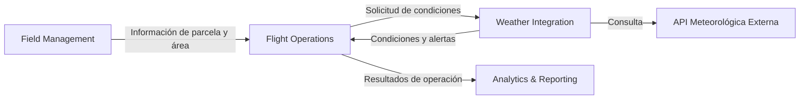

### Justificación

- **Field Management** mantiene la información territorial.
- **Flight Operations** gestiona el ciclo de vida de la misión.
- **Weather Integration** aísla la dependencia externa de información meteorológica.
- **Analytics & Reporting** transforma resultados en información histórica y reportes.

### 4.6.2. Software Architecture Context Diagram
El **System Context Diagram de C4** representa el sistema como una única unidad y muestra los usuarios y sistemas externos que interactúan directamente con él. En este nivel no se detallan tecnologías internas.

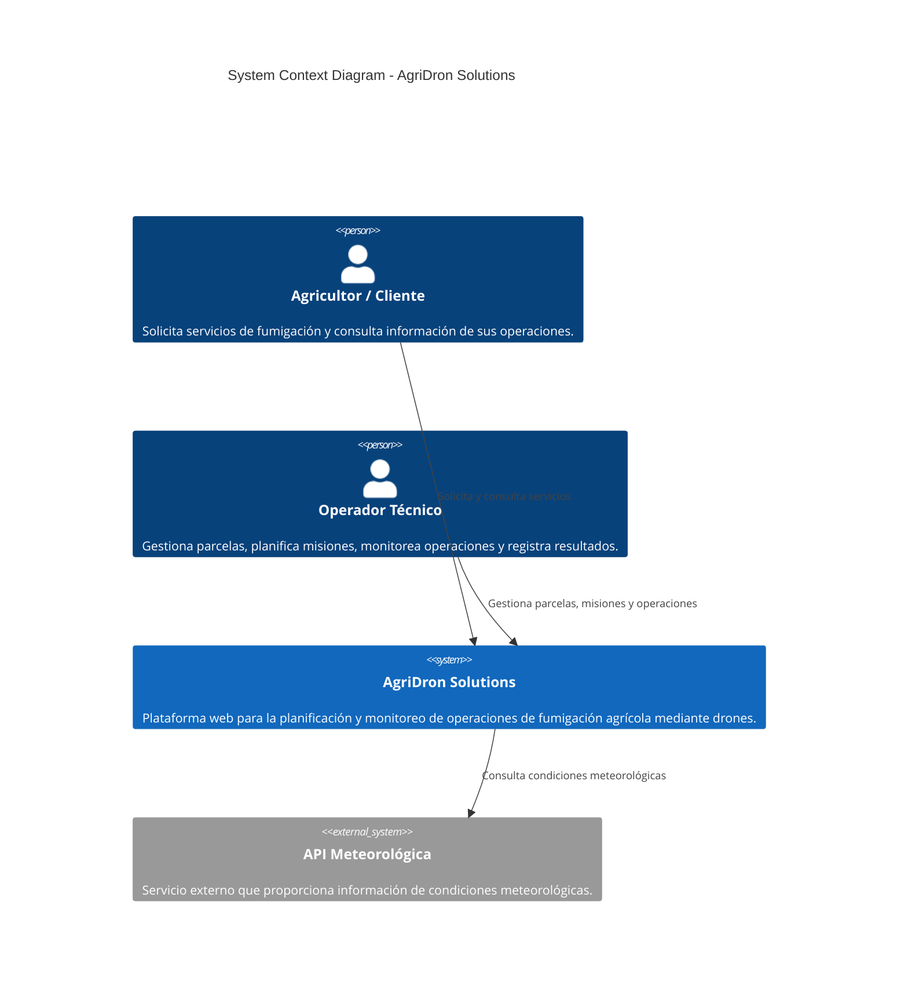

### Descripción

**AgriDron Solutions** es el sistema principal en el alcance de la solución. El **Agricultor / Cliente** interactúa con la plataforma para solicitar y consultar información relacionada con sus servicios, mientras que el **Operador Técnico** la utiliza para gestionar parcelas, planificar misiones, monitorear operaciones y registrar resultados.

La plataforma interactúa con una **API Meteorológica externa** para obtener información utilizada en la evaluación de las condiciones de operación.

### 4.6.3. Software Architecture Container Diagrams
El **Container Diagram de C4** realiza un acercamiento al sistema y muestra sus principales aplicaciones, servicios y almacenes de datos, incluyendo las tecnologías utilizadas y sus relaciones.

Los contenedores definidos son:

1. **Landing Page**
2. **Frontend Angular**
3. **Backend Spring Boot**
4. **Base de Datos Relacional**
5. **API Meteorológica Externa**

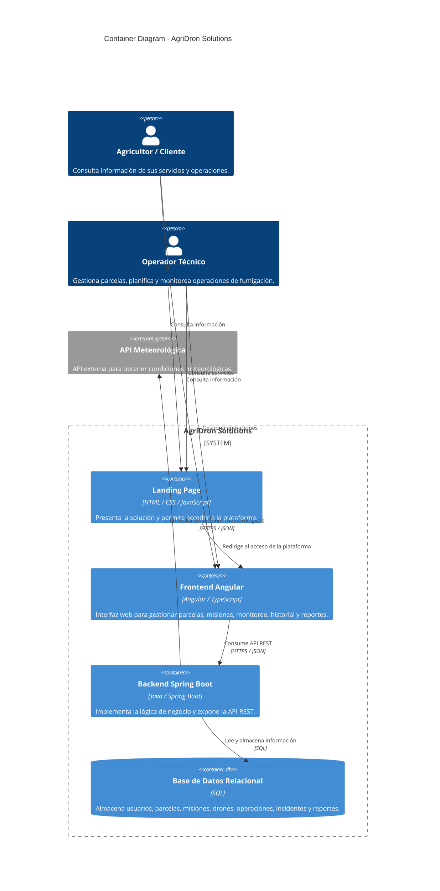

### Descripción de los contenedores

| Contenedor | Tecnología | Responsabilidad |
|---|---|---|
| **Landing Page** | HTML / CSS / JavaScript | Presentar AgriDron Solutions y facilitar el acceso a la plataforma. |
| **Frontend Angular** | Angular / TypeScript | Proporcionar la interfaz para gestionar parcelas, misiones, monitoreo, historial y reportes. |
| **Backend Spring Boot** | Java / Spring Boot | Implementar la lógica de negocio, exponer servicios REST y coordinar datos y servicios externos. |
| **Base de Datos Relacional** | SQL | Persistir usuarios, parcelas, misiones, operaciones, incidentes y reportes. |
| **API Meteorológica** | Servicio externo | Proporcionar datos meteorológicos para apoyar la planificación. |

### Flujo de comunicación

1. El usuario accede a la **Landing Page**.
2. El usuario utiliza el **Frontend Angular** para gestionar o consultar información.
3. El **Frontend Angular** consume el **Backend Spring Boot** mediante API REST.
4. El **Backend Spring Boot** consulta y actualiza la **Base de Datos Relacional**.
5. El **Backend Spring Boot** consulta la **API Meteorológica** cuando se requiere información climática.
6. La información procesada se presenta mediante el **Frontend Angular**.

## Trazabilidad entre dominio y arquitectura

| Bounded Context | Responsabilidad | Soporte arquitectónico |
|---|---|---|
| **Field Management** | Campos, parcelas y áreas | Frontend + Backend + BD |
| **Flight Operations** | Misiones, drones, operaciones e incidentes | Frontend + Backend + BD |
| **Weather Integration** | Condiciones y alertas meteorológicas | Backend + API Meteorológica |
| **Analytics & Reporting** | Historial, métricas y reportes | Frontend + Backend + BD |

La correspondencia permite mantener trazabilidad entre el análisis de dominio realizado mediante Event Storming y la arquitectura propuesta para AgriDron Solutions.

### 4.6.4. Software Architecture Components Diagrams
Esta sección presenta el diseño interno de los principales componentes de software de **AgriDron Solutions**. Se mantiene la separación entre la aplicación web, los servicios REST y las integraciones externas, alineándolos con los Bounded Contexts definidos en la arquitectura.


## 4.6.4.1. RESTful API

La API RESTful implementada con Spring Boot concentra la lógica de aplicación y dominio. Se organiza en capas de presentación, aplicación, dominio e infraestructura.

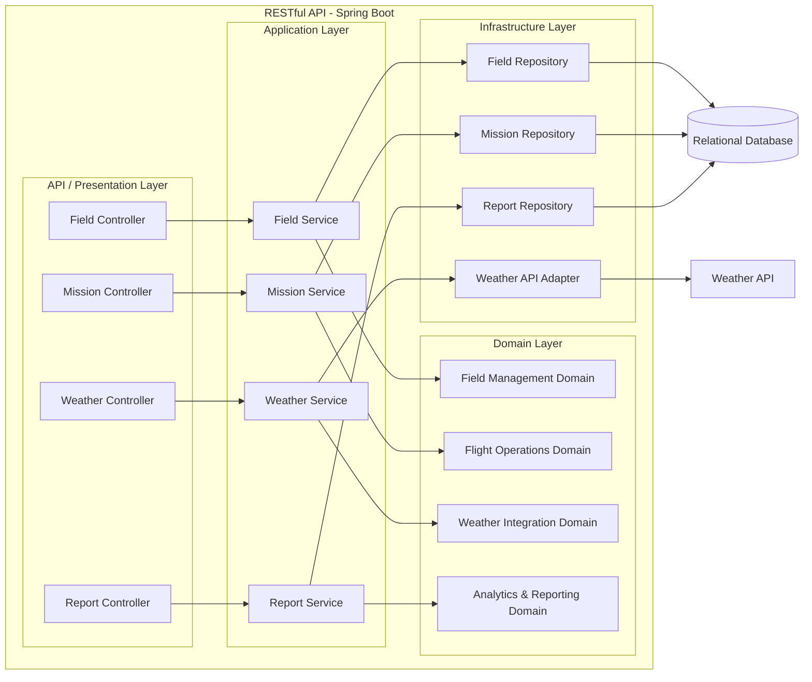

### Responsabilidades

| Capa | Responsabilidad |
|---|---|
| Presentation | Recibir solicitudes HTTP y devolver respuestas mediante endpoints REST. |
| Application | Coordinar casos de uso y orquestar operaciones del dominio. |
| Domain | Contener reglas y conceptos principales de cada Bounded Context. |
| Infrastructure | Implementar persistencia e integración con servicios externos. |

## 4.6.4.2. Web Application

La aplicación web utiliza Angular para proporcionar las funcionalidades de operadores y clientes.

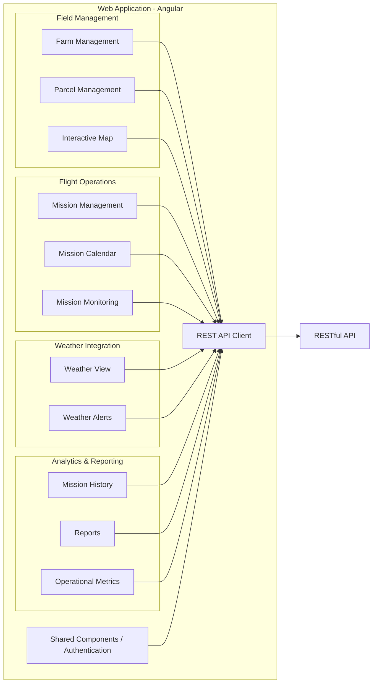

### Responsabilidades

- **Field Management:** administrar campos, parcelas y áreas de fumigación.
- **Flight Operations:** crear, programar y monitorear misiones.
- **Weather Integration:** mostrar condiciones y alertas meteorológicas.
- **Analytics & Reporting:** consultar historial y reportes.
- **Shared Components:** centralizar elementos reutilizables y autenticación.
- **REST API Client:** encapsular la comunicación con el Backend.

## 4.6.4.3. Weather Integration Component

La integración meteorológica se mantiene aislada para evitar acoplar directamente la lógica de negocio con la API externa.

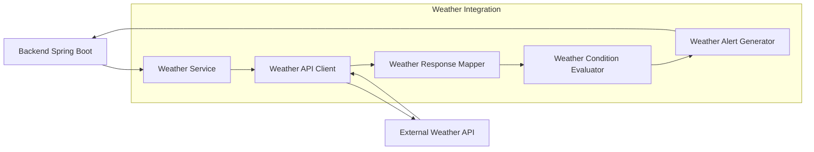

El componente permite cambiar o adaptar el proveedor meteorológico sin modificar directamente los componentes de **Flight Operations**.

---

## 4.7. Software Object-Oriented Design
El diseño orientado a objetos representa los principales elementos del dominio y sus relaciones. El Project Statement solicita que los Class Diagrams incluyan clases, interfaces, enumeraciones, atributos, métodos, visibilidad, relaciones y multiplicidades cuando correspondan.

### 4.7.1. Class Diagrams

### 4.7.1.1. Field Management

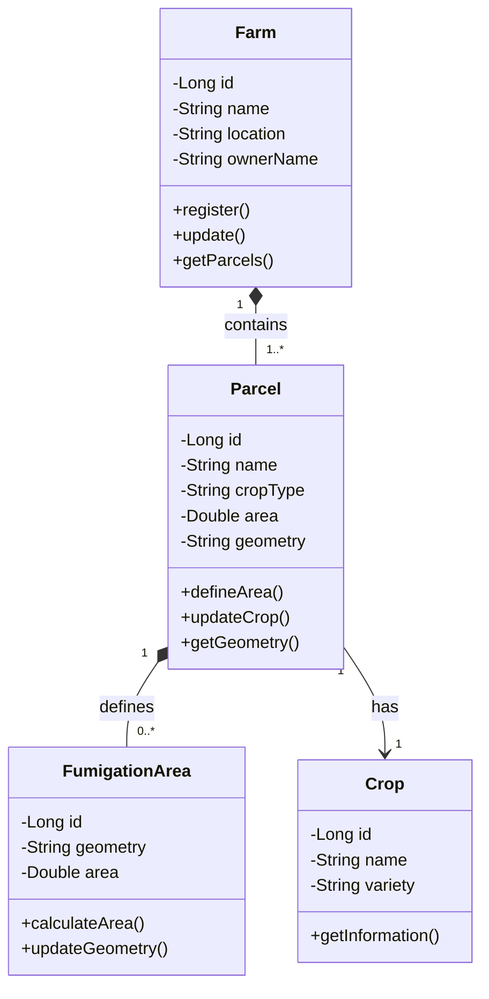

### 4.7.1.2. Flight Operations

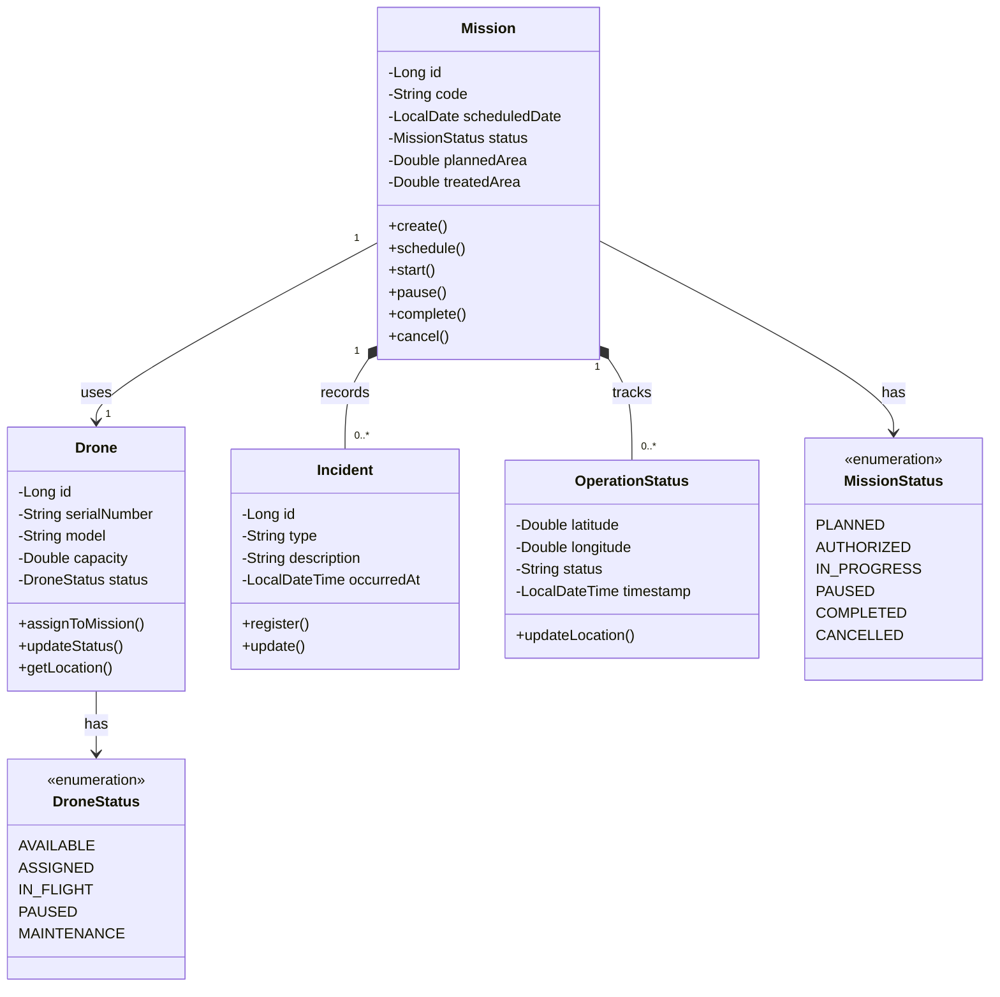

### 4.7.1.3. Weather Integration

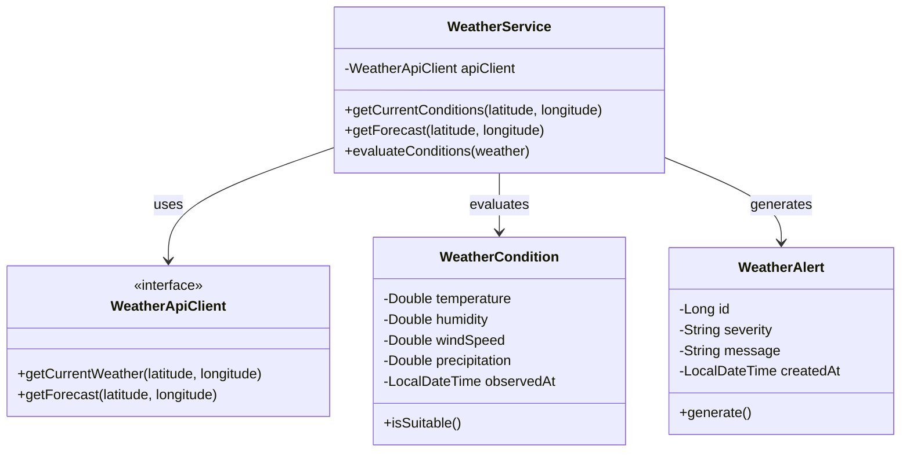

### 4.7.1.4. Analytics & Reporting

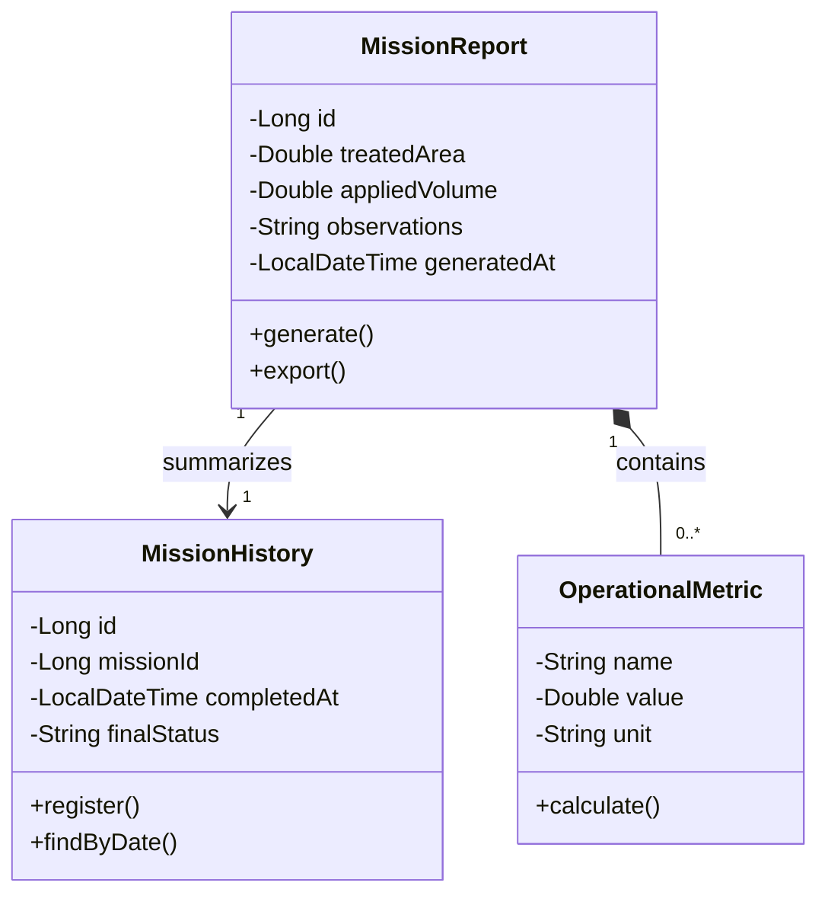

### 4.7.1.5. Shared / Identity

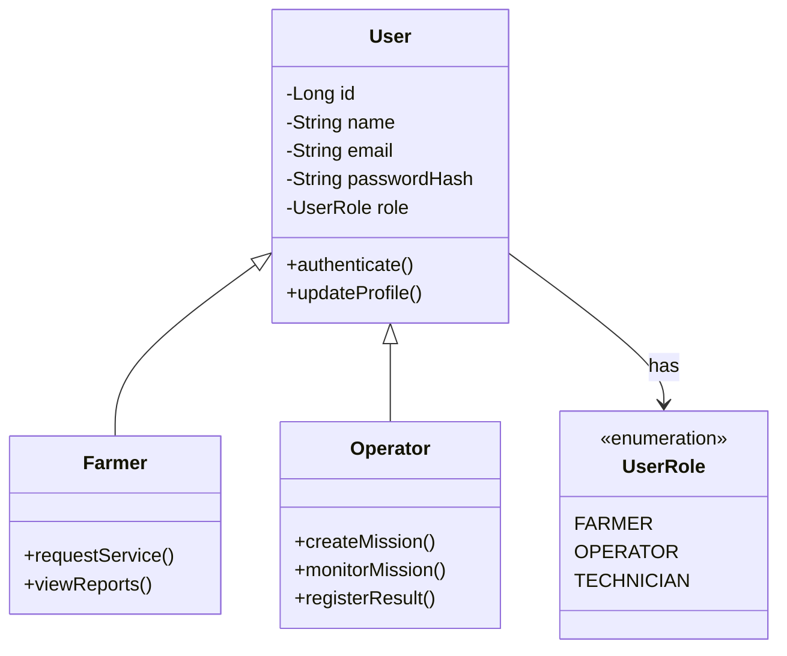

## 4.8. Database Design

### 4.8.1. Database Diagrams


**Descripción:**

[DESCRIPCIÓN.]

---

# Capítulo V: Product Implementation, Validation & Deployment

## 5.1. Software Configuration Management

El **Software Configuration Management (SCM)** de AgriDron Solutions establece las herramientas, convenciones y procedimientos que permitirán mantener la consistencia del producto durante su ciclo de vida. Esta configuración cubre el entorno de desarrollo, la gestión del código fuente, las convenciones de programación y el despliegue de los productos de software.

De acuerdo con el Project Statement, esta sección debe establecer decisiones y convenciones para mantener la consistencia durante el ciclo de vida del producto. Además, se debe considerar el entorno utilizado para actividades de gestión del proyecto, requisitos, UX/UI, desarrollo, despliegue y documentación.

La propuesta de SCM para AgriDron Solutions se alinea con la arquitectura definida previamente: **Landing Page**, **Frontend Angular**, **Backend Spring Boot** y **base de datos relacional**, además de la integración con una API meteorológica externa.

### 5.1.1. Software Development Environment Configuration

## 5.1.1.1. Propósito

El entorno de desarrollo define las herramientas que utilizará el equipo para implementar, documentar, probar y desplegar AgriDron Solutions. Se busca que todos los integrantes trabajen con una configuración homogénea, reduciendo problemas de compatibilidad y facilitando la colaboración.

El Project Statement indica que esta sección debe especificar el nombre de cada producto de software, su propósito y la ruta de referencia o descarga correspondiente, considerando las actividades de Project Management, Requirements Management, UX/UI Design, Software Development, Software Deployment y Software Documentation.

## 5.1.1.2. Herramientas del proyecto

| Categoría | Herramienta / Tecnología | Propósito | Referencia |
|---|---|---|---|
| Control de versiones | Git | Control local de versiones del código fuente. | https://git-scm.com/ |
| Repositorios | GitHub | Hospedaje de repositorios y colaboración mediante branches y Pull Requests. | https://github.com/ |
| Gestión del proyecto | Trello / Jira / YouTrack | Organización del backlog, tareas y seguimiento del trabajo. | Según herramienta seleccionada |
| Editor / IDE Frontend | Visual Studio Code | Desarrollo de Landing Page y Frontend Angular/TypeScript. | https://code.visualstudio.com/ |
| IDE Backend | IntelliJ IDEA / Eclipse | Desarrollo del Backend Java/Spring Boot. | https://www.jetbrains.com/idea/ |
| Runtime Frontend | Node.js + npm | Instalación de dependencias y ejecución de herramientas Angular. | https://nodejs.org/ |
| Framework Frontend | Angular | Implementación de la aplicación web. | https://angular.dev/ |
| Lenguaje Frontend | TypeScript | Desarrollo de la lógica del Frontend Angular. | https://www.typescriptlang.org/ |
| Lenguaje Backend | Java | Implementación del Backend y lógica de negocio. | https://www.java.com/ |
| Framework Backend | Spring Boot | Implementación de servicios REST y lógica del Backend. | https://spring.io/projects/spring-boot |
| Build Backend | Maven | Gestión de dependencias y construcción del proyecto Spring Boot. | https://maven.apache.org/ |
| Base de datos | PostgreSQL / SQL | Persistencia de la información de la plataforma. | https://www.postgresql.org/ |
| API testing | Postman | Prueba de endpoints REST durante el desarrollo. | https://www.postman.com/ |
| Documentación API | Swagger / OpenAPI | Documentación y consulta de los servicios REST. | https://swagger.io/ |
| Diseño UI/UX | Figma | Diseño de wireframes, mock-ups y prototipos. | https://www.figma.com/ |
| Diagramación | Mermaid | Diagramas como código dentro del repositorio Markdown. | https://mermaid.js.org/ |
| Documentación | Markdown | Elaboración de documentación técnica dentro del repositorio. | https://www.markdownguide.org/ |

> **Nota:** Las herramientas de gestión de proyectos y los proveedores cloud deberán reemplazarse por los productos concretos que el equipo haya seleccionado en su implementación final. La tabla mantiene como propuesta las herramientas que no han sido fijadas previamente.

## 5.1.1.3. Configuración base

Todos los integrantes deberán mantener una configuración equivalente para evitar diferencias entre ambientes locales.

### Frontend

```text
Node.js
npm
Angular CLI
Angular
TypeScript
```

### Backend

```text
Java JDK
Maven
Spring Boot
IDE compatible con Java
```

### Base de datos

```text
PostgreSQL
Cliente gráfico de base de datos
```

### Control de versiones

```text
Git
GitHub
GitFlow
Conventional Commits
Semantic Versioning
```

## 5.1.1.4. Estructura de repositorios

Para mantener separadas las responsabilidades de los productos, se propone trabajar con repositorios independientes:

```text
AgriDron Solutions
│
├── agridron-landing
│   └── Landing Page
│
├── agridron-frontend
│   └── Frontend Angular
│
└── agridron-backend
    ├── Backend Spring Boot
    ├── Unit Tests
    └── Integration / Acceptance Tests
```

Esta organización sigue la indicación del Project Statement de considerar los productos **Landing Page, Web Services y Frontend Web Applications** y, en el caso de Web Services, incluir también los archivos de pruebas.


### 5.1.2. Source Code Management

## 5.1.2.1. Plataforma y repositorios

El control de versiones del proyecto se realizará mediante **Git gestionado desde GitHub**. El Project Statement establece explícitamente GitHub como plataforma de control de versiones y solicita aplicar **GitFlow Workflow, Conventional Commits y Semantic Versioning**.

Los repositorios considerados para AgriDron Solutions son:

| Producto | Repositorio | Contenido |
|---|---|---|
| Landing Page | `AgiDron-LandingPage-7760-G3` | HTML, CSS y JavaScript |
| Frontend Web Application | `AgiDron-FrontEnd-7760-G3` | Angular y TypeScript |
| Web Services | `AgiDron-BackEnd-7760-G3` | Java, Spring Boot, pruebas unitarias e integración/aceptación |

> Los nombres anteriores son una propuesta de nomenclatura. Si el equipo ya creó repositorios con nombres diferentes, deben sustituirse por los nombres reales y sus URLs reales antes de entregar el informe.

## 5.1.2.2. GitFlow Workflow

Se utilizará **GitFlow** como estrategia de organización de ramas.

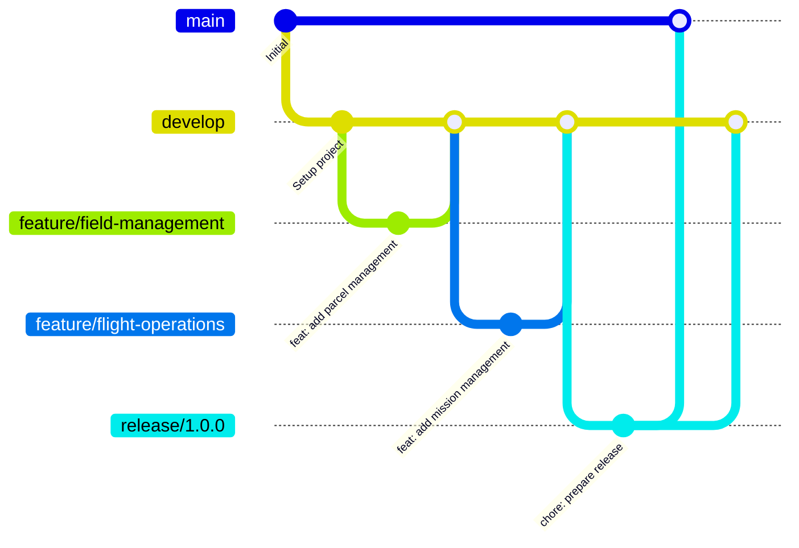

### Ramas principales

| Branch | Propósito |
|---|---|
| `main` | Contiene versiones estables listas para entrega o producción. |
| `develop` | Rama de integración de funcionalidades terminadas. |
| `feature/*` | Desarrollo aislado de una funcionalidad específica. |
| `release/*` | Preparación de una nueva versión estable. |
| `hotfix/*` | Corrección urgente de errores encontrados en producción. |

## 5.1.2.3. Convención para Feature Branches

Cada funcionalidad debe desarrollarse en una rama independiente.

Formato:

```text
feature/<descripcion>
```

Ejemplos:

```text
feature/field-management
feature/parcel-registration
feature/mission-planning
feature/weather-integration
feature/mission-monitoring
feature/mission-reports
```

Se utilizarán nombres en **inglés**, en minúsculas y separados mediante guiones.

## 5.1.2.4. Convención para Release Branches

Formato:

```text
release/<major>.<minor>.<patch>
```

Ejemplos:

```text
release/1.0.0
release/1.1.0
release/1.1.1
```

Las release branches permiten realizar ajustes finales antes de integrar una versión estable a `main`.

## 5.1.2.5. Convención para Hotfix Branches

Formato:

```text
hotfix/<descripcion>
```

Ejemplos:

```text
hotfix/weather-api-error
hotfix/mission-status-fix
hotfix/login-validation
```

Los hotfixes estarán destinados exclusivamente a correcciones urgentes de versiones publicadas.

## 5.1.2.6. Pull Requests

Las modificaciones realizadas en `feature/*`, `release/*` y `hotfix/*` deberán integrarse mediante Pull Requests.

Flujo recomendado:

```text
feature/*
    ↓
Pull Request
    ↓
Code Review
    ↓
Tests
    ↓
Merge
    ↓
develop
```

Para una versión estable:

```text
develop
    ↓
release/x.y.z
    ↓
Validation
    ↓
main
    ↓
Tag vX.Y.Z
```

Se recomienda que ningún integrante trabaje directamente sobre `main` para funcionalidades nuevas.

## 5.1.2.7. Conventional Commits

Los mensajes de commit seguirán la especificación de **Conventional Commits**.

Formato:

```text
<type>[optional scope]: <description>
```

Ejemplos:

```text
feat(field): add parcel registration
feat(mission): add mission planning
fix(weather): handle unavailable API response
docs(api): update endpoint documentation
test(mission): add mission service tests
refactor(report): simplify report generation
chore(deps): update project dependencies
```

Tipos principales:

| Tipo | Uso |
|---|---|
| `feat` | Nueva funcionalidad. |
| `fix` | Corrección de un error. |
| `docs` | Cambios en documentación. |
| `test` | Creación o modificación de pruebas. |
| `refactor` | Reestructuración sin cambiar el comportamiento funcional. |
| `style` | Cambios de formato que no modifican la lógica. |
| `chore` | Tareas de mantenimiento o configuración. |

Conventional Commits relaciona `feat` con incrementos **MINOR**, `fix` con incrementos **PATCH** y los cambios incompatibles con incrementos **MAJOR**, facilitando su integración con Semantic Versioning.

## 5.1.2.8. Semantic Versioning

Las versiones del producto seguirán el formato:

```text
MAJOR.MINOR.PATCH
```

Ejemplo:

```text
1.0.0
```

Reglas:

- **MAJOR:** cambios incompatibles con versiones anteriores.
- **MINOR:** nuevas funcionalidades compatibles.
- **PATCH:** correcciones compatibles.

Ejemplos:

```text
1.0.0 → primera versión estable
1.1.0 → incorporación del módulo de monitoreo
1.1.1 → corrección de un error
2.0.0 → cambio incompatible de la API
```

Las versiones estables serán identificadas mediante tags de Git:

```text
v1.0.0
v1.1.0
v1.1.1
```

### 5.1.3. Source Code Style Guide & Conventions

## 5.1.3.1. Principios generales

El Project Statement establece que para los lenguajes utilizados en la solución debe aplicarse nomenclatura en **inglés**. Para AgriDron Solutions se aplicará esta regla a HTML, CSS, JavaScript, TypeScript y Java.

Principios:

1. Utilizar nombres descriptivos.
2. Mantener una nomenclatura consistente.
3. Evitar abreviaturas innecesarias.
4. Mantener métodos y clases con responsabilidades específicas.
5. Evitar duplicación de código.
6. Mantener funciones pequeñas y legibles.
7. Documentar únicamente la lógica que requiera contexto adicional.
8. Mantener las pruebas junto con el código correspondiente.
9. No incluir credenciales ni secretos dentro del código fuente.

## 5.1.3.2. HTML

Convenciones:

- Utilizar HTML5 semántico.
- Utilizar elementos semánticos como `header`, `nav`, `main`, `section` y `footer`.
- Utilizar atributos `aria-*` cuando sean necesarios para accesibilidad.
- Utilizar nombres descriptivos para clases e identificadores.
- Mantener los atributos en minúsculas.

Ejemplo:

```html
<section class="mission-summary" aria-labelledby="mission-title">
    <h2 id="mission-title">Mission Summary</h2>
</section>
```

## 5.1.3.3. CSS

Convenciones:

- Utilizar nombres de clases en inglés.
- Utilizar `kebab-case` para clases CSS.
- Evitar estilos inline cuando no sean necesarios.
- Agrupar reglas relacionadas.
- Evitar selectores excesivamente específicos.

Ejemplo:

```css
.mission-card {
    display: flex;
    gap: 1rem;
}

.mission-card__status {
    font-weight: 600;
}
```

## 5.1.3.4. JavaScript

Convenciones:

- Variables y funciones: `camelCase`.
- Constantes: `UPPER_SNAKE_CASE` cuando representen valores constantes globales.
- Clases: `PascalCase`.
- Utilizar `const` por defecto y `let` cuando sea necesario.
- Evitar variables globales.

Ejemplo:

```javascript
const DEFAULT_MISSION_STATUS = "PENDING";

function createMission(missionData) {
    // implementation
}
```

## 5.1.3.5. TypeScript / Angular

Convenciones:

| Elemento | Convención | Ejemplo |
|---|---|---|
| Clase | PascalCase | `MissionService` |
| Interface | PascalCase | `Mission` |
| Variable | camelCase | `missionStatus` |
| Método | camelCase | `createMission()` |
| Constante | UPPER_SNAKE_CASE | `API_BASE_URL` |
| Archivo | kebab-case | `mission.service.ts` |
| Componente | kebab-case | `mission-list` |

Ejemplo:

```typescript
export interface Mission {
    id: number;
    parcelId: number;
    scheduledDate: string;
    status: MissionStatus;
}

export class MissionService {
    createMission(mission: Mission): void {
        // implementation
    }
}
```

## 5.1.3.6. Java / Spring Boot

Convenciones:

| Elemento | Convención | Ejemplo |
|---|---|---|
| Class | PascalCase | `MissionService` |
| Method | camelCase | `createMission()` |
| Variable | camelCase | `missionStatus` |
| Constant | UPPER_SNAKE_CASE | `MAX_MISSION_DURATION` |
| Package | lowercase | `com.agridron.mission` |
| DTO | PascalCase + DTO | `MissionResponseDTO` |
| Entity | PascalCase | `Mission` |

La estructura del backend seguirá una separación lógica entre:

```text
controller/
service/
domain/
repository/
dto/
config/
exception/
```

Ejemplo:

```java
@RestController
@RequestMapping("/api/missions")
public class MissionController {

    @GetMapping("/{id}")
    public MissionResponseDTO getMission(@PathVariable Long id) {
        return missionService.getMission(id);
    }
}
```

## 5.1.3.7. API REST

Los endpoints utilizarán nombres de recursos en plural y en inglés.

Ejemplos:

```text
GET    /api/farms
GET    /api/parcels
POST   /api/parcels
GET    /api/missions
POST   /api/missions
PUT    /api/missions/{id}
DELETE /api/missions/{id}
GET    /api/weather
GET    /api/reports
```

Se utilizarán los verbos HTTP según la operación:

| Verbo | Uso |
|---|---|
| GET | Consultar recursos. |
| POST | Crear recursos. |
| PUT | Actualizar un recurso. |
| PATCH | Actualizar parcialmente un recurso. |
| DELETE | Eliminar un recurso. |

## 5.1.3.8. Documentación y lenguaje

El idioma por defecto definido para los mensajes, interfaz de usuario e interfaz de documentación de los productos de la solución es **inglés**.

Por lo tanto:

- Variables: inglés.
- Clases: inglés.
- Métodos: inglés.
- Endpoints: inglés.
- Mensajes de API: inglés.
- Documentación técnica: inglés.
- Textos visibles para el usuario: inglés, salvo que una decisión posterior de UX establezca otro idioma.

### 5.1.4. Software Deployment Configuration

## 5.1.4.1. Objetivo

El despliegue permitirá publicar los productos de AgriDron Solutions en plataformas cloud y automatizar progresivamente el proceso de entrega.

El Project Statement establece que esta configuración debe contemplar la creación de cuentas, configuración de recursos en proveedores cloud y configuración de proyectos de desarrollo para integración o automatización del deployment. El proceso debe considerar los productos **Landing Page, Web Applications y Web Services**.

## 5.1.4.2. Arquitectura de despliegue

Se propone separar los componentes desplegables de acuerdo con la arquitectura del sistema:

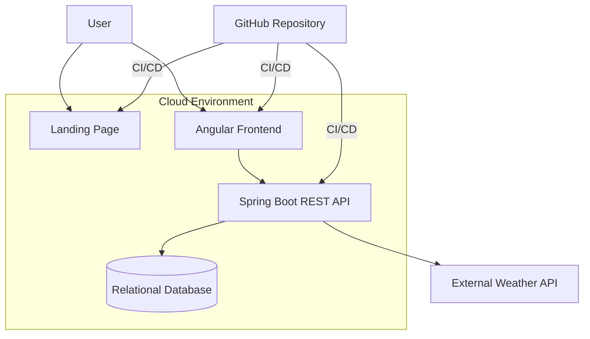

## 5.1.4.3. Ambientes

Se utilizarán tres ambientes conceptuales:

| Ambiente | Propósito |
|---|---|
| Development | Desarrollo local y validaciones iniciales. |
| Staging | Integración y validación antes de producción. |
| Production | Versión disponible para los usuarios. |

Flujo:

```text
feature/*
    ↓
Development
    ↓
develop
    ↓
Staging
    ↓
release/*
    ↓
main
    ↓
Production
```

## 5.1.4.4. Integración continua

El repositorio podrá utilizar **GitHub Actions** para automatizar las tareas de integración y despliegue.

Pipeline conceptual:

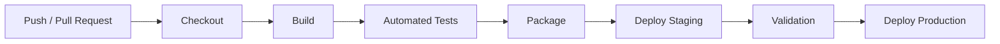

### Backend

```text
Checkout
↓
Install dependencies
↓
Run unit tests
↓
Run integration tests
↓
Build Spring Boot application
↓
Package application
↓
Deploy
```

### Frontend

```text
Checkout
↓
Install npm dependencies
↓
Run lint
↓
Run tests
↓
Build Angular application
↓
Deploy
```

### Landing Page

```text
Checkout
↓
Validate files
↓
Build / prepare static assets
↓
Deploy
```

## 5.1.4.5. Variables y secretos

Las credenciales, API keys, tokens y contraseñas no deberán almacenarse directamente en el repositorio.

Se utilizarán variables de entorno y secretos administrados por la plataforma de CI/CD.

Ejemplos:

```text
DATABASE_URL
DATABASE_USERNAME
DATABASE_PASSWORD
WEATHER_API_KEY
JWT_SECRET
```

Los valores reales no se incluirán en archivos versionados.

GitHub permite asociar secretos y variables a ambientes de despliegue. Además, los ambientes pueden restringir qué branches o tags tienen autorización para realizar deployments y pueden aplicar reglas de protección.

## 5.1.4.6. Configuración de base de datos

La base de datos relacional se desplegará como un servicio administrado o recurso equivalente dentro del proveedor cloud seleccionado.

La configuración deberá considerar:

- Nombre de base de datos.
- Usuario de aplicación.
- Contraseña almacenada como secreto.
- Host.
- Puerto.
- SSL/TLS cuando sea requerido.
- Variables de conexión.
- Backups.
- Restricción de acceso desde servicios autorizados.

El Backend consumirá la configuración mediante variables de entorno, por ejemplo:

```text
DB_HOST
DB_PORT
DB_NAME
DB_USER
DB_PASSWORD
```

## 5.1.4.7. Configuración de la API meteorológica

La API meteorológica será consumida exclusivamente desde el Backend.

```text
Frontend
   ↓
Backend
   ↓
Weather API
```

La clave de acceso de la API meteorológica deberá almacenarse como secreto:

```text
WEATHER_API_KEY
```

El Frontend no deberá contener directamente la clave privada del proveedor meteorológico.

## 5.1.4.8. Estrategia de deployment

La estrategia propuesta es:

1. Los desarrolladores trabajan en `feature/*`.
2. Se crea un Pull Request hacia `develop`.
3. Se ejecutan las pruebas automáticas.
4. La funcionalidad aprobada se integra en `develop`.
5. Una `release/*` prepara la versión.
6. La versión se valida en staging.
7. Se integra en `main`.
8. Se crea el tag correspondiente a Semantic Versioning.
9. El pipeline despliega la versión en production.

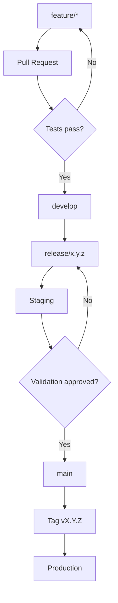

## 5.1.4.9. Trazabilidad del deployment

Cada versión desplegada deberá poder relacionarse con:

```text
Git Commit
    ↓
Pull Request
    ↓
Branch
    ↓
Release
    ↓
Semantic Version
    ↓
Deployment
```

Esto permite identificar qué cambios forman parte de una versión determinada y facilita la recuperación ante errores.

---

## 5.2. Landing Page, Services & Applications Implementation

### 5.2.1. Sprint 1

#### 5.2.1.1. Sprint Planning 1

**Objetivo del Sprint:**

[OBJETIVO.]

**Fecha de inicio:** [FECHA]

**Fecha de finalización:** [FECHA]

**Meta del Sprint:**

[DESCRIPCIÓN.]

#### 5.2.1.2. Aspect Leaders and Collaborators

| Aspecto | Líder | Colaboradores |
| :--- | :--- | :--- |
| [ASPECTO] | [NOMBRE] | [NOMBRES] |
| [ASPECTO] | [NOMBRE] | [NOMBRES] |

#### 5.2.1.3. Sprint Backlog 1

| ID | User Story | Tarea | Responsable | Estado |
| :--- | :--- | :--- | :--- | :--- |
| US-001 | [USER STORY] | [TAREA] | [NOMBRE] | [ESTADO] |
| US-002 | [USER STORY] | [TAREA] | [NOMBRE] | [ESTADO] |

#### 5.2.1.4. Development Evidence for Sprint Review

[PEGAR AQUÍ CAPTURAS / EVIDENCIAS DEL DESARROLLO.]


#### 5.2.1.5. Execution Evidence for Sprint Review

[PEGAR AQUÍ CAPTURAS / EVIDENCIAS DE EJECUCIÓN.]


#### 5.2.1.6. Services Documentation Evidence for Sprint Review

[PEGAR AQUÍ LA DOCUMENTACIÓN / EVIDENCIA DE SERVICIOS.]

#### 5.2.1.7. Software Deployment Evidence for Sprint Review

[PEGAR AQUÍ LA EVIDENCIA DEL DESPLIEGUE.]

#### 5.2.1.8. Team Collaboration Insights during Sprint

[DESCRIBIR LA COLABORACIÓN DURANTE EL SPRINT.]


---

## 5.3. Validation Interviews

### 5.3.1. Interview Design

[DESCRIBIR EL DISEÑO DE LAS ENTREVISTAS DE VALIDACIÓN.]

### 5.3.2. Interview Registry

[REGISTRAR LAS ENTREVISTAS DE VALIDACIÓN.]

### 5.3.3. Heuristic Evaluations

[PEGAR AQUÍ LOS RESULTADOS DE LAS EVALUACIONES HEURÍSTICAS.]

---

## 5.4. Video About-the-Product

**Enlace al video:**

[PEGAR AQUÍ EL ENLACE AL VIDEO]

**Descripción:**

[DESCRIBIR BREVEMENTE EL CONTENIDO DEL VIDEO.]

---

# Conclusiones

## Conclusión 1

[PEGAR AQUÍ LA CONCLUSIÓN.]

## Conclusión 2

[PEGAR AQUÍ LA CONCLUSIÓN.]

## Recomendaciones

[PEGAR AQUÍ LAS RECOMENDACIONES.]

---

# Bibliografía

> Registrar las fuentes utilizadas siguiendo el formato APA 7.

1. [REFERENCIA APA 7]
2. [REFERENCIA APA 7]
3. [REFERENCIA APA 7]

---

# Anexos

## Anexo A: Evidencias adicionales

[PEGAR AQUÍ EVIDENCIAS ADICIONALES.]

## Anexo B: Videos de Exposiciones

**Video de exposición:** [ENLACE]

## Anexo C: Otros

[AGREGAR OTROS ANEXOS SI CORRESPONDE.]


