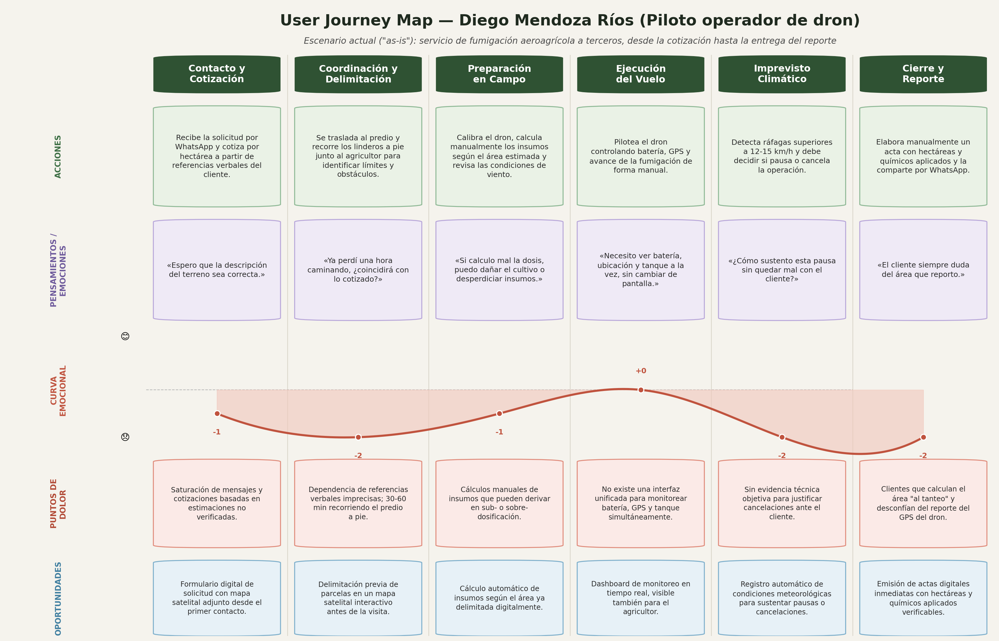
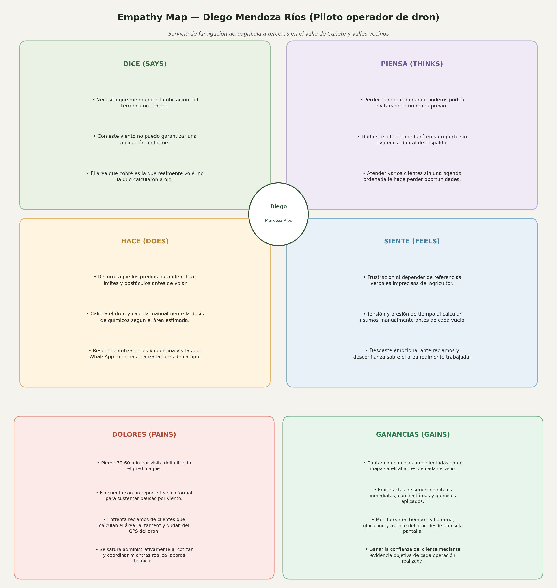
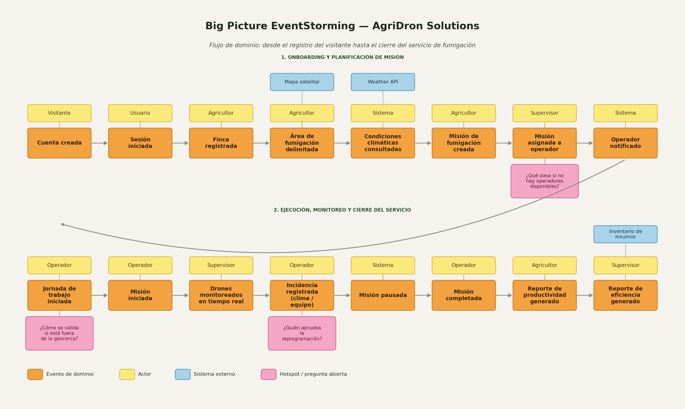

asdasdasdasdasfksdkl
    asdasdas
## **Universidad Peruana de Ciencias Aplicadas**
### Carrera de Ingeniería de Software
 

**Curso: Desarrollo de Aplicaciones Open Source**

**NRC: 7760**

**Docente: FLORES MOROCCO; Juan Antonio**
 

### **Informe del Trabajo Final**

**Nombre de la Startup:** AgriDron

**Nombre del producto:** [NOMBRE DEL PRODUCTO]
 

### **Integrantes**

<table align="center" style="border-collapse: collapse; border: none; margin-left: auto; margin-right: auto;">
    <tr>
        <th style="border: none; padding: 0 18px 6px 0; text-align: center;">Código</th>
        <th style="border: none; padding: 0 0 6px 0; text-align: center;">Damacen Galindo, Italo Gianfranco</th>
    </tr>
    <tr>
        <td style="border: none; padding: 0 18px 4px 0; text-align: center;">[CÓDIGO]</td>
        <td style="border: none; padding: 0 0 4px 0; text-align: center;">Nicho Huillcañahui, Edwin Noe</td>
    </tr>
    <tr>
        <td style="border: none; padding: 0 18px 4px 0; text-align: center;">[CÓDIGO]</td>
        <td style="border: none; padding: 0 0 4px 0; text-align: center;">Ramirez Gutierrez, Gabriel</td>
    </tr>
    <tr>
        <td style="border: none; padding: 0 18px 4px 0; text-align: center;">U202422642</td>
        <td style="border: none; padding: 0 0 4px 0; text-align: center;">Sayago Vidal, Sebastian Leonardo</td>
    </tr>
    <tr>
        <td style="border: none; padding: 0 18px 4px 0; text-align: center;">U202222473</td>
        <td style="border: none; padding: 0 0 4px 0; text-align: center;">Vasquez Roncal, Alexander Felipe</td>
    </tr>
</table>
 

<b><i>Septiembre, 2026</i></b>

 

---

## Registro de Versiones

| Versión | Fecha | Autor | Descripción |
| :--- | :--- | :--- | :--- |
| 0.1.0 | 05/09/2026 | Sebastián Sayago | Creación inicial del documento. |
| 0.2.0 | 06/09/2026 | Sebastián Sayago | Implementación inicial del capitulo 1 |

---

# Contenido

## Tabla de Contenido

- [Contenido](#contenido)
  - [Tabla de Contenido](#tabla-de-contenido)
  - [Student Outcome](#student-outcome)
  - [Capítulo I: Introducción](#capítulo-i-introducción)
    - [1.1. Startup Profile](#11-startup-profile)
      - [1.1.1. Descripción de la Startup](#111-descripción-de-la-startup)
      - [1.1.2. Perfiles de integrantes del equipo](#112-perfiles-de-integrantes-del-equipo)
    - [1.2. Solution Profile](#12-solution-profile)
      - [1.2.1. Antecedentes y problemática](#121-antecedentes-y-problemática)
      - [1.2.2. Lean UX Process](#122-lean-ux-process)
        - [1.2.2.1. Lean UX Problem Statements](#1221-lean-ux-problem-statements)
        - [1.2.2.2. Lean UX Assumptions](#1222-lean-ux-assumptions)
        - [1.2.2.3. Lean UX Hypothesis Statements](#1223-lean-ux-hypothesis-statements)
        - [1.2.2.4. Lean UX Canvas](#1224-lean-ux-canvas)
    - [1.3. Segmentos objetivo](#13-segmentos-objetivo)
  - [Capítulo II: Requirements Elicitation & Analysis](#capítulo-ii-requirements-elicitation--analysis)
    - [2.1. Competidores](#21-competidores)
      - [2.1.1. Análisis competitivo](#211-análisis-competitivo)
      - [2.1.2. Estrategias y tácticas frente a competidores](#212-estrategias-y-tácticas-frente-a-competidores)
    - [2.2. Entrevistas](#22-entrevistas)
      - [2.2.1. Diseño de entrevistas](#221-diseño-de-entrevistas)
      - [2.2.2. Registro de entrevistas](#222-registro-de-entrevistas)
      - [2.2.3. Análisis de entrevistas](#223-análisis-de-entrevistas)
    - [2.3. Needfinding](#23-needfinding)
      - [2.3.1. User Personas](#231-user-personas)
      - [2.3.2. User Task Matrix](#232-user-task-matrix)
      - [2.3.3. User Journey Mapping](#233-user-journey-mapping)
      - [2.3.4. Empathy Mapping](#234-empathy-mapping)
    - [2.4. Big Picture EventStorming](#24-big-picture-eventstorming)
    - [2.5. Ubiquitous Language](#25-ubiquitous-language)
  - [Capítulo III: Requirements Specification](#capítulo-iii-requirements-specification)
    - [3.1. User Stories](#31-user-stories)
    - [3.2. Impact Mapping](#32-impact-mapping)
    - [3.3. Product Backlog](#33-product-backlog)
  - [Capítulo IV: Product Design](#capítulo-iv-product-design)
    - [4.1. Style Guidelines](#41-style-guidelines)
      - [4.1.1. General Style Guidelines](#411-general-style-guidelines)
      - [4.1.2. Web Style Guidelines](#412-web-style-guidelines)
    - [4.2. Information Architecture](#42-information-architecture)
      - [4.2.1. Organization Systems](#421-organization-systems)
      - [4.2.2. Labeling Systems](#422-labeling-systems)
      - [4.2.3. SEO Tags and Meta Tags](#423-seo-tags-and-meta-tags)
      - [4.2.4. Searching Systems](#424-searching-systems)
      - [4.2.5. Navigation Systems](#425-navigation-systems)
    - [4.3. Landing Page UI Design](#43-landing-page-ui-design)
      - [4.3.1. Landing Page Wireframe](#431-landing-page-wireframe)
      - [4.3.2. Landing Page Mock-up](#432-landing-page-mock-up)
    - [4.4. Web Applications UX/UI Design](#44-web-applications-uxui-design)
      - [4.4.1. Web Applications Wireframes](#441-web-applications-wireframes)
      - [4.4.2. Web Applications Wireflow Diagrams](#442-web-applications-wireflow-diagrams)
      - [4.4.3. Web Applications Mock-ups](#443-web-applications-mock-ups)
      - [4.4.4. Web Applications User Flow Diagrams](#444-web-applications-user-flow-diagrams)
    - [4.5. Web Applications Prototyping](#45-web-applications-prototyping)
    - [4.6. Domain-Driven Software Architecture](#46-domain-driven-software-architecture)
      - [4.6.1. Design-Level Event Storming](#461-design-level-event-storming)
      - [4.6.2. Software Architecture Context Diagram](#462-software-architecture-context-diagram)
      - [4.6.3. Software Architecture Container Diagrams](#463-software-architecture-container-diagrams)
      - [4.6.4. Software Architecture Components Diagrams](#464-software-architecture-components-diagrams)
    - [4.7. Software Object-Oriented Design](#47-software-object-oriented-design)
      - [4.7.1. Class Diagrams](#471-class-diagrams)
    - [4.8. Database Design](#48-database-design)
      - [4.8.1. Database Diagrams](#481-database-diagrams)
  - [Capítulo V: Product Implementation, Validation & Deployment](#capítulo-v-product-implementation-validation--deployment)
    - [5.1. Software Configuration Management](#51-software-configuration-management)
      - [5.1.1. Software Development Environment Configuration](#511-software-development-environment-configuration)
      - [5.1.2. Source Code Management](#512-source-code-management)
      - [5.1.3. Source Code Style Guide & Conventions](#513-source-code-style-guide--conventions)
      - [5.1.4. Software Deployment Configuration](#514-software-deployment-configuration)
    - [5.2. Landing Page, Services & Applications Implementation](#52-landing-page-services--applications-implementation)
      - [5.2.1. Sprint 1](#521-sprint-1)
        - [5.2.1.1. Sprint Planning 1](#5211-sprint-planning-1)
        - [5.2.1.2. Aspect Leaders and Collaborators](#5212-aspect-leaders-and-collaborators)
        - [5.2.1.3. Sprint Backlog 1](#5213-sprint-backlog-1)
        - [5.2.1.4. Development Evidence for Sprint Review](#5214-development-evidence-for-sprint-review)
        - [5.2.1.5. Execution Evidence for Sprint Review](#5215-execution-evidence-for-sprint-review)
        - [5.2.1.6. Services Documentation Evidence for Sprint Review](#5216-services-documentation-evidence-for-sprint-review)
        - [5.2.1.7. Software Deployment Evidence for Sprint Review](#5217-software-deployment-evidence-for-sprint-review)
        - [5.2.1.8. Team Collaboration Insights during Sprint](#5218-team-collaboration-insights-during-sprint)
    - [5.3. Validation Interviews](#53-validation-interviews)
      - [5.3.1. Interview Design](#531-interview-design)
      - [5.3.2. Interview Registry](#532-interview-registry)
      - [5.3.3. Heuristic Evaluations](#533-heuristic-evaluations)
    - [5.4. Video About-the-Product](#54-video-about-the-product)
  - [Conclusiones](#conclusiones)
  - [Bibliografía](#bibliografía)
  - [Anexos](#anexos)

---

## Student Outcome

> **[PEGAR AQUÍ EL STUDENT OUTCOME CORRESPONDIENTE A LA ENTREGA]**
>
> **Criterio:** [PEGAR AQUÍ EL CRITERIO]
>
> En el siguiente cuadro se describe las acciones realizadas y enunciados de conclusiones por parte del grupo, que permiten sustentar el haber alcanzado el logro del Student Outcome.

<table>
  <thead>
    <tr>
      <th>Criterio específico</th>
      <th>Acciones realizadas</th>
      <th>Conclusiones</th>
    </tr>
  </thead>
  <tbody>
    <tr>
      <td><strong>[CRITERIO ESPECÍFICO 1]</strong></td>
      <td>
        
<b>[INTEGRANTE 1]</b> 

        
<em><b>AV1</b></em> [ACCIÓN REALIZADA]

         
        <b>[INTEGRANTE 2]</b> 
        <em><b>AV1</b></em> [ACCIÓN REALIZADA]
          
        <b>[REPETIR PARA TODOS LOS INTEGRANTES]</b>
      </td>
      <td>[CONCLUSIÓN]</td>
    </tr>
    <tr>
      <td><strong>[CRITERIO ESPECÍFICO 2]</strong></td>
      <td>
        
<b>[INTEGRANTE 1]</b> 

        
<em><b>AV1</b></em> [ACCIÓN REALIZADA]

         
        <b>[INTEGRANTE 2]</b> 
        <em><b>AV1</b></em> [ACCIÓN REALIZADA]
          
        <b>[REPETIR PARA TODOS LOS INTEGRANTES]</b>
      </td>
      <td>[CONCLUSIÓN]</td>
    </tr>
  </tbody>
</table>

---

# Capítulo I: Introducción

## 1.1. Startup Profile

### 1.1.1. Descripción de la Startup

<strong>AgriDron Solutions</strong> es una startup orientada al desarrollo de soluciones tecnológicas para el sector agrícola, enfocada en mejorar la planificación y el monitoreo de operaciones de fumigación mediante drones. La startup busca centralizar en una plataforma web las principales actividades relacionadas con estas operaciones, facilitando la gestión de parcelas, la planificación de misiones, la consulta de condiciones meteorológicas y el seguimiento de las operaciones realizadas.

La propuesta de AgriDron Solutions consiste en desarrollar una plataforma web que permita a los agricultores registrar y administrar sus fincas y parcelas, seleccionar mediante un mapa interactivo el área que desean fumigar, crear y gestionar misiones de fumigación y consultar información meteorológica mediante una API externa. Asimismo, la plataforma contará con un módulo de monitoreo que permitirá visualizar el estado y la ubicación de los drones durante una misión mediante datos inicialmente simulados.

Finalmente, la solución permitirá consultar el historial de las misiones realizadas y generar reportes de las operaciones, además de manejar diferentes roles de usuario, como agricultor, operador y técnico.

Misión: [DEFINIR MISIÓN DE AGRIDRON SOLUTIONS]

Visión: [DEFINIR VISIÓN DE AGRIDRON SOLUTIONS]

Valores:

<ul> <li>[VALOR 1]</li> 
    <li>[VALOR 2]</li> 
    <li>[VALOR 3]</li> 
    <li>[VALOR 4]</li> 
</ul>

### 1.1.2. Perfiles de integrantes del equipo

> Para cada integrante, colocar foto, nombre, código, descripción y aporte/rol dentro del proyecto.

<table>
  <tr>
    <td rowspan="4" align="center">
      
    </td>
  </tr>
  <tr>
    <td><b>Nombre:</b> [NOMBRE COMPLETO]</td>
  </tr>
  <tr>
    <td><b>Código:</b> [CÓDIGO]</td>
  </tr>
  <tr>
    <td>
      <b>Descripción:</b> 
      [DESCRIPCIÓN DEL PERFIL, CONOCIMIENTOS Y HABILIDADES.]
        
      [APORTE Y FUNCIÓN DENTRO DEL EQUIPO.]
    </td>
  </tr>
    <tr>
    <td rowspan="4" align="center">
      
    </td>
  </tr>
  <tr>
    <td><b>Nombre:</b> [NOMBRE COMPLETO]</td>
  </tr>
  <tr>
    <td><b>Código:</b> [CÓDIGO]</td>
  </tr>
  <tr>
    <td>
      <b>Descripción:</b> 
      [DESCRIPCIÓN DEL PERFIL, CONOCIMIENTOS Y HABILIDADES.]
        
      [APORTE Y FUNCIÓN DENTRO DEL EQUIPO.]
    </td>
  </tr>
    <tr>
    <td rowspan="4" align="center">
      
    </td>
  </tr>
  <tr>
    <td><b>Nombre:</b> [NOMBRE COMPLETO]</td>
  </tr>
  <tr>
    <td><b>Código:</b> [CÓDIGO]</td>
  </tr>
  <tr>
    <td>
      <b>Descripción:</b> 
      [DESCRIPCIÓN DEL PERFIL, CONOCIMIENTOS Y HABILIDADES.]
        
      [APORTE Y FUNCIÓN DENTRO DEL EQUIPO.]
    </td>
  </tr>
    <tr>
    <td rowspan="4" align="center">
      
    </td>
  </tr>
  <tr>
    <td><b>Nombre:</b> [NOMBRE COMPLETO]</td>
  </tr>
  <tr>
    <td><b>Código:</b> [CÓDIGO]</td>
  </tr>
  <tr>
    <td>
      <b>Descripción:</b> 
      [DESCRIPCIÓN DEL PERFIL, CONOCIMIENTOS Y HABILIDADES.]
        
      [APORTE Y FUNCIÓN DENTRO DEL EQUIPO.]
    </td>
  </tr>
    <tr>
    <td rowspan="4" align="center">
      
    </td>
  </tr>
  <tr>
    <td><b>Nombre:</b> [NOMBRE COMPLETO]</td>
  </tr>
  <tr>
    <td><b>Código:</b> [CÓDIGO]</td>
  </tr>
  <tr>
    <td>
      <b>Descripción:</b> 
      [DESCRIPCIÓN DEL PERFIL, CONOCIMIENTOS Y HABILIDADES.]
        
      [APORTE Y FUNCIÓN DENTRO DEL EQUIPO.]
    </td>
  </tr>
</table>

 

[REPETIR BLOQUE PARA CADA INTEGRANTE.]

---

## 1.2. Solution Profile

<strong>AgriDron Solutions</strong> propone una plataforma web para la planificación y monitoreo de operaciones de fumigación agrícola mediante drones. La solución busca centralizar las actividades que intervienen en una operación, desde la gestión de las fincas y parcelas hasta la creación, seguimiento y consulta posterior de las misiones.

El usuario podrá registrar sus fincas y parcelas, seleccionar mediante un mapa interactivo el área que desea fumigar y crear una misión de fumigación. Antes de realizar la operación, podrá consultar las condiciones meteorológicas mediante una API externa. Durante la misión, el sistema permitirá visualizar el estado y ubicación del dron utilizando inicialmente datos simulados. Posteriormente, el usuario podrá consultar el historial y los reportes de las operaciones realizadas.

### 1.2.1. Antecedentes y problemática

1.2.1.1. What

El problema se relaciona con la planificación y monitoreo de operaciones de fumigación agrícola mediante drones. Estas operaciones requieren gestionar información sobre las fincas y parcelas, definir el área que será fumigada, planificar las misiones, consultar las condiciones meteorológicas y realizar un seguimiento de la operación.

Actualmente, estas actividades pueden requerir coordinación manual y el uso de diferentes medios para gestionar la información relacionada con una misión, dificultando su centralización y seguimiento.

1.2.1.2. Where

La problemática se presenta en el contexto de las operaciones agrícolas en las que se utilizan drones para realizar actividades de fumigación sobre diferentes fincas y parcelas.

1.2.1.3. When

La problemática se presenta principalmente durante las diferentes etapas de una operación de fumigación: al planificar una misión, definir el área que será fumigada, verificar las condiciones meteorológicas, realizar el seguimiento de la misión y consultar posteriormente la información de la operación.

1.2.1.4. Who

Los principales usuarios involucrados son los agricultores responsables de gestionar las operaciones de fumigación, así como los operadores y técnicos relacionados con la ejecución y supervisión de las misiones mediante drones.

1.2.1.5. Why

La problemática surge debido a la necesidad de coordinar diferentes actividades e información asociadas a una operación de fumigación. La gestión separada de las parcelas, áreas de fumigación, condiciones meteorológicas, misiones y seguimiento de los drones puede dificultar la organización y consulta de la información.

1.2.1.6. How

AgriDron Solutions abordará esta problemática mediante una plataforma web que centralice la gestión de fincas y parcelas, la definición de áreas de fumigación mediante un mapa interactivo, la creación y gestión de misiones, la consulta de información meteorológica mediante una API externa, el monitoreo simulado de los drones y la consulta de reportes e historial de operaciones.

1.2.1.7. How much

[DEFINIR MODELO DE NEGOCIO, COSTOS, PRECIOS, PROYECCIONES U OTROS ASPECTOS ECONÓMICOS DE AGRIDRON SOLUTIONS.]

### 1.2.2. Lean UX Process

#### 1.2.2.1. Lean UX Problem Statements

Problem Statement 1

Los agricultores necesitan una forma centralizada de gestionar sus fincas, parcelas y áreas de fumigación, debido a que estas actividades forman parte de la planificación de sus operaciones con drones y pueden requerir coordinación manual.

Problem Statement 2

Los responsables de las operaciones de fumigación necesitan consultar las condiciones meteorológicas antes de realizar una misión, debido a que esta información es relevante para la planificación de la operación.

Problem Statement 3

Los responsables de una misión necesitan realizar un seguimiento del estado y ubicación del dron durante una operación, debido a que requieren conocer el progreso de la misión.

Problem Statement 4

Los usuarios necesitan consultar el historial y los reportes de las misiones realizadas, debido a que requieren mantener un registro de las operaciones de fumigación gestionadas.

#### 1.2.2.2. Lean UX Assumptions

**1.2.2.2.1. ¿Quién es el usuario?**

Los principales usuarios de la solución son agricultores, operadores y técnicos relacionados con la planificación, ejecución y supervisión de operaciones de fumigación agrícola mediante drones.

**1.2.2.2.2. ¿Dónde encaja nuestro producto en su trabajo o vida?**

La plataforma se utilizará como una herramienta de apoyo para gestionar las operaciones de fumigación agrícola. Permitirá centralizar actividades como el registro de parcelas, la planificación de misiones, la consulta de condiciones meteorológicas, el monitoreo de drones y la consulta de reportes.

**1.2.2.2.3. ¿Qué problemas tiene nuestro producto y cómo se pueden resolver?**

<ul> 
    <li><strong>Gestión dispersa de la información:</strong> centralizar la información de fincas, parcelas y misiones dentro de una misma plataforma.</li> 
    <li><strong>Dificultad para definir el área de fumigación:</strong> utilizar un mapa interactivo para seleccionar el área que será fumigada.</li> 
    <li><strong>Consulta de condiciones meteorológicas:</strong> integrar una API externa para obtener información climática.</li> 
    <li><strong>Seguimiento de las misiones:</strong> incorporar un módulo de monitoreo con datos simulados sobre el estado y ubicación del dron.</li> 
    <li><strong>Consulta de operaciones anteriores:</strong> almacenar el historial y generar reportes de las misiones realizadas.</li> 
</ul>

**1.2.2.2.4. ¿Cuándo y cómo es usado nuestro producto?**

La plataforma será utilizada antes, durante y después de una operación de fumigación. Antes de la misión, el usuario podrá gestionar la parcela, definir el área de fumigación, crear la misión y consultar las condiciones meteorológicas. Durante la operación podrá consultar el estado y ubicación del dron. Después de la misión podrá consultar el historial y los reportes generados.

**1.2.2.2.5. ¿Qué características son importantes?**

<ul> 
    <li>Gestión de fincas y parcelas.</li> 
    <li>Mapa interactivo para definir áreas de fumigación.</li> 
    <li>Creación y gestión de misiones.</li> <li>Consulta de condiciones meteorológicas mediante una API externa.</li> 
    <li>Monitoreo del estado y ubicación de los drones.</li> <li>Historial y reportes de las operaciones.</li> 
    <li>Gestión de roles de usuario.</li> 
</ul>

**1.2.2.2.6. ¿Cómo debe verse nuestro producto y cómo debe comportarse?**

La plataforma debe presentar una interfaz web clara y organizada, que permita a los usuarios acceder de manera sencilla a las principales funciones relacionadas con la gestión de sus operaciones. La información de las parcelas, misiones, condiciones meteorológicas y monitoreo deberá presentarse de manera comprensible, diferenciando las funcionalidades disponibles según el rol del usuario.

**1.2.2.2.7. Business Outcomes**

<ul> 
    <li>Centralizar la planificación y monitoreo de operaciones de fumigación agrícola mediante drones.</li> 
    <li>Ofrecer una solución tecnológica especializada para la gestión de operaciones agrícolas.</li> 
    <li>Facilitar la organización y disponibilidad de información relacionada con las misiones de fumigación.</li> 
</ul>

**1.2.2.2.8. User Outcomes**

<ul> 
    <li>Gestionar sus fincas y parcelas desde una única plataforma.</li> 
    <li>Planificar misiones y definir las áreas de fumigación mediante un mapa.</li> 
    <li>Consultar las condiciones meteorológicas antes de una misión.</li> 
    <li>Monitorear el estado y ubicación del dron durante una operación.</li> 
    <li>Consultar el historial y reportes de las misiones realizadas.</li> 
</ul>

**1.2.2.2.9. Features**

<ul> <li>Módulo de gestión de fincas y parcelas.</li> 
    <li>Mapa interactivo para selección del área de fumigación.</li> 
    <li>Módulo de creación y gestión de misiones.</li> 
    <li>Integración con API meteorológica.</li> 
    <li>Módulo de monitoreo de drones con datos simulados.</li> 
    <li>Historial y generación de reportes.</li> 
    <li>Gestión de roles: agricultor, operador y técnico.</li> 
</ul>

#### 1.2.2.3. Lean UX Hypothesis Statements

Hypothesis Statement 1

Creemos que centralizar la gestión de fincas, parcelas y misiones en una plataforma web permitirá a los agricultores organizar de manera más eficiente sus operaciones de fumigación. Sabremos que esto es cierto cuando los usuarios puedan gestionar estos elementos desde un único sistema y completen el flujo de planificación de una misión.

Hypothesis Statement 2

Creemos que permitir la selección del área de fumigación mediante un mapa interactivo facilitará la planificación de las misiones. Sabremos que esto es cierto cuando los usuarios puedan definir correctamente el área que desean fumigar utilizando el mapa.

Hypothesis Statement 3

Creemos que integrar información meteorológica mediante una API externa ayudará a los usuarios a considerar las condiciones climáticas durante la planificación de una misión. Sabremos que esto es cierto cuando los usuarios puedan consultar dicha información antes de gestionar una operación.

Hypothesis Statement 4

Creemos que visualizar el estado y ubicación del dron durante una misión permitirá a los usuarios realizar un mejor seguimiento de la operación. Sabremos que esto es cierto cuando puedan identificar el estado y posición del dron durante una misión simulada.

#### 1.2.2.4. Lean UX Canvas

Descripción:

El Lean UX Canvas de AgriDron Solutions permite organizar las principales hipótesis relacionadas con el problema, los usuarios, los resultados esperados y la solución propuesta. El canvas se utilizará como herramienta para orientar el diseño y validación de la plataforma, tomando como punto de partida las necesidades relacionadas con la planificación y monitoreo de operaciones de fumigación agrícola mediante drones.

### 1.3. Segmentos objetivo

1.3.1. Agricultores

Los agricultores constituyen el principal segmento objetivo de AgriDron Solutions. Son responsables de gestionar sus fincas y parcelas y requieren planificar las operaciones de fumigación que se realizarán mediante drones. La plataforma les permitirá registrar y administrar sus parcelas, definir las áreas de fumigación mediante un mapa, crear misiones, consultar las condiciones meteorológicas y revisar posteriormente el historial y los reportes de las operaciones.

1.3.2. Operadores y técnicos

Los operadores y técnicos constituyen un segmento relacionado con la ejecución y supervisión de las operaciones de fumigación. Estos usuarios podrán interactuar con las funcionalidades asociadas a la gestión y monitoreo de las misiones, de acuerdo con los permisos correspondientes a cada rol.

---

# Capítulo II: Requirements Elicitation & Analysis

## 2.1. Competidores

### 2.1.1. Análisis competitivo

[PEGAR AQUÍ LA MATRIZ / TABLA DE ANÁLISIS COMPETITIVO.]

| Criterio | Competidor 1 | Competidor 2 | Competidor 3 | Nuestra solución |
| :--- | :--- | :--- | :--- | :--- |
| [CRITERIO] | [DATO] | [DATO] | [DATO] | [DATO] |
| [CRITERIO] | [DATO] | [DATO] | [DATO] | [DATO] |
| [CRITERIO] | [DATO] | [DATO] | [DATO] | [DATO] |

### 2.1.2. Estrategias y tácticas frente a competidores

[DESCRIBIR LAS ESTRATEGIAS Y TÁCTICAS QUE PERMITIRÁN DIFERENCIAR LA SOLUCIÓN.]

---

## 2.2. Entrevistas

### 2.2.1. Diseño de entrevistas

**Objetivo de la entrevista:**

[DESCRIBIR OBJETIVO.]

**Segmento entrevistado:**

[DESCRIBIR SEGMENTO.]

**Cantidad de entrevistados:**

[CANTIDAD]

**Preguntas generales**

1. [PREGUNTA]
2. [PREGUNTA]
3. [PREGUNTA]

**Preguntas específicas del segmento 1**

1. [PREGUNTA]
2. [PREGUNTA]
3. [PREGUNTA]

**Preguntas específicas del segmento 2**

1. [PREGUNTA]
2. [PREGUNTA]
3. [PREGUNTA]

### 2.2.2. Registro de entrevistas

[PARA CADA ENTREVISTA, COMPLETAR EL SIGUIENTE FORMATO.]

#### Entrevista [NÚMERO]

| Campo | Información |
| :--- | :--- |
| Entrevistado | [NOMBRE / IDENTIFICADOR] |
| Edad | [EDAD] |
| Segmento | [SEGMENTO] |
| Fecha | [FECHA] |
| Modalidad | [PRESENCIAL / VIRTUAL] |
| Lugar | [LUGAR] |

**Registro / respuestas:**

| N.º | Pregunta | Respuesta |
| :--- | :--- | :--- |
| 1 | [PREGUNTA] | [RESPUESTA] |
| 2 | [PREGUNTA] | [RESPUESTA] |
| 3 | [PREGUNTA] | [RESPUESTA] |

**Evidencia:**

### 2.2.3. Análisis de entrevistas

[RESUMIR LOS HALLAZGOS PRINCIPALES DE LAS ENTREVISTAS.]

| Hallazgo | Evidencia / entrevista | Necesidad identificada | Implicación para la solución |
| :--- | :--- | :--- | :--- |
| [HALLAZGO] | [EVIDENCIA] | [NECESIDAD] | [IMPLICACIÓN] |
| [HALLAZGO] | [EVIDENCIA] | [NECESIDAD] | [IMPLICACIÓN] |

---

## 2.3. Needfinding

### 2.3.1. User Personas

#### Persona 1: [NOMBRE]

**Descripción:**

[DESCRIPCIÓN.]

**Necesidades:**

- [NECESIDAD 1]
- [NECESIDAD 2]

**Objetivos:**

- [OBJETIVO 1]
- [OBJETIVO 2]

**Frustraciones:**

- [FRUSTRACIÓN 1]
- [FRUSTRACIÓN 2]

#### Persona 2: [NOMBRE]

[REPETIR ESTRUCTURA.]

### 2.3.2. User Task Matrix

[PEGAR / CONSTRUIR AQUÍ LA MATRIZ DE TAREAS.]

| Tarea | Usuario | Frecuencia | Importancia | Dificultad | Problemas actuales |
| :--- | :--- | :--- | :--- | :--- | :--- |
| [TAREA] | [USUARIO] | [ALTA/MEDIA/BAJA] | [ALTA/MEDIA/BAJA] | [ALTA/MEDIA/BAJA] | [PROBLEMA] |
| [TAREA] | [USUARIO] | [ALTA/MEDIA/BAJA] | [ALTA/MEDIA/BAJA] | [ALTA/MEDIA/BAJA] | [PROBLEMA] |

### 2.3.3. User Journey Mapping

**Descripción:**

[EXPLICAR EL JOURNEY MAP Y LOS PRINCIPALES PUNTOS DE DOLOR.]

### 2.3.4. Empathy Mapping

**Descripción:**

[EXPLICAR EL EMPATHY MAP.]

---

## 2.4. Big Picture EventStorming

**Descripción:**

[EXPLICAR EL FLUJO GENERAL DEL DOMINIO, EVENTOS PRINCIPALES, ACTORES Y PROCESOS IDENTIFICADOS.]

---

## 2.5. Ubiquitous Language

| Término | Definición |
| :--- | :--- |
| [TÉRMINO] | [DEFINICIÓN DENTRO DEL DOMINIO] |
| [TÉRMINO] | [DEFINICIÓN DENTRO DEL DOMINIO] |
| [TÉRMINO] | [DEFINICIÓN DENTRO DEL DOMINIO] |

---

# Capítulo III: Requirements Specification

## 3.1. User Stories

> Registrar las User Stories como texto, incluyendo criterios de aceptación.

| ID | Título | Descripción | Criterios de Aceptación | Epic |
| :--- | :--- | :--- | :--- | :--- |
| US-001 | [TÍTULO] | Como [ROL], quiero [ACCIÓN], para [BENEFICIO]. | 1. [CRITERIO] 2. [CRITERIO] | EP-001 |
| US-002 | [TÍTULO] | Como [ROL], quiero [ACCIÓN], para [BENEFICIO]. | 1. [CRITERIO] 2. [CRITERIO] | EP-001 |

---

## 3.2. Impact Mapping

**Descripción:**

[EXPLICAR EL IMPACT MAP: OBJETIVO, ACTORES, IMPACTOS Y ENTREGABLES.]

---

## 3.3. Product Backlog

| ID | Epic | User Story | Prioridad | Story Points | Estado |
| :--- | :--- | :--- | :--- | :---: | :--- |
| US-001 | [EPIC] | [USER STORY] | [ALTA/MEDIA/BAJA] | [SP] | [ESTADO] |
| US-002 | [EPIC] | [USER STORY] | [ALTA/MEDIA/BAJA] | [SP] | [ESTADO] |

---

# Capítulo IV: Product Design

## 4.1. Style Guidelines

### 4.1.1. General Style Guidelines

[PEGAR AQUÍ LAS GENERAL STYLE GUIDELINES.]

### 4.1.2. Web Style Guidelines

[PEGAR AQUÍ LAS WEB STYLE GUIDELINES.]

---

## 4.2. Information Architecture

### 4.2.1. Organization Systems

[PEGAR AQUÍ LA INFORMACIÓN.]

### 4.2.2. Labeling Systems

[PEGAR AQUÍ LA INFORMACIÓN.]

### 4.2.3. SEO Tags and Meta Tags

[PEGAR AQUÍ LA INFORMACIÓN.]

### 4.2.4. Searching Systems

[PEGAR AQUÍ LA INFORMACIÓN.]

### 4.2.5. Navigation Systems

[PEGAR AQUÍ LA INFORMACIÓN.]

---

## 4.3. Landing Page UI Design

### 4.3.1. Landing Page Wireframe

**Descripción:**

[DESCRIPCIÓN DEL WIREFRAME.]

### 4.3.2. Landing Page Mock-up

**Descripción:**

[DESCRIPCIÓN DEL MOCK-UP.]

---

## 4.4. Web Applications UX/UI Design

### 4.4.1. Web Applications Wireframes

[PEGAR AQUÍ LOS WIREFRAMES.]

### 4.4.2. Web Applications Wireflow Diagrams

[PEGAR AQUÍ LOS WIREFLOWS.]

### 4.4.3. Web Applications Mock-ups

[PEGAR AQUÍ LOS MOCK-UPS.]

### 4.4.4. Web Applications User Flow Diagrams

[PEGAR AQUÍ LOS USER FLOWS.]

---

## 4.5. Web Applications Prototyping

[PEGAR AQUÍ EL ENLACE / EVIDENCIA DEL PROTOTIPO.]

---

## 4.6. Domain-Driven Software Architecture

### 4.6.1. Design-Level Event Storming

**Descripción:**

[DESCRIPCIÓN.]

### 4.6.2. Software Architecture Context Diagram

**Descripción:**

[DESCRIPCIÓN.]

### 4.6.3. Software Architecture Container Diagrams

**Descripción:**

[DESCRIPCIÓN.]

### 4.6.4. Software Architecture Components Diagrams

**Descripción:**

[DESCRIPCIÓN.]

---

## 4.7. Software Object-Oriented Design

### 4.7.1. Class Diagrams

**Descripción:**

[DESCRIPCIÓN.]

---

## 4.8. Database Design

### 4.8.1. Database Diagrams

**Descripción:**

[DESCRIPCIÓN.]

---

# Capítulo V: Product Implementation, Validation & Deployment

## 5.1. Software Configuration Management

### 5.1.1. Software Development Environment Configuration

[DESCRIBIR LAS HERRAMIENTAS, VERSIONES, IDE, FRAMEWORKS, LIBRERÍAS Y CONFIGURACIÓN UTILIZADA.]

### 5.1.2. Source Code Management

[DESCRIBIR EL REPOSITORIO, BRANCHING STRATEGY, GITFLOW U OTRA ESTRATEGIA.]

**Repositorio:** [URL]

### 5.1.3. Source Code Style Guide & Conventions

[DESCRIBIR CONVENCIONES DE CÓDIGO, NOMENCLATURA, FORMATO, COMMITS, ETC.]

### 5.1.4. Software Deployment Configuration

[DESCRIBIR LA CONFIGURACIÓN DE DESPLIEGUE.]

---

## 5.2. Landing Page, Services & Applications Implementation

### 5.2.1. Sprint 1

#### 5.2.1.1. Sprint Planning 1

**Objetivo del Sprint:**

[OBJETIVO.]

**Fecha de inicio:** [FECHA]

**Fecha de finalización:** [FECHA]

**Meta del Sprint:**

[DESCRIPCIÓN.]

#### 5.2.1.2. Aspect Leaders and Collaborators

| Aspecto | Líder | Colaboradores |
| :--- | :--- | :--- |
| [ASPECTO] | [NOMBRE] | [NOMBRES] |
| [ASPECTO] | [NOMBRE] | [NOMBRES] |

#### 5.2.1.3. Sprint Backlog 1

| ID | User Story | Tarea | Responsable | Estado |
| :--- | :--- | :--- | :--- | :--- |
| US-001 | [USER STORY] | [TAREA] | [NOMBRE] | [ESTADO] |
| US-002 | [USER STORY] | [TAREA] | [NOMBRE] | [ESTADO] |

#### 5.2.1.4. Development Evidence for Sprint Review

[PEGAR AQUÍ CAPTURAS / EVIDENCIAS DEL DESARROLLO.]

#### 5.2.1.5. Execution Evidence for Sprint Review

[PEGAR AQUÍ CAPTURAS / EVIDENCIAS DE EJECUCIÓN.]

#### 5.2.1.6. Services Documentation Evidence for Sprint Review

[PEGAR AQUÍ LA DOCUMENTACIÓN / EVIDENCIA DE SERVICIOS.]

#### 5.2.1.7. Software Deployment Evidence for Sprint Review

[PEGAR AQUÍ LA EVIDENCIA DEL DESPLIEGUE.]

#### 5.2.1.8. Team Collaboration Insights during Sprint

[DESCRIBIR LA COLABORACIÓN DURANTE EL SPRINT.]

---

## 5.3. Validation Interviews

### 5.3.1. Interview Design

[DESCRIBIR EL DISEÑO DE LAS ENTREVISTAS DE VALIDACIÓN.]

### 5.3.2. Interview Registry

[REGISTRAR LAS ENTREVISTAS DE VALIDACIÓN.]

### 5.3.3. Heuristic Evaluations

[PEGAR AQUÍ LOS RESULTADOS DE LAS EVALUACIONES HEURÍSTICAS.]

---

## 5.4. Video About-the-Product

**Enlace al video:**

[PEGAR AQUÍ EL ENLACE AL VIDEO]

**Descripción:**

[DESCRIBIR BREVEMENTE EL CONTENIDO DEL VIDEO.]

---

# Conclusiones

## Conclusión 1

[PEGAR AQUÍ LA CONCLUSIÓN.]

## Conclusión 2

[PEGAR AQUÍ LA CONCLUSIÓN.]

## Recomendaciones

[PEGAR AQUÍ LAS RECOMENDACIONES.]

---

# Bibliografía

> Registrar las fuentes utilizadas siguiendo el formato APA 7.

1. [REFERENCIA APA 7]
2. [REFERENCIA APA 7]
3. [REFERENCIA APA 7]

---

# Anexos

## Anexo A: Evidencias adicionales

[PEGAR AQUÍ EVIDENCIAS ADICIONALES.]

## Anexo B: Videos de Exposiciones

**Video de exposición:** [ENLACE]

## Anexo C: Otros

[AGREGAR OTROS ANEXOS SI CORRESPONDE.]

